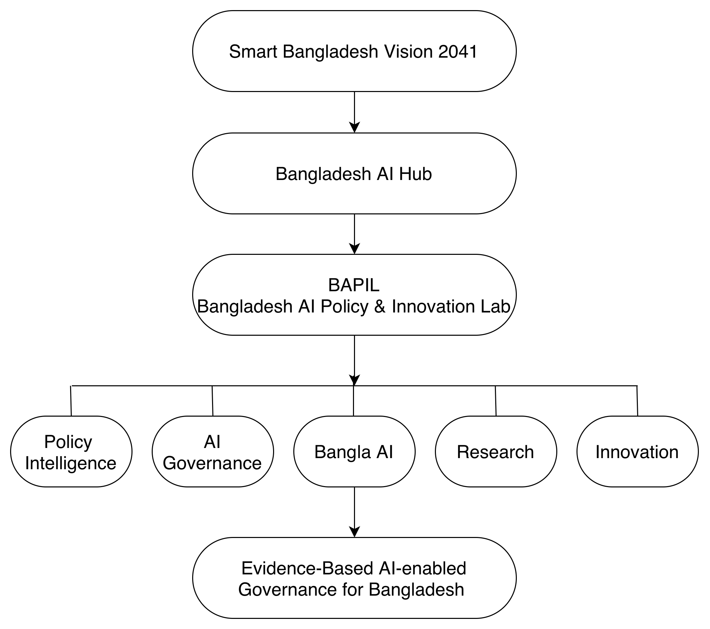

# Bangladesh AI Policy & Innovation Lab (BAPIL)

## Executive Summary Accompanying the BAPIL White Paper (Version 1.0.1)

### An Evidence-Based AI Policy and Innovation Framework for Bangladesh

**Version 1.0**

**Md Naim Hassan Saykat**

Master's Student in Artificial Intelligence  
Université Paris-Saclay, France

July 2026

**Full White Paper DOI:** 
<https://doi.org/10.5281/zenodo.21363967>

**Repository:** 
<https://github.com/md-naim-hassan-saykat/bapil>

---

*This Executive Summary presents the principal findings, proposed framework, expected strategic impact, and key strategic recommendations of the Bangladesh AI Policy & Innovation Lab (BAPIL) White Paper. It is intended for senior policymakers, government agencies, academic institutions, industry leaders, development partners, and other stakeholders considering the responsible use of artificial intelligence in Bangladesh.*

\newpage

# Document Information

| Item | Information |
|---|---|
| **Document Title** | Bangladesh AI Policy & Innovation Lab (BAPIL): Executive Summary |
| **Version** | 1.0 |
| **Publication Date** | July 2026 |
| **Author** | Md Naim Hassan Saykat |
| **Affiliation** | Université Paris-Saclay, France |
| **Language** | English |
| **Document Type** | Executive Summary Accompanying the BAPIL White Paper (Version 1.0.1) |
| **License** | Creative Commons Attribution 4.0 International (CC BY 4.0) |
| **Executive Summary DOI** | <https://doi.org/10.5281/zenodo.21441172> |
| **Full White Paper DOI** | <https://doi.org/10.5281/zenodo.21363967> |
| **Repository** | <https://github.com/md-naim-hassan-saykat/bapil> |

## Citation

Saykat, M. N. H. (2026). *Bangladesh AI Policy & Innovation Lab (BAPIL): Executive Summary* (Version 1.0). Executive summary accompanying the *Bangladesh AI Policy & Innovation Lab (BAPIL) White Paper* (Version 1.0.1). <https://doi.org/10.5281/zenodo.21441172>

## Disclaimer

BAPIL is an independent research and innovation initiative. This document does not represent any government institution, ministry, political organisation, or official policy position. Its proposals are intended to support research, informed discussion, stakeholder consultation, and future policy development.

## References Note

The numbered citations used throughout this Executive Summary correspond to the complete bibliography of the **Bangladesh AI Policy & Innovation Lab (BAPIL) White Paper (Version 1.0.1)**. For complete reference details, readers are encouraged to consult the full White Paper.

**Full White Paper DOI:** <https://doi.org/10.5281/zenodo.21363967>

\newpage

# Executive Summary

Artificial Intelligence (AI) is increasingly shaping governance, public administration, economic planning, national security, scientific research, and public service delivery. Governments around the world are exploring how AI, data analytics, digital infrastructure, and knowledge management systems can improve institutional effectiveness, policy evaluation, and citizen outcomes [1–17, 21, 26].

Bangladesh has established strong digital foundations through national digital-transformation programmes, expanding digital public services, national data initiatives, and emerging AI programmes. However, growing policy complexity, rapidly expanding public-sector data, and evolving technological risks require stronger capabilities in policy analysis, evidence synthesis, data governance, strategic foresight, responsible AI oversight, and data-driven decision support [28–33, 82, 83].

The **Bangladesh AI Policy & Innovation Lab (BAPIL)** is proposed as an independent, multidisciplinary research framework for exploring how AI and data-driven technologies can support evidence-based policymaking, responsible AI governance, digital government, institutional learning, and national innovation. BAPIL is not proposed as a policymaking authority. Rather, it is envisioned as a research, policy-intelligence, and collaboration platform that can develop methodologies, governance frameworks, technical prototypes, and knowledge resources for use by policymakers, researchers, universities, industry, civil society, and development partners [1, 3, 5, 7, 17, 21, 24, 25].

The framework is designed to complement existing national institutions and initiatives rather than duplicate them. Its purpose is to help bridge the gap between AI research, government decision-making, public-sector modernisation, Bangla-language technology, and responsible innovation.

## Core Proposition

BAPIL proposes that Bangladesh establish a coordinated capability for:

- AI-assisted policy research and evidence synthesis;
- responsible AI governance, risk assessment, and human oversight;
- policy, budget, and public-service analytics;
- Bangla-language policy intelligence and knowledge systems;
- secure and interoperable public-sector data practices;
- cybersecurity, misinformation, and digital-resilience research;
- interdisciplinary education, talent development, and public-sector capacity building;
- structured collaboration among government, academia, industry, civil society, and international partners.

## Vision

> To contribute to a future where governance, policymaking, and innovation in Bangladesh are supported by trustworthy, transparent, ethical, inclusive, and evidence-based AI systems.

BAPIL seeks to complement existing national initiatives by providing research, policy intelligence, technical innovation, and multidisciplinary collaboration rather than serving as a policymaking authority.

\newpage

# Why Bangladesh Needs BAPIL

## 1. Increasing Policy and Information Complexity

Government agencies must increasingly interpret large and diverse information sources, including laws, policies, national plans, budgets, administrative records, public consultations, statistical data, international standards, and research evidence. Manual review alone is often slow, fragmented, and difficult to scale. AI-assisted search, summarisation, knowledge graphs, comparative analysis, and monitoring tools could help institutions access relevant evidence more efficiently while preserving human authority over decisions [10, 17, 18, 20, 21, 38, 42].

## 2. Need for Evidence-Based and Data-Informed Governance

Policy choices increasingly require timely evidence, scenario analysis, implementation monitoring, and evaluation. BAPIL would explore decision-support methods that help authorised officials compare alternatives, identify trends, assess risks, and monitor outcomes. Such systems should augment human judgment, institutional responsibility, and democratic accountability rather than replace them [4, 5, 15, 17, 21].

## 3. Responsible AI and Regulatory Readiness

As AI adoption expands across public and private sectors, Bangladesh will need stronger frameworks for transparency, accountability, fairness, privacy, cybersecurity, explainability, procurement, auditability, and human oversight. Establishing responsible AI practices early can reduce institutional risk and increase public trust [1, 4–9, 14, 15, 50, 51, 68, 69].

## 4. Bangla-Language AI and Digital Inclusion

Bangla is one of the world's most widely spoken languages, yet high-quality policy, legal, administrative, and public-service AI resources remain comparatively limited. Investment in Bangla datasets, language technologies, policy search, speech systems, translation, and public-information tools could improve accessibility, digital inclusion, and citizen engagement [37–50, 76, 80, 81].

## 5. Fragmented Research and Innovation Capacity

Bangladesh's AI ecosystem includes universities, government agencies, technology companies, startups, and emerging national initiatives. Greater coordination could support shared research infrastructure, policy experimentation, graduate research, public-sector innovation, and international partnerships [16, 19, 27, 35, 36, 70, 73, 77, 80].

## 6. Cybersecurity, Misinformation, and Digital Resilience

The expansion of digital systems introduces risks related to cyber threats, information manipulation, privacy, data quality, and institutional dependence on automated tools. BAPIL would support research on secure AI, information integrity, risk management, resilience, and responsible public communication [14, 34, 71, 72].

# Proposed BAPIL Framework

The proposed framework combines research, data, governance, technical prototyping, and capacity development through seven interconnected pillars:

1. **AI Policy Intelligence and Research**  
   Policy search, evidence synthesis, comparative policy analysis, implementation monitoring, strategic foresight, and decision-support research.

2. **Data Analytics and Public Sentiment Analysis**  
   Analysis of public datasets, administrative trends, surveys, consultations, and citizen feedback under appropriate ethical and privacy safeguards.

3. **AI Governance and Ethics**  
   Transparency, fairness, accountability, privacy, explainability, human oversight, procurement guidance, audit mechanisms, and risk-management research.

4. **Bangla-Language AI and Knowledge Systems**  
   Bangla policy search, question answering, summarisation, translation, speech technologies, and domain-specific language resources.

5. **National Security, Cybersecurity, and Digital Resilience Research**  
   Secure AI adoption, information integrity, cyber-risk awareness, the resilience of critical systems, and misinformation research.

6. **AI Education and Talent Development**  
   Interdisciplinary curricula, public-sector training, graduate research, professional development, and broader AI literacy.

7. **Innovation and Startup Ecosystem Support**  
   Research translation, prototype development, university-industry collaboration, public-interest innovation, and responsible technology entrepreneurship.

\newpage

# Conceptual Operating Model

BAPIL would operate as a research and knowledge platform that transforms diverse information sources into structured evidence and policy insight.

The operating model contains five linked stages:

| Stage | Purpose |
|---|---|
| **1. Data and Evidence Sources** | Government data, policy documents, legislation, budgets, statistics, research publications, public consultations, and other authorised sources |
| **2. Data Management and Governance** | Data quality, metadata, interoperability, access control, privacy, security, documentation, and provenance |
| **3. AI and Analytics** | Search, NLP, forecasting, trend analysis, clustering, knowledge graphs, summarisation, and scenario-support methods |
| **4. Knowledge and Decision Support** | Dashboards, policy briefs, evidence maps, alerts, comparison tools, and institutional knowledge repositories |
| **5. Human Review and Governance** | Expert validation, authorised decision-making, audit trails, transparency, accountability, and continuous evaluation |

## Illustrative Pilot Projects

Initial research and prototype work could include:

- **Bangladesh Policy Search Engine:** semantic search across policies, laws, regulations, strategies, and public reports;
- **Budget Intelligence Dashboard:** analysis of allocations, expenditure trends, development priorities, and project implementation;
- **Citizen Feedback Analyser:** topic discovery, sentiment analysis, issue monitoring, and consultation summaries;
- **Bangla Policy Foundation Model:** domain-specific Bangla AI for policy research, public administration, and knowledge management;
- **Policy Impact and Monitoring Tools:** structured indicators, implementation tracking, and evidence-based review;
- **Misinformation and Information-Integrity Research:** detection, risk analysis, and digital-resilience support.

These pilots should begin as controlled research prototypes, use authorised and appropriate data, undergo independent evaluation, and remain subject to human oversight.

# Expected Strategic Impact

| Stakeholder | Potential Value |
|---|---|
| **Government and Public Institutions** | Faster evidence discovery, improved knowledge management, policy monitoring, strategic foresight, and better-informed decision support |
| **Universities and Researchers** | Shared research agendas, interdisciplinary collaboration, graduate research opportunities, open methods, and international partnerships |
| **Industry and Startups** | Responsible innovation pathways, research collaboration, public-interest technology opportunities, and stronger technology-transfer networks |
| **Citizens and Civil Society** | Greater accessibility, transparency, participation, Bangla-language services, and stronger safeguards for public-interest AI |
| **Development Partners** | A structured platform for capacity building, technical cooperation, evaluation, and alignment with responsible AI principles |

\newpage

# Key Strategic Recommendations

## Priority 1 - Establish a National AI Policy-Intelligence Capability

Support institutional capacity for AI-assisted evidence synthesis, policy analysis, implementation monitoring, and strategic foresight. Begin with limited, high-value research pilots and clearly defined governance arrangements.

## Priority 2 - Develop a Responsible AI Governance Framework

Create principles, standards, and operational guidance covering human oversight, transparency, fairness, privacy, security, explainability, accountability, procurement, auditability, and redress [1, 4–9, 14, 15].

## Priority 3 - Strengthen Public-Sector Data Governance

Improve data quality, metadata, interoperability, secure sharing, access control, documentation, retention practices, and privacy protection. Expand open data where legally, ethically, and operationally appropriate [18, 20, 31, 33, 78, 79].

## Priority 4 - Invest in Bangla-Language AI

Develop trusted Bangla datasets, language resources, evaluation benchmarks, speech and translation technologies, and policy-oriented NLP systems to improve inclusion and accessibility [37–50, 80, 81].

## Priority 5 - Expand National AI Research Capacity

Support graduate and doctoral research, shared computing resources, interdisciplinary laboratories, competitive research funding, international partnerships, and public-private research programmes [16, 27, 35, 36, 54–56, 70, 73, 77].

## Priority 6 - Build Government-Academia-Industry-Civil Society Collaboration

Create structured mechanisms for joint research, policy dialogue, responsible innovation, consultation, knowledge exchange, and independent review [3, 17, 19, 24, 25, 27].

## Priority 7 - Strengthen AI Literacy and Public-Sector Capability

Provide tailored training for policymakers, civil servants, educators, technical professionals, and institutional leaders. Capacity building should cover both AI opportunities and limitations, including risk, ethics, procurement, and governance [26, 35, 36, 64, 73, 76, 80].

## Priority 8 - Strengthen Cybersecurity and Digital Resilience

Integrate cybersecurity, privacy, information integrity, incident readiness, critical-infrastructure protection, and continuous risk assessment into AI-related programmes [14, 34, 71, 72].

## Priority 9 - Support Existing and Emerging National AI Initiatives

Position BAPIL as a complementary research and policy-intelligence capability that supports, rather than duplicates, existing and emerging national digital-transformation, AI, data-governance, and public-sector innovation initiatives [29, 30, 35, 36].

## Priority 10 - Develop Long-Term AI Strategy and Foresight

Establish mechanisms for horizon scanning, scenario analysis, emerging-technology assessment, workforce planning, and periodic review of national AI priorities [22, 23, 60, 63, 73, 77].

# Suggested Implementation Pathway

| Phase | Indicative Focus | Illustrative Outputs |
|---|---|---|
| **Phase 1: Foundation** | Stakeholder consultation, institutional mapping, data and legal review, research agenda, governance principles | Scoping report, governance charter, pilot selection criteria, risk register |
| **Phase 2: Research and Prototyping** | Controlled prototypes, Bangla AI research, policy search and analytics tools, evaluation methods | Pilot systems, technical reports, datasets and benchmarks where appropriate |
| **Phase 3: Institutional Collaboration** | Joint programmes with government, universities, industry, civil society, and development partners | Research partnerships, training programmes, policy dialogues, independent reviews |
| **Phase 4: Evaluation and Scale-Up** | Impact assessment, security testing, ethical review, institutional adoption decisions | Evaluation reports, revised governance guidance, scale-up recommendations |
| **Long-Term: 2030–2041** | National capability, international collaboration, foresight, sustainable research infrastructure | Mature policy-intelligence ecosystem, Bangla AI capacity, regional partnerships |

\newpage

# Governance and Safeguards

BAPIL should be developed according to the principle that AI supports human institutions rather than replacing them. Any future operational implementation should include:

- clearly assigned institutional responsibility;
- meaningful human review of consequential outputs;
- documented data sources, assumptions, and system limitations;
- privacy, cybersecurity, and access-control safeguards;
- bias, fairness, and accessibility assessment;
- independent technical and ethical review;
- audit trails and monitoring mechanisms;
- controlled experimentation before wider deployment;
- public-interest evaluation and stakeholder consultation;
- compliance with applicable laws, policies, and institutional mandates.

The framework should distinguish clearly among research prototypes, advisory tools, and operational government systems. No experimental model should be treated as an authoritative policymaking mechanism without appropriate validation, authorisation, accountability, and legal review.

# Next Steps for Stakeholders

Government agencies and partner institutions are invited to consider the following initial actions:

1. Review the full BAPIL White Paper and provide institutional feedback.
2. Identify priority policy or administrative challenges suitable for a limited research pilot.
3. Nominate technical, policy, legal, data-governance, and ethics focal points for consultation.
4. Assess opportunities for collaboration with universities, national AI initiatives, industry, civil society, and development partners.
5. Consider conducting a structured feasibility study before establishing any formal institutional structure or undertaking operational deployment.

# Conclusion

Collectively, the recommendations presented in this Executive Summary provide a phased, research-oriented pathway for strengthening Bangladesh's AI governance, policy intelligence, and innovation ecosystem.

Bangladesh has an opportunity to move beyond isolated AI applications toward a coordinated, responsible, and evidence-based national capability. The proposed BAPIL framework offers a practical foundation for policy intelligence, responsible AI governance, Bangla-language technology, public-sector innovation, talent development, and multi-stakeholder collaboration.

Its success would depend not only on technology, but also on institutional leadership, trustworthy data, ethical governance, cybersecurity, skilled people, transparent processes, and public trust. BAPIL is therefore proposed as a long-term research and collaboration platform that supports existing national initiatives and helps ensure that AI contributes to public benefit, inclusive development, institutional resilience, and Bangladesh's long-term transformation.

# Resources

**Executive Summary DOI:**  
<https://doi.org/10.5281/zenodo.21441172>

**Full White Paper DOI:**  
<https://doi.org/10.5281/zenodo.21363967>

**GitHub Repository:**  
<https://github.com/md-naim-hassan-saykat/bapil>

---

© 2026 Md Naim Hassan Saykat. Licensed under CC BY 4.0.
