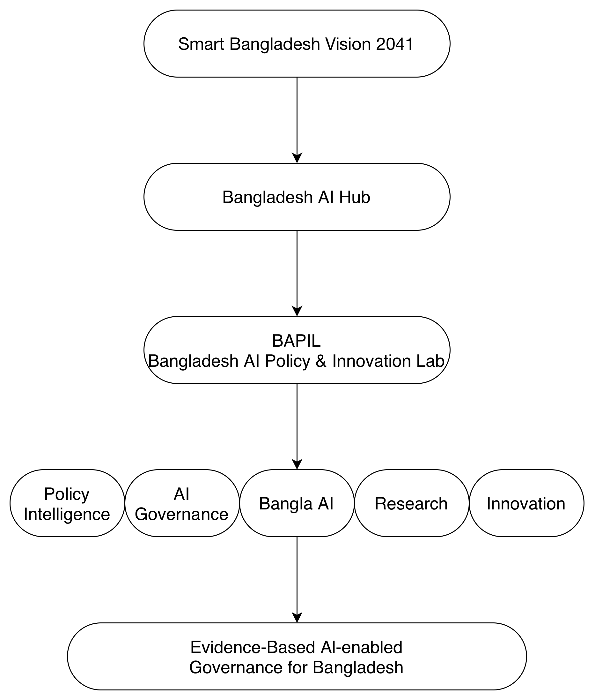
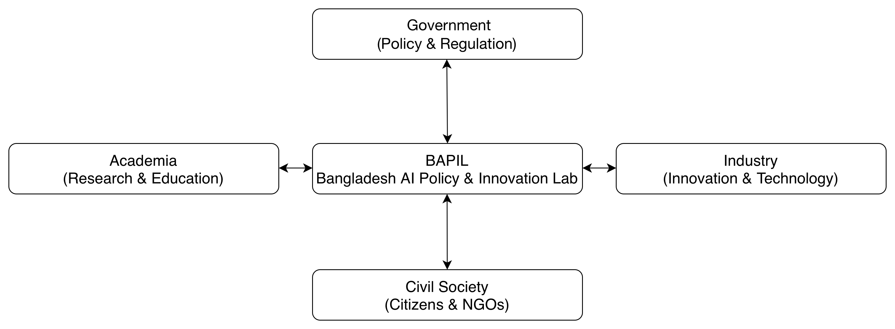
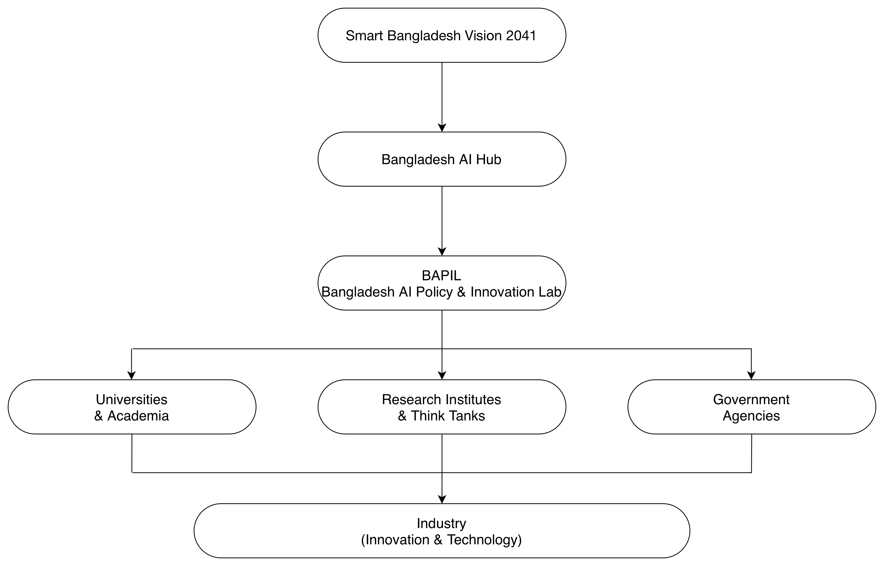
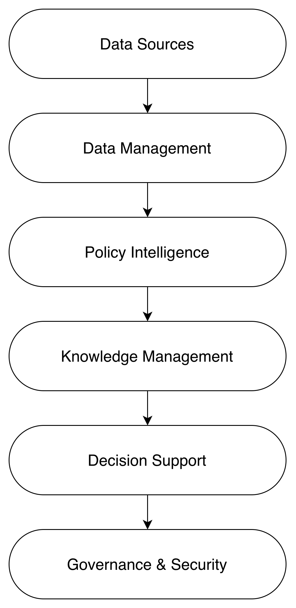
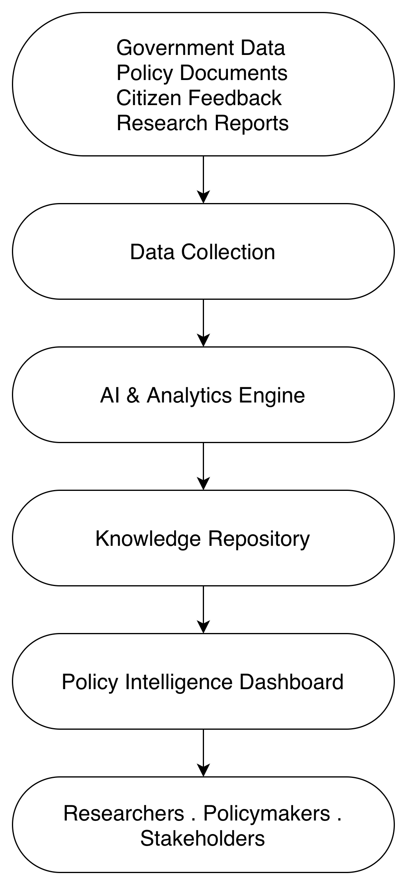
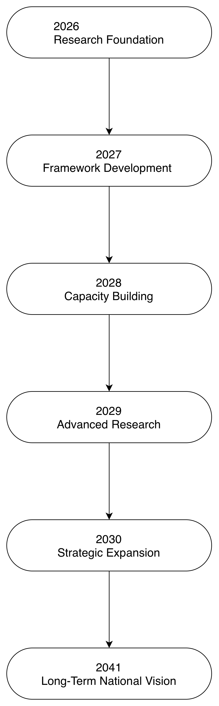

# BAPIL শ্বেতপত্র

## বাংলাদেশ এআই নীতি ও উদ্ভাবন ল্যাব (BAPIL)

### বাংলাদেশে কৃত্রিম বুদ্ধিমত্তা (AI) শাসনব্যবস্থা, নীতি-বুদ্ধিমত্তা এবং সরকারি খাতের উদ্ভাবনের জন্য একটি ধারণাগত কাঠামো

## লেখক

**মোঃ নাঈম হাসান সৈকত**  
কৃত্রিম বুদ্ধিমত্তা বিষয়ে স্নাতকোত্তর শিক্ষার্থী  
ইউনিভার্সিতে প্যারিস-স্যাকলে, ফ্রান্স

**সংস্করণ:** ১.০ 
**তারিখ:** জুলাই ২০২৬ 
**নথির ধরন:** শ্বেতপত্র (White Paper) 
**অবস্থা:** জন-আলোচনার জন্য প্রাথমিক খসড়া (Public Discussion Draft)

> **বাংলা সংস্করণ (Version 1.0)**  

> এই নথিটি **_BAPIL White Paper: Bangladesh AI Policy & Innovation Lab (Version 1.0)_**-এর বাংলা অনুবাদ। মূল রেফারেন্স নথি হিসেবে ইংরেজি সংস্করণকে বিবেচনা করা হবে। কোনো ব্যাখ্যাগত বা অনুবাদজনিত পার্থক্য দেখা দিলে ইংরেজি সংস্করণটিই প্রামাণ্য হিসেবে গণ্য হবে।

 

এই শ্বেতপত্রটি গবেষণা, নীতিগত আলোচনা, একাডেমিক সহযোগিতা এবং জনস্বার্থসংশ্লিষ্ট সংলাপের উদ্দেশ্যে প্রস্তুত করা হয়েছে।

এই নথি একটি স্বাধীন একাডেমিক ও নীতিগত গবেষণা উদ্যোগের ফল।

**বাংলাদেশে কৃত্রিম বুদ্ধিমত্তা শাসনব্যবস্থা, নীতি-বুদ্ধিমত্তা এবং সরকারি খাতের উদ্ভাবন বিষয়ক একটি স্বাধীন শ্বেতপত্র**

## দায়স্বীকার (Disclaimer)

এই শ্বেতপত্রটি লেখকের ব্যক্তিগত উদ্যোগে প্রস্তুতকৃত একটি স্বাধীন গবেষণা ও নীতিগত আলোচনা বিষয়ক দলিল। এতে উপস্থাপিত ধারণা, বিশ্লেষণ এবং সুপারিশসমূহ বাংলাদেশ সরকার, কোনো সরকারি প্রতিষ্ঠান, ইউনিভার্সিতে প্যারিস-স্যাকলে অথবা অন্য কোনো সহযোগী প্রতিষ্ঠানের আনুষ্ঠানিক অবস্থান বা মতামতকে প্রতিফলিত করে না।

**বাংলাদেশ এআই নীতি ও উদ্ভাবন ল্যাব (BAPIL)**-কে এখানে একটি ধারণাগত কাঠামো (Conceptual Framework) হিসেবে প্রস্তাব করা হয়েছে, যার উদ্দেশ্য বাংলাদেশে কৃত্রিম বুদ্ধিমত্তা শাসনব্যবস্থা, নীতি-বুদ্ধিমত্তা, ডিজিটাল রূপান্তর এবং সরকারি খাতের উদ্ভাবন বিষয়ে গবেষণা, সহযোগিতা, সংলাপ এবং ভবিষ্যৎ অনুসন্ধানকে উৎসাহিত করা।

এই নথি শুধুমাত্র শিক্ষা, গবেষণা এবং নীতিগত আলোচনার উদ্দেশ্যে প্রস্তুত করা হয়েছে।

এই নথিতে অন্তর্ভুক্ত কোনো সুপারিশকে বাংলাদেশ সরকারের আনুষ্ঠানিক নীতি, সিদ্ধান্ত অথবা কোনো প্রতিষ্ঠানের আনুষ্ঠানিক অনুমোদন হিসেবে ব্যাখ্যা করা উচিত নয়।

## লেখকের বক্তব্য

এই নথিটি জন-আলোচনার জন্য একটি প্রাথমিক খসড়া।

এখানে উপস্থাপিত ধারণাগুলো অনুসন্ধানমূলক (Exploratory) এবং ভবিষ্যৎ গবেষণা, সংশ্লিষ্ট অংশীজনের মতামত এবং সমন্বিত আলোচনার মাধ্যমে এগুলো আরও পরিমার্জিত ও বিকশিত হওয়ার প্রত্যাশা করা হচ্ছে।

যে কোনো মন্তব্য, তথ্যগত সংশোধন এবং গঠনমূলক পরামর্শ আন্তরিকভাবে স্বাগত।

## প্রস্তাবিত উদ্ধৃতি (Suggested Citation)

সৈকত, মোঃ নাঈম হাসান। (২০২৬)।

**BAPIL শ্বেতপত্র: বাংলাদেশ এআই নীতি ও উদ্ভাবন ল্যাব (সংস্করণ ১.০)।**

BAPIL Research Initiative.

Zenodo. DOI: সংযোজনাধীন (To be assigned).

## সংস্করণ ইতিহাস

| সংস্করণ | তারিখ | বিবরণ |
|----------|----------|----------|
| ১.০ | জুলাই ২০২৬ | জন-আলোচনার জন্য প্রাথমিক খসড়া প্রকাশ |

## সংক্ষিপ্ত রূপ (Acronyms

| সংক্ষিপ্ত রূপ | অর্থ |
|----------|----------|
| AI | কৃত্রিম বুদ্ধিমত্তা |
| NLP | প্রাকৃতিক ভাষা প্রক্রিয়াকরণ |
| RAG | তথ্য-উদ্ধার-সমৃদ্ধ পাঠ্য উৎপাদন |
| BPFM | বাংলা নীতি ফাউন্ডেশন মডেল |
| BAPIL | বাংলাদেশ এআই নীতি ও উদ্ভাবন ল্যাব |
| OECD | অর্থনৈতিক সহযোগিতা ও উন্নয়ন সংস্থা |
| NIST | জাতীয় মান ও প্রযুক্তি ইনস্টিটিউট (যুক্তরাষ্ট্র) |
| UNESCO | জাতিসংঘের শিক্ষা, বিজ্ঞান ও সাংস্কৃতিক সংস্থা |
| WEF | বিশ্ব অর্থনৈতিক ফোরাম |
| UNDP | জাতিসংঘ উন্নয়ন কর্মসূচি |
| ITU | আন্তর্জাতিক টেলিযোগাযোগ ইউনিয়ন |
| BCC | বাংলাদেশ কম্পিউটার কাউন্সিল |
| BBS | বাংলাদেশ পরিসংখ্যান ব্যুরো |
| ICT | তথ্য ও যোগাযোগ প্রযুক্তি |
| GovTech | সরকারি প্রযুক্তি |
| LLM | বৃহৎ ভাষা মডেল |
| XAI | ব্যাখ্যাযোগ্য কৃত্রিম বুদ্ধিমত্তা |

## পরিভাষা (Glossary)

| পরিভাষা | সংজ্ঞা |
|------|----------|
| **কৃত্রিম বুদ্ধিমত্তা (AI)** | কম্পিউটার বিজ্ঞানের এমন একটি শাখা, যার লক্ষ্য হলো এমন বুদ্ধিমান ব্যবস্থা তৈরি করা যা যুক্তি প্রয়োগ, শেখা, উপলব্ধি এবং সিদ্ধান্ত গ্রহণের মতো মানুষের বুদ্ধিবৃত্তিক সক্ষমতার অনুরূপ কাজ সম্পাদন করতে পারে। |
| **এআই শাসনব্যবস্থা (AI Governance)** | কৃত্রিম বুদ্ধিমত্তা ব্যবস্থার দায়িত্বশীল, নৈতিক, স্বচ্ছ এবং জবাবদিহিমূলক উন্নয়ন ও ব্যবহারের জন্য প্রণীত নীতি, প্রক্রিয়া, মানদণ্ড এবং তদারকি ব্যবস্থা। |
| **এআই নৈতিকতা (AI Ethics)** | ন্যায্যতা, জবাবদিহিতা, স্বচ্ছতা, গোপনীয়তা এবং মানবকল্যাণ নিশ্চিত করার লক্ষ্যে এআই প্রযুক্তির নকশা, উন্নয়ন ও ব্যবহারের জন্য প্রণীত নীতিমালা ও নির্দেশনা। |
| **নীতি-বুদ্ধিমত্তা (Policy Intelligence)** | তথ্য, উপাত্ত বিশ্লেষণ, গবেষণা এবং এআই-সহায়ক পদ্ধতির মাধ্যমে প্রমাণভিত্তিক নীতি বিশ্লেষণ, পর্যবেক্ষণ, মূল্যায়ন এবং সিদ্ধান্ত গ্রহণে সহায়তা প্রদান। |
| **প্রমাণভিত্তিক নীতি প্রণয়ন (Evidence-Based Policymaking)** | অনুমান বা ব্যক্তিগত অভিজ্ঞতার পরিবর্তে নির্ভরযোগ্য তথ্য, গবেষণার ফলাফল এবং বস্তুনিষ্ঠ বিশ্লেষণের ভিত্তিতে নীতি প্রণয়নের পদ্ধতি। |
| **ফাউন্ডেশন মডেল (Foundation Model)** | বৃহৎ পরিসরে পূর্ব-প্রশিক্ষিত একটি কৃত্রিম বুদ্ধিমত্তা মডেল, যা প্রশ্নোত্তর, সারসংক্ষেপ, অনুবাদ এবং তথ্য অনুসন্ধানসহ বিভিন্ন কাজে অভিযোজিত হতে পারে। |
| **বৃহৎ ভাষা মডেল (LLM)** | বিপুল পরিমাণ পাঠ্যতথ্যের ওপর প্রশিক্ষিত এমন একটি এআই মডেল, যা মানুষের ভাষা বুঝতে এবং তৈরি করতে সক্ষম। |
| **প্রাকৃতিক ভাষা প্রক্রিয়াকরণ (NLP)** | কৃত্রিম বুদ্ধিমত্তার এমন একটি শাখা, যা কম্পিউটারকে মানবভাষা বুঝতে, বিশ্লেষণ করতে, প্রক্রিয়াকরণ করতে এবং তৈরি করতে সক্ষম করে। |
| **তথ্য-উদ্ধার-সমৃদ্ধ পাঠ্য উৎপাদন (RAG)** | এমন একটি এআই স্থাপত্য, যা বহিরাগত জ্ঞানভান্ডার থেকে তথ্য সংগ্রহের সঙ্গে ভাষা উৎপাদনকে সমন্বিত করে অধিক নির্ভুল ও তথ্যসমৃদ্ধ উত্তর প্রদান করে। |
| **জ্ঞান গ্রাফ (Knowledge Graph)** | বিভিন্ন সত্তা, ধারণা এবং তাদের পারস্পরিক সম্পর্কের একটি কাঠামোবদ্ধ উপস্থাপনা, যা তথ্য সংগঠিত, সংযুক্ত এবং বিশ্লেষণে সহায়তা করে। |
| **তথ্য শাসন (Data Governance)** | তথ্যের গুণগত মান, নিরাপত্তা, গোপনীয়তা এবং দায়িত্বশীল ব্যবহার নিশ্চিত করার জন্য নীতি, মানদণ্ড এবং ব্যবস্থাপনা কাঠামো। |
| **ডিজিটাল শাসন (Digital Governance)** | সরকারি কার্যক্রম, জনসেবা প্রদান, স্বচ্ছতা এবং নাগরিক অংশগ্রহণ উন্নত করতে ডিজিটাল প্রযুক্তির ব্যবহার। |
| **সাইবার নিরাপত্তা (Cybersecurity)** | ডিজিটাল ব্যবস্থা, নেটওয়ার্ক, ডিভাইস এবং তথ্যকে অননুমোদিত প্রবেশ, আক্রমণ, বিঘ্ন বা অপব্যবহার থেকে সুরক্ষার ব্যবস্থা। |
| **সরকারি প্রযুক্তি (GovTech)** | সরকারি সেবা এবং সরকারি খাতের কার্যকারিতা উন্নয়নের উদ্দেশ্যে ডিজিটাল প্রযুক্তি ও উদ্ভাবনের প্রয়োগ। |
| **BAPIL** | বাংলাদেশে কৃত্রিম বুদ্ধিমত্তা শাসনব্যবস্থা, নীতি-বুদ্ধিমত্তা, ডিজিটাল শাসন এবং সরকারি খাতের উদ্ভাবনকে এগিয়ে নেওয়ার লক্ষ্যে প্রস্তাবিত একটি গবেষণাভিত্তিক কাঠামো। |

## আমি কেন এই শ্বেতপত্রটি লিখেছি

ইউনিভার্সিতে প্যারিস-স্যাকলে কৃত্রিম বুদ্ধিমত্তা বিষয়ে আমার স্নাতকোত্তর অধ্যয়নের সময় কৃত্রিম বুদ্ধিমত্তা, রাষ্ট্র পরিচালনা, জননীতি এবং প্রমাণভিত্তিক সিদ্ধান্ত গ্রহণের পারস্পরিক সম্পর্কের প্রতি আমার গভীর আগ্রহ সৃষ্টি হয়। বিশ্বজুড়ে কৃত্রিম বুদ্ধিমত্তা নিয়ে আলোচনার অধিকাংশই বাণিজ্যিক ও শিল্পখাতের প্রয়োগকে কেন্দ্র করে হলেও, আমার বিশ্বাস এটি নীতি গবেষণা, সরকারি খাতের উদ্ভাবন এবং ডিজিটাল শাসনব্যবস্থার উন্নয়নেও গুরুত্বপূর্ণ ভূমিকা রাখতে পারে।

বাংলাদেশ ইতোমধ্যে ডিজিটাল রূপান্তরের ক্ষেত্রে উল্লেখযোগ্য অগ্রগতি অর্জন করেছে এবং উদীয়মান প্রযুক্তি গ্রহণে ক্রমবর্ধমান আগ্রহ প্রদর্শন করছে। কৃত্রিম বুদ্ধিমত্তার দ্রুত বিকাশের এই সময়ে, দায়িত্বশীল উপায়ে এই প্রযুক্তিকে রাষ্ট্র পরিচালনা, জ্ঞান ব্যবস্থাপনা, নীতি বিশ্লেষণ এবং জনসেবার উন্নয়নে কীভাবে ব্যবহার করা যেতে পারে, তা নিয়ে এখন থেকেই গভীরভাবে চিন্তা করা প্রয়োজন।

এই শ্বেতপত্রটি একটি স্বাধীন একাডেমিক উদ্যোগ হিসেবে প্রস্তুত করা হয়েছে, যার উদ্দেশ্য গবেষক, নীতিনির্ধারক, শিক্ষার্থী, সরকারি প্রতিষ্ঠান, শিল্পখাতের অংশীজন এবং সাধারণ নাগরিকদের মধ্যে একটি গঠনমূলক আলোচনার সূচনা করা। এখানে উপস্থাপিত ধারণাগুলো কোনো চূড়ান্ত সমাধান নয়; বরং ভবিষ্যৎ গবেষণা, সংলাপ এবং সহযোগিতার ভিত্তি হিসেবে বিবেচিত হওয়ার জন্য প্রস্তাব করা হয়েছে।

সেই প্রেক্ষাপটে, **বাংলাদেশ এআই নীতি ও উদ্ভাবন ল্যাব (BAPIL)**-কে কোনো প্রস্তুত সমাধান হিসেবে নয়; বরং কৃত্রিম বুদ্ধিমত্তা শাসনব্যবস্থা, নীতি-বুদ্ধিমত্তা, ডিজিটাল রূপান্তর এবং দায়িত্বশীল উদ্ভাবনের ভবিষ্যৎ সম্ভাবনা অন্বেষণের জন্য একটি ধারণাগত কাঠামো হিসেবে উপস্থাপন করা হয়েছে।

আমার আন্তরিক প্রত্যাশা, এই শ্বেতপত্রটি বাংলাদেশের জন্য একটি জ্ঞানভিত্তিক, উদ্ভাবনমুখী এবং দায়িত্বশীল কৃত্রিম বুদ্ধিমত্তা ইকোসিস্টেম গঠনের চলমান আলোচনায় সামান্য হলেও ইতিবাচক অবদান রাখবে।

# অধ্যায় ১: নির্বাহী সারসংক্ষেপ

## নির্বাহী সারসংক্ষেপ

কৃত্রিম বুদ্ধিমত্তা (Artificial Intelligence - AI) বিশ্বব্যাপী শাসনব্যবস্থা, জনপ্রশাসন, অর্থনৈতিক পরিকল্পনা, জাতীয় নিরাপত্তা এবং জনসেবা প্রদান ব্যবস্থায় দ্রুত পরিবর্তন আনছে। উন্নত ও উন্নয়নশীল এবং উভয় ধরনের দেশের সরকার নীতিনির্ধারণের কার্যকারিতা বৃদ্ধি, প্রশাসনিক দক্ষতা উন্নয়ন এবং নাগরিকসেবার মানোন্নয়নের লক্ষ্যে ক্রমবর্ধমানভাবে AI-নির্ভর বিশ্লেষণ, ডিজিটাল অবকাঠামো এবং তথ্যভিত্তিক সিদ্ধান্ত গ্রহণ ব্যবস্থা ব্যবহার করছে [1-17, 21, 26]।

বাংলাদেশ **ডিজিটাল বাংলাদেশ** এবং **স্মার্ট বাংলাদেশ**-এর মতো জাতীয় উদ্যোগের মাধ্যমে ডিজিটাল রূপান্তরে উল্লেখযোগ্য অগ্রগতি অর্জন করেছে। তবে জননীতির ক্রমবর্ধমান জটিলতা, সরকারি ও নাগরিক-উৎপন্ন তথ্যের দ্রুত বিস্তার এবং প্রযুক্তিগত পরিবর্তনের ত্বরান্বিত গতির মতো চ্যালেঞ্জ মোকাবিলায় প্রমাণভিত্তিক শাসনব্যবস্থা এবং দীর্ঘমেয়াদি কৌশলগত পরিকল্পনাকে আরও শক্তিশালী করার জন্য উন্নত বিশ্লেষণাত্মক সক্ষমতা প্রয়োজন [28-33, 82, 83]।

এই হোয়াইট পেপারে **Bangladesh AI Policy & Innovation Lab (BAPIL)**-এর একটি ধারণাগত ও গবেষণাভিত্তিক কাঠামো (Conceptual Research Framework) প্রস্তাব করা হয়েছে, যার উদ্দেশ্য হলো অনুসন্ধান করা যে কীভাবে কৃত্রিম বুদ্ধিমত্তা, ডেটা বিশ্লেষণ এবং দায়িত্বশীল AI শাসনব্যবস্থা জাতীয় উন্নয়ন, সরকারি খাতের উদ্ভাবন এবং প্রাতিষ্ঠানিক সক্ষমতা বৃদ্ধিতে অবদান রাখতে পারে। এই উদ্যোগের লক্ষ্য হলো AI গবেষণা, নীতিনির্ধারণ, সুশাসন এবং উদ্ভাবনের মধ্যে বিদ্যমান ব্যবধান দূর করা এবং তথ্যসমৃদ্ধ সিদ্ধান্ত গ্রহণে সহায়ক পদ্ধতি, কাঠামো ও প্রোটোটাইপ সিস্টেম উন্নয়নের মাধ্যমে একটি সমন্বিত গবেষণা প্ল্যাটফর্ম গড়ে তোলা [1, 3, 5, 7, 17, 21, 24]।

BAPIL-কে একটি বহুবিষয়ক (Multidisciplinary) প্ল্যাটফর্ম হিসেবে কল্পনা করা হয়েছে, যা একাডেমিয়া, সরকার, শিল্পখাত এবং নাগরিক সমাজের বিশেষজ্ঞদের একত্রিত করে তথ্যনির্ভর পদ্ধতির মাধ্যমে জাতীয় চ্যালেঞ্জ মোকাবিলায় কাজ করবে। এই উদ্যোগের প্রধান কার্যক্ষেত্র হবে নীতি-গবেষণা ও নীতি-বুদ্ধিমত্তা (Policy Intelligence), সরকারি খাতের উদ্ভাবন, AI শাসনব্যবস্থা, সাইবার নিরাপত্তা সচেতনতা, মানবসম্পদ উন্নয়ন এবং উদ্ভাবনভিত্তিক ইকোসিস্টেম শক্তিশালীকরণ [17-27, 71-77]।

প্রস্তাবিত কাঠামোটি নিম্নোক্ত কৌশলগত স্তম্ভসমূহের ওপর ভিত্তি করে গঠিত:

* AI নীতি ও গবেষণা (AI Policy & Research)
* ডেটা বিশ্লেষণ ও জনমত বিশ্লেষণ (Data Analytics & Public Sentiment Analysis)
* ডিজিটাল নিরাপত্তা ও ভ্রান্ত তথ্য শনাক্তকরণ (Digital Security & Misinformation Detection)
* AI শাসনব্যবস্থা ও নৈতিকতা (AI Governance & Ethics)
* AI শিক্ষা ও দক্ষ মানবসম্পদ উন্নয়ন (AI Education & Talent Development)
* উদ্ভাবন ও স্টার্টআপ সহযোগিতা (Innovation & Startup Collaboration)

BAPIL-এর দীর্ঘমেয়াদি লক্ষ্য হলো এমন একটি ভবিষ্যৎ গড়ে তুলতে সহায়তা করা, যেখানে বাংলাদেশের নীতিনির্ধারণ ও উদ্ভাবন নির্ভর করবে নির্ভরযোগ্য, স্বচ্ছ, নৈতিক এবং প্রমাণভিত্তিক AI ব্যবস্থার ওপর। গবেষণা, সহযোগিতা এবং সক্ষমতা উন্নয়নের মাধ্যমে এই উদ্যোগ দায়িত্বশীল AI গ্রহণকে উৎসাহিত করবে এবং একই সঙ্গে টেকসই জাতীয় উন্নয়ন ও প্রযুক্তিগত অগ্রগতিকে ত্বরান্বিত করবে [1, 5, 6, 7, 15, 21, 24, 74, 75]।

এই নথিটি একটি ধারণাগত ও গবেষণাভিত্তিক কাঠামো, যার উদ্দেশ্য বাংলাদেশের ভবিষ্যৎ গঠনে কৃত্রিম বুদ্ধিমত্তার সম্ভাব্য ভূমিকা নিয়ে আলোচনা, সহযোগিতা এবং কৌশলগত চিন্তাভাবনাকে উৎসাহিত করা। এই হোয়াইট পেপারের বিষয়বস্তু শুধুমাত্র গবেষণা, শিক্ষা এবং নীতিগত আলোচনার উদ্দেশ্যে প্রস্তুত করা হয়েছে; এটি কোনো সরকারি প্রতিষ্ঠান বা সরকারের আনুষ্ঠানিক অবস্থানকে প্রতিফলিত করে না।

**চিত্র ১।** বাংলাদেশের সামগ্রিক AI ইকোসিস্টেমের মধ্যে **Bangladesh AI Policy & Innovation Lab (BAPIL)**-এর ধারণাগত অবস্থান।

এই হোয়াইট পেপারটি বিশেষভাবে নিম্নোক্ত অংশীজনদের জন্য প্রস্তুত করা হয়েছে:

* নীতিনির্ধারক
* সরকারি সংস্থা
* গবেষক ও শিক্ষাবিদ
* বিশ্ববিদ্যালয়
* প্রযুক্তি প্রতিষ্ঠান
* উন্নয়ন সহযোগী সংস্থা
* নাগরিক সমাজের সংগঠন
* শিক্ষার্থী ও উদ্ভাবক

## নির্বাহী সুপারিশের সারসংক্ষেপ

এই প্রস্তাবে উপস্থাপিত বিশ্লেষণের ভিত্তিতে বাংলাদেশে দায়িত্বশীল কৃত্রিম বুদ্ধিমত্তা (AI), ডিজিটাল সুশাসন এবং প্রমাণভিত্তিক নীতিনির্ধারণকে শক্তিশালী করার জন্য কয়েকটি কৌশলগত সুপারিশ উপস্থাপন করা হয়েছে। এসব সুপারিশের লক্ষ্য হলো জাতীয় AI সক্ষমতা বৃদ্ধি করা এবং একই সঙ্গে স্বচ্ছতা, জবাবদিহিতা, উদ্ভাবন ও জনকল্যাণ নিশ্চিত করা।

### ১. জাতীয় AI নীতি-বুদ্ধিমত্তা (Policy Intelligence) সক্ষমতা প্রতিষ্ঠা

বাংলাদেশে AI-সহায়ক নীতি বিশ্লেষণ, প্রমাণসমূহের সমন্বিত মূল্যায়ন (Evidence Synthesis) এবং সিদ্ধান্ত-সহায়ক (Decision Support) ব্যবস্থা গড়ে তোলার জন্য প্রাতিষ্ঠানিক সক্ষমতা উন্নয়নের বিষয়টি বিবেচনা করা উচিত। এ ধরনের সক্ষমতা নীতিনির্ধারকদের নীতিগত বিকল্প মূল্যায়ন, জনমত বিশ্লেষণ, নীতির বাস্তবায়ন পর্যবেক্ষণ এবং তথ্যনির্ভর পদ্ধতির মাধ্যমে উদীয়মান সামাজিক চ্যালেঞ্জ চিহ্নিত করতে সহায়তা করতে পারে [10, 17, 18, 20, 21, 26]।

এই প্রেক্ষাপটে, AI-সমর্থিত নীতি-বুদ্ধিমত্তা পদ্ধতি এবং সুশাসন কাঠামো নিয়ে গবেষণা ও পরীক্ষামূলক কাজ পরিচালনার জন্য **BAPIL** একটি গবেষণাকেন্দ্রিক প্ল্যাটফর্ম হিসেবে ভূমিকা রাখতে পারে।

### ২. AI শাসনব্যবস্থা ও নিয়ন্ত্রক প্রস্তুতি শক্তিশালীকরণ

সরকারি ও বেসরকারি উভয় খাতে AI-এর ব্যবহার বৃদ্ধি পাওয়ার সঙ্গে সঙ্গে বাংলাদেশে একটি সমন্বিত AI শাসনব্যবস্থা গড়ে তোলার প্রয়োজনীয়তা বাড়ছে। এই কাঠামোতে স্বচ্ছতা, জবাবদিহিতা, ন্যায্যতা, গোপনীয়তা, ঝুঁকি ব্যবস্থাপনা এবং মানবিক তত্ত্বাবধানের মতো গুরুত্বপূর্ণ বিষয়সমূহ অন্তর্ভুক্ত থাকা উচিত [1, 4-9, 14, 15, 51, 53, 68, 69]।

এ ধরনের AI শাসনব্যবস্থার মূল অগ্রাধিকার হতে পারে:

* স্বচ্ছতা ও জবাবদিহিতা নিশ্চিত করা।
* তথ্য সুরক্ষা ও ব্যক্তিগত গোপনীয়তা রক্ষা।
* নৈতিক AI উন্নয়নকে উৎসাহিত করা।
* অ্যালগরিদমিক পক্ষপাত (Algorithmic Bias) হ্রাস এবং ন্যায্যতা নিশ্চিত করা।
* স্বয়ংক্রিয় সিদ্ধান্ত গ্রহণ ব্যবস্থার দায়িত্বশীল ব্যবহার নিশ্চিত করা।
* মানবিক তত্ত্বাবধান ও কার্যকর ঝুঁকি ব্যবস্থাপনা প্রতিষ্ঠা করা।

প্রাথমিক পর্যায়েই এ ধরনের সুশাসন কাঠামো প্রতিষ্ঠা করা হলে AI প্রযুক্তির দায়িত্বশীল ব্যবহার নিশ্চিত করা এবং জাতীয় উন্নয়ন অগ্রাধিকারের সঙ্গে এর সামঞ্জস্য বজায় রাখা সহজ হবে।

### ৩. জাতীয় AI গবেষণা সক্ষমতা সম্প্রসারণ

কৃত্রিম বুদ্ধিমত্তায় দীর্ঘমেয়াদি প্রতিযোগিতামূলক সক্ষমতা অর্জনের জন্য গবেষণা অবকাঠামো, দক্ষ মানবসম্পদ উন্নয়ন এবং আন্তঃবিষয়ক সহযোগিতায় ধারাবাহিক বিনিয়োগ অপরিহার্য [16, 27, 35, 36, 54-56, 63, 70, 73, 77]।

এক্ষেত্রে সম্ভাব্য অগ্রাধিকারসমূহ হতে পারে:

* AI গবেষণা অর্থায়ন কর্মসূচি।
* উচ্চ-ক্ষমতাসম্পন্ন কম্পিউটিং (High-Performance Computing) অবকাঠামো।
* আন্তর্জাতিক গবেষণা প্রতিষ্ঠানের সঙ্গে অংশীদারিত্ব।
* স্নাতকোত্তর ও ডক্টরাল গবেষণায় সহায়তা।
* সরকারি-বেসরকারি যৌথ গবেষণা উদ্যোগ।

গবেষণা সক্ষমতা শক্তিশালী হলে তা একদিকে বৈজ্ঞানিক জ্ঞান সম্প্রসারণ করবে, অন্যদিকে বাস্তবমুখী প্রযুক্তিগত উদ্ভাবনকে ত্বরান্বিত করবে।

### ৪. বাংলা ভাষাভিত্তিক AI উন্নয়নকে উৎসাহিত করা

বিশ্বের অন্যতম বহুল ব্যবহৃত ভাষা হিসেবে বাংলা কৃত্রিম বুদ্ধিমত্তাভিত্তিক উদ্ভাবনের জন্য একটি গুরুত্বপূর্ণ কৌশলগত ক্ষেত্র। তাই ভাষাভিত্তিক সম্পদ, ফাউন্ডেশন মডেল, প্রাকৃতিক ভাষা প্রক্রিয়াকরণ (NLP), বক্তব্যপ্রযুক্তি (Speech Technologies) এবং ডিজিটাল জনসেবা উন্নয়নে জাতীয় উদ্যোগ গ্রহণ করা যেতে পারে [37-50, 80, 81]।

এক্ষেত্রে সম্ভাব্য অগ্রাধিকারসমূহ হলো:

* বৃহৎ পরিসরের বাংলা ভাষার ডেটাসেট তৈরি।
* বাংলা প্রাকৃতিক ভাষা প্রক্রিয়াকরণ (NLP) টুল উন্নয়ন।
* বক্তব্য (Speech) প্রযুক্তির উন্নয়ন।
* যন্ত্রভিত্তিক অনুবাদ (Machine Translation) ব্যবস্থা উন্নয়ন।
* শিক্ষা-সহায়ক AI অ্যাপ্লিকেশন তৈরি।
* বাংলা ভাষাভিত্তিক ডিজিটাল জনসেবা ইন্টারফেস উন্নয়ন।

বাংলা ভাষাভিত্তিক AI প্রযুক্তির উন্নয়ন ডিজিটাল অন্তর্ভুক্তি, তথ্যপ্রাপ্তির সুযোগ এবং নাগরিক সম্পৃক্ততা বৃদ্ধিতে গুরুত্বপূর্ণ ভূমিকা রাখতে পারে।

### ৫. ডেটা গভর্ন্যান্স ও উন্মুক্ত তথ্য (Open Data) ইকোসিস্টেম শক্তিশালী করা

উচ্চমানের তথ্য (High-quality Data) কার্যকর AI ব্যবস্থা এবং প্রমাণভিত্তিক নীতিনির্ধারণের অন্যতম প্রধান ভিত্তি। শক্তিশালী উন্মুক্ত তথ্য (Open Data) ইকোসিস্টেম, আন্তঃকার্যক্ষমতা (Interoperability) কাঠামো, মেটাডেটা মানদণ্ড (Metadata Standards) এবং কার্যকর ডেটা গভর্ন্যান্স ব্যবস্থা সরকারি খাতের উদ্ভাবন এবং AI গবেষণা-উভয় ক্ষেত্রেই উল্লেখযোগ্য অগ্রগতি সাধন করতে পারে [18, 20, 31, 33, 78, 79]।

অগ্রাধিকারমূলক পদক্ষেপগুলোর মধ্যে থাকতে পারে:

* তথ্যের গুণগত মান (Data Quality) উন্নত করার জন্য মানদণ্ড প্রণয়ন ও বাস্তবায়ন।
* সরকারি উন্মুক্ত তথ্য (Open Government Data) উদ্যোগ সম্প্রসারণ।
* বিভিন্ন সরকারি সংস্থার মধ্যে আন্তঃকার্যক্ষমতা (Interoperability) বৃদ্ধি।
* জাতীয় পর্যায়ে মেটাডেটা মানদণ্ড (Metadata Standards) উন্নয়ন।
* নিরাপদ ও কার্যকর তথ্য আদান-প্রদানের (Data Sharing) ব্যবস্থা শক্তিশালী করা।
* তথ্যের নিরাপত্তা ও ব্যক্তিগত গোপনীয়তা সুরক্ষার ব্যবস্থা আরও জোরদার করা।

একটি শক্তিশালী ডেটা ইকোসিস্টেম সরকারি খাতের উদ্ভাবন, নীতিনির্ধারণ এবং AI গবেষণাকে আরও কার্যকর, নির্ভরযোগ্য ও টেকসই করে তুলতে পারে।

### ৬. সরকার, একাডেমিয়া, শিল্পখাত ও নাগরিক সমাজের মধ্যে সহযোগিতা জোরদার করা

কৃত্রিম বুদ্ধিমত্তার কার্যকর উন্নয়ন নিশ্চিত করতে সরকার, একাডেমিয়া, শিল্পখাত, উন্নয়ন সহযোগী এবং নাগরিক সমাজসহ বিভিন্ন অংশীজনের সমন্বিত সহযোগিতা অপরিহার্য [3, 17, 19, 24, 25, 27, 35, 36]।

বাংলাদেশ নিম্নোক্ত সহযোগিতামূলক উদ্যোগসমূহ উৎসাহিত করার জন্য প্রাতিষ্ঠানিক ব্যবস্থা গড়ে তোলার বিষয়টি বিবেচনা করতে পারে:

* সরকার ও বিশ্ববিদ্যালয়ের মধ্যে গবেষণা ও জ্ঞানভিত্তিক অংশীদারিত্ব।
* শিল্পখাত-নেতৃত্বাধীন উদ্ভাবনী উদ্যোগ।
* যৌথ গবেষণা কর্মসূচি।
* আন্তর্জাতিক গবেষণা ও প্রযুক্তিগত সহযোগিতা।
* বহুপক্ষীয় (Multi-stakeholder) নীতিগত সংলাপ।
* প্রযুক্তি শাসনব্যবস্থায় (Technology Governance) নাগরিক অংশগ্রহণ বৃদ্ধি।

এ ধরনের সহযোগিতামূলক উদ্যোগ নীতিনির্ধারণের কার্যকারিতা বৃদ্ধি, গবেষণার মানোন্নয়ন এবং উদ্ভাবনের গতি ত্বরান্বিত করতে গুরুত্বপূর্ণ ভূমিকা রাখতে পারে।

### ৭. উদীয়মান জাতীয় AI উদ্যোগসমূহকে সমর্থন করা

**Smart Bangladesh Vision 2041** এবং **Bangladesh AI Hub**-এর মতো বিদ্যমান জাতীয় উদ্যোগসমূহ ভবিষ্যতে বাংলাদেশের AI উন্নয়নের জন্য একটি গুরুত্বপূর্ণ ভিত্তি তৈরি করেছে [29, 30, 35, 36]।

ভবিষ্যতের উদ্যোগগুলো নিম্নোক্ত ক্ষেত্রগুলোর মাধ্যমে বিদ্যমান প্রচেষ্টাকে সম্পূরক ও আরও শক্তিশালী করার দিকে মনোযোগ দিতে পারে:

* নীতি-গবেষণা (Policy Research)।
* সুশাসন ও প্রশাসনিক উদ্ভাবন (Governance Innovation)।
* জ্ঞান ব্যবস্থাপনা (Knowledge Management)।
* কৌশলগত ভবিষ্যৎ বিশ্লেষণ (Strategic Foresight)।
* প্রমাণভিত্তিক সিদ্ধান্ত-সহায়ক ব্যবস্থা (Evidence-Based Decision Support)।

এই প্রেক্ষাপটে **BAPIL**-কে এমন একটি পরিপূরক গবেষণা ও নীতি-বুদ্ধিমত্তা প্ল্যাটফর্ম হিসেবে কল্পনা করা হয়েছে, যা বিদ্যমান প্রতিষ্ঠানগুলোর দায়িত্বের পুনরাবৃত্তি না করে তাদের কার্যক্রমকে আরও শক্তিশালী করতে সহায়তা করবে।

### ৮. দীর্ঘমেয়াদি AI কৌশল ও ভবিষ্যৎ পূর্বাভাস (Foresight) সক্ষমতা গড়ে তোলা

প্রযুক্তিগত পরিবর্তনের দ্রুত গতির ফলে প্রযুক্তির ভবিষ্যৎ প্রবণতা বিশ্লেষণ (Technology Foresight), কৌশলগত পরিস্থিতি বিশ্লেষণ (Strategic Scenario Analysis), উদীয়মান প্রযুক্তির মূল্যায়ন (Emerging Technology Assessment) এবং ভবিষ্যৎ কর্মশক্তি পরিকল্পনা (Future Workforce Planning)-এর গুরুত্ব ক্রমেই বৃদ্ধি পাচ্ছে [22, 23, 60, 63, 73, 77]।

বাংলাদেশ নিম্নোক্ত জাতীয় সক্ষমতাগুলো আরও শক্তিশালী করার বিষয়টি বিবেচনা করতে পারে:

* প্রযুক্তির ভবিষ্যৎ প্রবণতা বিশ্লেষণ (Technology Foresight)।
* কৌশলগত পরিস্থিতি বিশ্লেষণ (Strategic Scenario Analysis)।
* উদীয়মান প্রযুক্তির মূল্যায়ন (Emerging Technology Assessment)।
* ভবিষ্যৎ কর্মশক্তি পরিকল্পনা (Future Workforce Planning)।
* AI-এর প্রভাব মূল্যায়ন (AI Impact Evaluation)।
* উদ্ভাবন ও প্রযুক্তি-নীতি গবেষণা (Innovation Policy Research)।

এ ধরনের সক্ষমতা দীর্ঘমেয়াদে বাংলাদেশের আন্তর্জাতিক প্রতিযোগিতামূলক সক্ষমতা, প্রযুক্তিগত প্রস্তুতি এবং জাতীয় স্থিতিস্থাপকতা (National Resilience) বৃদ্ধিতে গুরুত্বপূর্ণ অবদান রাখতে পারে।

## উপসংহারমূলক সুপারিশ

বাংলাদেশ ইতোমধ্যেই ডিজিটাল রূপান্তর, প্রযুক্তিগত সক্ষমতা সম্প্রসারণ এবং কৃত্রিম বুদ্ধিমত্তার প্রতি ক্রমবর্ধমান আগ্রহের মাধ্যমে একটি শক্তিশালী ভিত্তি গড়ে তুলেছে। উন্নয়নের পরবর্তী ধাপে গবেষণা, সুশাসন, দক্ষ মানবসম্পদ, তথ্য অবকাঠামো এবং প্রাতিষ্ঠানিক উদ্ভাবনের ক্ষেত্রে সমন্বিত ও দীর্ঘমেয়াদি বিনিয়োগ অপরিহার্য হবে।

AI শাসনব্যবস্থা শক্তিশালী করা, দায়িত্বশীল উদ্ভাবনকে উৎসাহিত করা এবং প্রমাণভিত্তিক নীতিনির্ধারণকে আরও কার্যকর করার মাধ্যমে বাংলাদেশ কৃত্রিম বুদ্ধিমত্তাকে টেকসই উন্নয়ন, সরকারি খাতের আধুনিকায়ন এবং অন্তর্ভুক্তিমূলক অর্থনৈতিক প্রবৃদ্ধির একটি শক্তিশালী হাতিয়ার হিসেবে ব্যবহার করতে সক্ষম হতে পারে।

এই প্রেক্ষাপটে প্রস্তাবিত **Bangladesh AI Policy & Innovation Lab (BAPIL)**-কে একটি গবেষণা, নীতি-বুদ্ধিমত্তা (Policy Intelligence) এবং জ্ঞানভিত্তিক সহযোগিতা প্ল্যাটফর্ম হিসেবে বিবেচনা করা হয়েছে, যা দায়িত্বশীল, স্বচ্ছ এবং কার্যকর উপায়ে জাতীয় উন্নয়ন কর্মকাণ্ডে কৃত্রিম বুদ্ধিমত্তার সমন্বিত ব্যবহারকে উৎসাহিত ও সহায়তা করতে পারে।

# অধ্যায় ২: কেন বাংলাদেশের AI-ভিত্তিক নীতি-বুদ্ধিমত্তা (Policy Intelligence) প্রয়োজন

## ভূমিকা

একবিংশ শতাব্দীতে রাষ্ট্র পরিচালনা ও সুশাসনের ক্রমবর্ধমান জটিলতা নীতিনির্ধারকদের সামনে নতুন ধরনের চ্যালেঞ্জ সৃষ্টি করেছে। কার্যকর সিদ্ধান্ত গ্রহণের জন্য এখন বিপুল পরিমাণ তথ্য বিশ্লেষণ, দ্রুত পরিবর্তনশীল সামাজিক ও অর্থনৈতিক বাস্তবতার মূল্যায়ন এবং জাতীয় ও বৈশ্বিক পর্যায়ে উদীয়মান চ্যালেঞ্জসমূহের যথাযথ মোকাবিলা অপরিহার্য। বিশ্বের বিভিন্ন দেশ ইতোমধ্যে কৃত্রিম বুদ্ধিমত্তা (Artificial Intelligence - AI), উন্নত তথ্য বিশ্লেষণ (Advanced Analytics) এবং ডিজিটাল প্রযুক্তির ব্যবহার বৃদ্ধি করছে, যাতে নীতিনির্ধারণ আরও কার্যকর হয়, সরকারি সেবার মান উন্নত হয় এবং প্রমাণভিত্তিক (Evidence-Based) সিদ্ধান্ত গ্রহণ নিশ্চিত করা যায় [10-21, 26]।

**Digital Bangladesh** এবং **Smart Bangladesh**-এর মতো জাতীয় উদ্যোগের মাধ্যমে বাংলাদেশ ডিজিটাল রূপান্তরের ক্ষেত্রে উল্লেখযোগ্য অগ্রগতি অর্জন করেছে। ডিজিটাল সেবা প্রদান, ই-গভর্ন্যান্স, তথ্যপ্রযুক্তি সংযোগ (Connectivity) এবং নাগরিকদের তথ্যপ্রাপ্তির সুযোগ সম্প্রসারণে গুরুত্বপূর্ণ সাফল্য অর্জিত হয়েছে [28-33, 82, 83]।

## প্রমাণভিত্তিক নীতিনির্ধারণে তথ্যনির্ভর (Data-Driven) পদ্ধতির প্রয়োজনীয়তা

আধুনিক নীতিনির্ধারণের কার্যকারিতা নির্ভর করে বিভিন্ন উৎস থেকে তথ্য সংগ্রহ, সমন্বয়, বিশ্লেষণ এবং যথাযথ ব্যাখ্যা করার সক্ষমতার ওপর। স্বাস্থ্য, শিক্ষা, কৃষি, পরিবহন, অর্থনীতি, সামাজিক সুরক্ষা, জলবায়ু পরিবর্তন এবং জনপ্রশাসনসহ বিভিন্ন খাতে সরকারি প্রতিষ্ঠানগুলো প্রতিনিয়ত বিপুল পরিমাণ তথ্য সংগ্রহ ও ব্যবস্থাপনা করে থাকে [18, 20, 21, 31, 33]।

তবে শুধুমাত্র তথ্যের প্রাপ্যতা যথেষ্ট নয়; সেই তথ্যকে কার্যকর নীতিগত অন্তর্দৃষ্টি (Actionable Insights)-এ রূপান্তর করাই সবচেয়ে বড় চ্যালেঞ্জ। AI-চালিত নীতি-বুদ্ধিমত্তা (Policy Intelligence) ব্যবস্থা নীতিনির্ধারকদের তথ্যের ধরণ ও প্রবণতা শনাক্ত করতে, বিশ্লেষণধর্মী সারসংক্ষেপ তৈরি করতে, ভবিষ্যৎ পরিস্থিতির পূর্বাভাস দিতে এবং বিভিন্ন নীতিগত বিকল্প মূল্যায়নে সহায়তা করতে পারে [10, 17, 18, 20, 21, 24]।

## তথ্যের ক্রমবর্ধমান জটিলতা মোকাবিলা

বর্তমান সময়ে নীতিগত সিদ্ধান্ত গ্রহণের ক্ষেত্রে একাধিক বিষয়, অংশীজন (Stakeholders) এবং দীর্ঘমেয়াদি সম্ভাব্য প্রভাব একসঙ্গে বিবেচনা করতে হয়। বৃহৎ পরিসরের তথ্যভান্ডার, দ্রুত পরিবর্তনশীল পরিস্থিতি এবং বিভিন্ন খাতের পারস্পরিক নির্ভরশীলতার কারণে প্রচলিত নীতি বিশ্লেষণ পদ্ধতি অনেক সময় সীমাবদ্ধতার সম্মুখীন হয় [10, 12, 17, 18]।

AI-ভিত্তিক প্রযুক্তি তথ্য বিশ্লেষণের সক্ষমতা বৃদ্ধি, নতুন জ্ঞান আবিষ্কার (Knowledge Discovery) এবং মানবিক দক্ষতা ও প্রাতিষ্ঠানিক অভিজ্ঞতার পরিপূরক হিসেবে উন্নত বিশ্লেষণাত্মক সরঞ্জাম সরবরাহের মাধ্যমে নীতিনির্ধারকদের কার্যকরভাবে সহায়তা করতে পারে [10, 17, 21, 38, 41, 42]।

## নাগরিক অংশগ্রহণ ও জনমত বিশ্লেষণ

ডিজিটাল প্ল্যাটফর্মের বিস্তারের ফলে নাগরিকদের জন্য সরকারি নীতি ও সেবাসমূহ সম্পর্কে মতামত প্রকাশ এবং নীতিগত আলোচনায় অংশগ্রহণের নতুন সুযোগ সৃষ্টি হয়েছে। সামাজিক যোগাযোগমাধ্যম, অনলাইন পরামর্শ (Online Consultation), জরিপ এবং ডিজিটাল মতামত সংগ্রহ ব্যবস্থা থেকে বিপুল পরিমাণ তথ্য উৎপন্ন হয়, যা আরও অংশগ্রহণমূলক ও জবাবদিহিমূলক সুশাসন প্রতিষ্ঠায় গুরুত্বপূর্ণ ভূমিকা রাখতে পারে [17, 21, 25, 82, 83]।

AI-ভিত্তিক জনমত বিশ্লেষণ (Sentiment Analysis) এবং জনমত পর্যবেক্ষণ (Public Opinion Monitoring) প্রযুক্তি উদীয়মান উদ্বেগ চিহ্নিত করা, সরকারি নীতির প্রতি জনগণের প্রতিক্রিয়া মূল্যায়ন এবং প্রমাণসমৃদ্ধ নীতিগত আলোচনাকে সমর্থন করতে পারে। তবে এ ক্ষেত্রে ব্যক্তিগত গোপনীয়তা, নৈতিক ব্যবহার এবং তথ্য সুরক্ষার যথাযথ নিশ্চয়তা প্রদান অপরিহার্য [7, 24, 45, 80, 81]।

## ডিজিটাল স্থিতিস্থাপকতা ও ভ্রান্ত তথ্যের চ্যালেঞ্জ

ডিজিটাল প্রযুক্তির ব্যাপক বিস্তারের সঙ্গে সঙ্গে সরকারগুলোকে ভুল তথ্য (Misinformation), বিভ্রান্তিকর তথ্য (Disinformation), সাইবার নিরাপত্তা ঝুঁকি এবং তথ্যের নির্ভরযোগ্যতা (Information Integrity) সম্পর্কিত নতুন চ্যালেঞ্জের মুখোমুখি হতে হচ্ছে। এসব চ্যালেঞ্জ নাগরিকদের আস্থা, সামাজিক সংহতি এবং সরকারি নীতির কার্যকর বাস্তবায়নের ওপর নেতিবাচক প্রভাব ফেলতে পারে [14, 34, 71, 72, 74, 75]।

AI-সহায়ক তথ্য পর্যবেক্ষণ, তথ্য যাচাইকরণ (Information Verification) এবং ডিজিটাল স্থিতিস্থাপকতা (Digital Resilience) বিষয়ক গবেষণা দায়িত্বশীল ও স্বচ্ছ উপায়ে এসব উদীয়মান চ্যালেঞ্জ মোকাবিলায় জাতীয় সক্ষমতা বৃদ্ধি করতে সহায়তা করতে পারে [14, 71, 72, 74, 75]।

## দায়িত্বশীল AI শাসনব্যবস্থা

সরকারি প্রতিষ্ঠানে AI-এর ব্যবহার নিশ্চিত করতে স্বচ্ছতা (Transparency), জবাবদিহিতা (Accountability), ন্যায্যতা (Fairness), ব্যক্তিগত গোপনীয়তা সুরক্ষা (Privacy Protection) এবং মানবিক তত্ত্বাবধান (Human Oversight) নিশ্চিত করার জন্য উপযুক্ত শাসনব্যবস্থা (Governance Mechanisms) অপরিহার্য। আন্তর্জাতিক অভিজ্ঞতা দেখায় যে, দায়িত্বশীল AI শাসনব্যবস্থা জনআস্থা অর্জন এবং AI প্রযুক্তির সামাজিক সুফল সর্বাধিক করার জন্য অত্যন্ত গুরুত্বপূর্ণ [1, 4-9, 15, 51, 53, 68, 69]।

বাংলাদেশের জন্য আন্তর্জাতিক অভিজ্ঞতা ও সর্বোত্তম অনুশীলন (Best Practices) থেকে শিক্ষা নিয়ে এমন একটি AI শাসন কাঠামো গড়ে তোলার সুযোগ রয়েছে, যা প্রযুক্তিগত উদ্ভাবনকে জাতীয় অগ্রাধিকার, জনস্বার্থ এবং নৈতিক মূল্যবোধের সঙ্গে সামঞ্জস্যপূর্ণ করবে [1, 5, 6, 15, 51, 54, 57, 60, 68]।

## বাংলাদেশের জন্য সম্ভাব্য সুযোগ

AI-ভিত্তিক নীতি-বুদ্ধিমত্তা (Policy Intelligence) সক্ষমতা গড়ে তোলা নিম্নলিখিত ক্ষেত্রগুলোতে গুরুত্বপূর্ণ অবদান রাখতে পারে:

* প্রমাণভিত্তিক নীতিনির্ধারণের সক্ষমতা বৃদ্ধি [10, 17, 21]
* সরকারি সেবা প্রদান আরও দক্ষ ও কার্যকর করা [17, 20, 21, 57]
* নীতির বাস্তবায়ন পর্যবেক্ষণ ও মূল্যায়ন শক্তিশালী করা [10, 20, 68, 69]
* সরকারি তথ্যসম্পদের আরও কার্যকর ব্যবহার নিশ্চিত করা [18, 31, 33, 78, 79]
* নাগরিক অংশগ্রহণ ও জনসম্পৃক্ততা বৃদ্ধি করা [21, 25, 82, 83]
* ডিজিটাল সুশাসন সক্ষমতা শক্তিশালী করা [11, 17, 20, 57, 58]
* জাতীয় AI গবেষণা সক্ষমতা সম্প্রসারণ করা [35, 36, 70, 73, 77]
* উদ্ভাবন, উদ্যোক্তা উন্নয়ন এবং অর্থনৈতিক প্রবৃদ্ধিকে উৎসাহিত করা [16, 26, 35, 36, 60]

## BAPIL-এর ভূমিকা

**Bangladesh AI Policy & Innovation Lab (BAPIL)**-কে একটি গবেষণাকেন্দ্রিক উদ্যোগ হিসেবে প্রস্তাব করা হয়েছে, যার উদ্দেশ্য হলো কৃত্রিম বুদ্ধিমত্তা, তথ্য বিশ্লেষণ এবং নীতি-বুদ্ধিমত্তা কীভাবে বাংলাদেশের জাতীয় উন্নয়নে কার্যকর অবদান রাখতে পারে তা অনুসন্ধান করা।

একাডেমিয়া, সরকার, শিল্পখাত এবং নাগরিক সমাজের বিশেষজ্ঞদের একত্রিত করে **BAPIL** আন্তঃবিষয়ক (Interdisciplinary) সহযোগিতা উৎসাহিত করতে এবং সুশাসন ও জননীতি প্রণয়নে উদীয়মান প্রযুক্তির দায়িত্বশীল প্রয়োগকে সমর্থন করতে চায় [3, 17, 19, 24, 25, 35, 36]।

## উপসংহার

বাংলাদেশ যখন তার দীর্ঘমেয়াদি উন্নয়ন লক্ষ্য এবং ডিজিটাল রূপান্তরের অভিযাত্রায় অগ্রসর হচ্ছে, তখন তথ্য, জ্ঞান এবং কৃত্রিম বুদ্ধিমত্তার দায়িত্বশীল ব্যবহার ক্রমেই আরও গুরুত্বপূর্ণ হয়ে উঠবে [29, 30, 35, 36]। AI-ভিত্তিক নীতি-বুদ্ধিমত্তা প্রমাণভিত্তিক সুশাসনকে শক্তিশালী করা, প্রাতিষ্ঠানিক কার্যকারিতা বৃদ্ধি করা এবং আরও তথ্যসমৃদ্ধ সিদ্ধান্ত গ্রহণে সহায়তা করার একটি গুরুত্বপূর্ণ সুযোগ সৃষ্টি করে [10, 17, 21]।

গবেষণা, সহযোগিতা এবং সক্ষমতা উন্নয়নের মাধ্যমে **Bangladesh AI Policy & Innovation Lab (BAPIL)** এমন একটি জ্ঞানভিত্তিক ও গবেষণানির্ভর প্ল্যাটফর্ম হিসেবে ভূমিকা রাখতে চায়, যা কৃত্রিম বুদ্ধিমত্তার দায়িত্বশীল, নৈতিক এবং কার্যকর প্রয়োগের মাধ্যমে বাংলাদেশের জাতীয় চ্যালেঞ্জ মোকাবিলা এবং ভবিষ্যৎ উন্নয়নকে সমর্থন করার বিষয়ে গঠনমূলক আলোচনা, গবেষণা ও সহযোগিতাকে এগিয়ে নিয়ে যাবে [1, 3, 5, 17, 21, 24, 29, 30]।

# অধ্যায় ৩: বৈশ্বিক উদাহরণ

## ভূমিকা

বিশ্বজুড়ে বিভিন্ন দেশ নীতিনির্ধারণ, সরকারি সেবা প্রদান এবং জাতীয় প্রতিযোগিতামূলক সক্ষমতা বৃদ্ধির লক্ষ্যে ক্রমবর্ধমানভাবে কৃত্রিম বুদ্ধিমত্তা (Artificial Intelligence - AI), ডিজিটাল প্রযুক্তি এবং তথ্যনির্ভর (Data-Driven) সুশাসন ব্যবস্থা গ্রহণ করছে। প্রতিটি দেশের প্রাতিষ্ঠানিক কাঠামো, নীতিমালা এবং নিয়ন্ত্রক ব্যবস্থা ভিন্ন হলেও, বিভিন্ন আন্তর্জাতিক অভিজ্ঞতা দেখায় যে AI এবং ডিজিটাল উদ্ভাবন কার্যকর শাসনব্যবস্থা গড়ে তুলতে গুরুত্বপূর্ণ ভূমিকা পালন করতে পারে [10-21, 26]।

এই শ্বেতপত্রে সিঙ্গাপুর, দক্ষিণ কোরিয়া, এস্তোনিয়া, যুক্তরাজ্য, ফিনল্যান্ড, সংযুক্ত আরব আমিরাত এবং কানাডার অভিজ্ঞতা পর্যালোচনা করা হয়েছে। এসব উদাহরণ ডিজিটাল রূপান্তর, AI শাসনব্যবস্থা, সরকারি খাতের উদ্ভাবন এবং নীতি-বুদ্ধিমত্তা (Policy Intelligence)-এর বিভিন্ন কার্যকর মডেল উপস্থাপন করে, যা বাংলাদেশের ভবিষ্যৎ গবেষণা ও নীতিগত আলোচনার জন্য মূল্যবান দিকনির্দেশনা প্রদান করতে পারে [51-70]।

## ৩.১ সিঙ্গাপুর: স্মার্ট নেশন (Smart Nation) এবং GovTech

সিঙ্গাপুর বিশ্বের অন্যতম অগ্রণী ডিজিটাল সরকার হিসেবে স্বীকৃত। **Smart Nation** উদ্যোগ এবং **GovTech Singapore**-এর মাধ্যমে দেশটি সরকারি কার্যক্রম ও জনসেবায় ডিজিটাল প্রযুক্তির সমন্বিত ব্যবহার নিশ্চিত করার জন্য একটি বিস্তৃত জাতীয় কৌশল বাস্তবায়ন করেছে [51-53]।

সিঙ্গাপুরের কৌশলের প্রধান বৈশিষ্ট্যসমূহ হলো:

* কেন্দ্রীভূত (Centralized) ডিজিটাল সরকার কৌশল।
* সরকারি ডিজিটাল সেবার ব্যাপক সম্প্রসারণ।
* উদ্ভাবনের প্রতি সরকারের শক্তিশালী সহায়তা।
* দায়িত্বশীল AI শাসনব্যবস্থা (Responsible AI Governance) উন্নয়ন।
* ডিজিটাল দক্ষতা ও মানবসম্পদ উন্নয়নে জাতীয় বিনিয়োগ।

সিঙ্গাপুর **AI Verify** এবং **Model AI Governance Framework**-এর মতো উদ্যোগ গ্রহণ করেছে, যার উদ্দেশ্য দায়িত্বশীল, নির্ভরযোগ্য এবং বিশ্বাসযোগ্য AI ব্যবহারের পরিবেশ গড়ে তোলা [51, 53]।

### বাংলাদেশের জন্য শিক্ষা

* দীর্ঘমেয়াদি ডিজিটাল রূপান্তর কৌশলের গুরুত্ব।
* বিভিন্ন সরকারি সংস্থার মধ্যে কার্যকর সমন্বয়।
* ডিজিটাল অবকাঠামো ও মানবসম্পদ উন্নয়নে বিনিয়োগ।
* সুশাসন কাঠামোর মধ্যে দায়িত্বশীল AI নীতিমালা সংযোজন।

এসব অভিজ্ঞতা বাংলাদেশের **Smart Bangladesh** ভিশন এবং ভবিষ্যৎ AI শাসনব্যবস্থা উন্নয়নের লক্ষ্যসমূহের সঙ্গে ঘনিষ্ঠভাবে সামঞ্জস্যপূর্ণ [30, 51-53]।

## ৩.২ দক্ষিণ কোরিয়া: জাতীয় AI কৌশল এবং AI Hub

দক্ষিণ কোরিয়া কৃত্রিম বুদ্ধিমত্তা গবেষণা, প্রযুক্তিগত উদ্ভাবন এবং ডিজিটাল রূপান্তরের ক্ষেত্রে বিশ্বের অন্যতম অগ্রগামী দেশ হিসেবে প্রতিষ্ঠিত হয়েছে। দেশটির **National AI Strategy**-এর মূল লক্ষ্য হলো AI-এর কার্যকর ব্যবহার নিশ্চিত করে অর্থনৈতিক প্রতিযোগিতামূলক সক্ষমতা, প্রযুক্তিগত নেতৃত্ব এবং সরকারি খাতের উদ্ভাবনকে আরও শক্তিশালী করা [54-56]।

দক্ষিণ কোরিয়ার কৌশলের প্রধান উপাদানসমূহ হলো:

* AI গবেষণা ও উন্নয়নে উল্লেখযোগ্য সরকারি বিনিয়োগ।
* AI-কেন্দ্রিক শিক্ষা ও দক্ষ মানবসম্পদ উন্নয়ন কর্মসূচি।
* সরকার, শিল্পখাত এবং একাডেমিয়ার মধ্যে শক্তিশালী সহযোগিতা।
* জাতীয় AI অবকাঠামো ও তথ্যভিত্তিক (Data) উদ্যোগ।
* AI স্টার্টআপ এবং উদ্ভাবনী ইকোসিস্টেমের জন্য প্রাতিষ্ঠানিক সহায়তা।

সাম্প্রতিক বছরগুলোতে দেশটি AI Hub প্রতিষ্ঠা, ডিজিটাল অবকাঠামো সম্প্রসারণ এবং আন্তর্জাতিক সহযোগিতা জোরদারের ওপরও বিশেষ গুরুত্ব দিয়েছে [54-56]।

### বাংলাদেশের জন্য শিক্ষা

* সমন্বিত জাতীয় AI কৌশল প্রণয়নের গুরুত্ব।
* AI দক্ষ মানবসম্পদ ও গবেষণা সক্ষমতা উন্নয়ন।
* সরকার-শিল্প-একাডেমিয়া সহযোগিতা জোরদার করা।
* উদ্ভাবনী ইকোসিস্টেম এবং স্টার্টআপ সহায়তা কর্মসূচি গড়ে তোলা।

বাংলাদেশের **AI Hub** উদ্যোগ এবং বিস্তৃত AI ইকোসিস্টেম উন্নয়নের ক্ষেত্রে এসব অভিজ্ঞতা বিশেষভাবে প্রাসঙ্গিক [35, 36, 54-56]।

## ৩.৩ এস্তোনিয়া: ডিজিটাল সরকার এবং ডিজিটাল পরিচয় ব্যবস্থা

এস্তোনিয়া বিশ্বের অন্যতম সফল ডিজিটাল সরকারব্যবস্থার উদাহরণ হিসেবে পরিচিত। ২০০০ সালের শুরুর দিক থেকেই দেশটি **Digital-First Governance** নীতি অনুসরণ করে এমন একটি ব্যবস্থা গড়ে তুলেছে, যার মাধ্যমে নাগরিকরা অধিকাংশ সরকারি সেবা অনলাইনে গ্রহণ করতে পারেন [57-59]।

এস্তোনিয়ার মডেলের প্রধান উপাদানসমূহ হলো:

* নিরাপদ জাতীয় ডিজিটাল পরিচয় (Digital Identity) ব্যবস্থা।
* ডিজিটাল স্বাক্ষর (Digital Signature) এবং অনলাইন সরকারি সেবা।
* **X-Road** আন্তঃকার্যক্ষমতা (Interoperability) প্ল্যাটফর্ম।
* সরকারি প্রতিষ্ঠানের মধ্যে নিরাপদ তথ্য বিনিময়।
* নাগরিককেন্দ্রিক (Citizen-Centric) সেবা প্রদান ব্যবস্থা।

এস্তোনিয়ার অভিজ্ঞতা দেখায় যে একটি শক্তিশালী ডিজিটাল অবকাঠামো সরকারি দক্ষতা, স্বচ্ছতা এবং জনসেবার সহজপ্রাপ্যতা উল্লেখযোগ্যভাবে বৃদ্ধি করতে পারে [57-59]।

### বাংলাদেশের জন্য শিক্ষা

* আন্তঃকার্যক্ষম (Interoperable) সরকারি তথ্যব্যবস্থা উন্নয়ন।
* নিরাপদ জাতীয় ডিজিটাল পরিচয় অবকাঠামো গড়ে তোলা।
* ডিজিটাল সরকারি সেবার পরিধি সম্প্রসারণ।
* সাইবার নিরাপত্তা এবং তথ্য সুরক্ষার মাধ্যমে জনআস্থা বৃদ্ধি।

এসব শিক্ষা বাংলাদেশের চলমান ই-গভর্ন্যান্স এবং ডিজিটাল সেবা উন্নয়ন কার্যক্রমকে আরও শক্তিশালী করতে সহায়ক হতে পারে [32, 33, 57-59]।

## ৩.৪ যুক্তরাজ্য: AI শাসনব্যবস্থা এবং সরকারি খাতের উদ্ভাবন

যুক্তরাজ্য এমন একটি সমন্বিত AI শাসনব্যবস্থা গ্রহণ করেছে, যার লক্ষ্য প্রযুক্তিগত উদ্ভাবনের সঙ্গে জবাবদিহিতা, জনআস্থা এবং ঝুঁকি ব্যবস্থাপনার মধ্যে ভারসাম্য প্রতিষ্ঠা করা [60-62]।

দেশটির উল্লেখযোগ্য উদ্যোগগুলোর মধ্যে রয়েছে:

* **Government Digital Service (GDS)**।
* AI শাসনব্যবস্থা ও নিয়ন্ত্রক কাঠামো।
* **AI Safety** এবং **AI Assurance** কর্মসূচি।
* সরকারি খাতে AI ব্যবহারের নির্দেশিকা।
* AI শাসনব্যবস্থা বিষয়ক গবেষণা ও নীতিগত প্রতিষ্ঠান।

যুক্তরাজ্য দায়িত্বশীল উদ্ভাবনের ওপর বিশেষ গুরুত্ব আরোপ করেছে এবং একই সঙ্গে গবেষণা, উদ্যোক্তা উন্নয়ন ও অর্থনৈতিক প্রবৃদ্ধিকে উৎসাহিত করেছে [60-62]।

### বাংলাদেশের জন্য শিক্ষা

* ঝুঁকিভিত্তিক (Risk-Based) AI শাসনব্যবস্থা গ্রহণ।
* সরকারি খাতে AI ব্যবহারের মানদণ্ড (Standards) এবং সর্বোত্তম অনুশীলন (Best Practices) প্রণয়ন।
* স্বচ্ছতা ও জবাবদিহিতা নিশ্চিত করা।
* AI তদারকি (AI Oversight)-এর জন্য প্রাতিষ্ঠানিক সক্ষমতা গড়ে তোলা।

এসব নীতি OECD, UNESCO এবং Council of Europe কর্তৃক প্রস্তাবিত আন্তর্জাতিক AI শাসনব্যবস্থার মূল নীতির সঙ্গে সামঞ্জস্যপূর্ণ [1, 5, 15, 60-62]।

## ৩.৫ ফিনল্যান্ড: AI শিক্ষা এবং জাতীয় AI প্রস্তুতি

ফিনল্যান্ড কৃত্রিম বুদ্ধিমত্তা (AI) বিষয়ক জনসচেতনতা বৃদ্ধি, ডিজিটাল দক্ষতা উন্নয়ন এবং সরকারি খাতের উদ্ভাবনকে অগ্রাধিকার দেওয়ার জন্য বিশ্বব্যাপী সুপরিচিত। দেশটি শিক্ষা, গবেষণা এবং অন্তর্ভুক্তিমূলক ডিজিটাল রূপান্তর নীতির মাধ্যমে AI যুগের জন্য সমাজকে প্রস্তুত করার ওপর বিশেষ গুরুত্বারোপ করেছে [63, 64]।

ফিনল্যান্ডের অন্যতম উল্লেখযোগ্য উদ্যোগ হলো **"Elements of AI"**, যা একটি উন্মুক্ত অনলাইন শিক্ষাক্রম (Online Course)। এর উদ্দেশ্য সাধারণ মানুষের মধ্যে কৃত্রিম বুদ্ধিমত্তা সম্পর্কে মৌলিক জ্ঞান ও সচেতনতা বৃদ্ধি করা। পাশাপাশি দেশটি AI গবেষণা, ডিজিটাল সরকারি সেবা এবং এমন একটি উদ্ভাবনী ইকোসিস্টেম গড়ে তুলতে বিনিয়োগ করেছে, যা বিশ্ববিদ্যালয়, শিল্পখাত এবং সরকারি প্রতিষ্ঠানের মধ্যে সহযোগিতাকে উৎসাহিত করে [63, 64]।

ফিনল্যান্ডের কৌশলের প্রধান বৈশিষ্ট্যসমূহ হলো:

* জাতীয় পর্যায়ে AI শিক্ষা উদ্যোগ।
* ডিজিটাল সাক্ষরতা (Digital Literacy)-এর ওপর বিশেষ গুরুত্ব।
* সরকারি খাতের উদ্ভাবন কর্মসূচি।
* গবেষণাভিত্তিক AI উন্নয়ন।
* সরকার, একাডেমিয়া এবং শিল্পখাতের মধ্যে সহযোগিতা।

### বাংলাদেশের জন্য শিক্ষা

* AI বিষয়ক জনসচেতনতা ও AI সাক্ষরতার গুরুত্ব।
* AI প্রস্তুতির ভিত্তি হিসেবে শিক্ষায় দীর্ঘমেয়াদি বিনিয়োগ।
* অন্তর্ভুক্তিমূলক ডিজিটাল রূপান্তর কৌশল উন্নয়ন।
* আন্তঃবিষয়ক (Interdisciplinary) AI গবেষণা ও উদ্ভাবনকে উৎসাহিত করা।

দীর্ঘমেয়াদি দক্ষ মানবসম্পদ উন্নয়ন এবং ভবিষ্যৎ AI প্রতিযোগিতামূলক সক্ষমতা গড়ে তোলার ক্ষেত্রে এসব অভিজ্ঞতা বাংলাদেশের জন্য বিশেষভাবে গুরুত্বপূর্ণ [63, 64, 73, 76, 77]।

## ৩.৬ সংযুক্ত আরব আমিরাত (UAE): সরকারি উদ্ভাবন এবং AI নেতৃত্ব

সংযুক্ত আরব আমিরাত (United Arab Emirates - UAE) কৃত্রিম বুদ্ধিমত্তা এবং ডিজিটাল সরকারব্যবস্থার ক্ষেত্রে মধ্যপ্রাচ্যের অন্যতম অগ্রণী দেশ হিসেবে নিজেকে প্রতিষ্ঠিত করেছে। দেশটি বিশ্বের প্রথম দিকের রাষ্ট্রগুলোর একটি, যেখানে **Minister of State for Artificial Intelligence** পদ সৃষ্টি করা হয়। পাশাপাশি সরকারি সেবা এবং অর্থনীতির বিভিন্ন খাতে AI-এর ব্যবহার সম্প্রসারণের লক্ষ্যে জাতীয় AI কৌশল প্রণয়ন ও বাস্তবায়ন করা হয়েছে [65-67]।

সরকারি দক্ষতা বৃদ্ধি, জনসেবা উন্নয়ন এবং নাগরিক অভিজ্ঞতা (Citizen Experience) সমৃদ্ধ করার উদ্দেশ্যে UAE উদ্ভাবনকেন্দ্রিক বিভিন্ন প্রতিষ্ঠান প্রতিষ্ঠা করেছে এবং ব্যাপক ডিজিটাল সরকার উদ্যোগ বাস্তবায়ন করেছে [65-67]।

UAE-এর কৌশলের প্রধান বৈশিষ্ট্যসমূহ হলো:

* জাতীয় AI কৌশল।
* সরকারি উদ্ভাবন কর্মসূচি।
* সরকারি সেবায় AI-এর ব্যাপক ব্যবহার।
* স্মার্ট সিটি (Smart City) উদ্যোগ।
* উদীয়মান প্রযুক্তিতে শক্তিশালী বিনিয়োগ।

UAE-এর অভিজ্ঞতা দেখায় যে সুদূরপ্রসারী সরকারি নেতৃত্ব এবং কৌশলগত পরিকল্পনা AI গ্রহণ ও ডিজিটাল রূপান্তরকে উল্লেখযোগ্যভাবে ত্বরান্বিত করতে পারে [65-67]।

### বাংলাদেশের জন্য শিক্ষা

* সর্বোচ্চ পর্যায়ের রাজনৈতিক ও প্রাতিষ্ঠানিক অঙ্গীকারের গুরুত্ব।
* সরকারি সেবা প্রদানে AI-এর কার্যকর সমন্বয়।
* উদ্ভাবনকেন্দ্রিক সুশাসন মডেল উন্নয়ন।
* উদীয়মান প্রযুক্তি এবং ভবিষ্যৎ দক্ষতায় বিনিয়োগ বৃদ্ধি।

এসব অভিজ্ঞতা প্রযুক্তিনীতিতে (Technology Policy) সুস্পষ্ট জাতীয় ভিশন এবং শক্তিশালী প্রাতিষ্ঠানিক নেতৃত্বের গুরুত্ব তুলে ধরে [29, 30, 65-67]।

## ৩.৭ কানাডা: দায়িত্বশীল AI এবং সরকারি খাতের শাসনব্যবস্থা

দায়িত্বশীল AI শাসনব্যবস্থা এবং সরকারি খাতে AI ব্যবহারের ক্ষেত্রে কানাডা আন্তর্জাতিকভাবে গুরুত্বপূর্ণ ভূমিকা পালন করেছে। দেশটি AI গবেষণায় ব্যাপক বিনিয়োগ করেছে এবং সরকারি প্রতিষ্ঠানে AI-এর দায়িত্বশীল ব্যবহার নিশ্চিত করার লক্ষ্যে নীতিমালা প্রণয়নকারী প্রথম দিকের দেশগুলোর একটি [68-70]।

কানাডার অন্যতম গুরুত্বপূর্ণ উদ্যোগ হলো **Directive on Automated Decision-Making**, যা সরকারি কার্যক্রমে ব্যবহৃত AI-ভিত্তিক সিদ্ধান্ত গ্রহণ ব্যবস্থার জন্য প্রয়োজনীয় শাসন ও জবাবদিহিতার নীতিমালা নির্ধারণ করে। এছাড়া কানাডা বিভিন্ন বিশ্ববিদ্যালয় ও উদ্ভাবনী কর্মসূচির মাধ্যমে AI গবেষণাকে ধারাবাহিকভাবে সমর্থন করে আসছে [68-70]।

কানাডার কৌশলের প্রধান বৈশিষ্ট্যসমূহ হলো:

* দায়িত্বশীল AI শাসনব্যবস্থা।
* সরকারি খাতে AI তদারকি (AI Oversight) ব্যবস্থা।
* শক্তিশালী AI গবেষণা ইকোসিস্টেম।
* স্বচ্ছতা ও জবাবদিহিতার বাধ্যবাধকতা।
* ঝুঁকিভিত্তিক (Risk-Based) AI বাস্তবায়ন পদ্ধতি।

### বাংলাদেশের জন্য শিক্ষা

* সরকারি খাতে AI ব্যবহারের জন্য জাতীয় মানদণ্ড (Standards) উন্নয়ন।
* স্বচ্ছতা এবং জবাবদিহিতা নিশ্চিত করা।
* AI ব্যবস্থার ঝুঁকিভিত্তিক মূল্যায়ন।
* দায়িত্বশীল বাস্তবায়নের মাধ্যমে জনগণের আস্থা অর্জন।

কানাডার অভিজ্ঞতা সরকারি প্রতিষ্ঠানে কার্যকর AI শাসনব্যবস্থা বাস্তবায়নের জন্য একটি বাস্তবসম্মত ও অনুসরণযোগ্য মডেল প্রদান করে [68-70]।

## তুলনামূলক বিশ্লেষণ

এই অধ্যায়ে আলোচিত বিভিন্ন আন্তর্জাতিক উদাহরণে শাসনব্যবস্থা, ডিজিটাল পরিপক্বতা, প্রাতিষ্ঠানিক কাঠামো এবং অর্থনৈতিক প্রেক্ষাপটের মধ্যে পার্থক্য থাকলেও কয়েকটি গুরুত্বপূর্ণ অভিন্ন বৈশিষ্ট্য স্পষ্টভাবে পরিলক্ষিত হয় [51-70]:

* শক্তিশালী সরকারি নেতৃত্ব এবং দীর্ঘমেয়াদি কৌশলগত ভিশন সফল ডিজিটাল রূপান্তরের অন্যতম প্রধান চালিকাশক্তি [52, 54, 56, 60, 65, 66]।
* ডিজিটাল অবকাঠামো এবং আন্তঃকার্যক্ষম (Interoperable) সরকারি তথ্যব্যবস্থায় ধারাবাহিক বিনিয়োগ উদ্ভাবন, দক্ষতা এবং উন্নত জনসেবা নিশ্চিত করে [17, 20, 21, 57-59]।
* AI শাসনব্যবস্থা এবং ঝুঁকি ব্যবস্থাপনা (Risk Management) কাঠামো জনআস্থা, স্বচ্ছতা, জবাবদিহিতা এবং দায়িত্বশীল উদ্ভাবন নিশ্চিত করতে গুরুত্বপূর্ণ ভূমিকা পালন করে [51, 53, 60-62, 68, 69]।
* সরকার, একাডেমিয়া, শিল্পখাত এবং নাগরিক সমাজের কার্যকর সহযোগিতা বাস্তবায়ন সক্ষমতা বৃদ্ধি করে এবং উদ্ভাবনের গতি ত্বরান্বিত করে [19, 27, 54, 63, 70]।
* দক্ষ মানবসম্পদ উন্নয়ন, ডিজিটাল সাক্ষরতা এবং AI শিক্ষা দীর্ঘমেয়াদি জাতীয় প্রতিযোগিতামূলক সক্ষমতা ও AI প্রস্তুতির জন্য অপরিহার্য [63, 64, 73, 76, 77]।

এসব আন্তর্জাতিক অভিজ্ঞতা প্রমাণ করে যে AI-নির্ভর কার্যকর সুশাসন কেবল উন্নত প্রযুক্তির ওপর নির্ভর করে না; বরং শক্তিশালী প্রতিষ্ঠান, সুসংগঠিত নীতিমালা, দক্ষ মানবসম্পদ এবং জনগণের আস্থাও সমানভাবে গুরুত্বপূর্ণ [1, 3, 5, 10, 17, 21, 51-70]।

## উপসংহার

সিঙ্গাপুর, দক্ষিণ কোরিয়া, এস্তোনিয়া, যুক্তরাজ্য, ফিনল্যান্ড, সংযুক্ত আরব আমিরাত এবং কানাডার অভিজ্ঞতা দেখায় যে সরকারগুলো কীভাবে কৃত্রিম বুদ্ধিমত্তা, তথ্য বিশ্লেষণ এবং ডিজিটাল প্রযুক্তি ব্যবহার করে সুশাসন ও সরকারি সেবা প্রদানকে আরও কার্যকর করতে পারে [51-70]।

যদিও বাংলাদেশের নিজস্ব সামাজিক, অর্থনৈতিক এবং প্রাতিষ্ঠানিক বাস্তবতা রয়েছে, তবুও এসব আন্তর্জাতিক অভিজ্ঞতা AI শাসনব্যবস্থা, নীতি-বুদ্ধিমত্তা (Policy Intelligence), ডিজিটাল রূপান্তর এবং সরকারি খাতের উদ্ভাবন বিষয়ে ভবিষ্যৎ গবেষণা ও নীতিগত আলোচনার জন্য মূল্যবান দিকনির্দেশনা প্রদান করতে পারে [1, 3, 5, 17, 21, 29, 30, 35, 36]।

পরবর্তী অধ্যায়ে বাংলাদেশের বর্তমান AI প্রেক্ষাপট বিশ্লেষণ করা হয়েছে এবং দেশের ভবিষ্যৎ AI ইকোসিস্টেম গঠনে সম্ভাব্য সুযোগ ও চ্যালেঞ্জসমূহ আলোচনা করা হয়েছে [29-36, 80]।

# অধ্যায় ৪: বাংলাদেশের বর্তমান AI প্রেক্ষাপট

## ভূমিকা

কৃত্রিম বুদ্ধিমত্তা (Artificial Intelligence - AI) বর্তমানে এমন একটি কৌশলগত প্রযুক্তি হিসেবে আবির্ভূত হয়েছে, যা অর্থনৈতিক উন্নয়ন, সরকারি সেবা প্রদান, শিক্ষা, স্বাস্থ্যসেবা, কৃষি, উৎপাদনশিল্প এবং সুশাসন ব্যবস্থায় মৌলিক পরিবর্তন আনার সক্ষমতা রাখে। সাম্প্রতিক বছরগুলোতে বাংলাদেশ সরকারি উদ্যোগ, একাডেমিক গবেষণা, স্টার্টআপ কার্যক্রম এবং বেসরকারি খাতের উদ্ভাবনের মাধ্যমে AI-এর প্রতি ক্রমবর্ধমান আগ্রহ প্রদর্শন করেছে [24, 26, 35, 36, 80]।

যদিও শীর্ষস্থানীয় ডিজিটাল অর্থনীতির দেশগুলোর তুলনায় বাংলাদেশ এখনও AI গ্রহণের প্রাথমিক পর্যায়ে রয়েছে, তবুও ডিজিটাল অবকাঠামো উন্নয়ন, দক্ষ মানবসম্পদ গঠন এবং প্রযুক্তিনির্ভর সরকারি সেবা সম্প্রসারণের মাধ্যমে ভবিষ্যৎ AI বিকাশের জন্য একটি গুরুত্বপূর্ণ ভিত্তি ইতোমধ্যে প্রতিষ্ঠিত হয়েছে [28-33, 35, 36, 82, 83]।

## ডিজিটাল রূপান্তর এবং জাতীয় উদ্যোগসমূহ

বাংলাদেশ **Digital Bangladesh** এবং **Smart Bangladesh**-এর মতো জাতীয় উদ্যোগের মাধ্যমে ধারাবাহিকভাবে ডিজিটাল রূপান্তরের পথে অগ্রসর হয়েছে। এসব কর্মসূচির ফলে ডিজিটাল সংযোগ, ই-গভর্ন্যান্স, অনলাইন সরকারি সেবা এবং বিভিন্ন খাতে প্রযুক্তি ব্যবহারে উল্লেখযোগ্য অগ্রগতি সাধিত হয়েছে [28-30, 32, 82, 83]।

প্রধান অর্জনসমূহের মধ্যে রয়েছে:

* ডিজিটাল সরকারি সেবার ব্যাপক সম্প্রসারণ।
* ইন্টারনেট ও মোবাইল সংযোগের দ্রুত বিস্তার।
* ডিজিটাল পেমেন্ট ইকোসিস্টেমের বিকাশ।
* ক্লাউডভিত্তিক (Cloud-Based) এবং তথ্যনির্ভর (Data-Driven) সেবার ক্রমবর্ধমান ব্যবহার।
* প্রযুক্তিভিত্তিক উদ্যোক্তা কার্যক্রম ও উদ্ভাবনের প্রসার।

এসব অগ্রগতি ভবিষ্যতে AI গ্রহণ এবং উদ্ভাবনকে আরও ত্বরান্বিত করার জন্য একটি শক্তিশালী ভিত্তি তৈরি করেছে [17, 20, 21, 28-30, 82, 83]।

## বাংলাদেশের বিদ্যমান ডিজিটাল সরকারব্যবস্থার ভিত্তি

### ডিজিটাল বাংলাদেশ এবং স্মার্ট বাংলাদেশ

**Vision 2021**-এর অংশ হিসেবে চালু হওয়া **Digital Bangladesh** উদ্যোগ সরকারি প্রতিষ্ঠান, শিক্ষা ব্যবস্থা, ব্যবসা-বাণিজ্য এবং জনসেবায় তথ্য ও যোগাযোগ প্রযুক্তির (ICT) ব্যবহার সম্প্রসারণে গুরুত্বপূর্ণ ভূমিকা পালন করেছে [28, 29, 82]।

এই সাফল্যের ধারাবাহিকতায় **Smart Bangladesh Vision 2041** আরও দ্রুত ডিজিটাল রূপান্তরের লক্ষ্যে নিম্নোক্ত চারটি প্রধান স্তম্ভকে অগ্রাধিকার দিয়েছে:

* স্মার্ট সরকার (Smart Government)
* স্মার্ট অর্থনীতি (Smart Economy)
* স্মার্ট সমাজ (Smart Society)
* স্মার্ট নাগরিক (Smart Citizens)

এই জাতীয় উদ্যোগগুলো ভবিষ্যতে AI-নির্ভর সুশাসন এবং উদ্ভাবন বাস্তবায়নের জন্য প্রয়োজনীয় অবকাঠামো ও প্রাতিষ্ঠানিক পরিবেশ গড়ে তুলতে গুরুত্বপূর্ণ ভূমিকা পালন করেছে [29, 30]।

### জাতীয় ডিজিটাল সেবা প্রদান প্ল্যাটফর্ম

বাংলাদেশ একাধিক বৃহৎ ডিজিটাল প্ল্যাটফর্ম গড়ে তুলেছে, যা সরকারি সেবা প্রদানের পদ্ধতিতে উল্লেখযোগ্য পরিবর্তন এনেছে [32, 82, 83]।

### জাতীয় পোর্টাল (National Portal)

**বাংলাদেশ জাতীয় পোর্টাল (Bangladesh National Portal)** সরকারি তথ্য ও সেবার জন্য একটি সমন্বিত ডিজিটাল প্রবেশদ্বার (Unified Digital Gateway) হিসেবে কাজ করে। এই প্ল্যাটফর্মের মাধ্যমে হাজার হাজার সরকারি প্রতিষ্ঠান তাদের তথ্য ও সেবা অনলাইনে প্রদান করছে, যার ফলে জনসাধারণের তথ্যপ্রাপ্তি সহজ হয়েছে এবং সরকারি কার্যক্রমে স্বচ্ছতা বৃদ্ধি পেয়েছে [83]।

ভবিষ্যতের AI-ভিত্তিক ব্যবস্থায় এই প্ল্যাটফর্ম সম্ভাব্যভাবে নিম্নোক্ত ক্ষেত্রে অবদান রাখতে পারে:

* কাঠামোবদ্ধ সরকারি তথ্যভাণ্ডার (Structured Government Information Repositories)।
* সরকারি সেবাসংক্রান্ত মেটাডেটা (Metadata)।
* ডিজিটাল সেবা সমন্বয়ের সুযোগ।
* সরকারি জ্ঞান ব্যবস্থাপনার (Knowledge Management) সম্পদ।

### ই-সেবা (e-Service) প্ল্যাটফর্মসমূহ

বর্তমানে বাংলাদেশের বহু সরকারি সেবা অনলাইন প্ল্যাটফর্মের মাধ্যমে প্রদান করা হচ্ছে, যার ফলে প্রশাসনিক জটিলতা হ্রাস পেয়েছে এবং নাগরিকদের সেবাপ্রাপ্তি আরও সহজ হয়েছে [82, 83]।

উল্লেখযোগ্য উদাহরণসমূহ হলো:

* জন্ম ও মৃত্যু নিবন্ধন সেবা।
* পাসপোর্ট ও অভিবাসন (Immigration) সেবা।
* কর (Tax) সম্পর্কিত ডিজিটাল সেবা।
* ইউটিলিটি ও ডিজিটাল পেমেন্ট সেবা।
* শিক্ষা ও পরীক্ষা ব্যবস্থাপনা প্ল্যাটফর্ম।

এসব ডিজিটাল সিস্টেম থেকে বিপুল পরিমাণ কার্যক্রমভিত্তিক তথ্য (Operational Data) উৎপন্ন হয়, যা ভবিষ্যতে নীতি বিশ্লেষণ, সরকারি সেবার মূল্যায়ন এবং সেবা উন্নয়নে গুরুত্বপূর্ণ ভূমিকা রাখতে পারে [18, 20, 21]।

### ই-নথি (e-Nothi) এবং ডিজিটাল প্রশাসন

বাংলাদেশের ডিজিটাল সুশাসনের অন্যতম গুরুত্বপূর্ণ সাফল্য হলো **ই-নথি (e-Nothi)** ব্যবস্থার বাস্তবায়ন [32]।

এই প্ল্যাটফর্মের মাধ্যমে নিম্নোক্ত কার্যক্রম পরিচালিত হয়:

* ডিজিটাল নথি (File) ব্যবস্থাপনা।
* ইলেকট্রনিক কর্মপ্রবাহ (Electronic Workflow) পরিচালনা।
* বিভিন্ন সরকারি সংস্থার মধ্যে সমন্বিত যোগাযোগ।
* নথি অনুসরণ (Document Tracking) ব্যবস্থা।
* প্রশাসনিক দক্ষতা বৃদ্ধি।

ই-নথির ব্যবহার কাগজনির্ভর প্রশাসনিক কার্যক্রম উল্লেখযোগ্যভাবে কমিয়েছে এবং একই সঙ্গে একটি ক্রমবর্ধমান প্রাতিষ্ঠানিক জ্ঞানভাণ্ডার (Institutional Knowledge Repository) তৈরি করেছে, যা ভবিষ্যতে নীতি-বুদ্ধিমত্তা (Policy Intelligence) এবং জ্ঞান ব্যবস্থাপনা (Knowledge Management) উদ্যোগের জন্য গুরুত্বপূর্ণ সম্পদ হতে পারে [32]।

### জাতীয় তথ্য (Data) ও পরিসংখ্যানগত অবকাঠামো

প্রমাণভিত্তিক নীতিনির্ধারণের জন্য নির্ভরযোগ্য ও উচ্চমানের তথ্য অপরিহার্য [18, 20]।

বাংলাদেশের তথ্যভিত্তিক অবকাঠামো গড়ে তোলার ক্ষেত্রে বিভিন্ন প্রতিষ্ঠান গুরুত্বপূর্ণ ভূমিকা পালন করছে।

#### বাংলাদেশ পরিসংখ্যান ব্যুরো (Bangladesh Bureau of Statistics - BBS)

**বাংলাদেশ পরিসংখ্যান ব্যুরো (BBS)** দেশের সরকারি পরিসংখ্যানের প্রধান উৎস। প্রতিষ্ঠানটি নিম্নোক্ত বিষয়ে জাতীয় পর্যায়ের তথ্য সরবরাহ করে:

* জনসংখ্যা।
* অর্থনীতি।
* কর্মসংস্থান।
* কৃষি।
* শিক্ষা।
* স্বাস্থ্য।
* টেকসই উন্নয়ন সূচক (Sustainable Development Indicators)।

এসব তথ্য নীতি বিশ্লেষণ, উন্নয়ন পরিকল্পনা এবং প্রমাণভিত্তিক সিদ্ধান্ত গ্রহণের জন্য অত্যন্ত গুরুত্বপূর্ণ ভিত্তি হিসেবে কাজ করে [31]।

#### উন্মুক্ত তথ্য (Open Data) উদ্যোগ

**Bangladesh Open Data Portal** নির্বাচিত সরকারি তথ্যসমূহ জনগণের জন্য উন্মুক্ত করে এবং সরকারি স্বচ্ছতা, গবেষণা ও উদ্ভাবনকে উৎসাহিত করে [33, 78, 79]।

এই উন্মুক্ত তথ্যভাণ্ডার ভবিষ্যতের নীতি-বুদ্ধিমত্তা (Policy Intelligence) এবং AI গবেষণার জন্য গুরুত্বপূর্ণ তথ্যসূত্র হিসেবে ব্যবহৃত হতে পারে [18, 33, 78, 79]।

### ডিজিটাল পরিচয় (Digital Identity) এবং নাগরিক সেবা

বাংলাদেশ বৃহৎ পরিসরের ডিজিটাল পরিচয় (Digital Identity) ব্যবস্থা গড়ে তুলেছে, যা সরকারি সেবা প্রদান এবং প্রশাসনিক কার্যক্রমকে আরও কার্যকর করেছে [82, 83]।

উল্লেখযোগ্য উদাহরণসমূহ হলো:

* জাতীয় পরিচয়পত্র (National Identity - NID) অবকাঠামো।
* ডিজিটাল জন্ম নিবন্ধন ব্যবস্থা।
* ইলেকট্রনিক পরিচয় যাচাইকরণ (Electronic Verification) সেবা।

ডিজিটাল পরিচয় অবকাঠামো সরকারি সেবা প্রদানের দক্ষতা বৃদ্ধি করেছে এবং ভবিষ্যতে সমন্বিত ডিজিটাল সরকারব্যবস্থা বাস্তবায়নের জন্য একটি গুরুত্বপূর্ণ ভিত্তি তৈরি করেছে [17, 20, 21, 82]।

### ডিজিটাল আর্থিক ইকোসিস্টেম

ডিজিটাল আর্থিক সেবার দ্রুত সম্প্রসারণ বাংলাদেশের ডিজিটাল রূপান্তরের অন্যতম উল্লেখযোগ্য সাফল্য হিসেবে বিবেচিত হয়।

এই খাতের প্রধান অগ্রগতিগুলোর মধ্যে রয়েছে:

* মোবাইল আর্থিক সেবা (Mobile Financial Services)।
* ডিজিটাল পেমেন্ট ব্যবস্থা।
* ইলেকট্রনিক আর্থিক লেনদেন।
* আর্থিক অন্তর্ভুক্তি (Financial Inclusion) কর্মসূচি।

এসব উন্নয়ন প্রমাণ করে যে বাংলাদেশ বৃহৎ পরিসরে প্রযুক্তি গ্রহণ ও বাস্তবায়নের সক্ষমতা অর্জন করেছে। একই সঙ্গে ভবিষ্যতের AI-নির্ভর ডিজিটাল সরকারব্যবস্থা এবং জনসেবা উদ্ভাবনের জন্য এসব অভিজ্ঞতা গুরুত্বপূর্ণ শিক্ষা প্রদান করে [29, 30, 82]।

### উদীয়মান GovTech ইকোসিস্টেম

সরকারি কার্যকারিতা বৃদ্ধি এবং নাগরিক অভিজ্ঞতা উন্নত করার লক্ষ্যে বাংলাদেশ ক্রমশ **GovTech (Government Technology)**-ভিত্তিক বিভিন্ন উদ্যোগ গ্রহণ করছে [17, 20, 21]।

উল্লেখযোগ্য উদাহরণসমূহ হলো:

* ডিজিটাল সেবা উদ্ভাবন (Digital Service Innovation) কর্মসূচি।
* সরকারি খাত আধুনিকায়ন (Public Sector Modernization) উদ্যোগ।
* সরকারি উদ্ভাবন গবেষণাগার (Government Innovation Laboratories)।
* নাগরিক অংশগ্রহণভিত্তিক (Citizen Engagement) ডিজিটাল প্ল্যাটফর্ম।

ক্রমবর্ধমান GovTech ইকোসিস্টেম ভবিষ্যতে AI-সক্ষম নীতি-বুদ্ধিমত্তা (AI-enabled Policy Intelligence) ব্যবস্থার পরীক্ষামূলক উন্নয়ন ও বাস্তবায়নের জন্য একটি অনুকূল পরিবেশ সৃষ্টি করছে [17, 20, 21, 32]।

### বিদ্যমান চ্যালেঞ্জসমূহ

উল্লেখযোগ্য অগ্রগতি সত্ত্বেও এখনও কয়েকটি গুরুত্বপূর্ণ চ্যালেঞ্জ বিদ্যমান:

* বিভিন্ন সরকারি সংস্থার মধ্যে তথ্যের বিচ্ছিন্নতা (Data Fragmentation)।
* তথ্যব্যবস্থাগুলোর মধ্যে সীমিত আন্তঃকার্যক্ষমতা (Interoperability)।
* তথ্যের গুণগত মান এবং মানদণ্ডে (Standards) বৈচিত্র্য।
* মেশিন-পাঠযোগ্য (Machine-Readable) নীতিগত নথির সীমিত প্রাপ্যতা।
* উন্নত তথ্য বিশ্লেষণ (Advanced Analytics) এবং AI-সংক্রান্ত দক্ষতার ঘাটতি।
* সাইবার নিরাপত্তা এবং তথ্য শাসন (Data Governance) সম্পর্কিত চ্যালেঞ্জ।

ভবিষ্যতে AI-নির্ভর সুশাসন উদ্যোগকে কার্যকরভাবে বাস্তবায়নের জন্য এসব চ্যালেঞ্জ মোকাবিলা করা অত্যন্ত গুরুত্বপূর্ণ হবে [18, 20, 31, 33, 71, 72, 78, 79]।

### BAPIL-এর জন্য তাৎপর্য

বাংলাদেশে বিদ্যমান ডিজিটাল সরকারব্যবস্থার ভিত্তি ভবিষ্যতে নীতি-বুদ্ধিমত্তাভিত্তিক (Policy Intelligence) উদ্যোগ বাস্তবায়নের সম্ভাবনাকে উল্লেখযোগ্যভাবে বৃদ্ধি করেছে [28-33]।

সম্পূর্ণ নতুনভাবে শুরু করার পরিবর্তে **BAPIL** নিম্নোক্ত বিদ্যমান সম্পদ ও অবকাঠামোর ওপর ভিত্তি করে অগ্রসর হতে পারে:

* বিদ্যমান ডিজিটাল সরকার অবকাঠামো।
* ই-নথি (e-Nothi) এবং প্রশাসনিক জ্ঞানব্যবস্থা।
* জাতীয় পরিসংখ্যানভিত্তিক তথ্যভাণ্ডার।
* উন্মুক্ত সরকারি তথ্য (Open Government Data) সম্পদ।
* ডিজিটাল সরকারি সেবা প্ল্যাটফর্ম।
* বিকাশমান GovTech উদ্যোগসমূহ।

এই ভিত্তিগুলো AI, তথ্য বিশ্লেষণ (Analytics), জ্ঞান ব্যবস্থাপনা (Knowledge Management) এবং নীতি-বুদ্ধিমত্তা (Policy Intelligence) ব্যবস্থার মাধ্যমে বিদ্যমান ডিজিটাল সুশাসন সক্ষমতাকে আরও শক্তিশালী করার সম্ভাবনা সৃষ্টি করে [17, 18, 20, 21, 32, 33]।

## কৃত্রিম বুদ্ধিমত্তা বিষয়ে সরকারের আগ্রহ

অর্থনৈতিক প্রতিযোগিতা, সরকারি প্রশাসন এবং জাতীয় উন্নয়নের জন্য AI-এর গুরুত্ব সরকারি প্রতিষ্ঠানগুলো ক্রমবর্ধমানভাবে স্বীকৃতি দিচ্ছে। বিভিন্ন নীতিগত আলোচনা, কৌশলগত উদ্যোগ এবং সক্ষমতা উন্নয়ন কর্মসূচিতে AI-কে ভবিষ্যৎ বিনিয়োগের একটি অগ্রাধিকারপ্রাপ্ত ক্ষেত্র হিসেবে চিহ্নিত করা হয়েছে [30, 35, 36, 80]।

আগ্রহের প্রধান ক্ষেত্রসমূহের মধ্যে রয়েছে:

* স্মার্ট সরকারি সেবা (Smart Government Services)।
* তথ্যনির্ভর (Data-Driven) নীতিনির্ধারণ।
* ডিজিটাল সুশাসন (Digital Governance)।
* সাইবার নিরাপত্তা এবং ডিজিটাল স্থিতিস্থাপকতা (Digital Resilience)।
* AI-সম্পর্কিত দক্ষ মানবসম্পদ উন্নয়ন।
* উদ্ভাবন এবং স্টার্টআপ ইকোসিস্টেম।

AI সক্ষমতা বৃদ্ধি এবং আন্তর্জাতিক সহযোগিতা সম্প্রসারণের লক্ষ্যে সাম্প্রতিক বিভিন্ন উদ্যোগ দেশের AI ইকোসিস্টেমকে আরও শক্তিশালী করার প্রতি সরকারের অঙ্গীকারের প্রতিফলন ঘটায় [35, 36]।

## BAPIL কীভাবে বিদ্যমান জাতীয় উদ্যোগগুলোর পরিপূরক ভূমিকা পালন করতে পারে

বাংলাদেশ ইতোমধ্যে ডিজিটাল রূপান্তর, প্রযুক্তিগত উদ্ভাবন এবং কৃত্রিম বুদ্ধিমত্তার বিকাশকে এগিয়ে নেওয়ার জন্য একাধিক গুরুত্বপূর্ণ জাতীয় উদ্যোগ গ্রহণ করেছে। এর মধ্যে রয়েছে **Smart Bangladesh Vision 2041**, জাতীয় ডিজিটাল রূপান্তর কর্মসূচি এবং **Bangladesh AI Hub**-এর মতো উদীয়মান AI-কেন্দ্রিক উদ্যোগ [29, 30, 35, 36]।

প্রস্তাবিত **Bangladesh AI Policy & Innovation Lab (BAPIL)**-এর উদ্দেশ্য এসব উদ্যোগের পুনরাবৃত্তি (Duplication) করা নয়। বরং এটি গবেষণা, নীতি-বুদ্ধিমত্তা (Policy Intelligence), AI শাসনব্যবস্থা (AI Governance) এবং প্রমাণভিত্তিক সিদ্ধান্ত-সহায়ক (Evidence-Based Decision Support) সক্ষমতার ওপর গুরুত্ব দিয়ে বিদ্যমান উদ্যোগগুলোর পরিপূরক ভূমিকা পালন করতে চায় [1, 5, 7, 17, 24]।

যেখানে **Bangladesh AI Hub**-এর মতো উদ্যোগ দক্ষ মানবসম্পদ উন্নয়ন, স্টার্টআপ সহায়তা, শিল্পখাতের সম্পৃক্ততা এবং AI প্রযুক্তির বাস্তব প্রয়োগকে অগ্রাধিকার দিতে পারে, সেখানে **BAPIL** মূলত AI-এর বিশ্লেষণধর্মী (Analytical), নীতিগত (Policy) এবং শাসনব্যবস্থা (Governance)-সংক্রান্ত দিকগুলোর ওপর গুরুত্বারোপ করে [35, 36]।

এর প্রধান লক্ষ্য হলো অনুসন্ধান করা যে AI, তথ্য বিশ্লেষণ এবং জ্ঞানভিত্তিক (Knowledge-Based) ব্যবস্থা কীভাবে:

* নীতি গবেষণাকে শক্তিশালী করতে পারে।
* সরকারি খাতের উদ্ভাবনকে ত্বরান্বিত করতে পারে।
* দায়িত্বশীল AI শাসনব্যবস্থা প্রতিষ্ঠায় সহায়তা করতে পারে।
* দীর্ঘমেয়াদি কৌশলগত পরিকল্পনাকে আরও কার্যকর করতে পারে [1, 5, 7, 17, 18, 24]।

অতএব, এসব উদ্যোগের পারস্পরিক সম্পর্ককে পরিপূরক (Complementary) হিসেবে বিবেচনা করা যেতে পারে:

| উদ্যোগ | প্রধান লক্ষ্য |
|---------|--------------|
| Smart Bangladesh Vision 2041 | জাতীয় ডিজিটাল রূপান্তর |
| Bangladesh AI Hub | AI দক্ষতা উন্নয়ন, স্টার্টআপ এবং গবেষণা সহায়তা |
| BAPIL | নীতি-বুদ্ধিমত্তা (Policy Intelligence) এবং AI শাসনব্যবস্থা (AI Governance) |

এই প্রেক্ষাপটে, **BAPIL**-কে একটি গবেষণা ও নীতি-বুদ্ধিমত্তাভিত্তিক প্ল্যাটফর্ম হিসেবে কল্পনা করা হয়েছে, যা বিশ্লেষণমূলক অন্তর্দৃষ্টি (Analytical Insights), AI শাসন কাঠামো (Governance Frameworks) এবং জ্ঞানসম্পদ (Knowledge Resources) প্রদান করে বাংলাদেশের বৃহত্তর AI ও ডিজিটাল রূপান্তর উদ্যোগগুলোকে সহায়তা করতে পারে।

বিদ্যমান উদ্যোগগুলোর বিকল্প হিসেবে নয়, বরং সেগুলোর **পরিপূরক** হিসেবে কাজ করে, **BAPIL** আন্তঃবিষয়ক গবেষণা, সহযোগিতা এবং দায়িত্বশীল উদ্ভাবনের মাধ্যমে বাংলাদেশের সামগ্রিক AI ইকোসিস্টেমকে আরও শক্তিশালী করার লক্ষ্য নিয়ে এগিয়ে যেতে চায়।

## একাডেমিক এবং গবেষণা ইকোসিস্টেম

বাংলাদেশের বিশ্ববিদ্যালয় এবং গবেষণা প্রতিষ্ঠানগুলো ধীরে ধীরে AI, মেশিন লার্নিং (Machine Learning), ডেটা সায়েন্স (Data Science), রোবোটিক্স (Robotics) এবং সংশ্লিষ্ট বিভিন্ন ক্ষেত্রে তাদের গবেষণা ও শিক্ষা কার্যক্রম সম্প্রসারণ করছে [35, 36, 80]।

বর্তমান একাডেমিক কার্যক্রমের উল্লেখযোগ্য ক্ষেত্রসমূহ হলো:

* AI এবং মেশিন লার্নিং গবেষণা।
* বাংলা ভাষাভিত্তিক প্রাকৃতিক ভাষা প্রক্রিয়াকরণ (Natural Language Processing - NLP)।
* কম্পিউটার ভিশন (Computer Vision) প্রযুক্তির ব্যবহার।
* স্বাস্থ্যসেবা ও চিকিৎসাবিষয়ক AI গবেষণা।
* কৃষি প্রযুক্তিভিত্তিক (AgriTech) উদ্ভাবনী সমাধান।
* ডেটা সায়েন্স শিক্ষা ও দক্ষতা উন্নয়ন।

তবে এখনও গবেষণা অর্থায়ন, উন্নতমানের কম্পিউটিং অবকাঠামোতে প্রবেশাধিকার, আন্তর্জাতিক গবেষণা সহযোগিতা এবং বৃহৎ পরিসরের গবেষণা অবকাঠামো উন্নয়নের ক্ষেত্রে উল্লেখযোগ্য চ্যালেঞ্জ রয়ে গেছে [35, 36, 73, 77, 80]।

## স্টার্টআপ এবং বেসরকারি খাতের উদ্ভাবন

গত এক দশকে বাংলাদেশের প্রযুক্তিভিত্তিক (Technology) ইকোসিস্টেম উল্লেখযোগ্যভাবে সম্প্রসারিত হয়েছে। স্টার্টআপ এবং প্রযুক্তি প্রতিষ্ঠানগুলো ক্রমবর্ধমানভাবে AI-সক্ষম (AI-enabled) পণ্য ও সেবা উন্নয়নে কাজ করছে। উল্লেখযোগ্য ক্ষেত্রসমূহ হলো:

* ফিনটেক (FinTech)।
* ই-কমার্স (E-commerce)।
* স্বাস্থ্যপ্রযুক্তি (HealthTech)।
* শিক্ষাপ্রযুক্তি (EdTech)।
* কৃষিপ্রযুক্তি (AgriTech)।
* গ্রাহকসেবা স্বয়ংক্রিয়করণ (Customer Service Automation)।
* তথ্য বিশ্লেষণ (Data Analytics) এবং ব্যবসায়িক বুদ্ধিমত্তা (Business Intelligence)।

উদ্ভাবনী ইকোসিস্টেম, ইনকিউবেটর (Incubators), অ্যাক্সেলারেটর (Accelerators) এবং ভেঞ্চার অর্থায়ন (Venture Financing) ব্যবস্থার ধারাবাহিক উন্নয়ন ভবিষ্যতে AI-নির্ভর উদ্যোক্তা কার্যক্রমকে আরও শক্তিশালী করতে পারে [26, 35, 36]।

## বাংলা ভাষা এবং কৃত্রিম বুদ্ধিমত্তা

বাংলাদেশের জন্য সবচেয়ে গুরুত্বপূর্ণ সম্ভাবনাগুলোর একটি হলো **বাংলা ভাষাভিত্তিক AI প্রযুক্তির উন্নয়ন**। বিশ্বের অন্যতম বহুল ব্যবহৃত ভাষা হিসেবে বাংলা নিম্নোক্ত ক্ষেত্রে গুরুত্বপূর্ণ সম্ভাবনা সৃষ্টি করে:

* প্রাকৃতিক ভাষা প্রক্রিয়াকরণ (Natural Language Processing - NLP)।
* বক্তৃতা শনাক্তকরণ (Speech Recognition)।
* যন্ত্রভিত্তিক অনুবাদ (Machine Translation)।
* তথ্য অনুসন্ধান (Information Retrieval)।
* ডিজিটাল সরকারি সেবা।
* শিক্ষাপ্রযুক্তি (Educational Technologies)।

বাংলা ভাষাকেন্দ্রিক AI মডেল, ভাষা সম্পদ (Language Resources) এবং ডেটাসেট উন্নয়ন দেশের ডিজিটাল অন্তর্ভুক্তি (Digital Inclusion), তথ্যপ্রাপ্তির সুযোগ এবং নাগরিকদের প্রযুক্তি ব্যবহারের সক্ষমতা বৃদ্ধি করতে গুরুত্বপূর্ণ ভূমিকা রাখতে পারে [46-49, 80, 81]।

## চ্যালেঞ্জ এবং সীমাবদ্ধতা

AI-কে ঘিরে ক্রমবর্ধমান অগ্রগতি সত্ত্বেও বাংলাদেশের সামনে এমন কিছু গুরুত্বপূর্ণ চ্যালেঞ্জ রয়েছে, যা AI উন্নয়ন ও ব্যাপক প্রয়োগের গতি প্রভাবিত করতে পারে।

প্রধান চ্যালেঞ্জসমূহ হলো:

* উন্নত AI গবেষণা অবকাঠামোর সীমাবদ্ধতা।
* উচ্চ দক্ষতাসম্পন্ন AI বিশেষজ্ঞের স্বল্পতা।
* বৃহৎ পরিসরের কম্পিউটিং (Large-Scale Computing) অবকাঠামোতে সীমিত প্রবেশাধিকার।
* তথ্যের গুণগত মান (Data Quality) এবং তথ্য শাসন (Data Governance) সম্পর্কিত সমস্যা।
* সাইবার নিরাপত্তা (Cybersecurity) সংক্রান্ত উদ্বেগ।
* নৈতিক (Ethical) এবং নিয়ন্ত্রক (Regulatory) চ্যালেঞ্জ।
* শিল্পখাত ও একাডেমিয়ার মধ্যে সহযোগিতার ঘাটতি।

এসব চ্যালেঞ্জ মোকাবিলার জন্য সরকার, একাডেমিয়া, শিল্পখাত এবং নাগরিক সমাজের মধ্যে সমন্বিত ও দীর্ঘমেয়াদি সহযোগিতা প্রয়োজন [7, 14, 35, 36, 71-80]।

## ভবিষ্যৎ উন্নয়নের সুযোগ

বাংলাদেশের AI ইকোসিস্টেম বিকাশে সহায়ক বেশ কয়েকটি গুরুত্বপূর্ণ শক্তি (Strengths) বিদ্যমান রয়েছে:

* বৃহৎ ও তরুণ জনসংখ্যা।
* সম্প্রসারণশীল ডিজিটাল অবকাঠামো।
* দ্রুত বিকাশমান প্রযুক্তি খাত।
* আন্তর্জাতিক সহযোগিতার ক্রমবর্ধমান সুযোগ।
* ডিজিটাল রূপান্তরের প্রতি শক্তিশালী জাতীয় আগ্রহ।
* উদীয়মান AI শিক্ষা ও দক্ষতা উন্নয়ন উদ্যোগ।

গবেষণা, দক্ষ মানবসম্পদ উন্নয়ন, সুশাসন এবং উদ্ভাবনে যথাযথ বিনিয়োগ নিশ্চিত করা গেলে বাংলাদেশ আঞ্চলিক AI পরিমণ্ডলে একটি গুরুত্বপূর্ণ অংশগ্রহণকারী হিসেবে আত্মপ্রকাশ করার সম্ভাবনা রাখে [26, 29, 30, 35, 36, 73, 77, 80]।

## BAPIL-এর জন্য তাৎপর্য

বাংলাদেশের বর্তমান AI প্রেক্ষাপট ভবিষ্যতের AI-নির্ভর সুশাসন এবং নীতি-বুদ্ধিমত্তা (Policy Intelligence) উদ্যোগের জন্য যেমন উল্লেখযোগ্য সম্ভাবনা তৈরি করেছে, তেমনি কিছু গুরুত্বপূর্ণ চ্যালেঞ্জও তুলে ধরেছে। AI-এর ব্যবহার যত বিস্তৃত হবে, গবেষণা, নীতি বিশ্লেষণ, AI শাসনব্যবস্থা (AI Governance) এবং প্রাতিষ্ঠানিক সক্ষমতা উন্নয়নের প্রয়োজন ততই বৃদ্ধি পাবে [1, 5, 7, 17, 24, 35, 36]।

**Bangladesh AI Policy & Innovation Lab (BAPIL)**-কে একটি গবেষণাকেন্দ্রিক (Research-Oriented) প্ল্যাটফর্ম হিসেবে কল্পনা করা হয়েছে, যা দায়িত্বশীল AI গ্রহণ, নীতি-বুদ্ধিমত্তা, ডিজিটাল সুশাসন এবং সরকারি খাতের উদ্ভাবন সম্পর্কিত গবেষণা ও নীতিগত আলোচনায় অবদান রাখতে পারে। একাডেমিয়া, সরকার, শিল্পখাত এবং নাগরিক সমাজের মধ্যে সহযোগিতা জোরদারের মাধ্যমে BAPIL প্রমাণভিত্তিক AI শাসনব্যবস্থা এবং জাতীয় উন্নয়নের জন্য কার্যকর নীতিগত পদ্ধতি (Evidence-Based Approaches) বিকাশে সহায়তা করতে চায় [3, 17, 19, 24, 25, 35, 36]।

## উপসংহার

কৃত্রিম বুদ্ধিমত্তার বিকাশযাত্রায় বাংলাদেশ বর্তমানে একটি গুরুত্বপূর্ণ পর্যায়ে অবস্থান করছে। দেশের ক্রমবর্ধমান ডিজিটাল ইকোসিস্টেম, সম্প্রসারণশীল প্রযুক্তি খাত এবং উদ্ভাবনের প্রতি বাড়তে থাকা গুরুত্ব ভবিষ্যতে AI গ্রহণ ও বিকাশের জন্য উল্লেখযোগ্য সুযোগ সৃষ্টি করেছে। একই সঙ্গে অবকাঠামো, সুশাসন, দক্ষ মানবসম্পদ এবং গবেষণা সক্ষমতা সম্পর্কিত বিদ্যমান চ্যালেঞ্জগুলো মোকাবিলা করা টেকসই, নিরাপদ এবং দায়িত্বশীল AI উন্নয়নের জন্য অপরিহার্য [29-36, 71-80]।

বাংলাদেশের বর্তমান AI প্রেক্ষাপট গভীরভাবে অনুধাবন করা ভবিষ্যৎ অগ্রাধিকার নির্ধারণ এবং সম্ভাব্য উন্নয়নের ক্ষেত্রগুলো চিহ্নিত করার জন্য অত্যন্ত গুরুত্বপূর্ণ। পরবর্তী অধ্যায়ে **Bangladesh AI Policy & Innovation Lab (BAPIL)**-এর ভিশন এবং কৌশলগত লক্ষ্যসমূহ উপস্থাপন করা হয়েছে, যা বাংলাদেশের AI শাসনব্যবস্থা, নীতি-বুদ্ধিমত্তা এবং সরকারি খাতের উদ্ভাবনকে সমর্থন করার জন্য একটি প্রস্তাবিত কাঠামো হিসেবে বিবেচিত হয়েছে [1, 5, 17, 24, 29, 30, 35, 36]।

# অধ্যায় ৫: BAPIL-এর ভিশন

## ভূমিকা

কৃত্রিম বুদ্ধিমত্তা (Artificial Intelligence - AI), তথ্য বিশ্লেষণ (Data Analytics) এবং ডিজিটাল প্রযুক্তির দ্রুত অগ্রগতি বিশ্বব্যাপী সরকার, প্রতিষ্ঠান এবং সমাজের জন্য যেমন নতুন সম্ভাবনার দ্বার উন্মোচন করছে, তেমনি নতুন চ্যালেঞ্জও সৃষ্টি করছে। বাংলাদেশ তার ডিজিটাল রূপান্তরের যাত্রায় এগিয়ে চলার সঙ্গে সঙ্গে প্রমাণভিত্তিক নীতিনির্ধারণ (Evidence-Based Policymaking), দায়িত্বশীল AI গ্রহণ (Responsible AI Adoption), ডিজিটাল সুশাসন (Digital Governance) এবং সরকারি খাতের উদ্ভাবনকে (Public Sector Innovation) সমর্থন করতে সক্ষম গবেষণাভিত্তিক কাঠামোর প্রয়োজনীয়তা ক্রমশ বৃদ্ধি পাচ্ছে [1-7, 10, 17-26]।

**Bangladesh AI Policy & Innovation Lab (BAPIL)**-কে একটি বহুমাত্রিক (Multidisciplinary) গবেষণা ও উদ্ভাবনমূলক উদ্যোগ হিসেবে কল্পনা করা হয়েছে, যা অনুসন্ধান করবে কীভাবে AI এবং তথ্যনির্ভর প্রযুক্তি (Data-Driven Technologies) সুশাসন, নীতি-বুদ্ধিমত্তা (Policy Intelligence), ডিজিটাল স্থিতিস্থাপকতা (Digital Resilience) এবং জাতীয় উন্নয়নে কার্যকর অবদান রাখতে পারে [3, 17, 21, 24-27]।

## ভিশন বিবৃতি (Vision Statement)

**এমন একটি ভবিষ্যৎ নির্মাণে অবদান রাখা, যেখানে বাংলাদেশের সুশাসন, নীতিনির্ধারণ এবং উদ্ভাবন নির্ভরযোগ্য (Trustworthy), স্বচ্ছ (Transparent), নৈতিক (Ethical) এবং প্রমাণভিত্তিক (Evidence-Based) কৃত্রিম বুদ্ধিমত্তা ব্যবস্থার মাধ্যমে সমর্থিত হবে।** [1, 4, 5, 7, 15]

## কৌশলগত উদ্দেশ্য (Strategic Purpose)

**BAPIL** এমন একটি গবেষণাকেন্দ্রিক প্ল্যাটফর্ম হিসেবে কাজ করতে চায়, যা প্রযুক্তি, জনপ্রশাসন, নীতিনির্ধারণ, একাডেমিয়া এবং উদ্ভাবনের মধ্যে বিদ্যমান ব্যবধান দূর করতে সহায়তা করবে। এর লক্ষ্য হলো জ্ঞান সৃষ্টি (Knowledge Generation), আন্তঃবিষয়ক সহযোগিতা (Interdisciplinary Collaboration) এবং দায়িত্বশীল AI গবেষণাকে উৎসাহিত করা, যাতে দীর্ঘমেয়াদি জাতীয় উন্নয়ন লক্ষ্যমাত্রা অর্জনে সহায়তা করা যায় [3, 17, 19, 24, 25, 27, 29, 30]।

মানবিক সিদ্ধান্ত গ্রহণের বিকল্প হওয়া BAPIL-এর উদ্দেশ্য নয়। বরং এটি অনুসন্ধান করবে কীভাবে AI নীতিনির্ধারক, গবেষক এবং বিভিন্ন প্রতিষ্ঠানকে বিশ্লেষণধর্মী অন্তর্দৃষ্টি (Analytical Insights), প্রমাণভিত্তিক আলোচনা এবং প্রাসঙ্গিক তথ্যে সহজ প্রবেশাধিকার প্রদানের মাধ্যমে সহায়তা করতে পারে [10, 17, 18, 20, 21]।

**চিত্র ২।** BAPIL-এর ধারণাগত (Conceptual) ইকোসিস্টেম, যেখানে সরকার, একাডেমিয়া, শিল্পখাত এবং নাগরিক সমাজের মধ্যে সহযোগিতার মাধ্যমে বাংলাদেশের প্রমাণভিত্তিক AI শাসনব্যবস্থা এবং উদ্ভাবনকে সমর্থনের কাঠামো উপস্থাপন করা হয়েছে [19, 24, 25, 27]।

BAPIL-এর লক্ষ্য বিদ্যমান জাতীয় AI উদ্যোগগুলোর **বিকল্প হওয়া নয়**, বরং **পরিপূরক (Complementary)** ভূমিকা পালন করা। যেখানে **Bangladesh AI Hub**-এর মতো উদ্যোগ দক্ষ মানবসম্পদ উন্নয়ন, স্টার্টআপ ইনকিউবেশন, AI প্রযুক্তির ব্যবহার এবং প্রযুক্তির বাণিজ্যিকীকরণের ওপর গুরুত্ব দেয়, সেখানে **BAPIL** গবেষণা, নীতি-বুদ্ধিমত্তা, AI শাসনব্যবস্থা, জ্ঞান ব্যবস্থাপনা এবং প্রমাণভিত্তিক সিদ্ধান্ত-সহায়ক ব্যবস্থার ওপর কেন্দ্রীভূত [35, 36]। সম্মিলিতভাবে এসব উদ্যোগ বাংলাদেশের একটি আরও সমন্বিত ও শক্তিশালী জাতীয় AI ইকোসিস্টেম গড়ে তুলতে সহায়তা করতে পারে [29, 30, 35, 36]।

## মূল নীতিমালা (Core Principles)

BAPIL-এর ভিশন কয়েকটি মৌলিক নীতির ওপর ভিত্তি করে গড়ে উঠেছে।

### মানবকেন্দ্রিক কৃত্রিম বুদ্ধিমত্তা (Human-Centered AI)

AI ব্যবস্থা এমনভাবে উন্নয়ন ও ব্যবহার করা উচিত, যাতে তা মানুষের দক্ষতাকে সহায়তা ও শক্তিশালী করে, একই সঙ্গে অর্থবহ মানবিক তত্ত্বাবধান (Human Oversight) এবং জবাবদিহিতা নিশ্চিত করে [1, 5, 7, 15, 51, 68]।

### স্বচ্ছতা (Transparency)

গবেষণা, পদ্ধতি এবং বিশ্লেষণাত্মক কাঠামোসমূহ যথাসম্ভব স্বচ্ছ, ব্যাখ্যাযোগ্য (Explainable) এবং যাচাইযোগ্য হওয়া উচিত [5, 7, 50, 68, 69]।

### দায়িত্বশীলতা (Responsibility)

AI প্রযুক্তির উন্নয়ন ও ব্যবহার এমনভাবে পরিচালিত হওয়া উচিত, যাতে তা জনস্বার্থ, সামাজিক কল্যাণ এবং দায়িত্বশীল উদ্ভাবনকে উৎসাহিত করে [1, 4, 5, 15, 24, 74, 75]।

### অন্তর্ভুক্তিমূলকতা (Inclusiveness)

AI-এর সুফল বাংলাদেশের সকল অঞ্চল, সম্প্রদায় এবং অংশীজনের কাছে সমভাবে পৌঁছানো উচিত এবং এটি একটি ন্যায়সঙ্গত ডিজিটাল রূপান্তরকে (Equitable Digital Transformation) সমর্থন করবে [3, 22, 23, 24, 76]।

### প্রমাণভিত্তিক সিদ্ধান্ত-সহায়তা (Evidence-Based Decision Support)

নীতিগত আলোচনা এবং কৌশলগত পরিকল্পনা নির্ভরযোগ্য তথ্য, কঠোর বিশ্লেষণ এবং বস্তুনিষ্ঠ প্রমাণের ওপর ভিত্তি করে পরিচালিত হওয়া উচিত [10, 17, 18, 20, 21]।

### সহযোগিতা (Collaboration)

AI শাসনব্যবস্থা এবং নীতি-বুদ্ধিমত্তার উন্নয়নে সরকার, একাডেমিয়া, শিল্পখাত, নাগরিক সমাজ এবং আন্তর্জাতিক অংশীদারদের মধ্যে সমন্বিত সহযোগিতা অপরিহার্য [19, 24, 25, 27, 35, 36]।

## কৌশলগত লক্ষ্যসমূহ (Strategic Objectives)

BAPIL-এর দীর্ঘমেয়াদি ভিশন এমন বিভিন্ন কার্যক্রমকে সমর্থন করা, যা নিম্নোক্ত ক্ষেত্রে অবদান রাখতে পারে:

* AI-সহায়ক নীতি-বুদ্ধিমত্তা (Policy Intelligence) এবং সিদ্ধান্ত-সহায়ক ব্যবস্থা [10, 17, 20, 21]।
* দায়িত্বশীল AI শাসনব্যবস্থার কাঠামো [1, 4-9, 15, 51, 53, 68, 69]।
* তথ্যনির্ভর সরকারি খাতের উদ্ভাবন [17, 18, 20, 21]।
* বাংলা ভাষাভিত্তিক AI গবেষণা ও প্রয়োগ [46-49, 80, 81]।
* ডিজিটাল স্থিতিস্থাপকতা এবং ভুয়া তথ্য (Misinformation) সম্পর্কে সচেতনতা [14, 34, 71, 72, 74, 75]।
* AI শিক্ষা এবং দক্ষ মানবসম্পদ উন্নয়ন [35, 36, 63, 64, 73, 76, 77]।
* গবেষণা সহযোগিতা এবং জ্ঞান বিনিময় [19, 24, 25, 27]।
* উদ্ভাবনী ইকোসিস্টেম এবং প্রযুক্তিভিত্তিক উদ্যোক্তা উন্নয়ন [16, 26, 35, 36, 70]।

## সম্ভাব্য প্রভাবের ক্ষেত্রসমূহ (Potential Areas of Impact)

BAPIL নিম্নোক্ত ক্ষেত্রে AI এবং তথ্য বিশ্লেষণের সম্ভাব্য প্রয়োগ নিয়ে গবেষণা ও অনুসন্ধান করতে চায়।

### সুশাসন এবং জনপ্রশাসন (Governance and Public Policy)

* নীতি বিশ্লেষণ ও মূল্যায়ন [10, 17, 20, 21]।
* সরকারি খাতের উদ্ভাবন [17, 20, 21]।
* প্রমাণভিত্তিক সিদ্ধান্ত-সহায়ক ব্যবস্থা [18, 20, 21]।

### শিক্ষা (Education)

* AI সাক্ষরতা (AI Literacy) কর্মসূচি [64, 76]।
* গবেষণা এবং সক্ষমতা উন্নয়ন [35, 36, 63, 73]।
* শিক্ষাপ্রযুক্তিভিত্তিক (Educational Technology) উদ্ভাবন [24, 76]।

### স্বাস্থ্যসেবা (Healthcare)

* স্বাস্থ্যসংক্রান্ত তথ্য বিশ্লেষণ (Health Data Analytics) [18, 24]।
* জনস্বাস্থ্য বুদ্ধিমত্তা (Public Health Intelligence) [17, 24]।
* চিকিৎসাবিষয়ক AI গবেষণা [16, 77]।

### কৃষি (Agriculture)

* তথ্যনির্ভর কৃষি বিশ্লেষণ [18, 23]।
* জলবায়ু ও খাদ্যনিরাপত্তা বিশ্লেষণ [22, 23]।
* স্মার্ট কৃষি (Smart Farming) প্রযুক্তি [24, 77]।

### ডিজিটাল সুশাসন (Digital Governance)

* ডিজিটাল সরকারি সেবা [17, 20, 21, 57]।
* নাগরিক অংশগ্রহণ এবং মতামত বিশ্লেষণ [21, 25]।
* সরকারি জ্ঞান ব্যবস্থাপনা [17, 18, 57, 58]।

## দীর্ঘমেয়াদি আকাঙ্ক্ষা (Long-Term Aspirations)

২০৪১ সালের মধ্যে **BAPIL** বাংলাদেশের AI শাসনব্যবস্থা এবং নীতি-বুদ্ধিমত্তা ইকোসিস্টেমকে আরও শক্তিশালী করার ক্ষেত্রে অবদান রাখার লক্ষ্য ধারণ করে। এই উদ্যোগ এমন একটি ভবিষ্যৎ কল্পনা করে, যেখানে AI প্রযুক্তির দায়িত্বশীল ব্যবহার নিশ্চিত হবে, গবেষণা সক্ষমতা বৃদ্ধি পাবে এবং বিভিন্ন খাতের মধ্যে সহযোগিতার মাধ্যমে টেকসই উন্নয়ন ও উদ্ভাবন ত্বরান্বিত হবে [23, 29, 30, 35, 36, 73, 77]।

BAPIL কোনো নীতিনির্ধারণকারী কর্তৃপক্ষ (Policymaking Authority) হিসেবে কাজ করতে চায় না। বরং এটি একটি গবেষণা, জ্ঞান এবং উদ্ভাবনভিত্তিক প্ল্যাটফর্ম হিসেবে তথ্যসমৃদ্ধ আলোচনা, প্রমাণভিত্তিক বিশ্লেষণ এবং উদীয়মান প্রযুক্তির দায়িত্বশীল অনুসন্ধানকে সমর্থন করবে [1, 5, 7, 15, 24]।

## আন্তর্জাতিক সহযোগিতার ভিশন (Vision for International Collaboration)

AI শাসনব্যবস্থা এবং ডিজিটাল রূপান্তর বৈশ্বিক চ্যালেঞ্জ, যা মোকাবিলায় আন্তর্জাতিক সহযোগিতা অপরিহার্য। BAPIL আন্তর্জাতিক অভিজ্ঞতা থেকে শিক্ষা গ্রহণ করতে এবং বিশ্বের বিভিন্ন বিশ্ববিদ্যালয়, গবেষণা প্রতিষ্ঠান, উদ্ভাবনী ইকোসিস্টেম এবং নীতিনির্ধারণী সম্প্রদায়ের সঙ্গে সহযোগিতা গড়ে তুলতে আগ্রহী [3, 19, 24, 27, 51-70]।

এ ধরনের সহযোগিতা জ্ঞান বিনিময়, সক্ষমতা উন্নয়ন, তুলনামূলক গবেষণা এবং AI শাসনব্যবস্থা ও সরকারি খাতের উদ্ভাবনের জন্য আন্তর্জাতিকভাবে সমৃদ্ধ নীতিগত কাঠামো গড়ে তুলতে সহায়ক হতে পারে [19, 24, 27, 51-70]।

## জাতীয় উদ্যোগগুলোর সঙ্গে প্রাতিষ্ঠানিক সামঞ্জস্য (Institutional Alignment with National Initiatives)

প্রস্তাবিত **Bangladesh AI Policy & Innovation Lab (BAPIL)**-কে এমন একটি পরিপূরক গবেষণা ও নীতি-বুদ্ধিমত্তাভিত্তিক উদ্যোগ হিসেবে কল্পনা করা হয়েছে, যা বাংলাদেশের বৃহত্তর ডিজিটাল রূপান্তর কর্মসূচিকে সমর্থন করবে [29, 30, 35, 36]।

BAPIL বিদ্যমান জাতীয় উদ্যোগগুলোর বিকল্প নয়। বরং এটি গবেষণা, নীতি-বুদ্ধিমত্তা, AI শাসন কাঠামো এবং জ্ঞান ব্যবস্থাপনার সক্ষমতা প্রদান করে কৃত্রিম বুদ্ধিমত্তা, ডিজিটাল রূপান্তর, উদ্ভাবন এবং সরকারি খাতের আধুনিকায়ন-সংক্রান্ত চলমান জাতীয় উদ্যোগগুলোকে শক্তিশালী করতে চায় [17, 20, 21, 29, 30, 35, 36]।

নিম্নে প্রধান উদ্যোগগুলোর পারস্পরিক সম্পর্ক ধারণাগতভাবে উপস্থাপন করা হয়েছে:

**চিত্র ৩।** *Smart Bangladesh Vision 2041*, *Bangladesh AI Hub* এবং *Bangladesh AI Policy & Innovation Lab (BAPIL)*-এর প্রাতিষ্ঠানিক সম্পর্কের ধারণাগত চিত্র। এখানে বিশ্ববিদ্যালয় ও একাডেমিয়া, গবেষণা প্রতিষ্ঠান ও থিংক ট্যাংক, সরকারি সংস্থা এবং শিল্পখাত, স্টার্টআপ ও নাগরিক সমাজের সঙ্গে BAPIL-এর সম্ভাব্য সম্পৃক্ততা এবং অবদান প্রদর্শিত হয়েছে [29, 30, 35, 36]।

এই ধারণাগত কাঠামোতে **Smart Bangladesh Vision 2041** জাতীয় উন্নয়নের সামগ্রিক ভিশন হিসেবে কাজ করে [29, 30]। **Bangladesh AI Hub** AI দক্ষতা উন্নয়ন, উদ্ভাবন, স্টার্টআপ সহায়তা এবং প্রযুক্তি ইকোসিস্টেমের বিকাশে অবদান রাখে [35, 36]। অন্যদিকে **BAPIL** নীতি-বুদ্ধিমত্তা, AI শাসনব্যবস্থা, জ্ঞান ব্যবস্থাপনা, গবেষণা এবং প্রমাণভিত্তিক সিদ্ধান্ত-সহায়ক ব্যবস্থার ওপর গুরুত্বারোপ করে এই উদ্যোগগুলোর পরিপূরক ভূমিকা পালন করে [1, 7, 10, 17, 21]।

বিশ্ববিদ্যালয়, গবেষণা প্রতিষ্ঠান, সরকারি সংস্থা, শিল্পখাত এবং নাগরিক সমাজের সঙ্গে সহযোগিতার মাধ্যমে BAPIL AI গবেষণা এবং জনপ্রশাসনের মধ্যে একটি কার্যকর সেতুবন্ধন তৈরি করতে পারে, যা দায়িত্বশীল উদ্ভাবন এবং দীর্ঘমেয়াদি জাতীয় উন্নয়নকে সমর্থন করবে [19, 24, 25, 27, 35, 36]।

## উপসংহার

BAPIL-এর ভিশন এই বিশ্বাসের ওপর প্রতিষ্ঠিত যে **দায়িত্বশীল কৃত্রিম বুদ্ধিমত্তা**, **শক্তিশালী সুশাসন**, **উচ্চমানের গবেষণা** এবং **আন্তঃবিষয়ক সহযোগিতা** সমন্বিতভাবে আরও তথ্যসমৃদ্ধ সিদ্ধান্ত গ্রহণ এবং টেকসই জাতীয় উন্নয়নে গুরুত্বপূর্ণ অবদান রাখতে পারে [1, 5, 15, 23, 24]। গবেষণা, সংলাপ এবং উদ্ভাবনের মাধ্যমে BAPIL এমন AI-সক্ষম সমাধানের অনুসন্ধানকে উৎসাহিত করতে চায়, যা বাংলাদেশের দীর্ঘমেয়াদি জাতীয় আকাঙ্ক্ষা এবং ডিজিটাল রূপান্তরের লক্ষ্যসমূহের সঙ্গে সামঞ্জস্যপূর্ণ [29, 30, 35, 36]।

# অধ্যায় ৬: BAPIL-এর স্থাপত্য (Architecture)

## ভূমিকা

**Bangladesh AI Policy & Innovation Lab (BAPIL)**-কে একটি গবেষণাভিত্তিক (Research-Oriented) নীতি-বুদ্ধিমত্তা (Policy Intelligence) কাঠামো হিসেবে কল্পনা করা হয়েছে, যা তথ্য বিশ্লেষণ (Data Analytics), কৃত্রিম বুদ্ধিমত্তা (Artificial Intelligence - AI), জ্ঞান ব্যবস্থাপনা (Knowledge Management) এবং সিদ্ধান্ত-সহায়ক (Decision Support) সক্ষমতাকে সমন্বিত করে। প্রস্তাবিত এই স্থাপত্য (Architecture) প্রমাণভিত্তিক বিশ্লেষণ, নীতি গবেষণা, ডিজিটাল সুশাসন (Digital Governance) বিষয়ক গবেষণা এবং দায়িত্বশীল AI-নির্ভর পরীক্ষামূলক কার্যক্রমকে (Responsible AI Experimentation) সহায়তা করার উদ্দেশ্যে নকশা করা হয়েছে [1, 4, 10, 17, 21]।

এই স্থাপত্যের উদ্দেশ্য নীতিনির্ধারণ প্রক্রিয়াকে স্বয়ংক্রিয় (Automated Policymaking) করা নয়। বরং এটি এমন বিশ্লেষণাত্মক সরঞ্জাম (Analytical Tools), জ্ঞানসম্পদ (Knowledge Resources) এবং AI-সহায়ক অন্তর্দৃষ্টি (AI-Assisted Insights) প্রদান করতে চায়, যা গবেষক, নীতিনির্ধারক এবং অন্যান্য অংশীজনকে জটিল নীতিগত চ্যালেঞ্জ আরও গভীরভাবে বুঝতে এবং বিশ্লেষণ করতে সহায়তা করবে [5, 7, 15, 17]।

## স্থাপত্যের মূল নীতিমালা (Architectural Principles)

BAPIL-এর স্থাপত্য নিম্নোক্ত মৌলিক নীতির ওপর ভিত্তি করে নির্মিত:

* মানবকেন্দ্রিক সিদ্ধান্ত-সহায়ক ব্যবস্থা (Human-Centered Decision Support) [1, 4, 5, 15]
* দায়িত্বশীল এবং নৈতিক AI (Responsible and Ethical AI) [2, 5, 6, 7]
* স্বচ্ছতা এবং ব্যাখ্যাযোগ্যতা (Transparency and Explainability) [4, 5, 7, 50]
* তথ্য নিরাপত্তা এবং গোপনীয়তা সুরক্ষা (Data Security and Privacy Protection) [6, 14, 34, 71]
* আন্তঃকার্যক্ষমতা (Interoperability) এবং সম্প্রসারণযোগ্যতা (Scalability) [11, 17, 20, 57, 59]
* গবেষণানির্ভর উদ্ভাবন (Research-Driven Innovation) [16, 24, 27, 35]
* মডুলার (Modular) এবং সম্প্রসারণযোগ্য (Extensible) নকশা [7, 8, 10, 17]

## উচ্চ-স্তরের স্থাপত্য (High-Level Architecture)

প্রস্তাবিত **BAPIL Architecture** ছয়টি প্রধান স্তর (Layers) নিয়ে গঠিত:

1. তথ্য উৎস স্তর (Data Sources Layer)
2. তথ্য ব্যবস্থাপনা স্তর (Data Management Layer)
3. নীতি-বুদ্ধিমত্তা স্তর (Policy Intelligence Layer)
4. জ্ঞান ব্যবস্থাপনা স্তর (Knowledge Management Layer)
5. সিদ্ধান্ত-সহায়ক স্তর (Decision Support Layer)
6. শাসন ও নিরাপত্তা স্তর (Governance and Security Layer)

এই ছয়টি স্তর সম্মিলিতভাবে এমন একটি সমন্বিত পরিবেশ (Integrated Environment) গঠন করে, যা নীতি-বুদ্ধিমত্তা, AI-সহায়ক বিশ্লেষণ এবং সুশাসন-সংক্রান্ত গবেষণাকে সমর্থন করতে সক্ষম [7, 10, 17, 18]।

**চিত্র ৪।** *Bangladesh AI Policy & Innovation Lab (BAPIL)*-এর উচ্চ-স্তরের ধারণাগত স্থাপত্য (High-Level Conceptual Architecture), যেখানে তথ্য উৎস থেকে শুরু করে তথ্য ব্যবস্থাপনা, নীতি-বুদ্ধিমত্তা, জ্ঞান ব্যবস্থাপনা, সিদ্ধান্ত-সহায়ক ব্যবস্থা এবং শাসন ও নিরাপত্তা পর্যন্ত সম্পূর্ণ কার্যপ্রবাহ (End-to-End Flow) উপস্থাপন করা হয়েছে, যার লক্ষ্য প্রমাণভিত্তিক নীতিনির্ধারণকে (Evidence-Based Policymaking) সমর্থন করা।

## তথ্য উৎস স্তর (Data Sources Layer)

**Data Sources Layer** নীতি বিশ্লেষণ এবং গবেষণার জন্য প্রয়োজনীয় বিভিন্ন উৎস থেকে তথ্য সংগ্রহের ভিত্তি হিসেবে কাজ করে।

সম্ভাব্য তথ্য উৎসসমূহের মধ্যে রয়েছে:

### সরকারি তথ্য (Government Data)

* জাতীয় পরিসংখ্যান [31]
* অর্থনৈতিক সূচক [29, 31]
* জাতীয় বাজেট প্রতিবেদন [29, 31]
* উন্নয়ন পরিকল্পনা [29, 30]
* সরকারি সেবাসংক্রান্ত তথ্যভাণ্ডার (Public Service Datasets) [33, 83]

### আইন ও নীতিগত নথি (Legislative and Policy Documents)

* আইন ও বিধিমালা [34]
* সংসদীয় কার্যবিবরণী (Parliamentary Proceedings)
* নীতিগত প্রতিবেদন [29, 30]
* কৌশলগত পরিকল্পনা সংক্রান্ত নথি [29, 30]

### জনসাধারণের জন্য উন্মুক্ত তথ্য (Public Information Sources)

* সংবাদমাধ্যম (News Media)
* গণপরামর্শ (Public Consultations)
* গবেষণা প্রকাশনা [24, 79, 80]
* উন্মুক্ত সরকারি তথ্য (Open Government Data) [33, 78]

### নাগরিক মতামতের উৎস (Citizen Feedback Sources)

* জরিপ (Surveys)
* জনমত প্রতিবেদন [79]
* সামাজিক যোগাযোগমাধ্যমের প্রবণতা (Social Media Trends) [81]
* ডিজিটাল নাগরিক অংশগ্রহণ প্ল্যাটফর্ম [17, 21]

এই স্তরের মূল উদ্দেশ্য হলো বিভিন্ন উৎস থেকে তথ্য সংগ্রহ ও সমন্বয় করা, যাতে তা নীতি বিশ্লেষণ এবং প্রমাণভিত্তিক সিদ্ধান্ত-সহায়ক কার্যক্রমে ব্যবহার করা যায় [18, 21, 22]।

## তথ্য ব্যবস্থাপনা স্তর (Data Management Layer)

**Data Management Layer** তথ্য সংগ্রহ, সংরক্ষণ, সমন্বয় (Integration) এবং প্রাক-প্রক্রিয়াকরণ (Preprocessing)-এর জন্য দায়ী।

এর প্রধান কার্যাবলির মধ্যে রয়েছে:

* তথ্য সংগ্রহ (Data Ingestion) [18, 20]
* তথ্য পরিশোধন (Data Cleaning) [18]
* তথ্য যাচাইকরণ (Data Validation) [18, 31]
* মেটাডেটা ব্যবস্থাপনা (Metadata Management) [18, 33]
* তথ্য তালিকাভুক্তকরণ (Data Cataloging) [17, 18]
* নিরাপদ তথ্য সংরক্ষণ (Secure Storage) [14, 34, 71]

একটি কেন্দ্রীভূত তথ্যভাণ্ডার (Centralized Data Repository) তথ্যের কার্যকর ব্যবহার নিশ্চিত করতে পারে, একই সঙ্গে তথ্য শাসন (Data Governance), গোপনীয়তা (Privacy) এবং নিরাপত্তা (Security)-সংক্রান্ত যথাযথ নিয়ন্ত্রণ বজায় রাখতে সহায়তা করবে [14, 17, 18, 34]।

## নীতি-বুদ্ধিমত্তা স্তর (Policy Intelligence Layer)

**Policy Intelligence Layer** হলো BAPIL কাঠামোর বিশ্লেষণমূলক (Analytical) কেন্দ্রবিন্দু।

এই স্তরের সম্ভাব্য সক্ষমতাসমূহের মধ্যে রয়েছে:

### নীতি বিশ্লেষণ (Policy Analytics)

* প্রবণতা বিশ্লেষণ (Trend Analysis) [10, 17, 20]
* তুলনামূলক বিশ্লেষণ (Comparative Analysis) [17, 21]
* নীতির প্রভাব মূল্যায়ন (Policy Impact Assessment) [10, 17]
* সম্ভাব্য পরিস্থিতি বিশ্লেষণ (Scenario Exploration) [60, 61]

### প্রাকৃতিক ভাষা প্রক্রিয়াকরণ (Natural Language Processing - NLP)

* নথির সারসংক্ষেপ তৈরি (Document Summarization) [38, 39, 42]
* তথ্য আহরণ (Information Extraction) [38, 46]
* বিষয়ভিত্তিক বিশ্লেষণ (Topic Modeling) [46, 81]
* অনুভূতি বিশ্লেষণ (Sentiment Analysis) [81]

### তথ্য বিশ্লেষণ (Data Analytics)

* পরিসংখ্যানভিত্তিক বিশ্লেষণ (Statistical Analysis) [18, 31]
* পূর্বাভাসমূলক মডেলিং (Predictive Modeling) [39, 42]
* তথ্যচিত্রায়ন (Visualization) [17, 20]
* প্রবণতা ও ধরণ শনাক্তকরণ (Pattern Identification) [18, 77]

### জ্ঞান আবিষ্কার (Knowledge Discovery)

* উদীয়মান সমস্যা শনাক্তকরণ (Identification of Emerging Issues) [2, 77]
* প্রমাণসমূহের সমন্বিত বিশ্লেষণ (Evidence Synthesis) [18, 24]
* আন্তঃখাত বিশ্লেষণ (Cross-Sector Analysis) [17, 21]

এই সরঞ্জামগুলোর উদ্দেশ্য গবেষণা ও বিশ্লেষণকে সহায়তা করা; মানবিক বিচার-বিবেচনার বিকল্প হিসেবে কাজ করা নয় [5, 7, 15]।

## জ্ঞান ব্যবস্থাপনা স্তর (Knowledge Management Layer)

কার্যকর নীতিনির্ধারণের জন্য সুসংগঠিত এবং নির্ভরযোগ্য জ্ঞানসম্পদে (Knowledge Resources) সহজ প্রবেশাধিকার অত্যন্ত গুরুত্বপূর্ণ।

**Knowledge Management Layer**-এ নিম্নোক্ত উপাদানসমূহ অন্তর্ভুক্ত থাকতে পারে:

* নীতিগত নথির সংরক্ষণাগার (Policy Document Repositories) [32, 83]
* গবেষণা তথ্যভাণ্ডার (Research Databases) [24, 79, 80]
* আন্তর্জাতিক ও জাতীয় সর্বোত্তম চর্চার (Best Practices) সংগ্রহশালা [11, 17, 25]
* জ্ঞান গ্রাফ (Knowledge Graphs) [38]
* প্রাতিষ্ঠানিক স্মৃতি সংরক্ষণ ব্যবস্থা (Institutional Memory Systems) [32, 57]

এই স্তরের লক্ষ্য হলো তথ্য ও জ্ঞানকে সংরক্ষণ, সংগঠিত এবং সহজে অনুসন্ধানযোগ্য করে তোলা, যাতে গবেষক, নীতিনির্ধারক এবং অন্যান্য অংশীজন দীর্ঘমেয়াদে আরও কার্যকরভাবে তা ব্যবহার করতে পারেন। একই সঙ্গে এটি প্রাতিষ্ঠানিক শিক্ষা (Institutional Learning) এবং জ্ঞান ধারাবাহিকতা (Knowledge Continuity) শক্তিশালী করতেও সহায়তা করবে [17, 21, 32]।

## সিদ্ধান্ত-সহায়ক স্তর (Decision Support Layer)

**Decision Support Layer** এমন ব্যবহারকারী-কেন্দ্রিক (User-Facing) সরঞ্জাম ও ইন্টারফেস প্রদান করে, যা বিশ্লেষণমূলক ফলাফল (Analytical Outputs) সহজে বোঝা, ব্যাখ্যা করা এবং ব্যবহার করতে সহায়তা করে।

সম্ভাব্য উপাদানসমূহের মধ্যে রয়েছে:

### নীতি-বুদ্ধিমত্তা ড্যাশবোর্ড (Policy Intelligence Dashboard)

* প্রধান সূচক (Key Indicators) [20, 31]
* প্রবণতা পর্যবেক্ষণ (Trend Monitoring) [17, 21]
* তথ্যচিত্রায়ন (Data Visualization) [20]
* গবেষণাভিত্তিক অন্তর্দৃষ্টি (Research Insights) [24, 77]

### ইন্টারঅ্যাকটিভ বিশ্লেষণাত্মক সরঞ্জাম (Interactive Analytics Tools)

* সম্ভাব্য পরিস্থিতি বিশ্লেষণ (Scenario Exploration) [60, 61]
* তুলনামূলক বিশ্লেষণ (Comparative Analysis) [17, 20]
* ব্যবহারকারীভিত্তিক প্রতিবেদন (Custom Reporting) [21]

### জ্ঞান অনুসন্ধান ব্যবস্থা (Knowledge Search Systems)

* বুদ্ধিমান নথি অনুসন্ধান (Intelligent Document Retrieval) [38]
* অর্থবোধক অনুসন্ধান (Semantic Search) [38, 46, 49]
* AI-সহায়ক তথ্য অনুসন্ধান (AI-Assisted Information Discovery) [39, 42, 43]

এই স্তরের মূল উদ্দেশ্য হলো নীতিনির্ধারণ-সম্পর্কিত তথ্যকে আরও সহজলভ্য (Accessible), স্বচ্ছ (Transparent) এবং ব্যবহারবান্ধব (Usable) করে তোলা, যাতে গবেষক, নীতিনির্ধারক এবং অন্যান্য অংশীজন আরও কার্যকরভাবে তা ব্যবহার করতে পারেন [10, 17, 21]।

## শাসন ও নিরাপত্তা স্তর (Governance and Security Layer)

দায়িত্বশীল AI ব্যবহারের জন্য এবং কার্যকর সুশাসন নিশ্চিত করতে শক্তিশালী তদারকি (Oversight) ও নিয়ন্ত্রণ ব্যবস্থা অপরিহার্য।

এই স্তরের সম্ভাব্য প্রধান উপাদানসমূহ হলো:

### AI শাসন কাঠামো (AI Governance Framework)

* স্বচ্ছতার নীতিমালা (Transparency Principles) [1, 4, 5]
* জবাবদিহিতা নিশ্চিতকরণ ব্যবস্থা (Accountability Mechanisms) [5, 6, 15, 68]
* মানবিক তত্ত্বাবধানের (Human Oversight) বাধ্যবাধকতা [5, 6, 68]

### তথ্য শাসন কাঠামো (Data Governance Framework)

* তথ্যের গুণগত মানের মানদণ্ড (Data Quality Standards) [18, 79]
* ব্যক্তিগত তথ্যের গোপনীয়তা সুরক্ষা (Privacy Protection) [6, 14, 34]
* তথ্যে প্রবেশাধিকার নীতিমালা (Data Access Policies) [18, 33]

### নিরাপত্তা ব্যবস্থা (Security Controls)

* সাইবার নিরাপত্তা পর্যবেক্ষণ (Cybersecurity Monitoring) [14, 71, 72]
* প্রবেশাধিকার ব্যবস্থাপনা (Access Management) [14, 34]
* ঝুঁকি মূল্যায়ন (Risk Assessment) [2, 7, 71]

এই স্তর নিশ্চিত করে যে গবেষণা, তথ্য বিশ্লেষণ এবং AI-সম্পর্কিত কার্যক্রম নৈতিক (Ethical), আইনগত (Legal), সাইবার নিরাপত্তা (Cybersecurity) এবং প্রাতিষ্ঠানিক (Institutional) নীতিমালার সঙ্গে সামঞ্জস্যপূর্ণভাবে পরিচালিত হচ্ছে [5, 6, 7, 14, 15]।

## ভবিষ্যৎ গবেষণার সম্ভাব্য উপাদানসমূহ (Future Research Components)

ভবিষ্যতে BAPIL-এর স্থাপত্যে নিম্নোক্ত গবেষণাভিত্তিক প্রযুক্তি ও সক্ষমতাসমূহ অন্তর্ভুক্ত করার সম্ভাবনা বিবেচনা করা যেতে পারে:

* বাংলা পলিসি ফাউন্ডেশন মডেল (Bangla Policy Foundation Models - BPFM) [41, 46, 48, 49]
* Retrieval-Augmented Generation (RAG) ব্যবস্থা [38]
* জ্ঞান গ্রাফ (Knowledge Graph) প্রযুক্তি [38]
* মাল্টি-এজেন্ট (Multi-Agent) নীতি বিশ্লেষণ ব্যবস্থা [41, 42]
* ব্যাখ্যাযোগ্য AI (Explainable AI - XAI) ব্যবস্থা [5, 7, 50]
* উন্নত জনমত ও অনুভূতি বিশ্লেষণ (Advanced Public Sentiment Analysis) সরঞ্জাম [46, 81]
* নীতিনির্ধারণ-কেন্দ্রিক বাংলা বৃহৎ ভাষা মডেল (Policy-Oriented Bangla Large Language Models - LLMs) [46, 48, 49]
* AI প্রস্তুতি (AI Readiness) এবং AI শাসনব্যবস্থার মানদণ্ড মূল্যায়ন (Governance Benchmarking Systems) [26, 80]

উপরোক্ত সকল উপাদান গবেষণা, মূল্যায়ন, নিরাপত্তা, স্বচ্ছতা এবং সুশাসন-সংক্রান্ত নীতিমালার আলোকে ধাপে ধাপে বিবেচনা ও উন্নয়ন করা হবে [2, 5, 7, 50]।

## উপসংহার

প্রস্তাবিত **BAPIL Architecture** একটি ধারণাগত (Conceptual) কাঠামো, যার উদ্দেশ্য গবেষণাভিত্তিক পরিবেশে তথ্য (Data), কৃত্রিম বুদ্ধিমত্তা (AI), জ্ঞান ব্যবস্থাপনা (Knowledge Management) এবং নীতি-বুদ্ধিমত্তা (Policy Intelligence) সক্ষমতাকে সমন্বিত করা। উন্নত বিশ্লেষণাত্মক সরঞ্জামকে (Analytical Tools) দায়িত্বশীল সুশাসনের নীতিমালার (Responsible Governance Principles) সঙ্গে সমন্বয় করে এই স্থাপত্য প্রমাণভিত্তিক গবেষণা, তথ্যসমৃদ্ধ নীতিগত আলোচনা এবং সরকারি খাতের উদ্ভাবনকে (Public Sector Innovation) শক্তিশালী করার লক্ষ্য ধারণ করে [1, 5, 7, 17, 21]।

এই স্থাপত্য আন্তর্জাতিকভাবে স্বীকৃত AI শাসনব্যবস্থা, ডিজিটাল সরকার (Digital Government), জ্ঞান ব্যবস্থাপনা এবং সরকারি খাতের উদ্ভাবনের সর্বোত্তম চর্চা (International Best Practices)-এর ওপর ভিত্তি করে নির্মিত। একই সঙ্গে এটি বাংলাদেশের ডিজিটাল রূপান্তর কর্মসূচি, **Smart Bangladesh Vision 2041**, AI প্রস্তুতি (AI Readiness) উদ্যোগ এবং বিকাশমান জাতীয় AI ইকোসিস্টেমের সঙ্গে সামঞ্জস্য রেখে পরিকল্পিত হয়েছে [17, 20, 21, 29, 30, 35, 36, 80]।

# অধ্যায় ৭: নীতি-বুদ্ধিমত্তা ড্যাশবোর্ড (Policy Intelligence Dashboard)

## ভূমিকা

**Bangladesh AI Policy & Innovation Lab (BAPIL)**-এর প্রস্তাবিত কাঠামোর অন্যতম গুরুত্বপূর্ণ উপাদান হলো **নীতি-বুদ্ধিমত্তা ড্যাশবোর্ড (Policy Intelligence Dashboard)**। এই ড্যাশবোর্ডকে একটি সমন্বিত (Integrated) বিশ্লেষণাত্মক প্ল্যাটফর্ম হিসেবে কল্পনা করা হয়েছে, যা গবেষক, নীতিনির্ধারক এবং অন্যান্য অংশীজনকে প্রাসঙ্গিক তথ্যে সহজ প্রবেশাধিকার, প্রবণতা পর্যবেক্ষণ, নীতিগত অন্তর্দৃষ্টি (Policy Insights) অন্বেষণ এবং প্রমাণভিত্তিক সিদ্ধান্ত গ্রহণে সহায়তা করবে [10,17,21,24,25]।

এই ড্যাশবোর্ডের উদ্দেশ্য স্বয়ংক্রিয়ভাবে নীতিনির্ধারণ করা নয়। বরং এটি একটি **সিদ্ধান্ত-সহায়ক (Decision Support)** এবং **জ্ঞান আবিষ্কার (Knowledge Discovery)** পরিবেশ হিসেবে কাজ করবে, যা তথ্যচিত্রায়ন (Data Visualization), বিশ্লেষণাত্মক সরঞ্জাম (Analytics) এবং AI-সহায়ক অন্তর্দৃষ্টির (AI-Assisted Insights) মাধ্যমে ব্যবহারকারীদের জটিল নীতিগত বিষয়সমূহ আরও সহজে বুঝতে সহায়তা করবে [1,4,10,17]।

## ড্যাশবোর্ডের উদ্দেশ্য (Purpose of the Dashboard)

আধুনিক সুশাসনের জন্য অর্থনৈতিক সূচক, নাগরিক মতামত, নীতিগত নথি, গবেষণা প্রকাশনা এবং প্রশাসনিক তথ্যসহ বিভিন্ন উৎস থেকে সময়োপযোগী তথ্য সংগ্রহ ও বিশ্লেষণ অত্যন্ত গুরুত্বপূর্ণ [17,18,20,21]।

**Policy Intelligence Dashboard**-এর প্রধান উদ্দেশ্যসমূহ হলো:

* নীতিনির্ধারণ-সম্পর্কিত তথ্যের সহজ প্রাপ্যতা নিশ্চিত করা।
* প্রমাণভিত্তিক নীতি বিশ্লেষণকে সমর্থন করা।
* জাতীয় উন্নয়ন সূচকসমূহ পর্যবেক্ষণে সহায়তা করা।
* নীতিগত প্রবণতা এবং উদীয়মান চ্যালেঞ্জ বিশ্লেষণের সুযোগ সৃষ্টি করা।
* স্বচ্ছতা এবং প্রাতিষ্ঠানিক জ্ঞান বিনিময়কে উৎসাহিত করা।
* গবেষণা এবং সরকারি খাতের উদ্ভাবনকে সমর্থন করা [17,20,21,25]।

## প্রধান কার্যকরী উপাদানসমূহ (Key Functional Components)

ড্যাশবোর্ডটি একাধিক সমন্বিত (Integrated) মডিউল নিয়ে গঠিত হতে পারে।

### জাতীয় সূচক মডিউল (National Indicators Module)

এই মডিউলটি জাতীয় উন্নয়নের গুরুত্বপূর্ণ সূচকসমূহে সহজ প্রবেশাধিকার প্রদান করবে [21,23,29,31]।

সম্ভাব্য সূচকসমূহের মধ্যে রয়েছে:

* অর্থনৈতিক প্রবৃদ্ধি (Economic Growth)
* মূল্যস্ফীতি (Inflation)
* কর্মসংস্থান পরিসংখ্যান (Employment Statistics)
* শিক্ষা-সংক্রান্ত সূচক (Education Indicators)
* স্বাস্থ্যসেবা-সংক্রান্ত সূচক (Healthcare Indicators)
* কৃষি উৎপাদন (Agricultural Production)
* ডিজিটাল রূপান্তর সূচক (Digital Transformation Metrics)
* টেকসই উন্নয়ন সূচক (Sustainable Development Indicators)

ইন্টারঅ্যাকটিভ তথ্যচিত্র (Interactive Visualizations) ব্যবহারকারীদের সময়ের সঙ্গে পরিবর্তিত প্রবণতা পর্যবেক্ষণ এবং বিভিন্ন খাতের মধ্যে তুলনামূলক বিশ্লেষণ করতে সহায়তা করবে [21,23,31]।

### নীতি পর্যবেক্ষণ মডিউল (Policy Monitoring Module)

এই মডিউলটি বিভিন্ন সরকারি নীতির বাস্তবায়ন অগ্রগতি এবং ফলাফল পর্যবেক্ষণের ওপর গুরুত্ব দেবে [11,12,20,32]।

সম্ভাব্য সক্ষমতাসমূহের মধ্যে রয়েছে:

* নীতির বাস্তবায়ন অবস্থা পর্যবেক্ষণ (Policy Status Tracking)
* কর্মসম্পাদন মূল্যায়ন (Performance Monitoring)
* মাইলস্টোন বা অগ্রগতির দৃশ্যায়ন (Milestone Visualization)
* কর্মসূচি মূল্যায়নে সহায়তা (Program Evaluation Support)
* কৌশলগত পরিকল্পনা ড্যাশবোর্ড (Strategic Planning Dashboards)

এর মূল লক্ষ্য হলো নীতি বাস্তবায়ন প্রক্রিয়াকে আরও দৃশ্যমান (Visible), পর্যবেক্ষণযোগ্য এবং বিশ্লেষণযোগ্য করে তোলা [11,20,32]।

### জনমত এবং নাগরিক প্রতিক্রিয়া মডিউল (Public Sentiment and Citizen Feedback Module)

কার্যকর ও অংশগ্রহণমূলক সুশাসনের জন্য নাগরিকদের মতামত ও অভিজ্ঞতা বোঝা অত্যন্ত গুরুত্বপূর্ণ [18,21,24]।

সম্ভাব্য বৈশিষ্ট্যসমূহ:

* জনমত পর্যবেক্ষণ (Public Opinion Monitoring)
* জরিপ বিশ্লেষণ (Survey Analysis)
* অনুভূতি বিশ্লেষণ (Sentiment Analysis)
* নাগরিক প্রতিক্রিয়া সমন্বয় (Citizen Feedback Aggregation)
* উদীয়মান সমস্যা শনাক্তকরণ (Emerging Issue Identification)

AI-সহায়ক বিশ্লেষণাত্মক প্রযুক্তি বৃহৎ পরিমাণ নাগরিক মতামত সংক্ষিপ্ত ও বিশ্লেষণ করতে সহায়তা করতে পারে, তবে তা অবশ্যই উপযুক্ত নৈতিক নীতিমালা (Ethical Safeguards) অনুসরণ করে পরিচালিত হবে [5,7,80,81]।

### নীতি গবেষণা মডিউল (Policy Research Module)

এই মডিউলটি নীতিনির্ধারণ-সম্পর্কিত গবেষণা সম্পদে (Research Resources) সহজ প্রবেশাধিকার প্রদান করতে পারে [17,19,25,27]।

সম্ভাব্য বৈশিষ্ট্যসমূহ:

* গবেষণা সংরক্ষণাগার (Research Repositories)
* নীতি সংক্ষিপ্তসার (Policy Briefs)
* তুলনামূলক গবেষণা (Comparative Studies)
* আন্তর্জাতিক সর্বোত্তম চর্চা (International Best Practices)
* প্রমাণসমূহের সমন্বিত বিশ্লেষণ (Evidence Synthesis Tools)

এই মডিউলের লক্ষ্য জ্ঞান বিনিময় (Knowledge Sharing) এবং নীতিগত শিক্ষা (Policy Learning) শক্তিশালী করা [17,25,27]।

## AI-সহায়ক বিশ্লেষণাত্মক সক্ষমতা (AI-Assisted Analytical Capabilities)

ড্যাশবোর্ডের বিশ্লেষণ ক্ষমতা বৃদ্ধি করার জন্য বিভিন্ন AI প্রযুক্তি অন্তর্ভুক্ত করা যেতে পারে [37-45]।

সম্ভাব্য সক্ষমতাসমূহের মধ্যে রয়েছে:

### নথির সারসংক্ষেপ (Document Summarization)

AI ব্যবস্থা দীর্ঘ নীতিগত নথি, সরকারি প্রতিবেদন এবং গবেষণা প্রকাশনার সংক্ষিপ্ত ও অর্থবহ সারসংক্ষেপ (Concise Summaries) প্রস্তুত করতে সহায়তা করতে পারে [39,42,43]।

### তথ্য আহরণ (Information Extraction)

বৃহৎ নথি সংগ্রহ (Large Document Collections) থেকে গুরুত্বপূর্ণ তথ্য স্বয়ংক্রিয়ভাবে শনাক্ত ও আহরণ করা যেতে পারে [38,42,46,48]।

উদাহরণস্বরূপ:

* প্রধান নীতিগত বিষয় (Key Policy Themes)
* অংশীজনের অবস্থান (Stakeholder Positions)
* কৌশলগত লক্ষ্য (Strategic Objectives)
* নিয়ন্ত্রক পরিবর্তন (Regulatory Changes)

### প্রবণতা বিশ্লেষণ (Trend Analysis)

বিশ্লেষণাত্মক সরঞ্জাম বিভিন্ন তথ্যভাণ্ডার এবং নীতিগত ক্ষেত্র জুড়ে বিদ্যমান প্রবণতা (Trends) ও ধরণ (Patterns) শনাক্ত করতে পারে [18,21,77]।

### জ্ঞান আবিষ্কার (Knowledge Discovery)

AI-সহায়ক ব্যবস্থা বিভিন্ন নীতি, সরকারি কর্মসূচি, উন্নয়ন ফলাফল এবং জাতীয় সূচকের মধ্যে পারস্পরিক সম্পর্ক (Relationships) শনাক্ত করতে সহায়তা করতে পারে [38,41,50]।

উল্লেখ্য, এসব সক্ষমতার উদ্দেশ্য মানবিক বিশ্লেষণকে শক্তিশালী করা; বিশেষজ্ঞের বিচার-বিবেচনার বিকল্প হওয়া নয় [1,4,5]।

## তথ্যচিত্রায়ন এবং ব্যবহারকারীর অভিজ্ঞতা (Visualization and User Experience)

কার্যকর নীতি-বুদ্ধিমত্তা নিশ্চিত করতে তথ্য এমনভাবে উপস্থাপন করা প্রয়োজন, যাতে তা সহজে বোঝা, বিশ্লেষণ এবং ব্যবহার করা যায় [17,20,21]।

সম্ভাব্য তথ্যচিত্রায়ন সরঞ্জামসমূহ:

* ইন্টারঅ্যাকটিভ চার্ট (Interactive Charts)
* ভৌগোলিক মানচিত্র (Geographic Maps)
* নীতিগত সময়রেখা (Policy Timelines)
* তুলনামূলক ড্যাশবোর্ড (Comparative Dashboards)
* নেটওয়ার্ক ভিজ্যুয়ালাইজেশন (Network Visualizations)
* প্রবণতা পর্যবেক্ষণ প্যানেল (Trend Monitoring Panels)

ড্যাশবোর্ডের ব্যবহারকারী ইন্টারফেস (User Interface) উন্নয়নে **ব্যবহারকারী-কেন্দ্রিক নকশা (User-Centered Design)** নীতি অনুসরণ করা উচিত [17,21]।

## জ্ঞান অনুসন্ধান এবং তথ্য পুনরুদ্ধার (Knowledge Search and Retrieval)

নীতিনির্ধারণের ক্ষেত্রে অন্যতম বড় চ্যালেঞ্জ হলো বিপুল সংখ্যক নথির মধ্যে থেকে দ্রুত এবং সঠিক তথ্য খুঁজে বের করা [18,25]।

ভবিষ্যৎ সংস্করণে ড্যাশবোর্ডে নিম্নোক্ত সুবিধাসমূহ যুক্ত করা যেতে পারে:

* অর্থবোধক অনুসন্ধান ব্যবস্থা (Semantic Search Systems)
* AI-সহায়ক তথ্য পুনরুদ্ধার (AI-Assisted Information Retrieval)
* নীতিগত নথির সংরক্ষণাগার (Policy Document Repositories)
* জ্ঞান গ্রাফ (Knowledge Graph) ভিত্তিক অনুসন্ধান
* আন্তঃনথি সংযোগ (Cross-Document Linking)

এসব সুবিধা প্রাতিষ্ঠানিক জ্ঞান এবং গবেষণা সম্পদে দ্রুত ও কার্যকর প্রবেশাধিকার নিশ্চিত করতে সহায়তা করতে পারে [38,46,48,49]।

## অংশীজনভিত্তিক ব্যবহার (Stakeholder Perspectives)

বিভিন্ন অংশীজন তাদের প্রয়োজন অনুযায়ী ড্যাশবোর্ডটি ভিন্নভাবে ব্যবহার করতে পারেন [3,17,21,25]।

### নীতিনির্ধারক (Policymakers)

* নীতিগত অন্তর্দৃষ্টি (Policy Insights) পর্যালোচনা
* নীতি বাস্তবায়নের অগ্রগতি পর্যবেক্ষণ
* গবেষণা ও প্রমাণভিত্তিক তথ্য মূল্যায়ন

### গবেষক (Researchers)

* তথ্যভাণ্ডার (Datasets) বিশ্লেষণ
* গবেষণামূলক বিশ্লেষণ পরিচালনা
* নীতিগত নথি ও গবেষণা সংরক্ষণাগারে প্রবেশাধিকার

### সরকারি সংস্থা (Government Agencies)

* কর্মসম্পাদন সূচক (Performance Indicators) পর্যবেক্ষণ
* পরিকল্পনা এবং মূল্যায়ন কার্যক্রমে সহায়তা

### নাগরিক সমাজ এবং সাধারণ অংশীজন (Civil Society and Public Stakeholders)

* জনসাধারণের জন্য উন্মুক্ত তথ্য ব্যবহার
* নীতিগত প্রবণতা এবং জাতীয় উন্নয়ন সূচক বিশ্লেষণ

## স্বচ্ছতা এবং দায়িত্বশীল ব্যবহার (Transparency and Responsible Use)

ড্যাশবোর্ডটি **দায়িত্বশীল AI (Responsible AI)** এবং **সুশাসনের (Good Governance)** নীতিমালা অনুসরণ করে নকশা ও পরিচালিত হওয়া উচিত [1,4,5,6,7,15]।

প্রধান বিবেচ্য বিষয়সমূহ হলো:

* বিশ্লেষণ পদ্ধতির স্বচ্ছতা (Transparency of Methodologies)
* মানবিক তত্ত্বাবধান (Human Oversight)
* তথ্যের গোপনীয়তা সুরক্ষা (Data Privacy Protection)
* নিরাপত্তা ব্যবস্থা (Security Controls)
* AI প্রযুক্তির নৈতিক ব্যবহার (Ethical Use of AI Technologies)
* বিশ্লেষণাত্মক ফলাফলের ব্যাখ্যাযোগ্যতা (Explainability of Analytical Outputs)

জনআস্থা (Public Trust), জবাবদিহিতা (Accountability) এবং দায়িত্বশীল AI ব্যবহারের সংস্কৃতি গড়ে তুলতে এসব নীতিমালার যথাযথ বাস্তবায়ন অত্যন্ত গুরুত্বপূর্ণ [1,4,5,6,7,14,15,74,75]।

## ড্যাশবোর্ডের ধারণাগত স্থাপত্য (Conceptual Dashboard Architecture)

নীতি-বুদ্ধিমত্তা ড্যাশবোর্ডের (Policy Intelligence Dashboard) কার্যপ্রবাহের একটি সরলীকৃত ধারণাগত রূপ নিচে উপস্থাপন করা হয়েছে:

**চিত্র ৫।** *Bangladesh AI Policy & Innovation Lab (BAPIL)* ইকোসিস্টেমে নীতি-বুদ্ধিমত্তার (Policy Intelligence) ধারণাগত কার্যপ্রবাহ। এখানে সরকারি তথ্য (Government Data), নীতিগত নথি (Policy Documents), নাগরিক মতামত (Citizen Feedback) এবং গবেষণা প্রতিবেদন (Research Reports) থেকে শুরু করে তথ্য সংগ্রহ (Data Collection), AI-নির্ভর বিশ্লেষণ (AI-Powered Analytics), জ্ঞান ব্যবস্থাপনা (Knowledge Management) এবং নীতি-বুদ্ধিমত্তার মাধ্যমে গবেষক, নীতিনির্ধারক এবং অন্যান্য অংশীজনের জন্য প্রমাণভিত্তিক সিদ্ধান্ত গ্রহণে সহায়তার সম্পূর্ণ প্রক্রিয়া উপস্থাপন করা হয়েছে।

এই স্থাপত্য দেখায় কীভাবে বিভিন্ন উৎস থেকে সংগৃহীত তথ্য বিশ্লেষণের মাধ্যমে ব্যবহারযোগ্য অন্তর্দৃষ্টি (Actionable Insights) এবং সহজবোধ্য তথ্যচিত্র (Accessible Visualizations)-এ রূপান্তরিত হতে পারে [10,17,18,21,33,83]।

## ভবিষ্যৎ সম্ভাবনা (Future Opportunities)

ভবিষ্যৎ গবেষণার মাধ্যমে ড্যাশবোর্ডে আরও উন্নত বৈশিষ্ট্য ও সক্ষমতা সংযোজনের সম্ভাবনা রয়েছে [38,41,42,49,50]। সম্ভাব্য ক্ষেত্রসমূহের মধ্যে রয়েছে:

* বাস্তবসময়ে (Real-Time) নীতি পর্যবেক্ষণ (Policy Monitoring)।
* AI-নির্ভর নীতি সহকারী (AI-Powered Policy Assistants)।
* বাংলা ভাষাভিত্তিক নীতি অনুসন্ধান ব্যবস্থা (Bangla-Language Policy Search Systems)।
* **Retrieval-Augmented Generation (RAG)**-ভিত্তিক জ্ঞান অনুসন্ধান।
* নীতি সিমুলেশন পরিবেশ (Policy Simulation Environments)।
* ব্যাখ্যাযোগ্য কৃত্রিম বুদ্ধিমত্তাভিত্তিক বিশ্লেষণ (Explainable AI Analytics)।
* আন্তঃখাতভিত্তিক জ্ঞান গ্রাফ (Cross-Sector Knowledge Graphs)।

তবে এসব সক্ষমতার উন্নয়ন গবেষণা, প্রযুক্তিগত মূল্যায়ন, নিরাপত্তা, স্বচ্ছতা এবং AI শাসনব্যবস্থার (AI Governance) নীতিমালার আলোকে ধাপে ধাপে বাস্তবায়িত হবে [2,5,7,50,74,75]।

## উপসংহার (Conclusion)

**Policy Intelligence Dashboard** হলো BAPIL কাঠামোর একটি গুরুত্বপূর্ণ এবং কেন্দ্রীয় উপাদান। তথ্য বিশ্লেষণ (Data Analytics), AI-সহায়ক অন্তর্দৃষ্টি (AI-Assisted Insights), উন্নত তথ্যচিত্রায়ন (Visualization Tools) এবং জ্ঞান ব্যবস্থাপনা (Knowledge Management)-এর সমন্বয়ের মাধ্যমে এই ড্যাশবোর্ড প্রমাণভিত্তিক নীতি বিশ্লেষণ এবং তথ্যসমৃদ্ধ সিদ্ধান্ত গ্রহণকে (Evidence-Based Decision-Making) শক্তিশালী করার লক্ষ্য ধারণ করে [17,21,24]।

এই ড্যাশবোর্ডের উদ্দেশ্য নীতিনির্ধারক বা সরকারি প্রতিষ্ঠানের সিদ্ধান্ত গ্রহণের বিকল্প হওয়া নয়। বরং এটি একটি **গবেষণা ও সিদ্ধান্ত-সহায়ক প্ল্যাটফর্ম (Research and Decision-Support Platform)** হিসেবে কাজ করবে, যা অংশীজনদের জটিল নীতিগত বিষয় বিশ্লেষণ, প্রাসঙ্গিক তথ্য দ্রুত অনুসন্ধান এবং উদীয়মান নীতিগত চ্যালেঞ্জসমূহ আরও গভীরভাবে অনুধাবন করতে সহায়তা করবে [1,4,5,10]।

পরবর্তী অধ্যায়ে **Bangla Policy Foundation Model (BPFM)**-এর ধারণা উপস্থাপন করা হয়েছে এবং আলোচনা করা হয়েছে কীভাবে বাংলা ভাষাভিত্তিক AI প্রযুক্তি বাংলাদেশের নীতি-বুদ্ধিমত্তা, জ্ঞান ব্যবস্থাপনা এবং সরকারি খাতের উদ্ভাবনে গুরুত্বপূর্ণ অবদান রাখতে পারে [37,46,48,49,80]।

# অধ্যায় ৮: বাংলা নীতি ফাউন্ডেশন মডেল (Bangla Policy Foundation Model - BPFM)

## ভূমিকা

সাম্প্রতিক বছরগুলোতে কৃত্রিম বুদ্ধিমত্তা (Artificial Intelligence বা AI)-এর দ্রুত অগ্রগতি এমন বৃহৎ **ফাউন্ডেশন মডেল (Foundation Models)**-এর বিকাশ ঘটিয়েছে, যা মানব ভাষা বুঝতে, বিশ্লেষণ করতে এবং ভাষাভিত্তিক নতুন তথ্য তৈরি করতে সক্ষম [37,39,41,42,43,44]। এই মডেলগুলো বর্তমানে তথ্য অনুসন্ধান (Information Retrieval), নথি বিশ্লেষণ (Document Analysis), জ্ঞান ব্যবস্থাপনা (Knowledge Management), সিদ্ধান্ত-সহায়ক ব্যবস্থা (Decision Support) এবং সরকারি সেবা প্রদানসহ বিভিন্ন ক্ষেত্রে গুরুত্বপূর্ণ ভূমিকা পালন করছে [10,17,21,24]।

তবে বর্তমানে বিদ্যমান অধিকাংশ ফাউন্ডেশন মডেল মূলত উচ্চ-সম্পদসম্পন্ন (High-Resource) ভাষাগুলোর জন্য উন্নয়ন করা হয়েছে। ফলে বাংলাদেশের ভাষাগত বৈশিষ্ট্য, সাংস্কৃতিক প্রেক্ষাপট এবং নীতিনির্ধারণ-সংক্রান্ত বিশেষ চাহিদা পূরণে এগুলোর সক্ষমতা সীমিত হতে পারে [41,45,46,48,49]।

এই বাস্তবতায় **বাংলা নীতি ফাউন্ডেশন মডেল (Bangla Policy Foundation Model - BPFM)** ধারণাটি একটি সম্ভাবনাময় গবেষণার দিকনির্দেশনা হিসেবে বিবেচিত হতে পারে। এটি এমন একটি বিশেষায়িত AI কাঠামো, যার লক্ষ্য হবে বাংলা ভাষায় নীতি-বুদ্ধিমত্তা (Policy Intelligence), শাসনব্যবস্থা-সংক্রান্ত গবেষণা (Governance Research) এবং সরকারি খাতের উদ্ভাবন (Public Sector Innovation)-কে সহায়তা করা [24,30,35,80]।

এই অধ্যায়ে উপস্থাপিত ধারণাটি একটি **দীর্ঘমেয়াদি গবেষণা-ভিত্তিক দিকনির্দেশনা (Long-Term Research Direction)** হিসেবে বিবেচিত; এটি কোনো পূর্ণাঙ্গ বাস্তবায়ন পরিকল্পনা (Implementation Plan) নয়।

## ফাউন্ডেশন মডেল (Foundation Model) কী?

**ফাউন্ডেশন মডেল** হলো বৃহৎ পরিসরের একটি AI মডেল, যা বৈচিত্র্যময় তথ্যভাণ্ডারের (Large and Diverse Datasets) ওপর প্রশিক্ষিত (Pre-trained) হয়ে বিভিন্ন ধরনের কাজ সম্পাদন করতে পারে। পরবর্তীতে নির্দিষ্ট প্রয়োজনে **ফাইন-টিউনিং (Fine-Tuning)** বা অভিযোজনের (Adaptation) মাধ্যমে এটি বিশেষায়িত কাজে ব্যবহার করা যায় [41]।

একটি ফাউন্ডেশন মডেলের সম্ভাব্য সক্ষমতার মধ্যে রয়েছে [39,42,43,44]:

* প্রশ্নোত্তর ব্যবস্থা (Question Answering)
* পাঠ্য সারসংক্ষেপ (Text Summarization)
* তথ্য অনুসন্ধান (Information Retrieval)
* নথির শ্রেণিবিন্যাস (Document Classification)
* ভাষান্তর (Language Translation)
* জ্ঞান আহরণ (Knowledge Extraction)
* কথোপকথনভিত্তিক সহায়তা (Conversational Assistance)

এসব সক্ষমতা নীতি বিশ্লেষণ, সরকারি গবেষণা এবং শাসনব্যবস্থা-সংক্রান্ত গবেষণাকে আরও কার্যকরভাবে সমর্থন করতে পারে [10,17,21]।

## কেন বাংলা নীতি ফাউন্ডেশন মডেল?

বাংলা বিশ্বের অন্যতম বহুল ব্যবহৃত ভাষা। তবুও বাংলা ভাষায় নীতি বিশ্লেষণ, সরকারি গবেষণা এবং শাসনব্যবস্থা-সংক্রান্ত কাজের জন্য বিশেষভাবে নির্মিত বৃহৎ AI সম্পদ এখনো সীমিত [46,48,49,80]।

একটি বিশেষায়িত **বাংলা নীতি ফাউন্ডেশন মডেল (BPFM)** নিম্নোক্ত চ্যালেঞ্জগুলো মোকাবিলায় সহায়ক হতে পারে:

* বিপুল সংখ্যক নীতিগত নথি (Policy Documents) [29,30]
* জটিল সরকারি প্রতিবেদন (Government Reports) [31,32]
* বাজেট ও পরিকল্পনা-সংক্রান্ত নথি (Budget and Planning Documents) [29,31]
* আইন ও বিধিমালা (Legislative Texts) [34]
* নাগরিক মতামত ও জনপরামর্শ (Citizen Feedback and Public Consultations) [21,24,81]
* সরকারি খাতের জ্ঞান ব্যবস্থাপনা (Public Sector Knowledge Management) [17,21,82]

এ ধরনের একটি মডেল গবেষক, নীতিনির্ধারক এবং সরকারি প্রতিষ্ঠানকে বৃহৎ তথ্যভাণ্ডারের মধ্যে দ্রুত, নির্ভুল এবং কার্যকরভাবে প্রয়োজনীয় তথ্য অনুসন্ধান ও বিশ্লেষণে সহায়তা করতে পারে [18,21]।

## কৌশলগত উদ্দেশ্য (Strategic Objectives)

প্রস্তাবিত **Bangla Policy Foundation Model (BPFM)**-এর প্রধান লক্ষ্যসমূহ হতে পারে:

### নীতি-বুদ্ধিমত্তা (Policy Intelligence)

* নীতিগত নথি বিশ্লেষণ (Policy Document Analysis) [10,17]
* বিধি ও নিয়ন্ত্রক কাঠামো পর্যবেক্ষণ (Regulatory Monitoring) [6,15]
* আইনগত বিশ্লেষণ (Legislative Analysis) [34]
* প্রমাণসমূহের সমন্বিত বিশ্লেষণ (Evidence Synthesis) [21,24]

### জ্ঞান ব্যবস্থাপনা (Knowledge Management)

* সরকারি জ্ঞানভাণ্ডার (Government Knowledge Repositories) [17,21]
* গবেষণা তথ্যভাণ্ডার (Research Databases) [25]
* প্রাতিষ্ঠানিক স্মৃতি সংরক্ষণ ব্যবস্থা (Institutional Memory Systems) [32]
* জনসাধারণের তথ্যপ্রাপ্তি সহজতর করা (Public Information Access) [33,83]

### নাগরিক অংশগ্রহণ (Citizen Engagement)

* নাগরিক মতামত বিশ্লেষণ (Analysis of Public Feedback) [21,24]
* অনুভূতি বিশ্লেষণ (Sentiment Analysis) [81]
* জনপরামর্শ কার্যক্রমে সহায়তা (Public Consultation Support) [22]
* নাগরিক তথ্যসেবা (Citizen Information Services) [17,21]

### বাংলা ভাষা প্রযুক্তি (Bangla Language Technology)

* বাংলা প্রাকৃতিক ভাষা প্রক্রিয়াকরণ (Bangla Natural Language Processing - NLP) [46,48,49]
* নথি অনুধাবন (Document Understanding) [41,42]
* প্রশ্নোত্তর ব্যবস্থা (Question-Answering Systems) [39,42]
* অর্থবোধক অনুসন্ধান (Semantic Search) [38]

## সম্ভাব্য তথ্যের উৎস (Potential Data Sources)

ভবিষ্যতের গবেষণা উদ্যোগের অংশ হিসেবে আইনগত, নৈতিক এবং শাসনব্যবস্থার নীতিমালা অনুসরণ করে উন্মুক্ত ও উপযুক্তভাবে ব্যবস্থাপিত বিভিন্ন তথ্যসূত্র ব্যবহারের সম্ভাবনা বিবেচনা করা যেতে পারে।

### সরকারি প্রকাশনা (Government Publications)

* নীতিগত নথি (Policy Documents) [29,30]
* কৌশলগত পরিকল্পনা (Strategic Plans) [29,30]
* বাজেট প্রতিবেদন (Budget Reports) [31]
* বার্ষিক প্রতিবেদন (Annual Reports) [31]
* বিধি ও নিয়ন্ত্রক নথি (Regulatory Documents) [34]

### সংসদীয় ও আইনগত সম্পদ (Parliamentary and Legislative Resources)

* সংসদীয় কার্যবিবরণী (Parliamentary Proceedings)
* আইন প্রণয়ন-সংক্রান্ত নথি (Legislative Records) [34]
* সংসদীয় কমিটির প্রতিবেদন (Committee Reports)

### গবেষণা ও একাডেমিক উপকরণ (Research and Academic Materials)

* গবেষণা প্রকাশনা (Research Publications) [25]
* নীতি গবেষণা (Policy Studies) [17,21]
* উন্নয়ন প্রতিবেদন (Development Reports) [23,24]
* আন্তর্জাতিক সর্বোত্তম চর্চা (International Best Practices) [11,17,21]

### জনসাধারণের তথ্যসম্পদ (Public Information Resources)

* সংবাদ সংরক্ষণাগার (News Archives)
* জনপরামর্শ-সংক্রান্ত নথি (Public Consultation Documents) [21,22]
* উন্মুক্ত সরকারি তথ্যভাণ্ডার (Open Government Datasets) [33,78,79]

সব ধরনের তথ্য ব্যবহার অবশ্যই প্রযোজ্য আইন, নৈতিক নীতিমালা এবং শাসনব্যবস্থার (Governance) নির্দেশিকা অনুসরণ করে পরিচালিত হবে [1,4,5,6,15,34]।

## ধারণাগত স্থাপত্য (Conceptual Architecture)

**Bangla Policy Foundation Model (BPFM)**-এর ধারণাগত কাঠামো একাধিক সমন্বিত স্তর (Integrated Components) নিয়ে গঠিত হতে পারে।

### তথ্য সংগ্রহ স্তর (Data Collection Layer)

এই স্তর বিশ্বস্ত (Trusted) এবং সুশাসিত (Governed) উৎস থেকে নীতি-সংক্রান্ত তথ্য সংগ্রহ, সমন্বয় এবং সংগঠনের দায়িত্ব পালন করবে [18,33,78,79]।

### ভাষা প্রক্রিয়াকরণ স্তর (Language Processing Layer)

এই স্তরের সম্ভাব্য কার্যাবলি:

* টোকেনাইজেশন (Tokenization) [37]
* ভাষা অনুধাবন (Language Understanding) [39,42]
* নামযুক্ত সত্তা শনাক্তকরণ (Named Entity Recognition - NER) [46]
* তথ্য আহরণ (Information Extraction) [41]

### জ্ঞান স্তর (Knowledge Layer)

এই স্তর সমর্থন করবে:

* জ্ঞানভাণ্ডার (Knowledge Repositories) [17,21]
* জ্ঞান গ্রাফ (Knowledge Graphs)
* নীতিগত নথির সূচীকরণ (Policy Document Indexing)
* অর্থবোধক সম্পর্ক (Semantic Relationships)

### ফাউন্ডেশন মডেল স্তর (Foundation Model Layer)

এই স্তরের সম্ভাব্য সক্ষমতাসমূহ:

* ভাষা অনুধাবন (Language Understanding) [41,42,43,44]
* প্রসঙ্গভিত্তিক তথ্য অনুসন্ধান (Context-Aware Retrieval) [38]
* প্রশ্নোত্তর ব্যবস্থা (Question Answering) [39,42]
* নথির সারসংক্ষেপ (Document Summarization) [41]

### প্রয়োগ স্তর (Application Layer)

এই স্তর নিম্নোক্ত অ্যাপ্লিকেশনসমূহকে সমর্থন করতে পারে:

* নীতি-বুদ্ধিমত্তা ড্যাশবোর্ড (Policy Intelligence Dashboards) [17,21]
* গবেষণা সহায়ক সরঞ্জাম (Research Tools)
* অনুসন্ধান ব্যবস্থা (Search Systems) [38]
* বিশ্লেষণাত্মক ইন্টারফেস (Analytical Interfaces)

## Retrieval-Augmented Generation (RAG)

ভবিষ্যৎ গবেষণায় **Retrieval-Augmented Generation (RAG)** ভিত্তিক স্থাপত্য নিয়ে কাজ করার সম্ভাবনা রয়েছে [38]।

সাধারণ ভাষা মডেলের মতো কেবলমাত্র মডেলের অভ্যন্তরীণ জ্ঞানের ওপর নির্ভর না করে, **RAG** প্রথমে বাহ্যিক জ্ঞানভাণ্ডার (External Knowledge Repositories) থেকে প্রাসঙ্গিক তথ্য অনুসন্ধান করে এবং পরে সেই তথ্যের ভিত্তিতে উত্তর তৈরি করে [38]।

সম্ভাব্য সুবিধাসমূহ:

* তথ্যের অধিক নির্ভুলতা (Improved Factual Grounding) [38]
* অধিক স্বচ্ছতা (Better Transparency) [50]
* সর্বশেষ তথ্য ব্যবহারের সক্ষমতা (Access to Updated Information) [38]
* ভুল বা বিভ্রান্তিকর তথ্য (Hallucination) তৈরির ঝুঁকি হ্রাস [2,38]
* নীতি গবেষণায় অধিক কার্যকারিতা [17,21]

যেসব ক্ষেত্রে নির্ভুলতা, উৎসের অনুসরণযোগ্যতা (Traceability) এবং নির্ভরযোগ্যতা অত্যন্ত গুরুত্বপূর্ণ, সেখানে RAG-ভিত্তিক ব্যবস্থা বিশেষভাবে কার্যকর হতে পারে [2,7,15]।

## সম্ভাব্য ব্যবহার ক্ষেত্র (Potential Use Cases)

**Bangla Policy Foundation Model (BPFM)** বিভিন্ন ধরনের নীতিগত ও গবেষণামূলক কাজে ব্যবহার করা যেতে পারে।

### নীতিগত নথি অনুসন্ধান (Policy Document Search)

ব্যবহারকারীরা স্বাভাবিক বাংলা ভাষায় (Natural Language Queries) প্রশ্ন করে বিপুল সংখ্যক নীতিগত নথির মধ্যে প্রয়োজনীয় তথ্য অনুসন্ধান করতে পারবেন [38]।

### নথির সারসংক্ষেপ (Policy Summarization)

দীর্ঘ সরকারি প্রতিবেদন বা নীতিগত নথিকে সংক্ষিপ্ত, সহজবোধ্য এবং অর্থবহ সারসংক্ষেপে রূপান্তর করা সম্ভব হবে [41,42]।

### বাজেট বিশ্লেষণ (Budget Analysis)

AI-সহায়ক বিশ্লেষণাত্মক সরঞ্জাম সরকারি বাজেটের গুরুত্বপূর্ণ বিষয়, প্রবণতা এবং বরাদ্দসমূহ শনাক্ত করতে সহায়তা করতে পারে [31]।

### আইনগত বিশ্লেষণ (Legislative Analysis)

গবেষকেরা আইন, বিধিমালা এবং সংসদীয় আলোচনাকে আরও দ্রুত ও কার্যকরভাবে বিশ্লেষণ করতে পারবেন [34]।

### জ্ঞান আবিষ্কার (Knowledge Discovery)

এই ব্যবস্থা বিভিন্ন নীতি, সরকারি কর্মসূচি, প্রতিষ্ঠান এবং জাতীয় উন্নয়ন অগ্রাধিকারের মধ্যে সম্পর্ক (Relationships) শনাক্ত করতে সহায়তা করতে পারে [17,21]।

## দায়িত্বশীল AI বিষয়ক বিবেচনা (Responsible AI Considerations)

নীতি-সংক্রান্ত যেকোনো ফাউন্ডেশন মডেলের উন্নয়ন অবশ্যই **দায়িত্বশীল AI (Responsible AI)**-এর মৌলিক নীতিমালা অনুসরণ করে পরিচালিত হওয়া উচিত [1,4,5,6,7,15,51,53]।

গুরুত্বপূর্ণ বিবেচ্য বিষয়সমূহ হলো:

* স্বচ্ছতা (Transparency) [1,4,50]
* মানবিক তত্ত্বাবধান (Human Oversight) [5,15,68]
* তথ্য শাসনব্যবস্থা (Data Governance) [18,21]
* ব্যক্তিগত তথ্যের সুরক্ষা (Privacy Protection) [5,34]
* নিরাপত্তা ব্যবস্থা (Security Controls) [14,71,72]
* ন্যায্যতা নিশ্চিতকরণ এবং পক্ষপাত হ্রাস (Fairness and Bias Mitigation) [45,50]
* জবাবদিহিতা ব্যবস্থা (Accountability Mechanisms) [1,15,68,69]

এই মডেলের উদ্দেশ্য মানুষের সিদ্ধান্ত গ্রহণকে সহায়তা করা; মানুষের বিচার-বিবেচনার বিকল্প হওয়া নয় [1,4,5,7]।

## গবেষণাগত চ্যালেঞ্জ (Research Challenges)

এই ধরনের একটি মডেল বাস্তবায়নের ক্ষেত্রে বিভিন্ন প্রযুক্তিগত, প্রাতিষ্ঠানিক এবং নীতিগত চ্যালেঞ্জ মোকাবিলা করতে হবে।

প্রধান চ্যালেঞ্জগুলোর মধ্যে রয়েছে:

* উচ্চমানের বাংলা তথ্যভাণ্ডারের সীমিত প্রাপ্যতা [46,48,49,81]
* তথ্যের মান এবং মানসম্মতকরণ (Data Standardization and Quality) [18,78,79]
* উচ্চক্ষমতাসম্পন্ন কম্পিউটিং অবকাঠামোর প্রয়োজনীয়তা [35,36,77]
* মডেল মূল্যায়ন এবং বেঞ্চমার্কিং [41,50,77]
* শাসনব্যবস্থা ও নিয়ন্ত্রক বিষয়সমূহ [1,5,6,15]
* দীর্ঘমেয়াদি রক্ষণাবেক্ষণ এবং টেকসই উন্নয়ন [17,24,30]

এসব চ্যালেঞ্জ মোকাবিলায় বিশ্ববিদ্যালয়, সরকারি প্রতিষ্ঠান, শিল্পখাত এবং গবেষণা সংস্থার মধ্যে সমন্বিত সহযোগিতা অত্যন্ত গুরুত্বপূর্ণ হবে [24,27,35,36,80]।

## দীর্ঘমেয়াদি দৃষ্টিভঙ্গি (Long-Term Vision)

দীর্ঘমেয়াদে **Bangla Policy Foundation Model (BPFM)** বাংলা ভাষাভিত্তিক AI প্রযুক্তির একটি বৃহত্তর ইকোসিস্টেম গড়ে তুলতে গুরুত্বপূর্ণ ভূমিকা রাখতে পারে, যা সুশাসন, শিক্ষা, গবেষণা এবং সরকারি সেবার উন্নয়নে সহায়ক হবে [24,30,35,36,76,80]।

BAPIL-এর বৃহত্তর কাঠামোর একটি মৌলিক উপাদান হিসেবে এই মডেল জ্ঞান আবিষ্কার (Knowledge Discovery), নীতি-বুদ্ধিমত্তা (Policy Intelligence) এবং প্রমাণভিত্তিক গবেষণাকে শক্তিশালী করতে পারে। একই সঙ্গে এটি জাতীয় অগ্রাধিকারের সঙ্গে সামঞ্জস্যপূর্ণ দায়িত্বশীল AI উন্নয়নকে উৎসাহিত করতে পারে [1,4,5,24,30]।

## উপসংহার (Conclusion)

**Bangla Policy Foundation Model (BPFM)** একটি কৌশলগত গবেষণা-ভিত্তিক ধারণা, যার উদ্দেশ্য আধুনিক AI প্রযুক্তিকে কাজে লাগিয়ে বাংলাদেশের নীতি-বুদ্ধিমত্তা (Policy Intelligence) এবং সরকারি খাতের উদ্ভাবন (Public Sector Innovation)-কে শক্তিশালী করার সম্ভাবনা অনুসন্ধান করা [24,30,35,80]।

বাংলা ভাষা প্রক্রিয়াকরণ (Bangla Language Processing), জ্ঞান ব্যবস্থাপনা (Knowledge Management), তথ্য অনুসন্ধান (Information Retrieval) এবং **দায়িত্বশীল AI (Responsible AI)** নীতিমালার সমন্বয়ের মাধ্যমে [38,46,48,49], এই মডেল ভবিষ্যতে প্রমাণভিত্তিক সুশাসন (Evidence-Based Governance) এবং ডিজিটাল রূপান্তর (Digital Transformation)-কে আরও শক্তিশালী করার প্রচেষ্টায় গুরুত্বপূর্ণ অবদান রাখতে পারে [17,21,30]।

পরবর্তী অধ্যায়ে **AI Governance Framework** নিয়ে আলোচনা করা হয়েছে, যেখানে BAPIL ইকোসিস্টেমে দায়িত্বশীল AI গ্রহণের জন্য প্রয়োজনীয় প্রাতিষ্ঠানিক, নৈতিক এবং নিয়ন্ত্রক (Institutional, Ethical and Regulatory) বিষয়সমূহ বিশদভাবে উপস্থাপন করা হয়েছে [1,4,5,6,15]।

# অধ্যায় ৯: AI শাসনব্যবস্থা (AI Governance Framework)

## ভূমিকা

কৃত্রিম বুদ্ধিমত্তা (Artificial Intelligence বা AI) ক্রমবর্ধমানভাবে শাসনব্যবস্থা (Governance), সরকারি প্রশাসন (Public Administration), গবেষণা (Research) এবং সিদ্ধান্ত-সহায়ক ব্যবস্থা (Decision Support Systems)-এর সঙ্গে একীভূত হওয়ার ফলে কার্যকর AI শাসনব্যবস্থার (AI Governance) প্রয়োজনীয়তা অত্যন্ত গুরুত্বপূর্ণ হয়ে উঠেছে [1,4,5,6,7,10,15]। AI দক্ষতা বৃদ্ধি, উদ্ভাবন এবং প্রমাণভিত্তিক নীতিনির্ধারণে (Evidence-Based Policymaking) নতুন সম্ভাবনা সৃষ্টি করলেও, একই সঙ্গে এটি স্বচ্ছতা (Transparency), জবাবদিহিতা (Accountability), ব্যক্তিগত গোপনীয়তা (Privacy), পক্ষপাত (Bias), নিরাপত্তা (Security) এবং জনআস্থা (Public Trust)-সংক্রান্ত বিভিন্ন ঝুঁকিও সৃষ্টি করে [2,5,6,7,14,15]।

BAPIL ইকোসিস্টেমের অন্তর্ভুক্ত **AI Governance Framework**-এর উদ্দেশ্য হলো এমন নীতি, নির্দেশিকা এবং তদারকি কাঠামো (Oversight Mechanisms) প্রতিষ্ঠা করা, যা AI-ভিত্তিক প্রযুক্তির দায়িত্বশীল উন্নয়ন (Development), বাস্তবায়ন (Deployment) এবং মূল্যায়ন (Evaluation)-কে সহায়তা করবে [1,4,5,7]।

এই কাঠামোর লক্ষ্য হলো নিশ্চিত করা যে AI প্রযুক্তি জনস্বার্থ (Public Interest)-কে অগ্রাধিকার দেবে এবং একই সঙ্গে আইনগত, নৈতিক ও প্রাতিষ্ঠানিক (Legal, Ethical and Institutional) প্রয়োজনীয়তার সঙ্গে সামঞ্জস্য বজায় রাখবে [5,6,15,17,21]।

## AI শাসনব্যবস্থা (AI Governance) কী?

**AI Governance** বলতে সেই নীতি (Policies), প্রক্রিয়া (Processes), মানদণ্ড (Standards) এবং প্রাতিষ্ঠানিক ব্যবস্থা (Institutional Mechanisms)-কে বোঝায়, যা কৃত্রিম বুদ্ধিমত্তা-ভিত্তিক ব্যবস্থার উন্নয়ন, ব্যবহার এবং তদারকিকে পরিচালিত করে [1,4,5,6,7]।

একটি কার্যকর AI শাসনব্যবস্থার লক্ষ্য হলো:

* দায়িত্বশীল উদ্ভাবন (Responsible Innovation) উৎসাহিত করা [1,4,62]।
* জবাবদিহিতা এবং কার্যকর তদারকি নিশ্চিত করা [5,6,68]।
* ব্যক্তিগত অধিকার ও গোপনীয়তা সুরক্ষা করা [5,15]।
* অনাকাঙ্ক্ষিত ক্ষতি বা ঝুঁকি হ্রাস করা [2,7]।
* জনআস্থা গড়ে তোলা [1,5,15]।
* স্বচ্ছতা এবং ব্যাখ্যাযোগ্যতা নিশ্চিত করা [4,7,68]।
* নৈতিক, আইনসম্মত এবং দায়িত্বশীল AI ব্যবহারে উৎসাহ প্রদান করা [5,6,15]।

AI শাসনব্যবস্থার উদ্দেশ্য উদ্ভাবনকে বাধাগ্রস্ত করা নয়; বরং প্রযুক্তিগত অগ্রগতিকে সমাজের মূল্যবোধ এবং জনস্বার্থের সঙ্গে সামঞ্জস্যপূর্ণ রাখা [1,4,5]।

## দিকনির্দেশক নীতিমালা (Guiding Principles)

প্রস্তাবিত **BAPIL AI Governance Framework** আন্তর্জাতিকভাবে স্বীকৃত AI নীতিমালার ওপর ভিত্তি করে প্রণীত, যা বাংলাদেশের নীতি-বুদ্ধিমত্তা (Policy Intelligence) এবং সরকারি খাতের উদ্ভাবনের (Public Sector Innovation) প্রেক্ষাপটে অভিযোজিত হয়েছে [1,4,5,7,15]।

### স্বচ্ছতা (Transparency)

AI-ভিত্তিক ব্যবস্থাগুলোকে যতদূর সম্ভব সহজে বোঝা যায় এবং ব্যাখ্যা করা যায়-এমনভাবে নকশা করা উচিত [1,4,5,50,68]।

মূল লক্ষ্যসমূহ:

* স্পষ্ট ডকুমেন্টেশন।
* ব্যাখ্যাযোগ্য ফলাফল (Explainable Outputs)।
* স্বচ্ছ বিশ্লেষণ পদ্ধতি।
* সীমাবদ্ধতার স্পষ্ট প্রকাশ।

### জবাবদিহিতা (Accountability)

AI-সহায়ক ব্যবস্থা ব্যবহার করলেও চূড়ান্ত সিদ্ধান্তের দায়িত্ব মানুষের এবং সংশ্লিষ্ট প্রতিষ্ঠানের ওপরই থাকবে [1,5,6,15,68]।

মূল লক্ষ্যসমূহ:

* দায়িত্বের স্পষ্ট বণ্টন।
* কার্যকর তদারকি ব্যবস্থা।
* নিরীক্ষাযোগ্যতা (Auditability)।
* শাসনব্যবস্থার পর্যালোচনা প্রক্রিয়া।

### ন্যায্যতা ও অন্তর্ভুক্তি (Fairness and Inclusion)

AI ব্যবস্থাকে এমনভাবে উন্নয়ন ও মূল্যায়ন করা উচিত যাতে অন্যায্য পক্ষপাত (Bias) কমানো যায় এবং সবার জন্য ন্যায্য ফলাফল নিশ্চিত করা যায় [5,15,45,53]।

মূল লক্ষ্যসমূহ:

* পক্ষপাত মূল্যায়ন।
* অন্তর্ভুক্তিমূলক তথ্য ব্যবহারের নীতি।
* ন্যায্য মূল্যায়ন পদ্ধতি।
* সকলের জন্য প্রবেশযোগ্যতা নিশ্চিত করা।

### ব্যক্তিগত গোপনীয়তা সুরক্ষা (Privacy Protection)

তথ্য সংগ্রহ, সংরক্ষণ এবং প্রক্রিয়াকরণের ক্ষেত্রে ব্যক্তিগত গোপনীয়তা ও প্রযোজ্য আইনসমূহকে যথাযথভাবে সম্মান করা উচিত [5,6,15,34]।

মূল লক্ষ্যসমূহ:

* প্রয়োজনীয় তথ্যের সীমিত সংগ্রহ (Data Minimization)।
* নিরাপদ তথ্য সংরক্ষণ।
* নিয়ন্ত্রিত তথ্যপ্রবেশ (Controlled Access)।
* গোপনীয়তা-সংরক্ষণকারী প্রযুক্তির ব্যবহার।

### মানবিক তত্ত্বাবধান (Human Oversight)

AI মানুষের সিদ্ধান্ত গ্রহণে সহায়তা করবে; মানুষের বিচার-বিবেচনার বিকল্প হবে না [1,5,6,51,68]।

মূল লক্ষ্যসমূহ:

* মানবিক পর্যালোচনা।
* বিশেষজ্ঞ দ্বারা যাচাই।
* সিদ্ধান্তের জবাবদিহিতা।
* প্রয়োজনে AI-এর সিদ্ধান্ত অগ্রাহ্য করার ব্যবস্থা (Override Mechanisms)।

### নিরাপত্তা ও নির্ভরযোগ্যতা (Safety and Reliability)

AI ব্যবস্থাকে নির্ভরযোগ্য, নিরাপদ এবং নির্ধারিত উদ্দেশ্যের জন্য উপযোগী হতে হবে [2,6,7,14]।

মূল লক্ষ্যসমূহ:

* সিস্টেম পরীক্ষা।
* কর্মক্ষমতা পর্যবেক্ষণ।
* ঝুঁকি ব্যবস্থাপনা।
* ধারাবাহিক মূল্যায়ন।

## শাসনব্যবস্থার কাঠামো (Governance Structure)

প্রস্তাবিত AI শাসনব্যবস্থা একাধিক পরিপূরক স্তর (Complementary Layers)-এর সমন্বয়ে গঠিত হতে পারে।

### কৌশলগত শাসন স্তর (Strategic Governance Layer)

এই স্তরের দায়িত্ব:

* দীর্ঘমেয়াদি দৃষ্টিভঙ্গি নির্ধারণ।
* শাসননীতি প্রণয়ন।
* প্রাতিষ্ঠানিক তদারকি।
* কৌশলগত অগ্রাধিকার নির্ধারণ।

এই স্তর আন্তর্জাতিক AI শাসনব্যবস্থা এবং জাতীয় AI কৌশলের সঙ্গে সামঞ্জস্যপূর্ণ [1,9,15,54,60,70]।

### প্রযুক্তিগত শাসন স্তর (Technical Governance Layer)

এই স্তরের দায়িত্ব:

* AI মডেলের মূল্যায়ন।
* তথ্যের মান নিশ্চিত করা।
* প্রযুক্তিগত ডকুমেন্টেশন।
* সিস্টেম পর্যবেক্ষণ।

এই স্তর **NIST AI Risk Management Framework (AI RMF)**, OECD-এর নির্দেশনা এবং Responsible AI-এর সর্বোত্তম চর্চার ওপর ভিত্তি করে গঠিত [7,8,10,14]।

### নৈতিক শাসন স্তর (Ethical Governance Layer)

এই স্তরের দায়িত্ব:

* নৈতিক মূল্যায়ন।
* Responsible AI পর্যালোচনা।
* পক্ষপাত ও ন্যায্যতার বিশ্লেষণ।
* জনস্বার্থ মূল্যায়ন।

এই স্তর UNESCO এবং Council of Europe-এর নীতিমালার সঙ্গে সামঞ্জস্যপূর্ণ [5,15]।

### পরিচালনাগত শাসন স্তর (Operational Governance Layer)

এই স্তরের দায়িত্ব:

* দৈনন্দিন কার্যক্রম পরিচালনা।
* নীতিমালা অনুসরণের পর্যবেক্ষণ।
* ঘটনা (Incident) রিপোর্টিং।
* ধারাবাহিক উন্নয়ন।

এই কাঠামো আন্তর্জাতিক সরকারি AI শাসনব্যবস্থার প্রচলিত চর্চার সঙ্গে সামঞ্জস্যপূর্ণ [17,20,21,61]।

## AI জীবনচক্রভিত্তিক শাসনব্যবস্থা (AI Lifecycle Governance)

AI ব্যবস্থার সম্পূর্ণ জীবনচক্র (Lifecycle)-জুড়ে শাসনব্যবস্থা কার্যকরভাবে প্রয়োগ করা উচিত [7,14]।

### তথ্য সংগ্রহ (Data Collection)

* তথ্যের মান মূল্যায়ন।
* Data Governance-এর সঙ্গে সামঞ্জস্য।
* ব্যক্তিগত তথ্য সুরক্ষা ব্যবস্থা।

### মডেল উন্নয়ন (Model Development)

* ডকুমেন্টেশন।
* যাচাই-বাছাই পদ্ধতি।
* ন্যায্যতা মূল্যায়ন।

### বাস্তবায়ন (Deployment)

* নিরাপত্তা পর্যালোচনা।
* কর্মক্ষমতা পরীক্ষা।
* ঝুঁকি মূল্যায়ন।

### পর্যবেক্ষণ (Monitoring)

* ধারাবাহিক মূল্যায়ন।
* প্রতিক্রিয়া সংগ্রহ।
* ত্রুটি পর্যবেক্ষণ।

### অবসান ও হালনাগাদ (Retirement and Updating)

* মডেল পুনর্মূল্যায়ন।
* সংস্করণ ব্যবস্থাপনা।
* দায়িত্বশীলভাবে অবসান (Responsible Decommissioning)।

## ঝুঁকিভিত্তিক শাসনব্যবস্থা (Risk-Based Governance Approach)

সব AI ব্যবস্থার ঝুঁকি সমান নয়। তাই **Risk-Based Governance** অনুসরণ করে সম্ভাব্য ঝুঁকির মাত্রা অনুযায়ী তদারকি ও নিয়ন্ত্রণ ব্যবস্থা নির্ধারণ করা উচিত [6,7,8,68,69]।

### নিম্ন-ঝুঁকিপূর্ণ ব্যবস্থা (Low-Risk Systems)

উদাহরণ:

* গবেষণা সরঞ্জাম।
* তথ্য অনুসন্ধান ব্যবস্থা।
* তথ্যচিত্রায়ন (Visualization) সরঞ্জাম।

### মধ্যম-ঝুঁকিপূর্ণ ব্যবস্থা (Medium-Risk Systems)

উদাহরণ:

* নীতি সুপারিশকারী ব্যবস্থা।
* জনমত বিশ্লেষণ ব্যবস্থা।
* পূর্বাভাসভিত্তিক বিশ্লেষণ ব্যবস্থা।

### উচ্চ-ঝুঁকিপূর্ণ ব্যবস্থা (High-Risk Systems)

উদাহরণ:

* গুরুত্বপূর্ণ সরকারি সিদ্ধান্তে প্রভাব ফেলে এমন ব্যবস্থা।
* সংবেদনশীল সরকারি খাতে ব্যবহৃত AI।
* গুরুত্বপূর্ণ অবকাঠামো-সম্পর্কিত AI ব্যবস্থা।

উচ্চ-ঝুঁকিপূর্ণ ব্যবস্থার জন্য অধিক কঠোর তদারকি, পরীক্ষা এবং শাসন নিয়ন্ত্রণ প্রয়োজন [6,7,15,68,69]।

## তথ্য শাসন কাঠামো (Data Governance Framework)

কার্যকর AI শাসনব্যবস্থার অন্যতম ভিত্তি হলো শক্তিশালী **Data Governance** [18,21,78,79]।

এর প্রধান উপাদানসমূহ:

* তথ্যের মান নিশ্চিতকরণ।
* Data Stewardship।
* Metadata Management।
* প্রবেশাধিকার নিয়ন্ত্রণ।
* ব্যক্তিগত তথ্য সুরক্ষা।
* নিরাপত্তা নীতিমালা।

এই কাঠামোর উদ্দেশ্য হলো দায়িত্বশীল তথ্য ব্যবহার নিশ্চিত করা এবং একই সঙ্গে গবেষণা ও উদ্ভাবনকে উৎসাহিত করা [18,21,33,78,79]।

## ব্যাখ্যাযোগ্যতা ও স্বচ্ছতা (Explainability and Transparency)

নীতি-বুদ্ধিমত্তা (Policy Intelligence)-ভিত্তিক AI ব্যবস্থার ক্ষেত্রে ব্যাখ্যাযোগ্যতা অত্যন্ত গুরুত্বপূর্ণ [1,5,7,50,68]।

ব্যবহারকারীর জানা উচিত:

* কীভাবে ফলাফল তৈরি হয়েছে।
* কোন তথ্যসূত্র ব্যবহার করা হয়েছে।
* কোন অনুমান (Assumptions) করা হয়েছে।
* সীমাবদ্ধতাগুলো কী।
* প্রয়োজনে ফলাফলের নির্ভরযোগ্যতার মাত্রা (Confidence Level)।

Explainable AI (XAI) প্রযুক্তি বিশ্লেষণাত্মক ব্যবস্থার স্বচ্ছতা এবং জনআস্থা বৃদ্ধি করতে সহায়তা করতে পারে [5,7,50]।

## নৈতিক পর্যালোচনা ও প্রভাব মূল্যায়ন (Ethics Review and Impact Assessment)

ভবিষ্যতে BAPIL-এর আওতায় পরিচালিত AI প্রকল্পগুলোর জন্য একটি কাঠামোবদ্ধ নৈতিক মূল্যায়ন ব্যবস্থা (Structured Ethical Review Process) গড়ে তোলা যেতে পারে [5,15,53,69,74]।

সম্ভাব্য মূল্যায়নের বিষয়সমূহ:

* সামাজিক প্রভাব।
* ব্যক্তিগত গোপনীয়তার প্রভাব।
* ন্যায্যতা-সংক্রান্ত বিষয়।
* মানবাধিকার বিষয়ক বিবেচনা।
* জনআস্থার ওপর সম্ভাব্য প্রভাব।

এ ধরনের মূল্যায়ন বাস্তবায়নের আগেই সম্ভাব্য ঝুঁকি শনাক্ত এবং প্রশমনে সহায়ক হতে পারে [5,15]।

## আন্তর্জাতিক কাঠামোর সঙ্গে সামঞ্জস্য (International Alignment)

প্রস্তাবিত **BAPIL AI Governance Framework** নিম্নোক্ত আন্তর্জাতিক কাঠামোসমূহ থেকে অনুপ্রেরণা গ্রহণ করতে পারে:

* OECD AI Principles
* UNESCO Recommendation on the Ethics of AI
* NIST AI Risk Management Framework
* European Union AI Act
* Singapore Model AI Governance Framework

এসব আন্তর্জাতিক কাঠামো স্থানীয় বাস্তবতা ও জাতীয় অগ্রাধিকারের সঙ্গে সামঞ্জস্য রেখে AI শাসনব্যবস্থা গড়ে তুলতে মূল্যবান দিকনির্দেশনা প্রদান করে [1,5,6,7,51]।

## AI শাসনব্যবস্থা ও জনআস্থা (Governance and Public Trust)

AI প্রযুক্তির সফল গ্রহণযোগ্যতার জন্য জনআস্থা (Public Trust) অত্যন্ত গুরুত্বপূর্ণ [1,5,15,74,75]।

জনআস্থা শক্তিশালী করার উপায়গুলোর মধ্যে রয়েছে:

* স্বচ্ছতা।
* জবাবদিহিতা।
* নাগরিক সম্পৃক্ততা।
* স্বাধীন তদারকি।
* দায়িত্বশীল যোগাযোগ।

যে AI ব্যবস্থা বিশ্বাসযোগ্য (Trustworthy) হিসেবে বিবেচিত হয়, তা অধিক গ্রহণযোগ্যতা অর্জন করে এবং বাস্তব ক্ষেত্রে অধিক কার্যকরভাবে ব্যবহৃত হতে পারে [1,5,15]।

## BAPIL-এর ভূমিকা (Role of BAPIL)

BAPIL-এর সামগ্রিক কাঠামোর মধ্যে **AI Governance** একটি মৌলিক ভিত্তি (Foundational Pillar) হিসেবে কাজ করে, যা দায়িত্বশীল উদ্ভাবন (Responsible Innovation) এবং নীতি-বুদ্ধিমত্তাকে (Policy Intelligence) সমর্থন করে [24,25,35,36,80]।

### BAPIL-এর লক্ষ্যসমূহ

* AI শাসনব্যবস্থা-সংক্রান্ত গবেষণা উৎসাহিত করা।
* আন্তর্জাতিক সর্বোত্তম চর্চা (Best Practices) অনুসন্ধান করা।
* নীতিগত আলোচনায় সহায়তা করা।
* দায়িত্বশীল AI গ্রহণে উৎসাহ প্রদান।
* আন্তঃবিষয়ক (Interdisciplinary) সহযোগিতা শক্তিশালী করা।

BAPIL-এর উদ্দেশ্য সরাসরি AI নিয়ন্ত্রণ (Regulation) করা নয়; বরং গবেষণা, জ্ঞান এবং বিশ্লেষণভিত্তিক দৃষ্টিভঙ্গির মাধ্যমে AI শাসনব্যবস্থা-সংক্রান্ত আলোচনাকে সমৃদ্ধ করা [24,25,27]।

## উপসংহার (Conclusion)

কৃত্রিম বুদ্ধিমত্তা (AI) শাসনব্যবস্থা, গবেষণা এবং সরকারি খাতের উদ্ভাবনের ক্ষেত্রে ক্রমেই গুরুত্বপূর্ণ হয়ে উঠছে। তাই AI প্রযুক্তির দায়িত্বশীল, নিরাপদ এবং বিশ্বাসযোগ্য ব্যবহার নিশ্চিত করার জন্য একটি কার্যকর **AI Governance Framework** অপরিহার্য [1,5,6,7,15]।

স্বচ্ছতা (Transparency), জবাবদিহিতা (Accountability), ন্যায্যতা (Fairness), ব্যক্তিগত গোপনীয়তা (Privacy), নিরাপত্তা (Security) এবং মানবিক তত্ত্বাবধান (Human Oversight)-এর ওপর গুরুত্বারোপের মাধ্যমে প্রস্তাবিত **BAPIL AI Governance Framework** BAPIL ইকোসিস্টেমে দায়িত্বশীল AI গবেষণা, উন্নয়ন এবং প্রয়োগের জন্য একটি শক্তিশালী ভিত্তি গড়ে তুলতে চায় [1,4,5,6,7,15]।

পরবর্তী অধ্যায়ে **জাতীয় নিরাপত্তা (National Security)** এবং **সাইবার নিরাপত্তা (Cybersecurity)**-সংক্রান্ত বিষয়সমূহ আলোচনা করা হয়েছে। সেখানে উদীয়মান প্রযুক্তি কীভাবে ডিজিটাল স্থিতিস্থাপকতা (Digital Resilience), তথ্যের অখণ্ডতা (Information Integrity) এবং সরকারি খাতের নিরাপত্তাকে প্রভাবিত করতে পারে, তা বিশদভাবে উপস্থাপন করা হয়েছে [14,34,71,72]।

# অধ্যায় ১০: জাতীয় নিরাপত্তা ও সাইবার নিরাপত্তা

## ভূমিকা

সমাজ যত বেশি ডিজিটাল প্রযুক্তি, কৃত্রিম বুদ্ধিমত্তা (Artificial Intelligence - AI), ডেটা-নির্ভর ব্যবস্থা এবং আন্তঃসংযুক্ত অবকাঠামোর ওপর নির্ভরশীল হয়ে উঠছে, ততই জাতীয় নিরাপত্তা ও সাইবার নিরাপত্তা রাষ্ট্র পরিচালনার অন্যতম গুরুত্বপূর্ণ নীতিগত অগ্রাধিকার হিসেবে আবির্ভূত হচ্ছে [2, 14, 17, 21, 71, 72]। বিশ্বের বিভিন্ন দেশ সরকারি প্রতিষ্ঠান, গুরুত্বপূর্ণ অবকাঠামো, অর্থনৈতিক ব্যবস্থা এবং নাগরিকদের ক্রমবর্ধমান সাইবার হুমকি থেকে সুরক্ষিত রাখতে ডিজিটাল স্থিতিস্থাপকতা (Digital Resilience), সাইবার নিরাপত্তা সক্ষমতা এবং নিরাপদ প্রযুক্তি ইকোসিস্টেম গড়ে তুলতে বিনিয়োগ করছে [14, 17, 71, 72]।

বাংলাদেশের ক্ষেত্রে চলমান ডিজিটাল রূপান্তর অর্থনৈতিক প্রবৃদ্ধি, সরকারি সেবা উদ্ভাবন এবং প্রযুক্তিগত অগ্রগতির জন্য গুরুত্বপূর্ণ সম্ভাবনা সৃষ্টি করেছে [29, 30, 82, 83]। একই সঙ্গে ডিজিটালায়নের প্রসার সাইবার নিরাপত্তা, তথ্যের অখণ্ডতা (Information Integrity), সাইবার অপরাধ এবং প্রযুক্তিনির্ভর ঝুঁকির মতো নতুন চ্যালেঞ্জও সৃষ্টি করছে [34, 71, 72, 80]।

এই অধ্যায়ে BAPIL কাঠামোর বিস্তৃত প্রেক্ষাপটে কৃত্রিম বুদ্ধিমত্তা, সাইবার নিরাপত্তা, ডিজিটাল স্থিতিস্থাপকতা এবং জাতীয় নিরাপত্তার পারস্পরিক সম্পর্ক বিশ্লেষণ করা হয়েছে [30, 35, 36]।

## সাইবার নিরাপত্তার ক্রমবর্ধমান গুরুত্ব

সাইবার নিরাপত্তা বলতে ডিজিটাল ব্যবস্থা, নেটওয়ার্ক, ডিভাইস এবং তথ্যকে অননুমোদিত প্রবেশ, বিঘ্ন, ক্ষতি বা অপব্যবহার থেকে সুরক্ষিত রাখার প্রক্রিয়াকে বোঝায় [14, 71, 72]।

সরকারি সেবা, আর্থিক ব্যবস্থা, স্বাস্থ্যসেবা প্ল্যাটফর্ম, শিক্ষা প্রতিষ্ঠান এবং যোগাযোগ নেটওয়ার্ক ক্রমেই ডিজিটাল হওয়ায় সাইবার ঘটনার সম্ভাব্য প্রভাবও বহুগুণ বৃদ্ধি পাচ্ছে [17, 20, 21, 71]।

সাইবার নিরাপত্তার প্রধান উদ্দেশ্যসমূহ হলো:

* গুরুত্বপূর্ণ জাতীয় অবকাঠামোর সুরক্ষা।
* সরকারি তথ্যপ্রযুক্তি ব্যবস্থার নিরাপত্তা নিশ্চিত করা।
* নাগরিকদের ব্যক্তিগত তথ্য সুরক্ষিত রাখা।
* সরকারি ও বেসরকারি সেবার ধারাবাহিকতা বজায় রাখা।
* সাইবার অপরাধ প্রতিরোধ করা।
* ডিজিটাল পরিবেশের প্রতি জনসাধারণের আস্থা বৃদ্ধি করা।

অতএব, সাইবার নিরাপত্তা কেবল প্রযুক্তিগত বিষয় নয়; এটি অর্থনীতি, সমাজ এবং সুশাসনেরও একটি গুরুত্বপূর্ণ উপাদান [14, 17, 21, 71]।

## ডিজিটাল যুগে জাতীয় নিরাপত্তা

বর্তমান সময়ে জাতীয় নিরাপত্তার ধারণা ঐতিহ্যগত সামরিক নিরাপত্তার পাশাপাশি ডিজিটাল নিরাপত্তাকেও অন্তর্ভুক্ত করেছে [2, 14, 71, 72]।

উদীয়মান উদ্বেগের ক্ষেত্রগুলোর মধ্যে রয়েছে:

* সরকারি প্রতিষ্ঠানের ওপর সাইবার আক্রমণ।
* তথ্য ফাঁস (Data Breach) ও তথ্য চুরি।
* ডিজিটাল ভ্রান্ত তথ্য (Misinformation) ও বিভ্রান্তিমূলক তথ্য (Disinformation) প্রচারণা।
* গুরুত্বপূর্ণ অবকাঠামোর ওপর আক্রমণ।
* প্রযুক্তি সরবরাহ শৃঙ্খলের (Technology Supply Chain) দুর্বলতা।
* AI-সক্ষম সাইবার হুমকি।

জাতীয় উন্নয়নের সঙ্গে ডিজিটাল প্রযুক্তির সংযুক্তি যত বাড়ছে, সাইবার নিরাপত্তা এবং জাতীয় স্থিতিস্থাপকতার সম্পর্ক ততই গভীর হচ্ছে [21, 30, 71, 72, 80]।

## কৃত্রিম বুদ্ধিমত্তা (AI) এবং সাইবার নিরাপত্তা

সাইবার নিরাপত্তার ক্ষেত্রে কৃত্রিম বুদ্ধিমত্তা দ্বৈত ভূমিকা পালন করতে পারে [2, 7, 14, 75]।

### সাইবার প্রতিরক্ষায় AI-এর ব্যবহার

AI প্রযুক্তি সাইবার নিরাপত্তা সক্ষমতা উন্নত করতে নিম্নলিখিত ক্ষেত্রে সহায়তা করতে পারে:

* সাইবার হুমকি শনাক্তকরণ।
* অস্বাভাবিক কার্যকলাপ (Anomaly) শনাক্ত করা।
* নেটওয়ার্ক পর্যবেক্ষণ।
* জালিয়াতি (Fraud) শনাক্তকরণ।
* স্বয়ংক্রিয়ভাবে নিরাপত্তা ঘটনার বিশ্লেষণ।
* ঝুঁকি মূল্যায়ন।

এসব প্রযুক্তি উদীয়মান সাইবার হুমকির দ্রুত এবং কার্যকর প্রতিক্রিয়া নিশ্চিত করতে সহায়ক হতে পারে [7, 14, 71, 72, 77]।

### AI-সম্পর্কিত সম্ভাব্য ঝুঁকি

অন্যদিকে, AI নতুন ধরনের ঝুঁকিও সৃষ্টি করতে পারে, যেমন:

* স্বয়ংক্রিয় সাইবার আক্রমণ।
* উন্নতমানের ফিশিং (Phishing) অভিযান।
* কৃত্রিম মিডিয়া (Synthetic Media) ও ডিপফেক (Deepfake)।
* AI-সক্ষম ভ্রান্ত তথ্য প্রচার।
* AI ব্যবস্থার বিরুদ্ধে প্রতিপক্ষীয় (Adversarial) আক্রমণ।

এই কারণে দায়িত্বশীল AI শাসন এবং কার্যকর নিরাপত্তা ব্যবস্থা অত্যন্ত গুরুত্বপূর্ণ [2, 6, 7, 41, 45, 74, 75]।

## ডিজিটাল স্থিতিস্থাপকতা (Digital Resilience)

ডিজিটাল স্থিতিস্থাপকতা বলতে প্রতিষ্ঠান, প্রযুক্তিগত ব্যবস্থা এবং সমাজের সেই সক্ষমতাকে বোঝায়, যার মাধ্যমে তারা ডিজিটাল বিঘ্নের জন্য প্রস্তুতি নিতে, তা মোকাবিলা করতে এবং দ্রুত পুনরুদ্ধার করতে সক্ষম হয় [17, 20, 21, 71]।

এর প্রধান উপাদানগুলো হলো:

* সাইবার নিরাপত্তা প্রস্তুতি।
* নিরাপত্তা ঘটনার প্রতিক্রিয়া সক্ষমতা।
* ব্যাকআপ ও পুনরুদ্ধার ব্যবস্থা।
* প্রাতিষ্ঠানিক প্রস্তুতি।
* ধারাবাহিক পর্যবেক্ষণ।
* জনসচেতনতা ও শিক্ষা।

ডিজিটাল স্থিতিস্থাপকতা গড়ে তুলতে প্রযুক্তিগত সক্ষমতার পাশাপাশি প্রাতিষ্ঠানিক সক্ষমতাও সমানভাবে গুরুত্বপূর্ণ [20, 21, 71, 72]।

## তথ্যের অখণ্ডতা (Information Integrity) এবং ভ্রান্ত তথ্য

ডিজিটাল যোগাযোগ প্ল্যাটফর্মের দ্রুত বিস্তারের ফলে তথ্য আগের যেকোনো সময়ের তুলনায় অনেক দ্রুত ছড়িয়ে পড়ছে। এটি যেমন নাগরিক অংশগ্রহণ ও যোগাযোগের নতুন সুযোগ সৃষ্টি করেছে, তেমনি ভ্রান্ত তথ্য (Misinformation) এবং বিভ্রান্তিমূলক তথ্য (Disinformation) ছড়িয়ে পড়ার ঝুঁকিও বাড়িয়েছে [2, 45, 74, 75]।

সম্ভাব্য চ্যালেঞ্জগুলোর মধ্যে রয়েছে:

* ভুয়া তথ্য প্রচারণা।
* বিকৃত বা পরিবর্তিত মিডিয়া কনটেন্ট।
* ডিপফেক প্রযুক্তি।
* সমন্বিত তথ্য প্রভাব অভিযান।
* জনগণের আস্থার অবক্ষয়।

তথ্যের অখণ্ডতা এবং দায়িত্বশীল AI-সম্পর্কিত গবেষণা এসব চ্যালেঞ্জ সম্পর্কে আরও গভীর ধারণা প্রদান করতে পারে [2, 5, 45, 74, 75]।

## গুরুত্বপূর্ণ ডিজিটাল অবকাঠামো

আধুনিক রাষ্ট্রব্যবস্থা এমন ডিজিটাল অবকাঠামোর ওপর নির্ভরশীল, যা বিভিন্ন অপরিহার্য সেবা পরিচালনা করে [17, 20, 21, 71]।

এর মধ্যে রয়েছে:

* সরকারি তথ্যব্যবস্থা।
* টেলিযোগাযোগ নেটওয়ার্ক।
* আর্থিক ব্যবস্থা।
* স্বাস্থ্যসেবা প্ল্যাটফর্ম।
* জ্বালানি ও ইউটিলিটি ব্যবস্থা।
* পরিবহন ব্যবস্থা।

এই অবকাঠামোগুলোর নিরাপত্তা নিশ্চিত করা জাতীয় স্থিতিস্থাপকতা এবং অর্থনৈতিক স্থিতিশীলতার জন্য ক্রমেই অধিক গুরুত্বপূর্ণ হয়ে উঠছে [14, 17, 20, 21, 71]।

## সাইবার নিরাপত্তা সক্ষমতা উন্নয়ন

একটি শক্তিশালী সাইবার নিরাপত্তা ইকোসিস্টেম গড়ে তুলতে মানবসম্পদ, প্রতিষ্ঠান এবং জ্ঞানভিত্তিক বিনিয়োগ অপরিহার্য [71, 72, 73]।

অগ্রাধিকারমূলক ক্ষেত্রগুলো হতে পারে:

* সাইবার নিরাপত্তা শিক্ষা।
* দক্ষ মানবসম্পদ উন্নয়ন।
* গবেষণা ও উদ্ভাবন।
* পেশাগত প্রশিক্ষণ।
* জনসচেতনতা কর্মসূচি।
* আন্তর্জাতিক সহযোগিতা।

দেশীয় দক্ষতা ও বিশেষজ্ঞ তৈরি দীর্ঘমেয়াদে জাতীয় স্থিতিস্থাপকতা বৃদ্ধি করতে গুরুত্বপূর্ণ ভূমিকা রাখতে পারে [35, 36, 73, 76, 77, 80]।

## দায়িত্বশীল নিরাপত্তা শাসন (Responsible Security Governance)

সাইবার নিরাপত্তা উদ্যোগগুলো এমন নীতিমালার ভিত্তিতে পরিচালিত হওয়া উচিত, যা নিরাপত্তার লক্ষ্য এবং বৃহত্তর সামাজিক মূল্যবোধের মধ্যে ভারসাম্য বজায় রাখে [5, 6, 7, 14, 15]।

মূল নীতিসমূহের মধ্যে রয়েছে:

* আইনের শাসন।
* জবাবদিহিতা।
* গোপনীয়তা সুরক্ষা।
* প্রয়োজনীয় ক্ষেত্রে স্বচ্ছতা।
* মানবাধিকার বিবেচনা।
* সামঞ্জস্যপূর্ণ ও প্রয়োজনানুগ ব্যবস্থা (Proportionality)।

দায়িত্বশীল নিরাপত্তা শাসন জনআস্থা বৃদ্ধি এবং গণতান্ত্রিক মূল্যবোধ সংরক্ষণে সহায়তা করে [5, 6, 15, 68]।

## আন্তর্জাতিক সহযোগিতা

সাইবার নিরাপত্তা এবং ডিজিটাল স্থিতিস্থাপকতা বৈশ্বিক চ্যালেঞ্জ; তাই এগুলো মোকাবিলায় আন্তর্জাতিক সহযোগিতা অত্যন্ত গুরুত্বপূর্ণ [19, 27, 71, 72]।

সম্ভাব্য সহযোগিতার ক্ষেত্রগুলো হলো:

* তথ্য ও অভিজ্ঞতা বিনিময়।
* সক্ষমতা উন্নয়ন।
* যৌথ গবেষণা।
* আন্তর্জাতিক মানদণ্ড উন্নয়ন।
* সাইবার নিরাপত্তা প্রশিক্ষণ।
* সর্বোত্তম অনুশীলন (Best Practices) বিনিময়।

আন্তর্জাতিক অংশীদারিত্ব জাতীয় সক্ষমতা বৃদ্ধি করার পাশাপাশি আঞ্চলিক ও বৈশ্বিক ডিজিটাল স্থিতিস্থাপকতাও জোরদার করতে পারে [19, 27, 71, 72, 75]।

## BAPIL-এর ভূমিকা

BAPIL কাঠামোর মধ্যে জাতীয় নিরাপত্তা এবং সাইবার নিরাপত্তাকে গবেষণা, নীতি-গবেষণা (Policy Intelligence) এবং সুশাসনের দৃষ্টিকোণ থেকে বিবেচনা করা হয়েছে [30, 35, 36, 80]।

সম্ভাব্য গবেষণা ও কার্যক্রমের ক্ষেত্রগুলো হলো:

* AI এবং সাইবার নিরাপত্তা বিষয়ক গবেষণা।
* ডিজিটাল স্থিতিস্থাপকতা বিষয়ক গবেষণা।
* তথ্যের অখণ্ডতা (Information Integrity) বিশ্লেষণ।
* নীতিগত গবেষণা ও তুলনামূলক অধ্যয়ন।
* সাইবার নিরাপত্তা শাসন কাঠামো উন্নয়ন।
* জনসচেতনতা ও সক্ষমতা উন্নয়নমূলক উদ্যোগ।

BAPIL-এর উদ্দেশ্য সরাসরি সাইবার নিরাপত্তা কার্যক্রম পরিচালনা করা নয়; বরং গবেষণা, জ্ঞান এবং নীতিগত বিশ্লেষণের মাধ্যমে সাইবার নিরাপত্তা ও ডিজিটাল সুশাসন বিষয়ে তথ্যভিত্তিক আলোচনাকে সমৃদ্ধ করা [30, 35, 36]।

## ভবিষ্যৎ গবেষণার সম্ভাব্য দিকনির্দেশনা

ভবিষ্যৎ গবেষণায় নিম্নোক্ত বিষয়গুলো অনুসন্ধান করা যেতে পারে:

* AI-সক্ষম সাইবার হুমকি শনাক্তকরণ [7, 14, 71]।
* সাইবার নিরাপত্তা নীতি ও শাসন কাঠামো [14, 34, 68]।
* তথ্যের অখণ্ডতা ও ভ্রান্ত তথ্য বিশ্লেষণ [45, 74, 75]।
* ডিজিটাল স্থিতিস্থাপকতার সূচক উন্নয়ন [20, 21, 71]।
* নিরাপদ AI ব্যবস্থা (Secure AI Systems) [2, 6, 7]।
* গোপনীয়তা সংরক্ষণকারী প্রযুক্তি (Privacy-Preserving Technologies) [5, 15]।
* দায়িত্বশীল সাইবার নিরাপত্তা শাসন [5, 6, 14, 15]।

এসব গবেষণা ক্ষেত্র AI, সুশাসন এবং জাতীয় উন্নয়নের গুরুত্বপূর্ণ সংযোগস্থলকে আরও সুদৃঢ় করতে সহায়তা করতে পারে [2, 7, 75, 80]।

## উপসংহার

বাংলাদেশ তার ডিজিটাল রূপান্তরের যাত্রায় অগ্রসর হওয়ার সঙ্গে সঙ্গে সাইবার নিরাপত্তা এবং ডিজিটাল স্থিতিস্থাপকতা জাতীয় উন্নয়নের অন্যতম অপরিহার্য ভিত্তি হিসেবে প্রতিষ্ঠিত হবে [29, 30, 35, 36, 80]। ডিজিটাল অবকাঠামো সুরক্ষা, প্রাতিষ্ঠানিক সক্ষমতা বৃদ্ধি এবং দায়িত্বশীল প্রযুক্তি শাসন নিশ্চিত করা নিরাপদ, টেকসই এবং অন্তর্ভুক্তিমূলক উন্নয়নের জন্য অত্যাবশ্যক [14, 34, 71, 72]।

BAPIL-এর সামগ্রিক ভিশনের অংশ হিসেবে সাইবার নিরাপত্তা, তথ্যের অখণ্ডতা এবং ডিজিটাল স্থিতিস্থাপকতা বিষয়ক গবেষণা উদীয়মান চ্যালেঞ্জ সম্পর্কে গভীরতর উপলব্ধি গড়ে তুলতে এবং জাতীয় সক্ষমতা শক্তিশালী করার জন্য তথ্য-প্রমাণভিত্তিক (Evidence-Based) নীতি ও কৌশল বিকাশে অবদান রাখতে পারে [30, 35, 36, 80]।

পরবর্তী অধ্যায়ে **কৃত্রিম বুদ্ধিমত্তা শিক্ষা ও দক্ষ মানবসম্পদ উন্নয়ন (AI Education and Talent Development)** বিষয়টি আলোচনা করা হয়েছে, যেখানে বাংলাদেশের দীর্ঘমেয়াদি AI ইকোসিস্টেম গড়ে তোলার জন্য প্রয়োজনীয় মানবসম্পদ, দক্ষতা উন্নয়ন, গবেষণা সক্ষমতা এবং শিক্ষাব্যবস্থার ভূমিকা বিশ্লেষণ করা হবে।

# অধ্যায় ১১: এআই শিক্ষা, মানবসম্পদ ও মেধা উন্নয়ন

## ভূমিকা

কৃত্রিম বুদ্ধিমত্তা (Artificial Intelligence - AI) ক্রমেই এমন একটি কৌশলগত প্রযুক্তি হিসেবে স্বীকৃতি পাচ্ছে, যা অর্থনৈতিক প্রবৃদ্ধি, সরকারি খাতের আধুনিকায়ন, বৈজ্ঞানিক গবেষণা এবং প্রযুক্তিগত উদ্ভাবনের ভবিষ্যৎ নির্ধারণে গুরুত্বপূর্ণ ভূমিকা পালন করবে [1, 5, 6, 21]। অবকাঠামো, তথ্যসম্পদ এবং ডিজিটাল ব্যবস্থায় বিনিয়োগ অত্যন্ত গুরুত্বপূর্ণ হলেও, একটি টেকসই এআই ইকোসিস্টেমের দীর্ঘমেয়াদি সফলতা মূলত দক্ষ মানবসম্পদের প্রাপ্যতার ওপর নির্ভরশীল [23, 26, 73, 77]।

বাংলাদেশের জন্য শক্তিশালী এআই-ভিত্তিক মানবসম্পদ গড়ে তোলা একই সঙ্গে একটি চ্যালেঞ্জ এবং একটি গুরুত্বপূর্ণ সুযোগ। বিশ্বব্যাপী এআই বিশেষজ্ঞের চাহিদা দ্রুত বৃদ্ধি পাওয়ায় শিক্ষা, প্রশিক্ষণ, গবেষণা এবং দক্ষতা উন্নয়নে বিনিয়োগ বাংলাদেশের জন্য অত্যাবশ্যক, যাতে দেশটি উদীয়মান এআই-নির্ভর বৈশ্বিক অর্থনীতিতে কার্যকরভাবে অংশগ্রহণ করতে পারে [23, 26, 63, 73]।

এই অধ্যায়ে BAPIL কাঠামোর প্রেক্ষাপটে শিক্ষা, গবেষণা এবং মানবসম্পদ উন্নয়নের ভূমিকা বিশ্লেষণ করা হয়েছে।

## মানবসম্পদের গুরুত্ব

প্রযুক্তি একাই উদ্ভাবন নিশ্চিত করতে পারে না। একটি টেকসই এআই ইকোসিস্টেম গড়ে তুলতে কৃত্রিম বুদ্ধিমত্তা, মেশিন লার্নিং, ডেটা সায়েন্স, সফটওয়্যার প্রকৌশল, সাইবার নিরাপত্তা, ডিজিটাল গভর্ন্যান্স, জননীতি এবং দায়িত্বশীল এআইসহ বিভিন্ন ক্ষেত্রে দক্ষ মানবসম্পদ প্রয়োজন [1, 5, 7, 14, 76]।

একটি শক্তিশালী মানবসম্পদ ইকোসিস্টেম দেশকে নিজস্ব দক্ষতা বিকাশ, বিদেশি প্রযুক্তি ও দক্ষতার ওপর নির্ভরতা হ্রাস, প্রযুক্তিগত স্বনির্ভরতা বৃদ্ধি এবং দীর্ঘমেয়াদি উদ্ভাবন সক্ষমতা গড়ে তুলতে সহায়তা করে [4, 9, 23, 26, 77]।

## বাংলাদেশে এআই শিক্ষার বর্তমান প্রেক্ষাপট

সাম্প্রতিক বছরগুলোতে বাংলাদেশের বিভিন্ন বিশ্ববিদ্যালয় ও শিক্ষা প্রতিষ্ঠান কম্পিউটার বিজ্ঞান, তথ্যপ্রযুক্তি, ডেটা সায়েন্স, কৃত্রিম বুদ্ধিমত্তা, রোবোটিক্স এবং সফটওয়্যার প্রকৌশল বিষয়ক শিক্ষা ও গবেষণা কার্যক্রম সম্প্রসারণ করেছে [28, 29, 31, 80]।

একই সঙ্গে অনলাইন শিক্ষামাধ্যম, বুটক্যাম্প এবং পেশাগত প্রশিক্ষণ কর্মসূচির মাধ্যমে প্রযুক্তিগত শিক্ষা ও ডিজিটাল দক্ষতা অর্জনের সুযোগও বৃদ্ধি পেয়েছে [30, 32, 35, 36]।

তবে ইতিবাচক অগ্রগতির পাশাপাশি এখনো কয়েকটি গুরুত্বপূর্ণ চ্যালেঞ্জ বিদ্যমান, যেমন:

* গবেষণা অর্থায়নের সীমাবদ্ধতা;
* উন্নত কম্পিউটিং অবকাঠামোর সীমিত প্রাপ্যতা;
* শিল্প-বিশ্ববিদ্যালয় সহযোগিতার ঘাটতি;
* বিশেষায়িত এআই পাঠ্যক্রমের অভাব;
* শিক্ষক ও গবেষকের সক্ষমতা উন্নয়নের প্রয়োজন;
* আন্তর্জাতিক গবেষণায় অংশগ্রহণের সীমিত সুযোগ।

এসব সীমাবদ্ধতা দূর করা বাংলাদেশের জাতীয় এআই সক্ষমতা এবং এআই প্রস্তুতি (AI Readiness) জোরদারের জন্য গুরুত্বপূর্ণ [26, 29, 35, 36, 79, 80]।

## বিভিন্ন স্তরে এআই শিক্ষা

একটি কার্যকর মানবসম্পদ উন্নয়ন কৌশলে শিক্ষার প্রতিটি স্তর এবং আজীবন শিক্ষার (Lifelong Learning) ধারণাকে অন্তর্ভুক্ত করা প্রয়োজন [23, 73, 76]।

### বিদ্যালয় পর্যায়ের শিক্ষা

ভবিষ্যৎ প্রজন্মকে প্রযুক্তিনির্ভর বিশ্বে প্রস্তুত করতে নিম্নোক্ত বিষয়গুলো গুরুত্ব পেতে পারে:

* ডিজিটাল সাক্ষরতা কর্মসূচি;
* কম্পিউটেশনাল থিংকিং শিক্ষা;
* প্রাথমিক প্রোগ্রামিং ও কোডিং দক্ষতা;
* দায়িত্বশীল প্রযুক্তি ব্যবহারের সচেতনতা;
* এআই সাক্ষরতা ও নৈতিকতা শিক্ষা।

শৈশব থেকেই প্রযুক্তি সম্পর্কে ধারণা গড়ে তোলা ভবিষ্যৎ কর্মজীবনের প্রস্তুতি এবং ডিজিটাল অর্থনীতিতে অন্তর্ভুক্তিমূলক অংশগ্রহণ নিশ্চিত করতে সহায়ক হতে পারে [5, 23, 73, 76]। UNESCO-ও একবিংশ শতাব্দীর শিক্ষার্থীদের জন্য এআই সাক্ষরতাকে একটি মৌলিক দক্ষতা হিসেবে বিবেচনা করার ওপর গুরুত্বারোপ করেছে [76]।

### বিশ্ববিদ্যালয় পর্যায়ের শিক্ষা

এআই বিশেষজ্ঞ তৈরি এবং অগ্রগামী গবেষণা পরিচালনায় বিশ্ববিদ্যালয়সমূহের ভূমিকা অত্যন্ত গুরুত্বপূর্ণ [23, 26, 63, 77]।

অগ্রাধিকারপ্রাপ্ত ক্ষেত্রগুলোর মধ্যে রয়েছে:

* আধুনিক এআই পাঠ্যক্রম;
* গবেষণার সুযোগ বৃদ্ধি;
* ব্যবহারিক প্রকল্পভিত্তিক শিক্ষা;
* আন্তঃবিষয়ক (Interdisciplinary) শিক্ষা;
* শিল্পখাতের সঙ্গে সহযোগিতা;
* উদ্যোক্তা উন্নয়ন শিক্ষা।

উচ্চশিক্ষা প্রতিষ্ঠানসমূহ জাতীয় এআই ইকোসিস্টেম এবং উদ্ভাবন পরিবেশের গুরুত্বপূর্ণ চালিকাশক্তি হিসেবে কাজ করতে পারে [29, 30, 35, 63, 77]।

## পেশাগত ও কর্মশক্তি উন্নয়ন

প্রযুক্তিগত পরিবর্তনের দ্রুত গতির কারণে ধারাবাহিক শিক্ষা এবং কর্মদক্ষতার উন্নয়ন অপরিহার্য [64, 73]।

সম্ভাব্য উদ্যোগসমূহের মধ্যে রয়েছে:

* পেশাগত সার্টিফিকেশন কর্মসূচি;
* শিল্পখাতভিত্তিক প্রশিক্ষণ;
* রি-স্কিলিং ও আপ-স্কিলিং কর্মসূচি;
* সরকারি কর্মকর্তাদের প্রযুক্তিগত প্রশিক্ষণ;
* সরকারি খাতের ডিজিটাল দক্ষতা উন্নয়ন।

ধারাবাহিক শিক্ষা কর্মশক্তির অভিযোজন ক্ষমতা বৃদ্ধি, দক্ষতার ঘাটতি হ্রাস এবং এআই-নির্ভর নতুন কর্মক্ষেত্রে কর্মসংস্থানের সুযোগ বাড়াতে সহায়ক হতে পারে [23, 64, 71, 73]।

## গবেষণা সক্ষমতা উন্নয়ন

গবেষণা এআই অগ্রগতি এবং প্রযুক্তিগত প্রতিযোগিতামূলক সক্ষমতার অন্যতম ভিত্তি [41, 50, 77]।

নিম্নোক্ত ক্ষেত্রগুলোতে দীর্ঘমেয়াদি বিনিয়োগ প্রয়োজন:

* গবেষণা অর্থায়ন ব্যবস্থা;
* উচ্চক্ষমতাসম্পন্ন কম্পিউটিং (High-Performance Computing) অবকাঠামো;
* উন্মুক্ত ডেটাসেট;
* গবেষণা সহযোগিতা প্ল্যাটফর্ম;
* আন্তর্জাতিক অংশীদারিত্ব;
* স্নাতকোত্তর ও পিএইচডি গবেষণার সুযোগ সম্প্রসারণ।

গবেষণা সক্ষমতা শক্তিশালী হলে উদ্ভাবন, নতুন জ্ঞান সৃষ্টি এবং দীর্ঘমেয়াদি প্রতিযোগিতামূলক সক্ষমতা বৃদ্ধি পাবে [2, 29, 35, 41, 77]।

বাংলা ভাষাভিত্তিক এআই গবেষণা, ফাউন্ডেশন মডেল, উন্মুক্ত ডেটাসেট এবং স্বল্প-সম্পদসম্পন্ন ভাষা-প্রযুক্তির (Low-Resource Language Technologies) উন্নয়নেও বিশেষ গুরুত্ব দেওয়া উচিত, যাতে জাতীয় ডিজিটাল অন্তর্ভুক্তি আরও শক্তিশালী হয় [46, 47, 48, 49, 80]।

## সরকারি খাতের উদ্ভাবনের জন্য এআই মানবসম্পদ

সরকারি খাতে ডিজিটাল প্রযুক্তির ব্যবহার বাড়ার সঙ্গে সঙ্গে প্রযুক্তি ও জননীতি-উভয় ক্ষেত্র সম্পর্কে সম্যক ধারণাসম্পন্ন পেশাজীবীর চাহিদাও বৃদ্ধি পাচ্ছে [10, 11, 17, 21]।

গুরুত্বপূর্ণ দক্ষতার ক্ষেত্রগুলো হলো:

* গভর্ন্যান্সে ডেটা অ্যানালিটিক্স;
* ডিজিটাল রূপান্তর;
* নীতি বিশ্লেষণ ও Policy Intelligence;
* সাইবার নিরাপত্তা গভর্ন্যান্স;
* দায়িত্বশীল এআই বাস্তবায়ন;
* সরকারি খাতের উদ্ভাবন।

এ ধরনের দক্ষতা আরও কার্যকর, স্বচ্ছ এবং প্রমাণভিত্তিক শাসনব্যবস্থা প্রতিষ্ঠায় সহায়তা করতে পারে [10, 11, 17, 21, 32, 82]।

## আন্তঃবিষয়ক দক্ষতা ও এআই গভর্ন্যান্স

এআই উন্নয়ন শুধুমাত্র প্রযুক্তিগত বিষয় নয়; এটি একটি বহুমাত্রিক চ্যালেঞ্জ।

কার্যকর এআই গভর্ন্যান্সের জন্য নিম্নোক্ত ক্ষেত্রগুলোর সমন্বিত দক্ষতা প্রয়োজন:

* জননীতি;
* অর্থনীতি;
* আইন;
* নৈতিকতা;
* সমাজবিজ্ঞান;
* রাষ্ট্রবিজ্ঞান;
* তথ্যব্যবস্থা (Information Systems)।

আন্তঃবিষয়ক সহযোগিতা নিশ্চিত করতে পারে যে এআই ব্যবস্থা সমাজের চাহিদা, গণতান্ত্রিক মূল্যবোধ এবং জনস্বার্থের সঙ্গে সামঞ্জস্যপূর্ণ থাকবে [1, 5, 6, 15, 45]।

এ কারণে এআই শিক্ষায় নৈতিকতা, মানবাধিকার, ন্যায্যতা, স্বচ্ছতা, জবাবদিহিতা এবং ঝুঁকি ব্যবস্থাপনার নীতিগুলো অন্তর্ভুক্ত করা অত্যন্ত গুরুত্বপূর্ণ [5, 7, 15, 45]।

## আন্তর্জাতিক সহযোগিতা ও জ্ঞান বিনিময়

মানবসম্পদ উন্নয়ন এবং জ্ঞান স্থানান্তরে আন্তর্জাতিক সহযোগিতা গুরুত্বপূর্ণ ভূমিকা পালন করে [2, 23, 26, 27]।

সম্ভাব্য সহযোগিতার ক্ষেত্রগুলো হলো:

* একাডেমিক অংশীদারিত্ব;
* যৌথ গবেষণা প্রকল্প;
* শিক্ষার্থী ও গবেষক বিনিময় কর্মসূচি;
* আন্তর্জাতিক বৃত্তি;
* গবেষণা ইন্টার্নশিপ;
* যৌথ উদ্ভাবন কর্মসূচি।

আন্তর্জাতিক সম্পৃক্ততা গবেষণার মান, দক্ষতা উন্নয়ন এবং উদ্ভাবনের বিস্তারকে ত্বরান্বিত করতে পারে [2, 23, 27, 63, 77]।

সিঙ্গাপুর, দক্ষিণ কোরিয়া, ফিনল্যান্ড, এস্তোনিয়া, কানাডা এবং যুক্তরাজ্যের অভিজ্ঞতা দেখায় যে আন্তর্জাতিক সহযোগিতা এবং কৌশলগত বিনিয়োগ একটি শক্তিশালী এআই মানবসম্পদ গঠনে গুরুত্বপূর্ণ ভূমিকা পালন করে [51-56, 58, 60-70]।

## BAPIL-এর ভূমিকা

BAPIL কাঠামোর মধ্যে এআই শিক্ষা এবং মানবসম্পদ উন্নয়নকে দীর্ঘমেয়াদি টেকসই উন্নয়নের একটি কৌশলগত স্তম্ভ হিসেবে বিবেচনা করা হয়েছে।

### গবেষণা ও জ্ঞান বিনিময়

* নীতি-সংক্রান্ত গবেষণা প্রকাশ;
* কর্মশালা ও সেমিনার;
* জ্ঞান প্রচার ও প্রসার কার্যক্রম।

এসব উদ্যোগ প্রমাণভিত্তিক নীতিনির্ধারণকে সমর্থন করবে এবং বাংলাদেশের এআই জ্ঞানভিত্তিক ইকোসিস্টেমকে শক্তিশালী করবে [1, 17, 21]।

### এআই গভর্ন্যান্স শিক্ষা

* দায়িত্বশীল এআই সম্পর্কে সচেতনতা বৃদ্ধি;
* নীতি ও গভর্ন্যান্স বিষয়ক প্রশিক্ষণ;
* সরকারি খাতের জন্য এআই সাক্ষরতা।

এসব কার্যক্রম বিশ্বাসযোগ্য, নৈতিক এবং মানবকেন্দ্রিক এআই ব্যবহারে সহায়ক হবে [1, 5, 7, 15]।

### মানবসম্পদ উন্নয়ন উদ্যোগ

* প্রশিক্ষণ কর্মসূচি;
* গবেষণা মেন্টরশিপ;
* শিক্ষার্থী সম্পৃক্ততা;
* সক্ষমতা উন্নয়ন কার্যক্রম।

এসব উদ্যোগ নতুন প্রজন্মের এআই গবেষক, প্রযুক্তিবিদ এবং নীতিনির্ধারক তৈরিতে সহায়ক হতে পারে [23, 35, 36, 73, 77]।

### সহযোগিতা প্ল্যাটফর্ম

* বিশ্ববিদ্যালয়-সরকার অংশীদারিত্ব;
* শিল্পখাতের সম্পৃক্ততা;
* আন্তর্জাতিক সহযোগিতা।

টেকসই এআই ইকোসিস্টেম গড়ে তুলতে বহুপক্ষীয় সহযোগিতা অপরিহার্য [17, 23, 26, 27]।

BAPIL-এর সামগ্রিক লক্ষ্য হলো বাংলাদেশের জন্য একটি শক্তিশালী এআই জ্ঞানভিত্তিক ইকোসিস্টেম গড়ে তুলতে সহায়তা করা।

## ভবিষ্যৎ সম্ভাবনা

আগামী বছরগুলোতে নিম্নোক্ত উদ্যোগগুলো মানবসম্পদ উন্নয়নে গুরুত্বপূর্ণ ভূমিকা রাখতে পারে:

* এআই ডিগ্রি প্রোগ্রামের সম্প্রসারণ;
* গবেষণা প্রতিষ্ঠানের বিকাশ;
* বাংলা ভাষাভিত্তিক এআই সম্পদের উন্নয়ন;
* আন্তর্জাতিক গবেষণা নেটওয়ার্কে অধিকতর অংশগ্রহণ;
* সরকারি-বেসরকারি অংশীদারিত্ব;
* এআই-কেন্দ্রিক উদ্ভাবন কেন্দ্র ও ইনকিউবেটর প্রতিষ্ঠা।

এসব উদ্যোগ আগামী কয়েক দশকে বাংলাদেশের জাতীয় সক্ষমতা আরও শক্তিশালী করতে সহায়ক হতে পারে [29, 35, 36, 46-49, 77, 80]।

## দীর্ঘমেয়াদি ভিশন

২০৪১ সালের মধ্যে বাংলাদেশ এমন একটি উচ্চ দক্ষতাসম্পন্ন মানবসম্পদ গড়ে তুলতে সক্ষম হতে পারে, যারা এআই গবেষণা, উদ্ভাবন, উদ্যোক্তা উন্নয়ন, গভর্ন্যান্স এবং সরকারি সেবা রূপান্তরে গুরুত্বপূর্ণ অবদান রাখবে [29, 30]।

এই লক্ষ্য অর্জনের জন্য শিক্ষা, গবেষণা, অবকাঠামো এবং সহযোগিতায় ধারাবাহিক বিনিয়োগ প্রয়োজন। মানবসম্পদ উন্নয়নকে জাতীয় এআই প্রস্তুতি এবং দীর্ঘমেয়াদি ডিজিটাল রূপান্তরের অন্যতম ভিত্তি হিসেবে বিবেচনা করা উচিত [23, 26, 29, 30, 77]।

## উপসংহার

এআই শিক্ষা এবং মানবসম্পদ উন্নয়ন একটি টেকসই এআই ইকোসিস্টেমের মৌলিক ভিত্তি [23, 26, 73, 76]। জাতীয় সক্ষমতা গড়ে তুলতে বিদ্যালয়, বিশ্ববিদ্যালয়, গবেষণা প্রতিষ্ঠান, সরকারি সংস্থা, শিল্পখাত এবং আন্তর্জাতিক অংশীদারদের সমন্বিত উদ্যোগ প্রয়োজন [1, 5, 17, 21]।

BAPIL-এর বৃহত্তর ভিশনের অংশ হিসেবে মানবসম্পদ উন্নয়নকে মানুষ, জ্ঞান এবং উদ্ভাবনের ওপর দীর্ঘমেয়াদি বিনিয়োগ হিসেবে দেখা হয়েছে। শিক্ষা, গবেষণা, আন্তঃবিষয়ক সহযোগিতা এবং দায়িত্বশীল এআই চর্চাকে উৎসাহিত করার মাধ্যমে বাংলাদেশ বৈশ্বিক এআই অঙ্গনে নিজের অবস্থান আরও সুদৃঢ় করতে পারে এবং একই সঙ্গে নিশ্চিত করতে পারে যে প্রযুক্তিগত অগ্রগতি জাতীয় উন্নয়ন ও জনকল্যাণে কার্যকর অবদান রাখছে [1, 5, 23, 29, 77]।

পরবর্তী অধ্যায়ে **স্টার্টআপ ইকোসিস্টেম** নিয়ে আলোচনা করা হয়েছে, যেখানে উদ্ভাবন, উদ্যোক্তা উন্নয়ন এবং উদীয়মান প্রযুক্তিভিত্তিক উদ্যোগসমূহ কীভাবে বাংলাদেশের এআই ইকোসিস্টেমের বিকাশে অবদান রাখতে পারে তা বিশ্লেষণ করা হয়েছে।

# অধ্যায় ১২: স্টার্টআপ ইকোসিস্টেম

## ভূমিকা

উদ্ভাবন (Innovation) এবং উদ্যোক্তা উন্নয়ন (Entrepreneurship) গবেষণা, প্রযুক্তি এবং নতুন ধারণাকে বাস্তবসম্মত সমাধানে রূপান্তর করার ক্ষেত্রে গুরুত্বপূর্ণ ভূমিকা পালন করে, যা অর্থনৈতিক ও সামাজিক মূল্য সৃষ্টি করে। বিশ্বজুড়ে স্টার্টআপসমূহ প্রযুক্তিগত অগ্রগতি, কর্মসংস্থান সৃষ্টি, ডিজিটাল রূপান্তর এবং অর্থনৈতিক প্রতিযোগিতা বৃদ্ধির অন্যতম প্রধান চালিকাশক্তি হিসেবে প্রতিষ্ঠিত হয়েছে [10-13, 17-20, 26, 73]। বিশেষ করে কৃত্রিম বুদ্ধিমত্তা (AI)-নির্ভর প্রতিষ্ঠানগুলো বিশ্বব্যাপী উল্লেখযোগ্য বিনিয়োগ আকর্ষণ করছে এবং বৈশ্বিক উদ্ভাবন ইকোসিস্টেমের ভবিষ্যৎ গঠনে গুরুত্বপূর্ণ ভূমিকা পালন করছে।

কৃত্রিম বুদ্ধিমত্তা (Artificial Intelligence - AI) শিল্পখাত এবং সরকারি সেবার কার্যক্রমকে দ্রুত পরিবর্তন করে চলেছে। এই প্রেক্ষাপটে একটি শক্তিশালী এআই-ভিত্তিক স্টার্টআপ ইকোসিস্টেম গড়ে তোলা বাংলাদেশের জন্য একটি গুরুত্বপূর্ণ সুযোগ [1, 4, 9, 17, 24, 26, 54, 70]। উদ্ভাবনকে উৎসাহিত করা, উদ্যোক্তাদের সহায়তা প্রদান এবং একাডেমিয়া, শিল্পখাত, সরকার ও বিনিয়োগকারীদের মধ্যে সহযোগিতা জোরদারের মাধ্যমে বাংলাদেশ উদীয়মান বৈশ্বিক ডিজিটাল অর্থনীতিতে আরও শক্তিশালী অবস্থান অর্জন করতে পারে [28-30, 35, 36]।

এই অধ্যায়ে BAPIL কাঠামোর প্রেক্ষাপটে স্টার্টআপ এবং উদ্ভাবন ইকোসিস্টেমের ভূমিকা আলোচনা করা হয়েছে।

## এআই অর্থনীতিতে স্টার্টআপের গুরুত্ব

স্টার্টআপকে প্রায়ই উদ্ভাবনের পরীক্ষাগার (Innovation Laboratory) হিসেবে বিবেচনা করা হয়, যেখানে নতুন প্রযুক্তি, ব্যবসায়িক মডেল এবং জটিল সমস্যার নতুন সমাধান নিয়ে পরীক্ষা-নিরীক্ষা করা হয় [10, 17, 19, 26, 50]। গবেষণা প্রতিষ্ঠান, ভেঞ্চার ক্যাপিটাল এবং সহায়ক সরকারি নীতির সমন্বয়ে গড়ে ওঠা উদ্যোক্তা ইকোসিস্টেমকে উদ্ভাবননির্ভর অর্থনৈতিক প্রবৃদ্ধির অন্যতম প্রধান চালিকাশক্তি হিসেবে বিশ্বব্যাপী স্বীকৃতি দেওয়া হয়েছে।

এআই-নির্ভর স্টার্টআপসমূহ নিম্নোক্ত ক্ষেত্রে গুরুত্বপূর্ণ অবদান রাখতে পারে:

* অর্থনীতির বহুমুখীকরণ (Economic Diversification) [17, 18, 26];
* প্রযুক্তির বাণিজ্যিকীকরণ (Technology Commercialization) [41, 50];
* কর্মসংস্থান সৃষ্টি [73];
* ডিজিটাল রূপান্তর [17, 21, 28];
* গবেষণার বাস্তব প্রয়োগ (Research Translation) [41, 50];
* রপ্তানিমুখী উদ্ভাবন (Export-Oriented Innovation) [26]।

গবেষণার ফলাফলকে ব্যবহারিক প্রযুক্তি ও সেবায় রূপান্তরের মাধ্যমে স্টার্টআপসমূহ জ্ঞান সৃষ্টি এবং বাস্তব প্রভাবের মধ্যকার ব্যবধান কমাতে গুরুত্বপূর্ণ ভূমিকা পালন করতে পারে [41, 50]।

## বাংলাদেশে স্টার্টআপ ইকোসিস্টেমের বর্তমান চিত্র

গত এক দশকে বাংলাদেশের স্টার্টআপ ইকোসিস্টেম উল্লেখযোগ্যভাবে সম্প্রসারিত হয়েছে, যা দেশের বৃহত্তর ডিজিটাল রূপান্তর কর্মসূচির অংশ হিসেবে বিকশিত হয়েছে [28-30, 32, 82, 83]। ডিজিটাল অবকাঠামো, মোবাইল সংযোগ এবং ই-গভর্ন্যান্স উদ্যোগের সম্প্রসারণ উদ্যোক্তা উন্নয়ন ও প্রযুক্তিনির্ভর উদ্ভাবনের জন্য অনুকূল পরিবেশ সৃষ্টি করেছে [28, 29, 32, 82]।

বর্তমানে বিভিন্ন প্রযুক্তিভিত্তিক স্টার্টআপ নিম্নোক্ত খাতে কার্যক্রম পরিচালনা করছে:

* আর্থিক প্রযুক্তি (FinTech);
* ই-কমার্স;
* লজিস্টিকস ও পরিবহন;
* স্বাস্থ্যপ্রযুক্তি (HealthTech);
* শিক্ষা প্রযুক্তি (EdTech);
* কৃষি প্রযুক্তি (AgriTech);
* সফটওয়্যার ও ডিজিটাল সেবা।

ইন্টারনেট সংযোগ, মোবাইল প্রযুক্তি এবং ডিজিটাল সেবার সম্প্রসারণ উদ্যোক্তা কার্যক্রম এবং প্রযুক্তিগত উদ্ভাবনের জন্য নতুন সম্ভাবনার দ্বার উন্মোচন করেছে [28, 30, 82]।

## এআই স্টার্টআপে উদীয়মান সম্ভাবনা

কৃত্রিম বুদ্ধিমত্তা বিভিন্ন খাতে উদ্ভাবনী পণ্য ও সেবা উন্নয়নের জন্য বিস্তৃত সুযোগ সৃষ্টি করছে [1, 4, 17, 24, 37-44]।

### সরকারি খাতের উদ্ভাবন

সম্ভাব্য প্রয়োগের ক্ষেত্রসমূহ:

* সরকারি সেবার দক্ষতা ও কার্যকারিতা বৃদ্ধি [10, 17, 21];
* নাগরিক সম্পৃক্ততা বৃদ্ধির ডিজিটাল টুল [17, 21];
* ডেটা অ্যানালিটিক্স প্ল্যাটফর্ম [18, 21];
* নীতি বিশ্লেষণ ও Policy Intelligence সমাধান [1, 4, 9]।

### স্বাস্থ্যসেবা

সম্ভাব্য প্রয়োগের ক্ষেত্রসমূহ:

* রোগ নির্ণয়ে এআই-সহায়ক ব্যবস্থা;
* স্বাস্থ্য তথ্য বিশ্লেষণ (Health Data Analytics);
* টেলিমেডিসিন ও দূরবর্তী স্বাস্থ্যসেবা;
* জনস্বাস্থ্য পর্যবেক্ষণ ও সিদ্ধান্ত সহায়ক ব্যবস্থা।

### কৃষি

সম্ভাব্য উদ্যোগসমূহ:

* স্মার্ট কৃষি (Smart Farming) সমাধান;
* ফসল পর্যবেক্ষণ ব্যবস্থা;
* কৃষি পরামর্শ প্ল্যাটফর্ম;
* জলবায়ু সহনশীল কৃষি প্রযুক্তি।

### শিক্ষা

সম্ভাব্য উদ্যোগসমূহ:

* ব্যক্তিকেন্দ্রিক শিক্ষা ব্যবস্থা (Personalized Learning Systems) [39, 42, 76];
* এআই-চালিত ভার্চুয়াল টিউটর [39, 42];
* শিক্ষা বিশ্লেষণ (Educational Analytics);
* ভাষা শিক্ষা প্রযুক্তি [46-49]।

### আর্থিক সেবা

সম্ভাব্য উদ্যোগসমূহ:

* জালিয়াতি শনাক্তকরণ (Fraud Detection);
* ঝুঁকি মূল্যায়ন (Risk Assessment);
* আর্থিক অন্তর্ভুক্তি (Financial Inclusion) সহায়ক প্রযুক্তি;
* বুদ্ধিমান গ্রাহক সহায়তা ব্যবস্থা (Intelligent Customer Support Systems) [39, 42]।

উপরোক্ত ক্ষেত্রগুলো প্রমাণ করে যে এআই-নির্ভর উদ্যোক্তা কার্যক্রম বাংলাদেশের অর্থনীতি, সরকারি সেবা এবং সমাজের বিভিন্ন খাতে উল্লেখযোগ্য ইতিবাচক পরিবর্তন আনতে সক্ষম [4, 17, 24, 26]।

## উদ্ভাবন ইকোসিস্টেমের উপাদানসমূহ

একটি সফল স্টার্টআপ ইকোসিস্টেম একাধিক অংশীজনের (Stakeholders) কার্যকর পারস্পরিক সহযোগিতা ও সমন্বয়ের ওপর নির্ভরশীল [17, 19, 26, 35, 36]। আন্তর্জাতিক অভিজ্ঞতা দেখায় যে সফল উদ্যোক্তা ইকোসিস্টেম সাধারণত সরকারি প্রতিষ্ঠান, বিশ্ববিদ্যালয়, বিনিয়োগকারী এবং শিল্পখাতের সমন্বিত অংশগ্রহণের মাধ্যমে গড়ে ওঠে।

### উদ্যোক্তা (Entrepreneurs)

যেসব উদ্ভাবক বাস্তব সমস্যাকে চিহ্নিত করে তার জন্য নতুন সমাধান উদ্ভাবন ও উন্নয়ন করেন।

### বিশ্ববিদ্যালয় ও গবেষণা প্রতিষ্ঠান

জ্ঞান, দক্ষ মানবসম্পদ এবং গবেষণার ফলাফলের প্রধান উৎস [41, 50]।

### সরকারি প্রতিষ্ঠান

নীতি সহায়তা, অবকাঠামো, প্রণোদনা এবং উদ্ভাবন কর্মসূচি বাস্তবায়নের দায়িত্ব পালনকারী প্রতিষ্ঠানসমূহ [17, 29, 30, 35, 36]।

### বিনিয়োগকারী (Investors)

স্টার্টআপের প্রতিষ্ঠা, প্রবৃদ্ধি এবং সম্প্রসারণের জন্য প্রয়োজনীয় আর্থিক মূলধনের উৎস [26]।

### শিল্পখাতের অংশীদার (Industry Partners)

সম্ভাব্য গ্রাহক, সহযোগী এবং প্রযুক্তির বাণিজ্যিকীকরণের অংশীদার।

### ইনকিউবেটর ও অ্যাক্সিলারেটর

মেন্টরশিপ, প্রশিক্ষণ, নেটওয়ার্কিং এবং ব্যবসায়িক সহায়তার মাধ্যমে স্টার্টআপের বিকাশে সহায়তা প্রদানকারী প্রতিষ্ঠান [26, 35, 36]।

এই সকল অংশীজনের মধ্যে কার্যকর সহযোগিতা উদ্ভাবন, প্রযুক্তি স্থানান্তর এবং স্টার্টআপ ইকোসিস্টেমের টেকসই বিকাশকে ত্বরান্বিত করতে পারে [17, 19, 26]।

## এআই স্টার্টআপের সামনে বিদ্যমান চ্যালেঞ্জ

সম্ভাবনা বৃদ্ধি পেলেও এআই-ভিত্তিক স্টার্টআপগুলো এখনো বিভিন্ন ধরনের প্রতিবন্ধকতার সম্মুখীন হয় [17, 26, 35, 80]।

প্রধান চ্যালেঞ্জসমূহ হলো:

* প্রাথমিক পর্যায়ের অর্থায়নের সীমিত সুযোগ [26];
* দক্ষ এআই বিশেষজ্ঞের ঘাটতি [35, 73, 77];
* গবেষণার ফলাফল বাণিজ্যিকীকরণের সীমিত সুযোগ [41, 50];
* তথ্য ও ডেটা প্রাপ্তির সীমাবদ্ধতা [18, 33, 78, 79];
* নিয়ন্ত্রক নীতির অনিশ্চয়তা [1, 5, 6];
* অবকাঠামোগত সীমাবদ্ধতা [35, 36];
* স্থানীয় বাজারের বাইরে সম্প্রসারণে প্রতিবন্ধকতা [26]।

এসব চ্যালেঞ্জ মোকাবিলায় সরকার, একাডেমিয়া, শিল্পখাত এবং আন্তর্জাতিক অংশীদারদের সমন্বিত উদ্যোগ প্রয়োজন [17, 19, 26, 35, 36]।

## গবেষণার বাণিজ্যিকীকরণ (Research Commercialization)

বাংলাদেশের জন্য অন্যতম গুরুত্বপূর্ণ সুযোগ হলো গবেষণার ফলাফলকে ব্যবহারিক প্রযুক্তি, পণ্য এবং সেবায় রূপান্তর করা [41, 50]।

সম্ভাব্য কার্যপ্রণালির মধ্যে রয়েছে:

* বিশ্ববিদ্যালয়ভিত্তিক স্পিন-অফ (University Spin-offs);
* প্রযুক্তি স্থানান্তর (Technology Transfer) কর্মসূচি;
* শিল্প-একাডেমিয়া সহযোগিতা [35, 36];
* প্রয়োগভিত্তিক গবেষণা (Applied Research) উদ্যোগ;
* স্টার্টআপ ইনকিউবেশন কর্মসূচি।

গবেষণার বাণিজ্যিকীকরণ বৈজ্ঞানিক জ্ঞানকে অর্থনৈতিক ও সামাজিক মূল্য সৃষ্টিতে রূপান্তর করতে পারে এবং একই সঙ্গে জাতীয় উদ্ভাবন সক্ষমতা শক্তিশালী করতে সহায়তা করে [41, 50]।

## এআই উদ্ভাবন এবং জনকল্যাণ

অনেক স্টার্টআপ বাণিজ্যিক সুযোগকে কেন্দ্র করে কাজ করলেও, কৃত্রিম বুদ্ধিমত্তাভিত্তিক উদ্ভাবন বৃহত্তর জনস্বার্থেও গুরুত্বপূর্ণ অবদান রাখতে পারে [1, 5, 17, 21, 24]।

সম্ভাব্য অবদানের ক্ষেত্রসমূহ:

* সরকারি সেবার মানোন্নয়ন [10, 17, 21];
* শিক্ষার সুযোগ সম্প্রসারণ [24, 76];
* স্বাস্থ্যসেবা উন্নয়ন;
* পরিবেশগত টেকসই উন্নয়নে সহায়তা [23, 24];
* ডিজিটাল অন্তর্ভুক্তি (Digital Inclusion) শক্তিশালী করা [3, 18, 22]।

সামাজিকভাবে উপকারী উদ্ভাবনকে উৎসাহিত করলে উদীয়মান প্রযুক্তির মাধ্যমে সর্বোচ্চ জনকল্যাণ নিশ্চিত করা সম্ভব [1, 5, 24]।

## BAPIL-এর ভূমিকা

BAPIL কাঠামোর মধ্যে স্টার্টআপ ইকোসিস্টেমকে গবেষণা, নীতি বিশ্লেষণ এবং প্রযুক্তিগত উদ্ভাবনকে ব্যবহারিক সমাধানে রূপান্তরের একটি গুরুত্বপূর্ণ মাধ্যম হিসেবে বিবেচনা করা হয়েছে।

সম্ভাব্য অবদানসমূহ নিম্নরূপ:

### উদ্ভাবনবিষয়ক গবেষণা

* স্টার্টআপ ইকোসিস্টেম বিশ্লেষণ [17, 26];
* উদ্ভাবন নীতি (Innovation Policy) বিষয়ক গবেষণা [9, 17];
* প্রযুক্তি গ্রহণ (Technology Adoption) বিষয়ক গবেষণা [4, 10]।

### জ্ঞান বিনিময়

* আন্তর্জাতিক ও জাতীয় সর্বোত্তম অনুশীলনের (Best Practices) ডকুমেন্টেশন;
* কেস স্টাডি প্রস্তুত;
* গবেষণার ফলাফল প্রচার ও জ্ঞান বিতরণ।

### সহযোগিতা প্ল্যাটফর্ম

* গবেষক ও উদ্যোক্তাদের মধ্যে সংযোগ স্থাপন;
* আন্তঃবিষয়ক (Interdisciplinary) সংলাপের সুযোগ সৃষ্টি;
* সরকারি ও বেসরকারি অংশীদারিত্বকে উৎসাহিত করা [17, 35, 36]।

### নীতি বুদ্ধিমত্তা (Policy Intelligence)

* প্রমাণভিত্তিক উদ্ভাবন নীতি প্রণয়নে সহায়তা [1, 4, 9];
* স্টার্টআপ ইকোসিস্টেমের প্রবণতা পর্যবেক্ষণ [26];
* উদীয়মান সম্ভাবনা ও সুযোগ চিহ্নিত করা।

BAPIL কোনো স্টার্টআপ ইনকিউবেটর বা বিনিয়োগ তহবিল হিসেবে কাজ করার উদ্দেশ্যে প্রতিষ্ঠিত নয়। বরং এটি গবেষণা, বিশ্লেষণ এবং জ্ঞানভিত্তিক সহায়তার মাধ্যমে উদ্ভাবন ইকোসিস্টেমের উন্নয়নে অবদান রাখতে চায়।

## আন্তর্জাতিক অভিজ্ঞতা

বিশ্বের বিভিন্ন দেশ স্টার্টআপকে প্রযুক্তিগত অগ্রগতি এবং অর্থনৈতিক প্রবৃদ্ধির অন্যতম প্রধান চালিকাশক্তি হিসেবে সফলভাবে কাজে লাগিয়েছে [51-70]।

সফলতার সাধারণ উপাদানগুলোর মধ্যে রয়েছে:

* শক্তিশালী শিক্ষা ব্যবস্থা [63, 64, 70];
* উচ্চমানের গবেষণা সক্ষমতা [54, 58, 70];
* পর্যাপ্ত অর্থায়নের সুযোগ [26];
* উদ্ভাবনবান্ধব নিয়ন্ত্রক পরিবেশ [6, 51, 62, 68];
* আন্তর্জাতিক সহযোগিতা [27, 51, 53];
* উদ্যোক্তা সংস্কৃতির বিকাশ [52, 57]।

সিঙ্গাপুর, দক্ষিণ কোরিয়া, এস্তোনিয়া, যুক্তরাজ্য, ফিনল্যান্ড, সংযুক্ত আরব আমিরাত (UAE) এবং কানাডার অভিজ্ঞতা দেখায় যে সমন্বিত জাতীয় কৌশল, শক্তিশালী ডিজিটাল অবকাঠামো এবং সরকারি-বেসরকারি অংশীদারিত্ব একটি কার্যকর উদ্ভাবন ইকোসিস্টেম গড়ে তুলতে গুরুত্বপূর্ণ ভূমিকা পালন করে [51-70]।

## দীর্ঘমেয়াদি লক্ষ্য (Long-Term Vision)

২০৪১ সালের মধ্যে বাংলাদেশ একটি গতিশীল এআই-ভিত্তিক উদ্ভাবন ইকোসিস্টেম গড়ে তুলতে সক্ষম হতে পারে, যা উদ্যোক্তা উন্নয়ন, গবেষণার বাণিজ্যিকীকরণ এবং প্রযুক্তিগত প্রতিযোগিতা বৃদ্ধিতে সহায়তা করবে [29, 30, 35, 36]।

একটি পরিপক্ব স্টার্টআপ ইকোসিস্টেম নিম্নোক্ত ক্ষেত্রে অবদান রাখতে পারে:

* অর্থনৈতিক প্রবৃদ্ধি [18, 29];
* উচ্চ দক্ষতাসম্পন্ন কর্মসংস্থান সৃষ্টি [73, 77];
* বৈশ্বিক প্রযুক্তি খাতে বাংলাদেশের অংশগ্রহণ বৃদ্ধি [26];
* জাতীয় উদ্ভাবন সক্ষমতা বৃদ্ধি [35, 36];
* বিভিন্ন খাতে ডিজিটাল রূপান্তরকে ত্বরান্বিত করা [17, 21, 28]।

এই লক্ষ্য অর্জনের জন্য মানবসম্পদ উন্নয়ন, অবকাঠামো, গবেষণা এবং আন্তঃপ্রাতিষ্ঠানিক সহযোগিতায় দীর্ঘমেয়াদি বিনিয়োগ প্রয়োজন [18, 29, 35, 73, 77]।

## উপসংহার

স্টার্টআপ ইকোসিস্টেম বাংলাদেশের ভবিষ্যৎ এআই ও উদ্ভাবনভিত্তিক অর্থনীতির একটি গুরুত্বপূর্ণ ভিত্তি। উদ্যোক্তা উন্নয়নকে উৎসাহিত করা, গবেষণার বাণিজ্যিকীকরণকে ত্বরান্বিত করা এবং বিভিন্ন অংশীজনের মধ্যে সহযোগিতা জোরদারের মাধ্যমে বাংলাদেশ স্থানীয় সমস্যার জন্য প্রযুক্তিনির্ভর সমাধান উদ্ভাবন এবং বৈশ্বিক প্রযুক্তি অর্থনীতিতে আরও সক্রিয় অংশগ্রহণ নিশ্চিত করতে পারে [17, 26, 35, 36]।

বৃহত্তর BAPIL ভিশনের প্রেক্ষাপটে স্টার্টআপসমূহকে গবেষণা, নীতি বুদ্ধিমত্তা (Policy Intelligence) এবং প্রযুক্তিগত উদ্ভাবনকে বাস্তব প্রয়োগে রূপান্তরের গুরুত্বপূর্ণ অংশীদার হিসেবে বিবেচনা করা হয়েছে। এর মাধ্যমে টেকসই উন্নয়ন, জনকল্যাণ এবং জ্ঞানভিত্তিক অর্থনীতি গঠনে ইতিবাচক অবদান রাখা সম্ভব [1, 3, 23, 24]।

পরবর্তী অধ্যায়ে **বাজেট প্রাক্কলন (Budget Estimation)** উপস্থাপন করা হবে, যেখানে BAPIL-এর দীর্ঘমেয়াদি বাস্তবায়নের জন্য প্রয়োজনীয় আর্থিক সম্পদ, অবকাঠামো, অংশীদারিত্ব এবং সক্ষমতা উন্নয়নে সম্ভাব্য বিনিয়োগ নিয়ে আলোচনা করা হবে।

# অধ্যায় ১৩: সম্পদ প্রয়োজনীয়তা ও অর্থায়ন-সংক্রান্ত বিবেচনা

## ভূমিকা

বাংলাদেশ এআই পলিসি অ্যান্ড ইনোভেশন ল্যাব (BAPIL)-এর সফল প্রতিষ্ঠা ও দীর্ঘমেয়াদি বিকাশ নির্ভর করবে উপযুক্ত মানবসম্পদ, প্রযুক্তিগত অবকাঠামো, প্রাতিষ্ঠানিক অংশীদারিত্ব এবং টেকসই অর্থায়ন ব্যবস্থার ওপর। একটি গবেষণাভিত্তিক উদ্যোগ হিসেবে BAPIL-কে ধাপে ধাপে (Phased Implementation) বাস্তবায়ন, সহযোগিতা বৃদ্ধি এবং সক্ষমতা উন্নয়নের মাধ্যমে বিকশিত হওয়ার জন্য পরিকল্পিত হয়েছে [1, 3, 9, 17, 22, 29, 30]।

শুধুমাত্র আর্থিক সম্পদের ওপর গুরুত্বারোপ না করে, এই অধ্যায়ে বাংলাদেশে একটি দীর্ঘমেয়াদি নীতি বুদ্ধিমত্তা (Policy Intelligence) এবং এআই গভর্ন্যান্স ইকোসিস্টেম গড়ে তোলার জন্য প্রয়োজনীয় সামগ্রিক সম্পদ, সক্ষমতা এবং প্রাতিষ্ঠানিক প্রস্তুতি নিয়ে আলোচনা করা হয়েছে [1, 4, 10, 17, 18, 26]।

## মানবসম্পদ প্রয়োজনীয়তা

যেকোনো এআই-নির্ভর উদ্যোগের অন্যতম গুরুত্বপূর্ণ ভিত্তি হলো দক্ষ মানবসম্পদ (Human Capital) [2, 24, 26, 73, 77]।

BAPIL-এর সফল বাস্তবায়নের জন্য বিভিন্ন শাখার বিশেষজ্ঞদের সমন্বিত অংশগ্রহণ প্রয়োজন হতে পারে। এর মধ্যে উল্লেখযোগ্য ক্ষেত্রসমূহ হলো:

### কৃত্রিম বুদ্ধিমত্তা ও ডেটা সায়েন্স

* মেশিন লার্নিং গবেষক (Machine Learning Researchers) [37-44];
* ডেটা বিজ্ঞানী (Data Scientists) [24, 26, 77];
* এআই প্রকৌশলী (AI Engineers) [2, 7, 42];
* প্রাকৃতিক ভাষা প্রক্রিয়াকরণ (Natural Language Processing - NLP) বিশেষজ্ঞ [46-49, 81];
* নলেজ গ্রাফ (Knowledge Graph) গবেষক [37-41]।

### জননীতি ও সুশাসন

* নীতি বিশ্লেষক (Policy Analysts) [1, 10, 17, 21];
* গভর্ন্যান্স বিশেষজ্ঞ [3, 11, 25];
* জনপ্রশাসন বিশেষজ্ঞ [12, 21];
* উন্নয়ন গবেষক (Development Researchers) [18, 23]।

### সাইবার নিরাপত্তা ও ডিজিটাল স্থিতিস্থাপকতা

* সাইবার নিরাপত্তা গবেষক [14, 34, 71, 72];
* ডিজিটাল ঝুঁকি বিশ্লেষক (Digital Risk Analysts) [7, 14];
* তথ্য নিরাপত্তা বিশেষজ্ঞ (Information Security Specialists) [14, 71]।

### গবেষণা ও জ্ঞান ব্যবস্থাপনা

* একাডেমিক গবেষক [41, 50];
* ডকুমেন্টেশন বিশেষজ্ঞ [18, 33];
* জ্ঞান ব্যবস্থাপনা (Knowledge Management) বিশেষজ্ঞ [17, 18]।

### প্রকল্প ব্যবস্থাপনা ও পরিচালনা

* প্রোগ্রাম ম্যানেজার;
* অংশীদারিত্ব সমন্বয়কারী;
* প্রশাসনিক সহায়তাকারী কর্মী।

BAPIL-এর আন্তঃবিষয়ক (Interdisciplinary) প্রকৃতির কারণে প্রযুক্তি, জননীতি এবং গভর্ন্যান্স - এই তিনটি ক্ষেত্রের মধ্যে কার্যকর সমন্বয় ও সহযোগিতা অপরিহার্য [1, 5, 15, 17, 25]।

## প্রযুক্তিগত অবকাঠামো প্রয়োজনীয়তা

একটি আধুনিক Policy Intelligence কাঠামো পরিচালনার জন্য এমন নির্ভরযোগ্য ডিজিটাল অবকাঠামো প্রয়োজন, যা গবেষণা, তথ্য বিশ্লেষণ এবং জ্ঞান ব্যবস্থাপনা কার্যক্রমকে কার্যকরভাবে সমর্থন করতে সক্ষম [17, 18, 20, 21, 30]।

সম্ভাব্য অবকাঠামোগত উপাদানসমূহের মধ্যে রয়েছে:

### কম্পিউটিং অবকাঠামো

* ক্লাউড কম্পিউটিং প্ল্যাটফর্ম (Cloud Computing Platforms) [16, 35, 36];
* গবেষণা সার্ভার (Research Servers) [35, 77];
* এআই উন্নয়ন পরিবেশ (AI Development Environments) [37-44];
* ডেটা প্রক্রিয়াকরণ ব্যবস্থা (Data Processing Systems) [17, 18]।

### ডেটা অবকাঠামো

* নিরাপদ ডেটা সংরক্ষণাগার (Secure Data Repositories) [18, 33, 78, 79];
* জ্ঞান ব্যবস্থাপনা ব্যবস্থা (Knowledge Management Systems) [17, 21];
* মেটাডেটা ব্যবস্থাপনা সরঞ্জাম (Metadata Management Tools) [18];
* ডেটা সমন্বয় প্ল্যাটফর্ম (Data Integration Platforms) [17, 20]।

### বিশ্লেষণমূলক প্ল্যাটফর্ম

* Policy Intelligence ড্যাশবোর্ড [10, 13, 17];
* ডেটা ভিজ্যুয়ালাইজেশন সিস্টেম [17, 18];
* এআই গবেষণা পরিবেশ [37-44];
* তথ্য অনুসন্ধান ব্যবস্থা (Information Retrieval Tools) [38, 46-49]।

### নিরাপত্তা অবকাঠামো

* প্রবেশাধিকার নিয়ন্ত্রণ ব্যবস্থা (Access Control Mechanisms) [14, 34];
* ডেটা সুরক্ষা ব্যবস্থা [5, 14];
* সাইবার নিরাপত্তা পর্যবেক্ষণ ব্যবস্থা [14, 71];
* ব্যাকআপ ও পুনরুদ্ধার (Backup and Recovery) সমাধান [14]।

অবকাঠামো উন্নয়নে সম্প্রসারণযোগ্যতা (Scalability), নিরাপত্তা (Security) এবং দীর্ঘমেয়াদি স্থায়িত্ব (Sustainability)-কে সর্বোচ্চ অগ্রাধিকার দেওয়া উচিত [7, 14, 17, 71]।

## ডেটা ও জ্ঞানসম্পদ

Policy Intelligence ব্যবস্থা নির্ভর করে নির্ভরযোগ্য, মানসম্পন্ন এবং সুশৃঙ্খলভাবে ব্যবস্থাপিত তথ্যসম্পদের ওপর [18, 21, 33, 78, 79]।

সম্ভাব্য তথ্য ও জ্ঞানসম্পদের উৎসসমূহের মধ্যে রয়েছে:

* সরকারি প্রকাশনা [29, 30, 83];
* জাতীয় পরিসংখ্যান [31];
* নীতিপত্র (Policy Documents) [1, 29, 30];
* আইনসভা ও আইনগত নথিপত্র (Legislative Records) [34];
* গবেষণা প্রকাশনা [41, 50];
* উন্মুক্ত সরকারি ডেটা (Open Government Data) [33, 78];
* জনপরামর্শ ও পর্যালোচনা প্রতিবেদন (Public Consultation Reports) [79];
* আন্তর্জাতিক নীতি ও এআই গভর্ন্যান্স কাঠামো [1, 4, 5, 6, 15]।

ডেটা ও তথ্যসম্পদের দায়িত্বশীল ব্যবহার নিশ্চিত করতে উপযুক্ত গভর্ন্যান্স ব্যবস্থা অপরিহার্য [1, 5, 7, 15, 18]।

## প্রাতিষ্ঠানিক অংশীদারিত্ব

BAPIL-এর দীর্ঘমেয়াদি উন্নয়ন বিভিন্ন অংশীজনের মধ্যে কার্যকর সহযোগিতার মাধ্যমে আরও শক্তিশালী হতে পারে [17, 19, 27, 35, 36]।

### সরকারি প্রতিষ্ঠান

সম্ভাব্য সহযোগিতার ক্ষেত্রসমূহ:

* ডিজিটাল রূপান্তর উদ্যোগ [17, 21, 30];
* নীতি গবেষণা কর্মসূচি [1, 9];
* সরকারি খাতের উদ্ভাবন কার্যক্রম [10, 17, 32];
* সক্ষমতা উন্নয়ন কর্মসূচি [35, 36]।

### বিশ্ববিদ্যালয় ও গবেষণা প্রতিষ্ঠান

সম্ভাব্য অবদানসমূহ:

* একাডেমিক দক্ষতা ও বিশেষজ্ঞ জ্ঞান [41, 50];
* যৌথ গবেষণা কার্যক্রম [16, 27];
* স্নাতকোত্তর ও ডক্টরাল গবেষণা কর্মসূচি [35, 36];
* জ্ঞান বিনিময় (Knowledge Exchange) [24, 25]।

### শিল্পখাত ও প্রযুক্তি অংশীদার

সম্ভাব্য অবদানসমূহ:

* প্রযুক্তিগত দক্ষতা;
* উদ্ভাবন সহায়তা [16, 35];
* অবকাঠামোগত অংশীদারিত্ব [35, 36];
* প্রয়োগভিত্তিক গবেষণায় সহযোগিতা [41]।

### নাগরিক সমাজ ও থিংক ট্যাঙ্ক

সম্ভাব্য অবদানসমূহ:

* নীতি সংলাপ (Policy Dialogue) [22];
* জনসম্পৃক্ততা (Public Engagement) [5, 15];
* স্বাধীন বিশ্লেষণ (Independent Analysis) [79];
* জ্ঞান প্রচার ও প্রসার (Knowledge Dissemination) [25]।

শক্তিশালী ও বহুমাত্রিক অংশীদারিত্ব BAPIL-এর কার্যকারিতা, উদ্ভাবনী সক্ষমতা এবং দীর্ঘমেয়াদি স্থায়িত্বকে উল্লেখযোগ্যভাবে বৃদ্ধি করতে পারে [17, 19, 27, 35]।

## সক্ষমতা উন্নয়নের প্রয়োজনীয়তা

দীর্ঘমেয়াদি সাফল্য নিশ্চিত করতে জ্ঞান, দক্ষতা এবং মানবসম্পদ উন্নয়নে ধারাবাহিক বিনিয়োগ অপরিহার্য [24, 35, 73, 76, 77]।

সম্ভাব্য উদ্যোগসমূহের মধ্যে রয়েছে:

* এআই সাক্ষরতা (AI Literacy) কর্মসূচি [24, 64, 76];
* Policy Intelligence বিষয়ক প্রশিক্ষণ [1, 10];
* গবেষণা কর্মশালা (Research Workshops) [35, 36];
* ফেলোশিপ কর্মসূচি (Fellowship Programs) [16, 27];
* শিক্ষার্থী সম্পৃক্ততা (Student Engagement) উদ্যোগ [64, 76];
* পেশাগত দক্ষতা উন্নয়ন (Professional Development) কর্মসূচি [73]।

সক্ষমতা উন্নয়নকে স্বল্পমেয়াদি কার্যক্রম হিসেবে নয়; বরং দীর্ঘমেয়াদি কৌশলগত বিনিয়োগ (Strategic Investment) হিসেবে বিবেচনা করা উচিত [3, 24, 73, 76]।

## সম্ভাব্য অর্থায়নের উৎস

গবেষণা ও উদ্ভাবনভিত্তিক একটি উদ্যোগ হিসেবে BAPIL বিভিন্ন উৎস থেকে অর্থায়নের সম্ভাবনা অনুসন্ধান করতে পারে।

### সরকারি কর্মসূচি

সম্ভাব্য সহায়তার ক্ষেত্রসমূহ:

* ডিজিটাল রূপান্তর কর্মসূচি [30, 32];
* উদ্ভাবন কর্মসূচি [35, 36];
* গবেষণা অর্থায়ন ব্যবস্থা [29];
* প্রযুক্তি উন্নয়ন প্রকল্প [35]।

### একাডেমিক ও গবেষণা অনুদান

সম্ভাব্য উৎসসমূহ:

* জাতীয় গবেষণা অর্থায়ন কর্মসূচি;
* আন্তর্জাতিক গবেষণা অনুদান (International Research Grants) [16, 27];
* যৌথ গবেষণা উদ্যোগ (Collaborative Research Initiatives) [19, 27]।

### আন্তর্জাতিক উন্নয়ন সহযোগী

সম্ভাব্য সহায়তার উৎসসমূহ:

* বহুপাক্ষিক আন্তর্জাতিক সংস্থা (Multilateral Organizations) [17-25];
* উন্নয়ন সহযোগী সংস্থা (Development Agencies) [3, 24];
* আন্তর্জাতিক সহযোগিতা কর্মসূচি (International Cooperation Programs) [16, 36]।

### শিল্পখাতের সহযোগিতা

সম্ভাব্য অবদানসমূহ:

* গবেষণা পৃষ্ঠপোষকতা (Research Sponsorship);
* প্রযুক্তিগত অংশীদারিত্ব (Technology Partnerships);
* উদ্ভাবন সহায়তা কর্মসূচি [16, 35]।

বহুমুখী অর্থায়ন কৌশল (Diversified Funding Strategy) গ্রহণ করলে উদ্যোগটির স্থিতিস্থাপকতা (Resilience) এবং দীর্ঘমেয়াদি স্থায়িত্ব (Sustainability) আরও শক্তিশালী হবে [17, 19, 24, 27]।

## ধাপভিত্তিক বাস্তবায়ন কৌশল

ঝুঁকি হ্রাস এবং টেকসই প্রবৃদ্ধি নিশ্চিত করার লক্ষ্যে BAPIL ধাপে ধাপে বাস্তবায়ন (Phased Implementation) কৌশল অনুসরণ করতে পারে [17, 29, 30]।

### ধাপ ১ - গবেষণা ও পরিকল্পনা

* সাহিত্য পর্যালোচনা (Literature Review) [1-16];
* তুলনামূলক গবেষণা (Comparative Studies) [51-70];
* শ্বেতপত্র (White Paper) প্রণয়ন;
* অংশীজন সম্পৃক্ততা (Stakeholder Engagement) [22, 25]।

### ধাপ ২ - প্রোটোটাইপ উন্নয়ন

* প্রাথমিক স্থাপত্য (Architecture) বাস্তবায়ন [37-44];
* Policy Intelligence Dashboard-এর প্রোটোটাইপ উন্নয়ন [10, 17];
* গবেষণাভিত্তিক প্রদর্শনী (Research Demonstrations) [41, 50]।

### ধাপ ৩ - সক্ষমতা উন্নয়ন

* প্রশিক্ষণ কর্মসূচি [35, 36, 76];
* গবেষণা সহযোগিতা [27, 35];
* জ্ঞান বিনিময় (Knowledge Sharing) উদ্যোগ [25]।

### ধাপ ৪ - সম্প্রসারণ ও অংশীদারিত্ব

* আন্তর্জাতিক সহযোগিতা [16, 19, 27];
* উদ্ভাবন ইকোসিস্টেম সম্প্রসারণ [26, 35];
* উন্নত গবেষণা উদ্যোগ [41, 50]।

ধাপে ধাপে বাস্তবায়ন কৌশল অনুসরণ করলে ধারাবাহিক শিক্ষা, মূল্যায়ন এবং অভিযোজনের মাধ্যমে BAPIL-কে ধীরে ধীরে সম্প্রসারণ করা সম্ভব হবে [17, 24, 29]।

## দীর্ঘমেয়াদি স্থায়িত্ব-সংক্রান্ত বিবেচনা

BAPIL-এর দীর্ঘমেয়াদি সফলতা ও স্থায়িত্ব কয়েকটি গুরুত্বপূর্ণ বিষয়ের ওপর নির্ভর করবে:

* উচ্চমানের গবেষণা (Research Excellence) [41, 50];
* প্রাতিষ্ঠানিক বিশ্বাসযোগ্যতা (Institutional Credibility) [1, 5];
* শক্তিশালী অংশীদারিত্ব [17, 19, 27];
* মানবসম্পদের ধারাবাহিক উন্নয়ন [35, 73, 76];
* বহুমুখী অর্থায়নের উৎস [17, 24];
* জনস্বার্থে বাস্তব ও পরিমাপযোগ্য অবদান (Demonstrated Public Value) [10, 17, 23]।

উদ্যোগের প্রাথমিক পরিকল্পনা পর্যায় থেকেই স্থায়িত্ব (Sustainability)-কে একটি মৌলিক নীতিগত বিবেচনা হিসেবে অন্তর্ভুক্ত করা উচিত [3, 17, 24]।

## উপসংহার

BAPIL-এর সফল বাস্তবায়নের জন্য কেবল আর্থিক বিনিয়োগই যথেষ্ট নয়। দক্ষ মানবসম্পদ, আধুনিক প্রযুক্তিগত অবকাঠামো, শক্তিশালী প্রাতিষ্ঠানিক অংশীদারিত্ব, মানসম্মত জ্ঞানসম্পদ এবং টেকসই গভর্ন্যান্স ব্যবস্থা - এসব উপাদান দীর্ঘমেয়াদি সাফল্যের জন্য সমানভাবে গুরুত্বপূর্ণ [1, 3, 7, 17, 18, 35]।

ধাপে ধাপে বাস্তবায়ন এবং বহুপক্ষীয় সহযোগিতাভিত্তিক (Collaborative) কৌশল গ্রহণের মাধ্যমে BAPIL কৃত্রিম বুদ্ধিমত্তা গভর্ন্যান্স, Policy Intelligence, ডিজিটাল রূপান্তর এবং সরকারি খাতের উদ্ভাবনে অর্থবহ অবদান রাখার সম্ভাবনা অনুসন্ধান করতে পারে। একই সঙ্গে এটি দায়িত্বশীল (Responsible) এবং প্রমাণভিত্তিক (Evidence-Based) উন্নয়নের নীতিমালার সঙ্গে সামঞ্জস্য বজায় রাখতে সক্ষম হবে [1, 4, 5, 7, 10, 15]।

পরবর্তী অধ্যায়ে **পাঁচ বছরব্যাপী রোডম্যাপ (Five-Year Roadmap)** উপস্থাপন করা হবে, যেখানে একটি গবেষণাভিত্তিক ধারণা থেকে BAPIL-কে ধীরে ধীরে একটি পরিপক্ব Policy Intelligence ও Innovation Framework-এ রূপান্তরের সম্ভাব্য বাস্তবায়ন কৌশল তুলে ধরা হবে।

# অধ্যায় ১৪: সরকারি খাতে উদ্ভাবন: পাঁচ বছরব্যাপী রোডম্যাপ (২০২৬-২০৩০)

## ভূমিকা

Bangladesh AI Policy & Innovation Lab (BAPIL)-এর বিকাশকে একটি ধাপে ধাপে, গবেষণানির্ভর এবং দীর্ঘমেয়াদি প্রক্রিয়া হিসেবে কল্পনা করা হয়েছে। শুরু থেকেই বৃহৎ পরিসরে বাস্তবায়নের পরিবর্তে, BAPIL গবেষণা, অংশীজন সম্পৃক্ততা, সক্ষমতা উন্নয়ন এবং পাইলট উদ্যোগের মাধ্যমে ধীরে ধীরে বিকশিত হতে পারে [1-5, 9, 17, 21]।

এই রোডম্যাপে ২০২৬-২০৩০ সময়কালের জন্য একটি ধারণাগত (Conceptual) পাঁচ বছরব্যাপী উন্নয়ন পরিকল্পনা উপস্থাপন করা হয়েছে, যার লক্ষ্য BAPIL-কে একটি গবেষণাভিত্তিক ধারণা থেকে ধীরে ধীরে একটি পরিপক্ব Policy Intelligence ও Innovation Framework-এ রূপান্তর করা [1, 9, 10, 17, 21]।

## নির্বাহী রোডম্যাপের সারসংক্ষেপ (২০২৬-২০৪১)

BAPIL-এর উন্নয়নকে একটি দীর্ঘমেয়াদি ও ধাপভিত্তিক যাত্রা হিসেবে পরিকল্পনা করা হয়েছে, যেখানে প্রাথমিক গবেষণা থেকে শুরু করে AI Governance, Policy Intelligence, উদ্ভাবন এবং ডিজিটাল রূপান্তরকে সহায়তা করতে সক্ষম একটি পরিপক্ব ইকোসিস্টেম গড়ে তোলার লক্ষ্য নির্ধারণ করা হয়েছে [1, 4, 9, 17, 22, 29, 30]। এই রোডম্যাপটি স্বল্পমেয়াদি কার্যক্রমকে বাংলাদেশের দীর্ঘমেয়াদি জাতীয় উন্নয়ন লক্ষ্য এবং বৃহত্তর ডিজিটাল রূপান্তর কর্মসূচির সঙ্গে সামঞ্জস্যপূর্ণভাবে সাজানো হয়েছে [28-30, 35, 36]।

| বছর | কৌশলগত অগ্রাধিকার | প্রধান লক্ষ্য |
|------|------------------|---------------|
| **২০২৬** | গবেষণা | ধারণাগত ভিত্তি স্থাপন, সাহিত্য পর্যালোচনা সম্পন্ন করা এবং BAPIL-এর প্রাথমিক কাঠামো তৈরি করা। |
| **২০২৭** | নীতিগত কাঠামো | AI Governance Framework, Policy Intelligence পদ্ধতি এবং প্রাথমিক প্রোটোটাইপ উন্নয়ন। |
| **২০২৮** | সক্ষমতা উন্নয়ন | মানবসম্পদ, গবেষণা নেটওয়ার্ক এবং প্রাতিষ্ঠানিক অংশীদারিত্ব শক্তিশালী করা। |
| **২০২৯** | উন্নত গবেষণা | উন্নত AI প্রযুক্তি, বাংলা ভাষাভিত্তিক AI এবং Policy Intelligence অ্যাপ্লিকেশন নিয়ে গবেষণা। |
| **২০৩০** | সম্প্রসারণ | অর্জিত সাফল্যকে সুসংহত করা, অংশীদারিত্ব সম্প্রসারণ এবং দীর্ঘমেয়াদি স্থায়িত্বের প্রস্তুতি গ্রহণ। |
| **২০৪১** | দীর্ঘমেয়াদি ভিশন | গবেষণা, সহযোগিতা এবং দায়িত্বশীল প্রযুক্তি উন্নয়নের মাধ্যমে একটি জ্ঞানভিত্তিক, উদ্ভাবননির্ভর এবং AI-সমৃদ্ধ বাংলাদেশ গঠনে অবদান রাখা। |

**চিত্র ৬।** ২০২৬ থেকে ২০৪১ সাল পর্যন্ত Bangladesh AI Policy & Innovation Lab (BAPIL)-এর ধাপভিত্তিক কৌশলগত উন্নয়ন রোডম্যাপ। এতে গবেষণার ভিত্তি নির্মাণ, নীতিগত কাঠামো উন্নয়ন, সক্ষমতা বৃদ্ধি, উন্নত গবেষণা, কৌশলগত সম্প্রসারণ এবং বাংলাদেশের দীর্ঘমেয়াদি জাতীয় উন্নয়ন ভিশনের সঙ্গে সামঞ্জস্যপূর্ণ অগ্রগতির ধারণাগত চিত্র উপস্থাপন করা হয়েছে।

এই অগ্রগতির ধারা সেই নীতিকে প্রতিফলিত করে যে একটি টেকসই AI ইকোসিস্টেম গড়ে ওঠে গবেষণা, সুশাসন, মানবসম্পদ, প্রাতিষ্ঠানিক সক্ষমতা এবং সহযোগিতায় ধারাবাহিক বিনিয়োগের মাধ্যমে [1, 4, 5, 9, 17, 21, 24, 76]। শুধুমাত্র দ্রুত প্রযুক্তি বাস্তবায়নের পরিবর্তে, BAPIL প্রমাণভিত্তিক উন্নয়ন, দায়িত্বশীল উদ্ভাবন এবং দীর্ঘমেয়াদি জাতীয় মূল্য সৃষ্টির ওপর গুরুত্বারোপ করে [1, 5, 7, 15, 22, 74, 75]।

এই রোডম্যাপকে নমনীয় (Flexible) ও অভিযোজনযোগ্য (Adaptive) হিসেবে পরিকল্পনা করা হয়েছে, যাতে প্রযুক্তিগত অগ্রগতি, নীতিগত চাহিদা, অংশীজনের মতামত এবং জাতীয় উন্নয়নের অগ্রাধিকারের ভিত্তিতে ভবিষ্যৎ পরিকল্পনা প্রয়োজনে পরিবর্তন ও হালনাগাদ করা যায় [2, 8, 9, 22, 29, 30]। বর্তমান আন্তর্জাতিক অভিজ্ঞতা অনুযায়ী, অভিযোজনযোগ্য গভর্ন্যান্স এবং ধারাবাহিক মূল্যায়ন সফল সরকারি AI উদ্যোগের গুরুত্বপূর্ণ উপাদান হিসেবে বিবেচিত হয় [9, 10, 15]।

## কৌশলগত উদ্দেশ্য

এই রোডম্যাপ নিম্নলিখিত কৌশলগত উদ্দেশ্যসমূহ দ্বারা পরিচালিত [1, 4, 5, 9, 17, 29, 30]:

* AI Governance এবং Policy Intelligence-এর জন্য একটি শক্তিশালী গবেষণা ভিত্তি প্রতিষ্ঠা করা।
* প্রাতিষ্ঠানিক জ্ঞান এবং প্রযুক্তিগত সক্ষমতা উন্নয়ন করা।
* দায়িত্বশীল AI গ্রহণ এবং ডিজিটাল গভর্ন্যান্সকে উৎসাহিত করা।
* AI শিক্ষা এবং মানবসম্পদ উন্নয়নকে শক্তিশালী করা।
* সরকার, একাডেমিয়া, শিল্পখাত এবং নাগরিক সমাজের মধ্যে সহযোগিতা বৃদ্ধি করা।
* উদ্ভাবন এবং প্রমাণভিত্তিক নীতিনির্ধারণকে সহায়তা করা।

# ধাপ ১: ভিত্তি নির্মাণ ও গবেষণা (২০২৬)

## উদ্দেশ্য

* BAPIL-এর ধারণাগত ভিত্তি প্রতিষ্ঠা করা।
* গবেষণা এবং তুলনামূলক বিশ্লেষণ পরিচালনা করা।
* অংশীজনদের মধ্যে সচেতনতা বৃদ্ধি এবং সম্পৃক্ততা গড়ে তোলা।

## প্রধান কার্যক্রম

* BAPIL White Paper সম্পন্ন করা।
* AI Governance এবং Policy Intelligence বিষয়ক সাহিত্য পর্যালোচনা পরিচালনা করা [1-10, 15]।
* সিঙ্গাপুর, দক্ষিণ কোরিয়া, এস্তোনিয়া, যুক্তরাজ্য, ফিনল্যান্ড, সংযুক্ত আরব আমিরাত (UAE) এবং কানাডার আন্তর্জাতিক অভিজ্ঞতা বিশ্লেষণ করা [51-70]।
* প্রাথমিক প্রযুক্তিগত স্থাপত্য (Technical Architecture) ধারণা উন্নয়ন করা।
* বিশ্ববিদ্যালয় ও গবেষণা প্রতিষ্ঠানের সঙ্গে অংশীদারিত্ব গড়ে তোলা [24, 27, 35, 36]।
* কর্মশালা এবং অংশীজন পরামর্শ সভা (Stakeholder Consultations) আয়োজন করা [5, 22, 76]।

## প্রত্যাশিত ফলাফল

* মৌলিক গবেষণা সম্পন্ন হবে।
* প্রাথমিক অংশীজন নেটওয়ার্ক গড়ে উঠবে।
* BAPIL-এর কৌশলগত দিকনির্দেশনা এবং ভিশন আরও সুস্পষ্ট হবে।

# ধাপ ২: নীতিগত কাঠামো নকশা ও পাইলট উন্নয়ন (২০২৭)

## উদ্দেশ্য

* গবেষণার ফলাফলকে ব্যবহারিক নীতিগত কাঠামোতে রূপান্তর করা।
* প্রাথমিক প্রোটোটাইপ এবং বিশ্লেষণাত্মক (Analytical) টুল উন্নয়ন করা।

## প্রধান কার্যক্রম

* BAPIL Policy Intelligence Framework নকশা করা [1, 4, 7, 15]।
* Policy Intelligence Dashboard-এর প্রাথমিক প্রোটোটাইপ তৈরি করা।
* জ্ঞান ব্যবস্থাপনা (Knowledge Management) এবং ডকুমেন্ট রিপোজিটরি তৈরি করা [18, 33, 78, 79]।
* বাংলা ভাষাভিত্তিক Policy Intelligence প্রযুক্তি নিয়ে গবেষণা করা [46-49, 80, 81]।
* AI Governance এবং নৈতিক (Ethical) নির্দেশিকা উন্নয়ন করা [1, 5-7, 15]।

## প্রত্যাশিত ফলাফল

* কার্যকর গবেষণাভিত্তিক প্রোটোটাইপ তৈরি হবে।
* প্রাথমিক AI Governance Framework প্রতিষ্ঠিত হবে।
* Policy Intelligence-এর জন্য প্রাথমিক বিশ্লেষণাত্মক সক্ষমতা (Pilot Analytical Capabilities) গড়ে উঠবে।

# ধাপ ৩: সক্ষমতা উন্নয়ন ও সহযোগিতা (২০২৮)

## উদ্দেশ্য

* মানবসম্পদ উন্নয়নের পরিধি সম্প্রসারণ করা।
* প্রাতিষ্ঠানিক সহযোগিতা আরও শক্তিশালী করা।

## প্রধান কার্যক্রম

* AI Governance বিষয়ক কর্মশালা এবং প্রশিক্ষণ কর্মসূচি চালু করা [35, 36, 76]।
* শিক্ষার্থী ও গবেষকদের সম্পৃক্ততা বৃদ্ধির উদ্যোগ গ্রহণ করা [24, 35, 77]।
* বিশ্ববিদ্যালয় এবং গবেষণা কেন্দ্রগুলোর সঙ্গে অংশীদারিত্ব গড়ে তোলা।
* নীতিগত সংক্ষিপ্ত প্রতিবেদন (Policy Briefs) এবং গবেষণা প্রতিবেদন প্রকাশ করা।
* জাতীয় সম্মেলন এবং জ্ঞান বিনিময়মূলক (Knowledge-Sharing) অনুষ্ঠান আয়োজন করা।

## প্রত্যাশিত ফলাফল

* গবেষণা সম্প্রদায়ের সম্প্রসারণ।
* AI Governance সম্পর্কে সচেতনতা বৃদ্ধি।
* প্রাতিষ্ঠানিক অংশীদারিত্ব আরও শক্তিশালী হওয়া।

# ধাপ ৪: উন্নত গবেষণা ও উদ্ভাবন (২০২৯)

## উদ্দেশ্য

* প্রযুক্তিগত সক্ষমতা আরও উন্নত করা।
* উদ্ভাবন ইকোসিস্টেমের সঙ্গে সম্পৃক্ততা জোরদার করা।

## প্রধান কার্যক্রম

* Bangla Policy Foundation Model (BPFM) নিয়ে গবেষণা পরিচালনা করা [41-50]।
* Foundation Model এবং Retrieval-Augmented Generation (RAG)-ভিত্তিক উন্নত Policy Analytics টুল উন্নয়ন করা [38-42]।
* জনমত (Public Sentiment) এবং Policy Intelligence বিষয়ক গবেষণা পরিচালনা করা [80, 81]।
* উদ্ভাবন ও Startup Ecosystem-সংক্রান্ত গবেষণাকে সহায়তা করা [16, 27, 35, 36]।
* আন্তর্জাতিক সহযোগিতা উদ্যোগ সম্প্রসারণ করা [19, 24, 27]।

## প্রত্যাশিত ফলাফল

* উন্নত গবেষণা ফলাফল (Research Outputs) প্রকাশ।
* বিশ্লেষণাত্মক সক্ষমতার উন্নয়ন।
* উদ্ভাবন ইকোসিস্টেমের সঙ্গে বিস্তৃত সম্পৃক্ততা।

# ধাপ ৫: সংহতি ও কৌশলগত সম্প্রসারণ (২০৩০)

## উদ্দেশ্য

* অগ্রগতি মূল্যায়ন করা এবং ভবিষ্যৎ সুযোগ চিহ্নিত করা।
* দীর্ঘমেয়াদি স্থায়িত্বের কৌশল প্রতিষ্ঠা করা।

## প্রধান কার্যক্রম

* কর্মসূচির সার্বিক মূল্যায়ন (Comprehensive Program Evaluation) পরিচালনা করা।
* পাঁচ বছরের প্রভাব মূল্যায়ন (Five-Year Impact Assessment) প্রতিবেদন প্রকাশ করা।
* Governance এবং Operational Framework পুনর্মূল্যায়ন করা [1, 9, 15]।
* ভবিষ্যৎ সম্প্রসারণের জন্য সুপারিশ প্রণয়ন করা।
* জাতীয় ও আন্তর্জাতিক অংশীদারিত্ব আরও শক্তিশালী করা [19, 24, 27]।

## প্রত্যাশিত ফলাফল

* একটি পরিপক্ব গবেষণা ও Policy Intelligence Framework প্রতিষ্ঠা।
* আরও শক্তিশালী প্রাতিষ্ঠানিক নেটওয়ার্ক।
* পরবর্তী দশকের জন্য একটি কৌশলগত রোডম্যাপ প্রস্তুত।

## সাফল্যের সূচক (Success Indicators)

অগ্রগতির সম্ভাব্য সূচকসমূহ হতে পারে:

* প্রকাশিত গবেষণা প্রবন্ধের সংখ্যা।
* প্রণীত Policy Study এবং বিশ্লেষণাত্মক প্রতিবেদন।
* পরিচালিত প্রশিক্ষণ কর্মসূচির সংখ্যা।
* প্রতিষ্ঠিত অংশীদারিত্বের সংখ্যা।
* শুরু হওয়া গবেষণা সহযোগিতা।
* উন্নয়নকৃত জ্ঞানভিত্তিক (Knowledge) সম্পদের পরিমাণ।
* জাতীয় ও আন্তর্জাতিক উদ্যোগে অংশগ্রহণের হার।

ভবিষ্যৎ পরিকল্পনা এবং অংশীজন পরামর্শের ভিত্তিতে এসব সূচক আরও পরিমার্জিত করা যেতে পারে [9, 13, 20, 21, 26, 77]।

## ঝুঁকি ও প্রশমন (Risk and Mitigation Considerations)

সম্ভাব্য চ্যালেঞ্জসমূহ:

* অর্থায়নের সীমাবদ্ধতা।
* দক্ষ জনবলের ঘাটতি [73, 77]।
* অবকাঠামোগত সীমাবদ্ধতা [18, 31]।
* তথ্যের প্রাপ্যতা-সংক্রান্ত সমস্যা [33, 78, 79]।
* প্রাতিষ্ঠানিক সমন্বয়ের চ্যালেঞ্জ [17, 20, 21]।

সম্ভাব্য প্রশমন কৌশল:

* বহুমুখী অর্থায়ন ব্যবস্থা (Diversified Funding Strategy)।
* সক্ষমতা উন্নয়ন কর্মসূচি [35, 36, 76]।
* কৌশলগত অংশীদারিত্ব [19, 24, 27]।
* ধাপে ধাপে বাস্তবায়ন (Incremental Implementation)।
* ধারাবাহিক মূল্যায়ন এবং অভিযোজন (Continuous Evaluation and Adaptation) [1, 9, 15]।

## ২০৩০ সালের পরবর্তী দৃষ্টিভঙ্গি

যদিও এই রোডম্যাপ ২০২৬-২০৩০ সময়কালকে কেন্দ্র করে প্রণীত, BAPIL-এর বৃহত্তর ভিশন বাংলাদেশের ২০৪১ সালের দীর্ঘমেয়াদি উন্নয়ন লক্ষ্য এবং তারও পরবর্তী সময় পর্যন্ত বিস্তৃত [29, 30]।

সম্ভাব্য ভবিষ্যৎ উদ্যোগগুলোর মধ্যে রয়েছে:

* জাতীয় পর্যায়ের Policy Intelligence Platform প্রতিষ্ঠা।
* উন্নত বাংলা ভাষাভিত্তিক AI ব্যবস্থা উন্নয়ন [46-49]।
* AI Governance-এ আঞ্চলিক নেতৃত্ব প্রতিষ্ঠা [1, 4, 27]।
* উন্নত গবেষণা অবকাঠামো সম্প্রসারণ।
* AI Governance এবং Public Sector Innovation বিষয়ক আন্তর্জাতিক উৎকর্ষ কেন্দ্র (Centre of Excellence) প্রতিষ্ঠা।

## উপসংহার

প্রস্তাবিত পাঁচ বছরব্যাপী রোডম্যাপটি BAPIL-এর ধীরে ধীরে বিকাশের জন্য একটি কাঠামোবদ্ধ (Structured) পথনির্দেশনা প্রদান করে। গবেষণা, সহযোগিতা, সক্ষমতা উন্নয়ন এবং দায়িত্বশীল উদ্ভাবনের মাধ্যমে BAPIL বাংলাদেশের AI Governance, Policy Intelligence এবং ডিজিটাল রূপান্তর বিষয়ক আলোচনায় ইতিবাচক অবদান রাখার লক্ষ্য রাখে [1, 4, 5, 17, 21, 28-30]।

এই রোডম্যাপের মূল ভিত্তি হলো টেকসই উন্নয়ন, আন্তঃবিষয়ক সহযোগিতা এবং প্রমাণভিত্তিক (Evidence-Based) অগ্রগতি [1, 3, 9, 22, 29, 30]। আন্তর্জাতিক অভিজ্ঞতা নির্দেশ করে যে সফল সরকারি AI উদ্যোগের জন্য শক্তিশালী Governance, প্রাতিষ্ঠানিক সক্ষমতা, দীর্ঘমেয়াদি প্রতিশ্রুতি এবং উদীয়মান প্রযুক্তিগত ও সামাজিক পরিবর্তনের সঙ্গে ধারাবাহিক অভিযোজন অপরিহার্য।

# অধ্যায় ১৫: দীর্ঘমেয়াদি ভিশন (২০৩০-২০৪১)

## ভূমিকা

যদিও Bangladesh AI Policy & Innovation Lab (BAPIL)-এর প্রাথমিক উন্নয়নপর্ব ২০২৬-২০৩০ সময়কালে গবেষণা, সক্ষমতা উন্নয়ন এবং পাইলট উদ্যোগের ওপর কেন্দ্রীভূত, এর বৃহত্তর ভিশন বাংলাদেশের ২০৪১ সালের দীর্ঘমেয়াদি উন্নয়ন লক্ষ্য এবং তার পরবর্তী সময় পর্যন্ত বিস্তৃত [3, 21, 23, 29, 30]।

এই অধ্যায়ে একটি কৌশলগত দীর্ঘমেয়াদি ভিশন উপস্থাপন করা হয়েছে, যেখানে আগামী এক দশকে AI Governance, Policy Intelligence, ডিজিটাল উদ্ভাবন এবং জ্ঞানভিত্তিক সিদ্ধান্ত গ্রহণ কীভাবে বিকশিত হতে পারে তা আলোচনা করা হয়েছে। এর উদ্দেশ্য নির্দিষ্ট ভবিষ্যৎ ফলাফল পূর্বাভাস দেওয়া নয়; বরং এমন সম্ভাবনাগুলো চিহ্নিত করা, যা একটি আরও উদ্ভাবনী, সহনশীল (Resilient) এবং প্রযুক্তিগতভাবে উন্নত বাংলাদেশ গঠনে সহায়ক হতে পারে [1, 17, 21, 24, 29, 30]।

# ২০৪১ সালের ভিশন

২০৪১ সালের মধ্যে BAPIL এমন একটি ইকোসিস্টেম গঠনে অবদান রাখার লক্ষ্য রাখে, যেখানে Artificial Intelligence (AI), Data Analytics এবং Evidence-Based Policy Intelligence জাতীয় উন্নয়ন, সরকারি খাতের উদ্ভাবন এবং দায়িত্বশীল সুশাসনকে সমর্থন করবে [21, 23, 29, 30, 80]।

এই দীর্ঘমেয়াদি ভিশন পাঁচটি কৌশলগত স্তম্ভের (Strategic Pillars) ওপর ভিত্তি করে নির্মিত:

* জ্ঞানভিত্তিক সুশাসন (Knowledge-Based Governance)
* দায়িত্বশীল AI ইকোসিস্টেম (Responsible AI Ecosystem)
* জাতীয় গবেষণা সক্ষমতা (National Research Capacity)
* মানবসম্পদ উন্নয়ন (Human Capital Development)
* আন্তর্জাতিক সহযোগিতা (International Collaboration)

# জ্ঞানভিত্তিক সুশাসন (Knowledge-Based Governance)

ভবিষ্যতের সুশাসন ব্যবস্থা ক্রমবর্ধমানভাবে তথ্য, বিশ্লেষণ এবং ডিজিটাল বুদ্ধিমত্তার (Digital Intelligence) ওপর নির্ভর করে আরও তথ্যসমৃদ্ধ সিদ্ধান্ত গ্রহণকে সমর্থন করতে পারে [11, 17, 18, 20, 21, 57, 58]।

সম্ভাব্য উন্নয়নের ক্ষেত্রসমূহ:

* প্রমাণভিত্তিক নীতিনির্ধারণ (Evidence-Informed Policymaking)
* ডিজিটাল Policy Intelligence Platform
* সমন্বিত সরকারি জ্ঞান ব্যবস্থাপনা ব্যবস্থা
* নীতি বাস্তবায়নের উন্নত পর্যবেক্ষণ ও মূল্যায়ন
* সরকারি খাতে অধিক স্বচ্ছতা

মূল উদ্দেশ্য হলো মানবীয় তত্ত্বাবধান (Human Oversight) এবং গণতান্ত্রিক জবাবদিহিতা বজায় রেখে প্রাতিষ্ঠানিক সক্ষমতা আরও শক্তিশালী করা [1, 5, 11, 17, 21, 68, 69]।

# দায়িত্বশীল AI ইকোসিস্টেম (Responsible AI Ecosystem)

AI প্রযুক্তির ব্যবহার যত বিস্তৃত হবে, কার্যকর AI Governance Framework-এর গুরুত্ব ততই বৃদ্ধি পাবে [1, 4, 5, 6, 7, 15]।

দীর্ঘমেয়াদি লক্ষ্যসমূহের মধ্যে রয়েছে:

* দায়িত্বশীল AI গ্রহণ
* স্বচ্ছ Governance ব্যবস্থা
* নৈতিক AI নির্দেশিকা
* ঝুঁকি ব্যবস্থাপনা কাঠামো
* জনআস্থা ও জবাবদিহিতা

লক্ষ্য হলো প্রযুক্তিগত অগ্রগতি যেন সর্বদা সামাজিক মূল্যবোধ, মানবকল্যাণ এবং জনস্বার্থের সঙ্গে সামঞ্জস্যপূর্ণ থাকে [1, 4, 5, 6, 7, 8, 9, 14, 15, 50]।

# বাংলা ভাষাভিত্তিক AI এবং ডিজিটাল অন্তর্ভুক্তি

বাংলা বিশ্বের অন্যতম বহুল ব্যবহৃত ভাষা এবং AI উদ্ভাবনের জন্য একটি গুরুত্বপূর্ণ সম্ভাবনার ক্ষেত্র [37, 39, 41, 46, 48, 49]।

ভবিষ্যৎ সম্ভাবনাগুলোর মধ্যে রয়েছে:

* উন্নত বাংলা ভাষাভিত্তিক AI ব্যবস্থা
* বাংলায় Policy Intelligence টুল
* AI-সহায়ক সরকারি তথ্যসেবা
* বহুভাষিক সরকারি জ্ঞান ব্যবস্থাপনা
* ডিজিটাল সেবার অধিকতর প্রবেশগম্যতা

এসব উদ্যোগ ডিজিটাল অন্তর্ভুক্তি বৃদ্ধি এবং নাগরিকদের জন্য প্রযুক্তিভিত্তিক সেবার বিস্তৃত সুযোগ সৃষ্টি করতে পারে [3, 24, 46, 47, 48, 49, 76, 81]।

# জাতীয় গবেষণা ও উদ্ভাবন সক্ষমতা

দীর্ঘমেয়াদি প্রযুক্তিগত প্রতিযোগিতামূলক সক্ষমতা শক্তিশালী গবেষণা প্রতিষ্ঠান এবং উদ্ভাবন ইকোসিস্টেমের ওপর নির্ভরশীল [16, 24, 27, 70, 77]।

সম্ভাব্য লক্ষ্যসমূহ:

* AI গবেষণা অবকাঠামোর সম্প্রসারণ
* গবেষণা প্রকাশনার সংখ্যা বৃদ্ধি
* আন্তর্জাতিক গবেষণা অংশীদারিত্ব বৃদ্ধি
* AI Governance বিষয়ক Centre of Excellence প্রতিষ্ঠা
* প্রযুক্তি স্থানান্তর (Technology Transfer) ব্যবস্থার উন্নয়ন

টেকসই উদ্ভাবনের জন্য গবেষণা সক্ষমতা উন্নয়ন একটি মৌলিক ভিত্তি হিসেবে বিবেচিত হবে [16, 24, 35, 36, 70, 77, 80]।

# মানবসম্পদ উন্নয়ন

ভবিষ্যতের AI ইকোসিস্টেম বহুমাত্রিক দক্ষতাসম্পন্ন মানবসম্পদের ওপর নির্ভর করবে [35, 36, 73, 76, 77]।

দীর্ঘমেয়াদি লক্ষ্যসমূহ:

* বিভিন্ন স্তরে AI শিক্ষা
* স্নাতকোত্তর ও গবেষণা কর্মসূচি
* পেশাগত প্রশিক্ষণ
* সরকারি কর্মকর্তাদের ডিজিটাল দক্ষতা উন্নয়ন
* আন্তঃবিষয়ক AI Governance বিশেষজ্ঞ তৈরি

মানবসম্পদ উন্নয়ন দীর্ঘমেয়াদি সাফল্যের অন্যতম প্রধান চালিকাশক্তি হিসেবে বিবেচিত হবে [35, 36, 63, 64, 73, 76]।

# সরকারি খাতের উদ্ভাবন

উদীয়মান প্রযুক্তি সরকারি সেবার মান এবং প্রশাসনিক দক্ষতা বৃদ্ধির নতুন সুযোগ সৃষ্টি করতে পারে [10, 17, 20, 21, 32, 57, 61]।

সম্ভাব্য প্রয়োগসমূহ:

* ডিজিটাল সরকারি সেবা
* Policy Analytics Platform
* জ্ঞান ব্যবস্থাপনা ব্যবস্থা
* তথ্যভিত্তিক পরিকল্পনা সরঞ্জাম
* নাগরিক সম্পৃক্ততা প্রযুক্তি

এসব উদ্ভাবনের উদ্দেশ্য বিদ্যমান সরকারি প্রতিষ্ঠানকে প্রতিস্থাপন করা নয়; বরং তাদের কার্যকারিতা বৃদ্ধি এবং উন্নত সেবা প্রদানকে সহায়তা করা [10, 11, 17, 20, 21, 32, 52, 57, 61, 68, 69, 82]।

# আন্তর্জাতিক নেতৃত্ব ও সহযোগিতা

AI Governance একটি বৈশ্বিক বিষয়, যা আন্তর্জাতিক সহযোগিতার মাধ্যমে আরও কার্যকরভাবে এগিয়ে নেওয়া সম্ভব [1, 15, 19, 27]।

২০৪১ সালের মধ্যে বাংলাদেশ নিম্নলিখিত ক্ষেত্রে আন্তর্জাতিক পর্যায়ে আরও সক্রিয় ভূমিকা পালনের চেষ্টা করতে পারে:

* AI Governance
* Digital Government
* Responsible Innovation
* Cybersecurity
* Emerging Technologies

আন্তর্জাতিক অংশীদারিত্ব জ্ঞান বিনিময়, গবেষণা সহযোগিতা এবং সক্ষমতা উন্নয়নে গুরুত্বপূর্ণ ভূমিকা রাখতে পারে [15, 19, 27, 54, 55, 60, 65, 70, 75]।

# প্রযুক্তির বাইরে বৃহত্তর ভিশন

BAPIL-এর চূড়ান্ত লক্ষ্য শুধুমাত্র প্রযুক্তি উন্নয়ন নয়।

এর বৃহত্তর উদ্দেশ্য হলো সহায়তা করা:

* উন্নত সুশাসন
* শক্তিশালী প্রতিষ্ঠান
* তথ্যসমৃদ্ধ জনআলোচনা
* টেকসই উন্নয়ন
* অন্তর্ভুক্তিমূলক উদ্ভাবন
* জনকল্যাণ

প্রযুক্তি সর্বদা মানুষ, প্রতিষ্ঠান এবং সমাজের সেবায় ব্যবহৃত একটি মাধ্যম হিসেবে বিবেচিত হওয়া উচিত [3, 5, 22, 23, 24, 74]।

# দীর্ঘমেয়াদি সাফল্যের সূচক

সম্ভাব্য অগ্রগতির সূচকসমূহ:

* AI গবেষণার পরিমাণ বৃদ্ধি
* AI শিক্ষা কর্মসূচির সম্প্রসারণ
* ডিজিটাল গভর্ন্যান্স সক্ষমতার উন্নয়ন
* বাংলা ভাষাভিত্তিক AI প্রযুক্তির বিকাশ
* আন্তর্জাতিক অংশীদারিত্ব শক্তিশালী হওয়া
* Responsible AI সম্পর্কে জনসচেতনতা বৃদ্ধি
* বৈশ্বিক AI Governance আলোচনায় বাংলাদেশের অংশগ্রহণ বৃদ্ধি

ভবিষ্যতের জাতীয় অগ্রাধিকার এবং প্রযুক্তিগত পরিবর্তনের সঙ্গে সামঞ্জস্য রেখে এসব সূচক সময়ের সঙ্গে আরও পরিমার্জিত হতে পারে [20, 21, 26, 71, 73, 77, 80]।

# উপসংহার

২০৩০ থেকে ২০৪১ সময়কাল বাংলাদেশের জন্য Artificial Intelligence, Digital Governance, Policy Intelligence এবং উদ্ভাবনের ক্ষেত্রে সক্ষমতা বৃদ্ধির একটি গুরুত্বপূর্ণ সুযোগের সময় হতে পারে [21, 29, 30, 80]। গবেষণা, সহযোগিতা, শিক্ষা এবং দায়িত্বশীল প্রযুক্তি উন্নয়নের মাধ্যমে BAPIL এমন একটি ভবিষ্যৎ গঠনে অবদান রাখার লক্ষ্য রাখে, যেখানে AI প্রমাণভিত্তিক সুশাসন, টেকসই উন্নয়ন এবং জনকল্যাণের সহায়ক হিসেবে কাজ করবে [1, 3, 4, 5, 17, 23, 24]।

এই দীর্ঘমেয়াদি ভিশনের বাস্তবায়ন নির্ভর করবে মানবসম্পদ, প্রাতিষ্ঠানিক সক্ষমতা, জ্ঞানভিত্তিক উন্নয়ন এবং দায়িত্বশীল উদ্ভাবনে ধারাবাহিক বিনিয়োগের ওপর। একই সঙ্গে সরকার, একাডেমিয়া, শিল্পখাত এবং নাগরিক সমাজের মধ্যে শক্তিশালী সহযোগিতা এই ভিশন বাস্তবায়নের অন্যতম প্রধান ভিত্তি হিসেবে কাজ করবে [19, 27, 35, 36, 70, 75]।

# অধ্যায় ১৬: ঝুঁকি, নৈতিকতা এবং দায়িত্বশীল কৃত্রিম বুদ্ধিমত্তা (Responsible AI)

## ভূমিকা

কৃত্রিম বুদ্ধিমত্তা (Artificial Intelligence বা AI) সুশাসন, গবেষণা, জনসেবা এবং সিদ্ধান্ত-সহায়ক (Decision Support) সক্ষমতা উন্নয়নের জন্য উল্লেখযোগ্য সম্ভাবনা সৃষ্টি করেছে [1, 10, 17, 21, 24]। তবে AI প্রযুক্তি একই সঙ্গে গুরুত্বপূর্ণ নৈতিক, সামাজিক, আইনগত এবং কার্যগত (Operational) চ্যালেঞ্জও সৃষ্টি করে, যা সতর্কতার সঙ্গে মোকাবিলা করা প্রয়োজন [2, 5, 6, 7, 15, 41, 45]।

দায়িত্বশীল AI (Responsible AI) শুধুমাত্র প্রযুক্তিগত উৎকর্ষতার বিষয় নয়। এটি উপযুক্ত Governance Framework, মানবীয় তত্ত্বাবধান (Human Oversight), স্বচ্ছতা (Transparency), জবাবদিহিতা (Accountability) এবং সমাজের ওপর সম্ভাব্য প্রভাবের ধারাবাহিক মূল্যায়নেরও দাবি করে [1, 4, 5, 7, 15]। AI-ভিত্তিক ব্যবস্থা যখন ক্রমশ সরকারি প্রতিষ্ঠান এবং জনসেবায় অন্তর্ভুক্ত হচ্ছে, তখন এর দায়িত্বশীল ব্যবহার নিশ্চিত করা একটি গুরুত্বপূর্ণ অগ্রাধিকার হয়ে উঠেছে [6, 10, 21]।

এই অধ্যায়ে BAPIL Framework-এর প্রেক্ষাপটে AI-এর প্রধান ঝুঁকি, নৈতিক বিবেচনা এবং Responsible AI-এর মৌলিক নীতিগুলো আলোচনা করা হয়েছে।

## দায়িত্বশীল AI (Responsible AI) কী?

দায়িত্বশীল AI বলতে এমনভাবে কৃত্রিম বুদ্ধিমত্তার উন্নয়ন এবং ব্যবহারকে বোঝায়, যা নৈতিক (Ethical), স্বচ্ছ (Transparent), জবাবদিহিমূলক (Accountable), নিরাপদ (Safe) এবং মানবিক মূল্যবোধের (Human Values) সঙ্গে সামঞ্জস্যপূর্ণ [1, 4, 5, 7, 15]।

Responsible AI-এর উদ্দেশ্য উদ্ভাবনের গতি কমিয়ে দেওয়া নয়; বরং প্রযুক্তিগত অগ্রগতি যেন সমাজের জন্য ইতিবাচক অবদান রাখে এবং সম্ভাব্য ক্ষতি (Potential Harm) যতটা সম্ভব কমিয়ে আনা যায়, তা নিশ্চিত করা [1, 5, 6, 74]।

BAPIL Framework-এর মধ্যে Responsible AI একটি মৌলিক নীতি (Foundational Principle) হিসেবে বিবেচিত, যা গবেষণা, প্রযুক্তি উন্নয়ন, সুশাসন এবং বাস্তবায়নের প্রতিটি ধাপকে পরিচালিত করবে [1, 4, 5, 7, 15]।

# নৈতিক নীতিমালা (Ethical Principles)

প্রস্তাবিত BAPIL Framework আন্তর্জাতিকভাবে স্বীকৃত AI Governance Framework-সমূহ থেকে অনুপ্রাণিত কয়েকটি মৌলিক নৈতিক নীতির ওপর ভিত্তি করে গড়ে তোলা হয়েছে [1, 4, 5, 6, 7, 15, 51]।

## মানবকেন্দ্রিক নকশা (Human-Centered Design)

AI ব্যবস্থা মানুষের সিদ্ধান্ত গ্রহণকে সহায়তা করবে এবং সর্বদা অর্থবহ মানবীয় তত্ত্বাবধানের (Meaningful Human Oversight) অধীন থাকবে [1, 5, 6, 15, 68]।

প্রধান বিবেচ্য বিষয়সমূহ:

* মানুষের জবাবদিহিতা (Human Accountability)।
* বিশেষজ্ঞ দ্বারা পর্যালোচনা (Expert Review)।
* গুরুত্বপূর্ণ সিদ্ধান্তে মানুষের চূড়ান্ত নিয়ন্ত্রণ।
* অতিরিক্ত স্বয়ংক্রিয়তার (Excessive Automation) ঝুঁকি থেকে সুরক্ষা।

## স্বচ্ছতা (Transparency)

ব্যবহারকারীদের AI-সহায়ক ফলাফল কীভাবে তৈরি হয়েছে, সে সম্পর্কে যুক্তিসঙ্গত ধারণা থাকা উচিত [1, 4, 5, 7, 50, 51]।

প্রধান বিবেচ্য বিষয়সমূহ:

* স্পষ্ট নথিপত্র (Clear Documentation)।
* ব্যাখ্যাযোগ্য পদ্ধতি (Explainable Methodologies)।
* সীমাবদ্ধতা সম্পর্কে প্রকাশ (Disclosure of Limitations)।
* ব্যবহৃত অনুমান (Assumptions) সম্পর্কে স্বচ্ছতা।

## ন্যায্যতা (Fairness)

AI ব্যবস্থা এমনভাবে নকশা করা উচিত যাতে অন্যায্য বৈষম্য কমে এবং সবার জন্য ন্যায়সঙ্গত ফলাফল নিশ্চিত হয় [1, 5, 6, 7, 45, 74]।

প্রধান বিবেচ্য বিষয়সমূহ:

* পক্ষপাত (Bias) শনাক্তকরণ।
* অন্তর্ভুক্তিমূলক (Inclusive) ডেটাসেট ব্যবহার।
* ন্যায্য মূল্যায়ন পদ্ধতি।
* সকল ব্যবহারকারীর জন্য প্রবেশগম্যতা (Accessibility) নিশ্চিত করা।

## জবাবদিহিতা (Accountability)

AI-ভিত্তিক সিদ্ধান্তের চূড়ান্ত দায়িত্ব সর্বদা মানবীয় প্রতিষ্ঠান এবং অনুমোদিত সিদ্ধান্ত গ্রহণকারীদের ওপরই থাকবে [1, 6, 15, 68, 69]।

প্রধান বিবেচ্য বিষয়সমূহ:

* Governance-এর স্পষ্ট দায়িত্ব নির্ধারণ।
* নিরীক্ষা (Audit) ব্যবস্থা।
* পর্যালোচনা (Review) প্রক্রিয়া।
* কার্যকর জবাবদিহিতার কাঠামো।

## গোপনীয়তা সুরক্ষা (Privacy Protection)

তথ্য সংগ্রহ, সংরক্ষণ এবং প্রক্রিয়াকরণ সর্বদা দায়িত্বশীল ও নিরাপদ পদ্ধতিতে পরিচালিত হওয়া উচিত [5, 7, 14, 18, 34]।

প্রধান বিবেচ্য বিষয়সমূহ:

* প্রয়োজনীয় সর্বনিম্ন তথ্য সংগ্রহ (Data Minimization)।
* নিরাপদ তথ্য সংরক্ষণ (Secure Storage)।
* যথাযথ প্রবেশাধিকার নিয়ন্ত্রণ (Access Controls)।
* প্রযোজ্য আইন ও বিধিমালার সঙ্গে সামঞ্জস্য (Regulatory Compliance)।

## AI-সংশ্লিষ্ট ঝুঁকি

যদিও AI প্রযুক্তি উল্লেখযোগ্য সম্ভাবনার দ্বার উন্মোচন করেছে, তবুও এটি এমন কিছু ঝুঁকিও সৃষ্টি করে, যা যথাযথভাবে চিহ্নিত ও ব্যবস্থাপনা করা প্রয়োজন [2, 6, 7, 41, 45]।

### পক্ষপাত (Bias) এবং বৈষম্য (Discrimination)

AI ব্যবস্থা ব্যবহৃত ডেটা অথবা নকশা (Design) প্রক্রিয়ায় বিদ্যমান পক্ষপাত উত্তরাধিকারসূত্রে গ্রহণ করতে পারে [5, 41, 45]।

সম্ভাব্য ঝুঁকিসমূহ:

* বিভিন্ন গোষ্ঠীর প্রতি অসম আচরণ।
* ভুল বা বিভ্রান্তিকর পূর্বাভাস।
* অনিচ্ছাকৃতভাবে কিছু ব্যক্তি বা গোষ্ঠীর বাদ পড়ে যাওয়া।

এসব ঝুঁকি কমানোর জন্য ধারাবাহিক পর্যবেক্ষণ এবং মূল্যায়ন অত্যন্ত গুরুত্বপূর্ণ [5, 7, 45]।

### স্বচ্ছতার অভাব (Lack of Transparency)

জটিল AI ব্যবস্থা অনেক সময় ব্যবহারকারীদের জন্য সহজে বোঝা কঠিন হতে পারে [42, 43, 50]।

সম্ভাব্য প্রভাব:

* জনআস্থা হ্রাস।
* জবাবদিহিতা দুর্বল হওয়া।
* ফলাফলের যথাযথ ব্যাখ্যা করতে অসুবিধা।

Explainable AI (XAI) এবং ব্যাখ্যাযোগ্যতা বৃদ্ধির বিভিন্ন পদ্ধতি AI ব্যবস্থার স্বচ্ছতা বাড়াতে সহায়তা করতে পারে [1, 5, 7, 50]।

### গোপনীয়তা এবং তথ্য সুরক্ষার ঝুঁকি (Privacy and Data Protection Risks)

Policy Intelligence System পরিচালনার জন্য প্রায়ই বিপুল পরিমাণ তথ্য ব্যবহার করতে হয় [18, 33, 78, 79]।

সম্ভাব্য উদ্বেগসমূহ:

* অননুমোদিত তথ্যপ্রবেশ।
* তথ্য ফাঁস (Data Breach)।
* ব্যক্তিগত তথ্যের অপব্যবহার।

এ কারণে শক্তিশালী Data Governance এবং Information Security ব্যবস্থা অত্যন্ত গুরুত্বপূর্ণ [7, 14, 18, 34]।

### নিরাপত্তা ঝুঁকি (Security Risks)

AI ব্যবস্থা নিম্নলিখিত নিরাপত্তা ঝুঁকির সম্মুখীন হতে পারে:

* সাইবার আক্রমণ (Cyberattacks)।
* Adversarial Manipulation।
* অননুমোদিত সিস্টেমে প্রবেশ।
* তথ্য বিকৃতি (Data Corruption)।

সিস্টেমের পুরো জীবনচক্র জুড়ে (Lifecycle) Cybersecurity ব্যবস্থা সংযুক্ত রাখা উচিত [2, 7, 14, 71, 72]।

### স্বয়ংক্রিয়তার ওপর অতিরিক্ত নির্ভরতা (Overreliance on Automation)

যেসব ক্ষেত্রে জনস্বার্থ বা গুরুত্বপূর্ণ প্রশাসনিক সিদ্ধান্ত জড়িত, সেখানে AI কখনোই মানবীয় বিচার-বিবেচনার বিকল্প হওয়া উচিত নয় [1, 5, 15, 68]।

সম্ভাব্য ঝুঁকিসমূহ:

* মানবীয় তত্ত্বাবধান কমে যাওয়া।
* AI-উৎপাদিত ফলাফলের ভুল ব্যাখ্যা।
* স্বয়ংক্রিয় সুপারিশের ওপর অতিরিক্ত নির্ভরশীলতা।

চূড়ান্ত সিদ্ধান্ত গ্রহণে মানবীয় দক্ষতা ও বিচার-বিবেচনাই প্রধান ভূমিকা পালন করবে [1, 5, 15]।

### ভ্রান্ত তথ্য এবং তথ্যের নির্ভরযোগ্যতা (Misinformation and Information Integrity)

AI প্রযুক্তির অগ্রগতির ফলে বাস্তবসম্মত কৃত্রিম (Synthetic) লেখা, ছবি, অডিও এবং ভিডিও তৈরি করা অনেক সহজ হয়েছে [39, 42, 43]।

সম্ভাব্য উদ্বেগসমূহ:

* ডিপফেইক (Deepfake)।
* স্বয়ংক্রিয় ভ্রান্ত তথ্য (Automated Misinformation)।
* বিকৃত বা পরিবর্তিত কনটেন্ট।
* তথ্যের বিশ্বাসযোগ্যতা সম্পর্কিত চ্যালেঞ্জ।

এসব ঝুঁকি মোকাবিলার জন্য প্রযুক্তিগত, প্রাতিষ্ঠানিক এবং শিক্ষামূলক পদক্ষেপের সমন্বয় প্রয়োজন [2, 5, 22, 45, 74]।

# সুশাসন ও তদারকি ব্যবস্থা (Governance and Oversight Mechanisms)

দায়িত্বশীল AI বাস্তবায়নের জন্য কার্যকর Governance Structure অপরিহার্য [1, 4, 7, 15]।

সম্ভাব্য ব্যবস্থা:

* নৈতিক পর্যালোচনা (Ethical Review) প্রক্রিয়া।
* ঝুঁকি মূল্যায়ন (Risk Assessment)।
* স্বাধীন তদারকি (Independent Oversight)।
* স্বচ্ছতা প্রতিবেদন (Transparency Reporting)।
* ধারাবাহিক পর্যবেক্ষণ (Continuous Monitoring)।
* অংশীজন পরামর্শ (Stakeholder Consultation)।

এসব Governance ব্যবস্থা নিশ্চিত করে যে AI প্রযুক্তি সর্বদা জনস্বার্থের সঙ্গে সামঞ্জস্যপূর্ণ থাকবে [1, 5, 7, 15, 51, 53]।

# Policy Intelligence-এ Responsible AI

Policy Intelligence System-এর ক্ষেত্রে বিশেষ সতর্কতা প্রয়োজন, কারণ এসব ব্যবস্থা জনআলোচনা, প্রাতিষ্ঠানিক বিশ্লেষণ এবং কৌশলগত পরিকল্পনাকে প্রভাবিত করতে পারে [10, 17, 21]।

দায়িত্বশীল বাস্তবায়নের জন্য প্রয়োজন:

* স্বচ্ছ বিশ্লেষণ পদ্ধতি।
* সীমাবদ্ধতার স্পষ্ট নথিভুক্তি।
* AI-উৎপাদিত ফলাফলের মানবীয় যাচাই।
* প্রমাণভিত্তিক বিশ্লেষণ।
* ধারাবাহিক মূল্যায়ন ও পর্যালোচনা।

AI-উৎপাদিত বিশ্লেষণকে চূড়ান্ত সিদ্ধান্ত হিসেবে নয়; বরং সিদ্ধান্ত গ্রহণে সহায়ক বিশ্লেষণাত্মক উপকরণ হিসেবে বিবেচনা করা উচিত [1, 5, 7, 10, 61]।

# আন্তর্জাতিক সেরা অনুশীলন (International Best Practices)

BAPIL Framework আন্তর্জাতিকভাবে স্বীকৃত বিভিন্ন উদ্যোগ থেকে শিক্ষা গ্রহণ করতে পারে, যেমন:

* OECD AI Principles [1, 4]
* UNESCO Recommendation on the Ethics of AI [5]
* NIST AI Risk Management Framework [7]
* European Union AI Act [6]
* Singapore Model AI Governance Framework [51, 53]

এসব Framework উদ্ভাবন, জবাবদিহিতা এবং জনআস্থার মধ্যে ভারসাম্য রক্ষার জন্য গুরুত্বপূর্ণ দিকনির্দেশনা প্রদান করে [1, 4, 5, 6, 7, 15, 51]।

# জনআস্থা গড়ে তোলা (Building Public Trust)

AI প্রযুক্তির সফল গ্রহণযোগ্যতার জন্য জনআস্থা (Public Trust) অত্যন্ত গুরুত্বপূর্ণ [1, 4, 5]।

জনআস্থা বৃদ্ধির উপায়সমূহ:

* স্বচ্ছতা।
* জবাবদিহিতা।
* নৈতিক Governance।
* জনসম্পৃক্ততা।
* দায়িত্বশীল যোগাযোগ।
* ধারাবাহিক তদারকি।

যেসব AI ব্যবস্থা জনগণের কাছে বিশ্বাসযোগ্য বলে বিবেচিত হয়, সেগুলোর কার্যকর গ্রহণ এবং ব্যবহারও তুলনামূলকভাবে বেশি হয় [1, 4, 5, 15, 74]।

# BAPIL-এর ভূমিকা

BAPIL-এর সামগ্রিক ভিশনের মধ্যে Responsible AI একটি আন্তঃবিষয়ক (Cross-Cutting) নীতি হিসেবে কাজ করে, যা গবেষণা, Governance, শিক্ষা এবং উদ্ভাবনের প্রতিটি ক্ষেত্রে প্রযোজ্য [1, 4, 5, 24]।

BAPIL-এর লক্ষ্যসমূহ:

* AI Ethics এবং AI Governance বিষয়ক গবেষণা উৎসাহিত করা।
* Responsible AI চর্চা প্রসার করা।
* জনসচেতনতা ও জনআলোচনাকে সমর্থন করা।
* প্রমাণভিত্তিক নীতিগত সংলাপে অবদান রাখা।
* আন্তঃবিষয়ক সহযোগিতা বৃদ্ধি করা।

এর উদ্দেশ্য হলো দায়িত্বশীল উদ্ভাবনকে উৎসাহিত করা এবং প্রযুক্তিগত উন্নয়নের কেন্দ্রবিন্দুতে সামাজিক মূল্যবোধকে বজায় রাখা [1, 5, 15, 24, 75]।

# উপসংহার

Artificial Intelligence যেমন নতুন সুযোগ সৃষ্টি করে, তেমনি গুরুত্বপূর্ণ ঝুঁকিও তৈরি করে [2, 10, 17, 21]। AI প্রযুক্তি সুশাসন, গবেষণা এবং জনসেবার উদ্ভাবনে গুরুত্বপূর্ণ ভূমিকা রাখতে পারে; তবে এর সফল ও টেকসই ব্যবহার নিশ্চিত করতে শক্তিশালী নৈতিক ভিত্তি, কার্যকর Governance ব্যবস্থা এবং অর্থবহ মানবীয় তত্ত্বাবধান অপরিহার্য [1, 4, 5, 6, 7, 15]।

স্বচ্ছতা, জবাবদিহিতা, ন্যায্যতা, গোপনীয়তা, নিরাপত্তা এবং জনআস্থার ওপর গুরুত্বারোপের মাধ্যমে BAPIL Framework এমন একটি Responsible AI Ecosystem গড়ে তুলতে চায়, যা জনস্বার্থ রক্ষা করবে এবং বাংলাদেশের টেকসই জাতীয় উন্নয়নে সহায়তা করবে [1, 5, 7, 14, 23, 24]।

পরবর্তী এবং চূড়ান্ত অধ্যায়ে এই White Paper-এর প্রধান অনুসন্ধানসমূহ (Key Findings) সংক্ষেপে উপস্থাপন করা হবে এবং বাংলাদেশে AI Governance, Policy Intelligence এবং Public Sector Innovation-এর জন্য একটি গবেষণানির্ভর উদ্যোগ হিসেবে BAPIL-এর সামগ্রিক ভিশন তুলে ধরা হবে।

# অধ্যায় ১৭: কৌশলগত সুপারিশসমূহ

## ভূমিকা

**Bangladesh AI Policy & Innovation Lab (BAPIL)** একটি দীর্ঘমেয়াদি গবেষণা ও নীতি-গোয়েন্দা (Policy Intelligence) উদ্যোগ হিসেবে প্রস্তাবিত, যার লক্ষ্য দায়িত্বশীল কৃত্রিম বুদ্ধিমত্তা (Artificial Intelligence - AI) গ্রহণ, প্রমাণভিত্তিক (Evidence-based) শাসনব্যবস্থা এবং সরকারি খাতের উদ্ভাবনে অবদান রাখা [1,3,10,17,21]।

আন্তর্জাতিক সর্বোত্তম অনুশীলন, উদীয়মান প্রযুক্তিগত অগ্রগতি এবং বাংলাদেশের জাতীয় উন্নয়ন আকাঙ্ক্ষাকে বিবেচনায় নিয়ে এই অধ্যায়ে এমন কিছু কৌশলগত সুপারিশ উপস্থাপন করা হয়েছে, যা ভবিষ্যতে AI গভর্ন্যান্স, ডিজিটাল রূপান্তর এবং উদ্ভাবনভিত্তিক ইকোসিস্টেম উন্নয়ন নিয়ে নীতিগত আলোচনাকে সমৃদ্ধ করতে সহায়তা করতে পারে [1,5,21,29,30]।

এখানে উপস্থাপিত সুপারিশসমূহ আলোচনার ভিত্তি হিসেবে প্রণীত; এগুলো কোনো সরকারি নীতি বা আনুষ্ঠানিক নীতিগত প্রস্তাব হিসেবে বিবেচিত হওয়া উচিত নয়।

## সুপারিশ ১: একটি জাতীয় AI গভর্ন্যান্স কাঠামো প্রতিষ্ঠা

কৃত্রিম বুদ্ধিমত্তা (AI) ক্রমবর্ধমানভাবে সরকারি প্রতিষ্ঠান, ব্যবসা-বাণিজ্য এবং ডিজিটাল সেবায় ব্যবহৃত হওয়ার প্রেক্ষাপটে, বাংলাদেশ একটি সমন্বিত জাতীয় AI গভর্ন্যান্স কাঠামো প্রণয়নের মাধ্যমে উল্লেখযোগ্যভাবে উপকৃত হতে পারে [1,4,5,6,7]।

প্রস্তাবিত কাঠামোতে নিম্নলিখিত বিষয়গুলো বিবেচনায় নেওয়া যেতে পারে:

* স্বচ্ছতা (Transparency) ও ব্যাখ্যাযোগ্যতার (Explainability) মানদণ্ড;
* জবাবদিহিতা ও তদারকি (Oversight) ব্যবস্থা;
* ঝুঁকিভিত্তিক (Risk-based) গভর্ন্যান্স পদ্ধতি;
* নৈতিক AI (Ethical AI)-এর নীতিমালা;
* মানবিক তত্ত্বাবধান (Human Oversight)-এর বিধান;
* জনআস্থা ও অংশীজনের (Stakeholder) সম্পৃক্ততা।

OECD AI Principles, UNESCO Recommendation on the Ethics of AI, NIST AI Risk Management Framework এবং European Union AI Act-এর মতো আন্তর্জাতিক কাঠামোগুলো ভবিষ্যৎ আলোচনার জন্য গুরুত্বপূর্ণ রেফারেন্স হিসেবে বিবেচিত হতে পারে [1,4,5,6,7,15,51]। এসব কাঠামো মানবকেন্দ্রিক, স্বচ্ছ, জবাবদিহিমূলক এবং বিশ্বাসযোগ্য AI ব্যবস্থার ওপর গুরুত্বারোপ করে, যা গণতান্ত্রিক মূল্যবোধ ও মানবাধিকারের প্রতি সম্মান প্রদর্শন করে [1,5]।

## সুপারিশ ২: বাংলা ভাষাভিত্তিক AI গবেষণা জোরদার করা

বিশ্বের অন্যতম বৃহৎ ভাষা হিসেবে বাংলা কৃত্রিম বুদ্ধিমত্তা গবেষণা ও উদ্ভাবনের জন্য একটি গুরুত্বপূর্ণ সম্ভাবনাময় ক্ষেত্র [37,39,44]।

অগ্রাধিকারপ্রাপ্ত ক্ষেত্রসমূহ হতে পারে:

* বাংলা Natural Language Processing (NLP)-এর জন্য প্রয়োজনীয় সম্পদ উন্নয়ন;
* বাংলা ভাষার ডেটাসেট সম্প্রসারণ;
* বাংলাভিত্তিক Large Language Model (LLM) ও Foundation Model গবেষণা;
* স্পিচ (Speech) এবং বহুভাষিক AI প্রযুক্তির উন্নয়ন;
* উন্মুক্ত (Open) বেঞ্চমার্কিং উদ্যোগ;
* সরকারি খাতে বাংলা ভাষাভিত্তিক AI প্রযুক্তির ব্যবহার।

বাংলা ভাষাভিত্তিক AI গবেষণায় বিনিয়োগ ডিজিটাল অন্তর্ভুক্তি (Digital Inclusion), তথ্যপ্রাপ্তি এবং প্রযুক্তিগত প্রবেশগম্যতা বৃদ্ধিতে গুরুত্বপূর্ণ ভূমিকা রাখতে পারে [24,46,47,48,49,81]।

## সুপারিশ ৩: উন্মুক্ত তথ্য (Open Data) ও জ্ঞান-বিনিময় উদ্যোগ সম্প্রসারণ

প্রমাণভিত্তিক শাসনব্যবস্থা নির্ভর করে নির্ভরযোগ্য, উচ্চমানসম্পন্ন এবং সহজলভ্য তথ্যের ওপর [18,21]।

সম্ভাব্য উদ্যোগগুলোর মধ্যে রয়েছে:

* সরকারি উন্মুক্ত তথ্য (Open Government Data) কর্মসূচির সম্প্রসারণ;
* তথ্য প্রকাশের মানসম্মত নীতিমালা প্রণয়ন;
* বিভিন্ন তথ্যব্যবস্থার আন্তঃকার্যক্ষমতা (Interoperability) উন্নয়ন;
* উন্মুক্ত গবেষণা সংগ্রহশালা (Research Repository) প্রতিষ্ঠা;
* সরকারি জ্ঞান-বিনিময় প্ল্যাটফর্ম গড়ে তোলা।

জনসাধারণের জন্য তথ্যপ্রাপ্তি বৃদ্ধি গবেষণা, উদ্ভাবন, স্বচ্ছতা এবং নাগরিক অংশগ্রহণকে আরও শক্তিশালী করতে পারে [18,21,33,78,79,82]।

## সুপারিশ ৪: জাতীয় জ্ঞানভান্ডার (National Knowledge Repository) গড়ে তোলা

সরকারি প্রতিষ্ঠানসমূহ বিপুল পরিমাণ নীতি, প্রতিবেদন, আইন, বিধিমালা এবং প্রাতিষ্ঠানিক জ্ঞান তৈরি করে, যা অনেক ক্ষেত্রে সহজে অনুসন্ধান, সংরক্ষণ বা বিশ্লেষণ করা যায় না [10,11,17,32]।

ভবিষ্যতে নিম্নলিখিত উদ্যোগগুলো বিবেচনা করা যেতে পারে:

* কেন্দ্রীভূত নীতি-সংগ্রহশালা (Policy Repository);
* ডিজিটাল আর্কাইভ ও ডকুমেন্ট ব্যবস্থাপনা ব্যবস্থা;
* Knowledge Graph প্রযুক্তির ব্যবহার;
* Semantic Search সক্ষমতা;
* প্রাতিষ্ঠানিক জ্ঞান (Institutional Memory) সংরক্ষণ ব্যবস্থা।

এ ধরনের জ্ঞান ব্যবস্থাপনা ব্যবস্থা প্রশাসনিক ধারাবাহিকতা, প্রাতিষ্ঠানিক শিক্ষা এবং প্রমাণভিত্তিক সিদ্ধান্ত গ্রহণকে আরও শক্তিশালী করতে সহায়তা করতে পারে [10,11,17,21,32,58]।

## সুপারিশ ৫: AI গবেষণা ও ফেলোশিপ কর্মসূচিতে বিনিয়োগ বৃদ্ধি

দীর্ঘমেয়াদে AI ক্ষেত্রে প্রতিযোগিতামূলক সক্ষমতা অর্জনের জন্য গবেষণা এবং মানবসম্পদ উন্নয়নে ধারাবাহিক বিনিয়োগ অপরিহার্য [16,35,36,73,77]।

সম্ভাব্য উদ্যোগগুলোর মধ্যে রয়েছে:

* গবেষণা অনুদান (Research Grants);
* স্নাতকোত্তর পর্যায়ের বৃত্তি (Graduate Scholarships);
* ডক্টরাল ফেলোশিপ;
* আন্তর্জাতিক গবেষণা সহযোগিতা;
* AI গবেষণা কেন্দ্র ও গবেষণাগার প্রতিষ্ঠা;
* সরকারি খাতে উদ্ভাবনভিত্তিক ফেলোশিপ কর্মসূচি।

গবেষণায় বিনিয়োগ দেশের নিজস্ব দক্ষতা, গবেষণা সক্ষমতা এবং উদ্ভাবনী ক্ষমতা বৃদ্ধির মাধ্যমে দীর্ঘমেয়াদি প্রযুক্তিগত প্রতিযোগিতা শক্তিশালী করতে সহায়তা করতে পারে [16,27,35,36,70,77,80]।

## সুপারিশ ৬: দায়িত্বশীল AI গ্রহণ (Responsible AI Adoption) উৎসাহিত করা

কৃত্রিম বুদ্ধিমত্তা (AI) প্রযুক্তির ব্যবহার যথাযথ গভর্ন্যান্স, তদারকি (Oversight) এবং ঝুঁকি ব্যবস্থাপনা (Risk Management) কাঠামোর মাধ্যমে পরিচালিত হওয়া উচিত [1,5,6,7]।

অগ্রাধিকারপ্রাপ্ত বিষয়সমূহ হতে পারে:

* নৈতিক AI (Ethical AI) মূল্যায়ন;
* স্বচ্ছতার (Transparency) মানদণ্ড;
* পক্ষপাত (Bias) ও ন্যায্যতা (Fairness) মূল্যায়ন;
* ব্যক্তিগত তথ্যের গোপনীয়তা (Privacy) সুরক্ষার ব্যবস্থা;
* সাইবার নিরাপত্তা (Cybersecurity) সুরক্ষা ব্যবস্থা;
* ধারাবাহিক পর্যবেক্ষণ (Monitoring) ও মূল্যায়ন।

দায়িত্বশীলভাবে AI গ্রহণের মাধ্যমে এর সম্ভাব্য সুফল সর্বাধিক করা এবং সম্ভাব্য ঝুঁকি হ্রাস করা সম্ভব [1,5,6,7,14,15,50,74]। আন্তর্জাতিক AI গভর্ন্যান্স কাঠামোগুলো ধারাবাহিকভাবে স্বচ্ছতা, জবাবদিহিতা, ন্যায্যতা, নিরাপত্তা এবং মানবিক তত্ত্বাবধানকে (Human Oversight) বিশ্বাসযোগ্য AI-এর মৌলিক ভিত্তি হিসেবে গুরুত্বারোপ করে।

## সুপারিশ ৭: একাডেমিয়া-সরকার-শিল্পখাতের সহযোগিতা জোরদার করা

গবেষক, নীতিনির্ধারক, শিল্পখাত এবং নাগরিক সমাজের মধ্যে সমন্বিত সহযোগিতা গড়ে উঠলে AI ইকোসিস্টেম সর্বাধিক কার্যকরভাবে বিকশিত হতে পারে [3,19,27]।

সম্ভাব্য উদ্যোগগুলোর মধ্যে রয়েছে:

* যৌথ গবেষণা উদ্যোগ;
* সমন্বিত উদ্ভাবন কর্মসূচি;
* জ্ঞান ও অভিজ্ঞতা বিনিময় প্ল্যাটফর্ম;
* সরকারি-বেসরকারি অংশীদারিত্ব (Public-Private Partnership);
* শিল্পখাত-সমর্থিত গবেষণা প্রকল্প;
* নীতিগত সংলাপ (Policy Dialogue) আয়োজন।

বিভিন্ন খাতের মধ্যে সহযোগিতা উদ্ভাবনের গতি ত্বরান্বিত করতে এবং বাস্তবায়ন সক্ষমতা বৃদ্ধি করতে সহায়তা করতে পারে [19,27,35,36,70,80]।

## সুপারিশ ৮: AI সাক্ষরতা (AI Literacy) ও সক্ষমতা উন্নয়ন কর্মসূচি গড়ে তোলা

AI-প্রস্তুতি (AI Readiness) নিশ্চিত করতে শুধু প্রযুক্তিগত বিশেষজ্ঞই নয়, বরং সচেতন নীতিনির্ধারক, সরকারি কর্মকর্তা, শিক্ষক এবং সাধারণ নাগরিকও গুরুত্বপূর্ণ ভূমিকা পালন করেন [26,73,76,80]।

সম্ভাব্য উদ্যোগগুলোর মধ্যে রয়েছে:

* AI সচেতনতা কর্মসূচি;
* ডিজিটাল সাক্ষরতা (Digital Literacy) কার্যক্রম;
* সরকারি খাতের জন্য AI প্রশিক্ষণ;
* দায়িত্বশীল AI বিষয়ক শিক্ষা;
* পেশাগত দক্ষতা উন্নয়ন কোর্স;
* বিশ্ববিদ্যালয়-শিল্পখাত প্রশিক্ষণ অংশীদারিত্ব।

AI সাক্ষরতা বৃদ্ধি প্রযুক্তিগত রূপান্তরে আরও সচেতন, অন্তর্ভুক্তিমূলক এবং কার্যকর অংশগ্রহণ নিশ্চিত করতে সহায়তা করতে পারে [35,36,64,73,76,80]। সাম্প্রতিক মূল্যায়নগুলো নির্দেশ করে যে AI-প্রস্তুতি মূলত দক্ষ মানবসম্পদ উন্নয়ন, আধুনিক পাঠ্যক্রম এবং বিভিন্ন খাতভিত্তিক দক্ষতা বিকাশের ওপর নির্ভরশীল।

## সুপারিশ ৯: সাইবার নিরাপত্তা ও ডিজিটাল স্থিতিস্থাপকতা (Digital Resilience) শক্তিশালী করা

ডিজিটাল প্রযুক্তির ব্যবহার যত বাড়ছে, সাইবার নিরাপত্তা এবং ডিজিটাল স্থিতিস্থাপকতা ততই কৌশলগত অগ্রাধিকার হিসেবে বিবেচিত হওয়া উচিত [14,34,71,72]।

অগ্রাধিকারপ্রাপ্ত ক্ষেত্রসমূহ হতে পারে:

* সাইবার নিরাপত্তা বিষয়ক দক্ষ মানবসম্পদ উন্নয়ন;
* গুরুত্বপূর্ণ অবকাঠামোর (Critical Infrastructure) সুরক্ষা;
* তথ্যের অখণ্ডতা (Information Integrity) সংরক্ষণ উদ্যোগ;
* ডিজিটাল ঝুঁকি ব্যবস্থাপনা কাঠামো;
* সাইবার ঘটনার (Incident) প্রতিক্রিয়া সক্ষমতা;
* জনসচেতনতা এবং সাইবার নিরাপত্তা সচেতনতা (Cyber Hygiene) কর্মসূচি।

টেকসই ডিজিটাল রূপান্তরের জন্য একটি শক্তিশালী সাইবার নিরাপত্তা ভিত্তি অপরিহার্য [14,34,71,72]।

## সুপারিশ ১০: আঞ্চলিক AI উদ্ভাবনে বাংলাদেশের ভূমিকা শক্তিশালী করা

বাংলাদেশের জন্য আঞ্চলিক ও আন্তর্জাতিক AI ইকোসিস্টেমে আরও সক্রিয় এবং অর্থবহ ভূমিকা পালনের উল্লেখযোগ্য সুযোগ রয়েছে [16,19,27,35,36]।

সম্ভাব্য উদ্যোগগুলোর মধ্যে রয়েছে:

* আন্তর্জাতিক গবেষণা অংশীদারিত্ব;
* AI গভর্ন্যান্সে আন্তর্জাতিক সহযোগিতা;
* বৈশ্বিক AI উদ্যোগে সক্রিয় অংশগ্রহণ;
* আঞ্চলিক জ্ঞান-বিনিময় নেটওয়ার্ক;
* যৌথ উদ্ভাবনী প্রকল্প;
* প্রযুক্তি ও দক্ষ মানবসম্পদ বিনিময় কর্মসূচি।

আন্তর্জাতিক সহযোগিতা জ্ঞান বিনিময়, সক্ষমতা উন্নয়ন এবং উদ্ভাবনকে ত্বরান্বিত করতে গুরুত্বপূর্ণ ভূমিকা পালন করতে পারে [19,27,54,55,60,65,70]। জাতীয় AI কৌশল এবং বৈশ্বিক AI গভর্ন্যান্স উদ্যোগে আন্তর্জাতিক সহযোগিতা ক্রমেই একটি গুরুত্বপূর্ণ উপাদান হিসেবে বিবেচিত হচ্ছে।

## উপসংহার

এই অধ্যায়ে উপস্থাপিত সুপারিশসমূহ সমগ্র শ্বেতপত্রে আলোচিত প্রধান বিষয়গুলোকে প্রতিফলিত করে। এর মধ্যে রয়েছে দায়িত্বশীল AI গভর্ন্যান্স, প্রমাণভিত্তিক নীতিনির্ধারণ, ডিজিটাল রূপান্তর, গবেষণা সক্ষমতা উন্নয়ন এবং উদ্ভাবনভিত্তিক ইকোসিস্টেম গঠন [1,17,21,24,29,30]।

বাস্তবায়নের পথ ভবিষ্যতের জাতীয় অগ্রাধিকার, অংশীজনের সম্পৃক্ততা এবং সম্পদের প্রাপ্যতার ওপর নির্ভর করবে। তবুও, এখানে উপস্থাপিত সুপারিশসমূহ বাংলাদেশের দীর্ঘমেয়াদি উন্নয়ন লক্ষ্যে কৃত্রিম বুদ্ধিমত্তার সম্ভাব্য ভূমিকা নিয়ে ভবিষ্যৎ আলোচনার একটি কার্যকর ভিত্তি হিসেবে কাজ করতে পারে [29,30,80]।

সবশেষে, AI-নির্ভর ভবিষ্যৎ গড়ে তোলার সাফল্য শুধু প্রযুক্তির ওপর নির্ভর করবে না; বরং শক্তিশালী প্রতিষ্ঠান, দক্ষ মানবসম্পদ, নৈতিক গভর্ন্যান্স, বহুপক্ষীয় সহযোগিতা এবং জনআস্থার ওপর সমানভাবে নির্ভর করবে [1,5,23,24,73,80]।

# অধ্যায় ১৮: উপসংহার

## উপসংহার

কৃত্রিম বুদ্ধিমত্তা (Artificial Intelligence - AI) বিশ্বব্যাপী শাসনব্যবস্থা, জনপ্রশাসন, অর্থনৈতিক উন্নয়ন, বৈজ্ঞানিক গবেষণা এবং ডিজিটাল রূপান্তরের ভবিষ্যৎকে ক্রমশ নতুনভাবে গড়ে তুলছে [1,3,10,17,21,22,23]। বিভিন্ন দেশের সরকার ও প্রতিষ্ঠান তথ্য, ডেটা অ্যানালিটিক্স এবং AI-ভিত্তিক প্রযুক্তির মাধ্যমে আরও তথ্যসমৃদ্ধ সিদ্ধান্ত গ্রহণ, উন্নত জনসেবা প্রদান এবং প্রাতিষ্ঠানিক কার্যকারিতা বৃদ্ধির নতুন সম্ভাবনা অনুসন্ধান করছে [10,17,20,21]।

বাংলাদেশ ইতোমধ্যেই **Digital Bangladesh** এবং **Smart Bangladesh**-এর মতো উদ্যোগের মাধ্যমে উল্লেখযোগ্য অগ্রগতি অর্জন করেছে [28,29,30,32,82,83]। উন্নয়নের এই ধারাবাহিক যাত্রায় উদীয়মান প্রযুক্তিগুলো শাসনব্যবস্থা আরও শক্তিশালী করা, উদ্ভাবনী সক্ষমতা বৃদ্ধি এবং প্রমাণভিত্তিক নীতিনির্ধারণকে আরও কার্যকর করার নতুন সুযোগ সৃষ্টি করছে [17,21,24,29,30]। একই সঙ্গে এসব সম্ভাবনার পাশাপাশি নৈতিকতা, গভর্ন্যান্স, সাইবার নিরাপত্তা, মানবসম্পদ উন্নয়ন এবং প্রাতিষ্ঠানিক প্রস্তুতির মতো গুরুত্বপূর্ণ চ্যালেঞ্জও বিদ্যমান [2,5,7,14,71,72,73,80]।

এই শ্বেতপত্রে **Bangladesh AI Policy & Innovation Lab (BAPIL)**-কে একটি গবেষণাভিত্তিক কাঠামো হিসেবে প্রস্তাব করা হয়েছে, যা কৃত্রিম বুদ্ধিমত্তা, Policy Intelligence, ডিজিটাল গভর্ন্যান্স এবং সরকারি খাতের উদ্ভাবনের পারস্পরিক সম্পর্ক নিয়ে গবেষণা ও জ্ঞানচর্চাকে উৎসাহিত করবে [1,10,17,21,25]। BAPIL কোনো নীতিনির্ধারণকারী প্রতিষ্ঠান হিসেবে নয়; বরং একটি বহুবিষয়ক (Multidisciplinary) গবেষণা ও সহযোগিতা প্ল্যাটফর্ম হিসেবে কল্পনা করা হয়েছে, যার লক্ষ্য গবেষণা, জ্ঞান বিনিময়, অংশীদারিত্ব এবং দায়িত্বশীল AI উন্নয়নকে এগিয়ে নেওয়া [3,24,25,27]।

প্রস্তাবিত এই কাঠামো কয়েকটি মৌলিক স্তম্ভের ওপর ভিত্তি করে গড়ে উঠেছে:

* AI Policy Intelligence ও গবেষণা;
* ডেটা অ্যানালিটিক্স ও জনমত (Public Sentiment) বিশ্লেষণ;
* AI গভর্ন্যান্স ও নৈতিকতা;
* জাতীয় নিরাপত্তা ও সাইবার নিরাপত্তা গবেষণা;
* AI শিক্ষা, মানবসম্পদ ও দক্ষতা উন্নয়ন;
* উদ্ভাবন ও স্টার্টআপ ইকোসিস্টেম সহায়তা;
* বাংলা ভাষাভিত্তিক AI ও জ্ঞান ব্যবস্থাপনা (Knowledge Systems)।

এই শ্বেতপত্রে সিঙ্গাপুর, দক্ষিণ কোরিয়া, এস্তোনিয়া, যুক্তরাজ্য, ফিনল্যান্ড, সংযুক্ত আরব আমিরাত (UAE) এবং কানাডার অভিজ্ঞতা বিশ্লেষণ করা হয়েছে, যেখান থেকে বাংলাদেশে AI গভর্ন্যান্স এবং ডিজিটাল রূপান্তর বিষয়ক ভবিষ্যৎ আলোচনার জন্য গুরুত্বপূর্ণ শিক্ষা গ্রহণ করা যেতে পারে [51,52,54,57,58,60,61,62]। পাশাপাশি এতে একটি ধারণাগত স্থাপত্য (Conceptual Architecture), গভর্ন্যান্স কাঠামো, বাস্তবায়ন রোডম্যাপ এবং ২০৪১ সাল পর্যন্ত বিস্তৃত একটি দীর্ঘমেয়াদি ভিশন উপস্থাপন করা হয়েছে [29,30]।

এই শ্বেতপত্রের অন্যতম কেন্দ্রীয় বার্তা হলো **দায়িত্বশীল AI (Responsible AI)**। শুধুমাত্র প্রযুক্তিগত অগ্রগতি যথেষ্ট নয়; টেকসই উন্নয়নের জন্য প্রয়োজন শক্তিশালী প্রতিষ্ঠান, নৈতিক গভর্ন্যান্স, স্বচ্ছতা, জবাবদিহিতা, জনআস্থা এবং অর্থবহ মানবিক তত্ত্বাবধান (Human Oversight) [1,4,5,6,7,15]। AI-এর উদ্দেশ্য হওয়া উচিত মানুষের সক্ষমতা বৃদ্ধি করা, মানুষের বিচার-বিবেচনার বিকল্প হয়ে ওঠা নয় [4,5,15]।

Policy Intelligence সক্ষমতা, বাংলা ভাষাভিত্তিক AI প্রযুক্তি এবং আন্তঃবিষয়ক গবেষণা ইকোসিস্টেম গড়ে তোলা বাংলাদেশের জন্য একটি গুরুত্বপূর্ণ সম্ভাবনার ক্ষেত্র [35,36,46,48,49,80]। জ্ঞান, মানবসম্পদ, উদ্ভাবন এবং সহযোগিতায় বিনিয়োগের মাধ্যমে বাংলাদেশ জটিল জাতীয় চ্যালেঞ্জ মোকাবিলার সক্ষমতা বৃদ্ধি করতে পারে এবং বৈশ্বিক AI অঙ্গনে আরও সক্রিয় ও কার্যকর অংশগ্রহণ নিশ্চিত করতে পারে [16,27,35,36,73,77]।

সবশেষে, **BAPIL**-কে একটি দীর্ঘমেয়াদি গবেষণা ও উদ্ভাবন উদ্যোগ হিসেবে কল্পনা করা হয়েছে, যা প্রমাণভিত্তিক চিন্তাধারা, দায়িত্বশীল প্রযুক্তি গ্রহণ এবং একাডেমিয়া, সরকার, শিল্পখাত, নাগরিক সমাজ ও আন্তর্জাতিক অংশীদারদের মধ্যে গঠনমূলক সংলাপ ও সহযোগিতাকে উৎসাহিত করবে [1,3,17,24,25,27]। এর মূল লক্ষ্য হলো এমন একটি ভবিষ্যৎ নির্মাণে অবদান রাখা, যেখানে কৃত্রিম বুদ্ধিমত্তা জনকল্যাণ, টেকসই উন্নয়ন এবং জাতীয় অগ্রগতির স্বার্থে দায়িত্বশীলভাবে উন্নয়ন ও প্রয়োগ করা হবে [5,22,23,24]।

এই শ্বেতপত্রে উপস্থাপিত ধারণাগুলো ভবিষ্যৎ গবেষণা, সংলাপ, সহযোগিতা এবং নতুন চিন্তার সূচনাবিন্দু হিসেবে বিবেচিত হওয়ার উদ্দেশ্যে প্রণীত। প্রযুক্তির দ্রুত পরিবর্তনশীল এই যুগে, সকল অংশীজনের ধারাবাহিক সম্পৃক্ততা নিশ্চিত করাই হবে এমন একটি AI ভবিষ্যৎ গঠনের প্রধান শর্ত, যা বাংলাদেশের জ্ঞানভিত্তিক, উদ্ভাবননির্ভর এবং ডিজিটালভাবে সক্ষম সমাজ গঠনের দীর্ঘমেয়াদি লক্ষ্যকে বাস্তবায়নে ইতিবাচক ভূমিকা রাখবে [22,23,29,30]।

## সমাপনী মন্তব্য

বাংলাদেশে কৃত্রিম বুদ্ধিমত্তার ভবিষ্যৎ কেবল প্রযুক্তির মাধ্যমে নির্ধারিত হবে না; বরং তা নির্ভর করবে রাষ্ট্রের প্রতিষ্ঠান, গবেষক, নীতিনির্ধারক, উদ্যোক্তা, শিক্ষাবিদ এবং নাগরিকদের সম্মিলিত সিদ্ধান্ত, দৃষ্টিভঙ্গি ও অংশগ্রহণের ওপর [1,5,22,24]। দায়িত্বশীল উদ্ভাবন, প্রমাণভিত্তিক শাসনব্যবস্থা এবং দীর্ঘমেয়াদি সহযোগিতার মাধ্যমে বাংলাদেশ এমন একটি AI ইকোসিস্টেম গড়ে তোলার সুযোগ রাখে, যা আগামী প্রজন্মের জন্য সমৃদ্ধি, অন্তর্ভুক্তি, স্থিতিস্থাপকতা এবং জনআস্থা নিশ্চিত করতে সহায়ক হবে [4,5,23,24,29,30]।

# পরিশিষ্ট A: সম্ভাব্য পাইলট প্রকল্পসমূহ

## ভূমিকা

এই পরিশিষ্টে উপস্থাপিত পাইলট প্রকল্পসমূহ **Bangladesh AI Policy & Innovation Lab (BAPIL)**-এর সামগ্রিক কাঠামোর আওতায় ভবিষ্যতে অনুসন্ধানযোগ্য সম্ভাব্য গবেষণা ও উদ্ভাবনী উদ্যোগের ধারণাগত উদাহরণ [10,17,21,24]। এগুলোর উদ্দেশ্য হলো কৃত্রিম বুদ্ধিমত্তা, ডেটা অ্যানালিটিক্স, Policy Intelligence এবং জ্ঞান ব্যবস্থাপনা (Knowledge Management) প্রযুক্তির সম্ভাব্য প্রয়োগ তুলে ধরা, যা শাসনব্যবস্থা বিষয়ক গবেষণা, সরকারি খাতের উদ্ভাবন এবং প্রমাণভিত্তিক সিদ্ধান্ত গ্রহণকে সহায়তা করতে পারে [10,17,18,21]।

এখানে বর্ণিত প্রকল্পসমূহ সম্পূর্ণরূপে ধারণাগত (Conceptual) এবং এগুলো কোনো অনুমোদিত সরকারি কর্মসূচি, বাস্তবায়ন পরিকল্পনা বা পরিচালনাগত (Operational) ব্যবস্থা হিসেবে বিবেচিত হওয়া উচিত নয়।

# পরিশিষ্ট A: সম্ভাব্য পাইলট প্রকল্পসমূহ

## পাইলট প্রকল্প ১: বাংলাদেশ নীতি অনুসন্ধান প্ল্যাটফর্ম (Bangladesh Policy Search Engine)

### উদ্দেশ্য

সরকারি নীতি, আইন, বিধিমালা, কৌশলগত পরিকল্পনা এবং সরকারি প্রতিবেদনসমূহের জন্য একটি সেমান্টিক সার্চ (Semantic Search) ও জ্ঞান অনুসন্ধান (Knowledge Discovery) প্ল্যাটফর্ম উন্নয়নের সম্ভাবনা অনুসন্ধান করা [18,33,38,57,59]।

### সম্ভাব্য সক্ষমতা

* প্রাকৃতিক ভাষাভিত্তিক (Natural Language) নীতি অনুসন্ধান [38,42]
* সেমান্টিক ডকুমেন্ট অনুসন্ধান (Semantic Document Retrieval) [38]
* AI-সহায়ক নথি সারসংক্ষেপ (Document Summarization) [39,42]
* আন্তঃনথি (Cross-document) সংযোগ ও উদ্ধৃতি (Citation) ট্র্যাকিং
* নলেজ গ্রাফ (Knowledge Graph) সমন্বয় [18]
* নীতি তুলনা এবং প্রবণতা (Trend) বিশ্লেষণ

### সম্ভাব্য সুফল

* নীতি-সংক্রান্ত তথ্যের সহজলভ্যতা বৃদ্ধি [33,83]
* প্রাতিষ্ঠানিক জ্ঞান ব্যবস্থাপনা (Knowledge Management) শক্তিশালীকরণ [57,58]
* নীতি গবেষণা ও প্রমাণভিত্তিক তথ্য অনুসন্ধানের গতি বৃদ্ধি
* স্বচ্ছতা ও তথ্যপ্রাপ্তির সুযোগ উন্নত করা [17,21]

## পাইলট প্রকল্প ২: বাজেট ইন্টেলিজেন্স ড্যাশবোর্ড (Budget Intelligence Dashboard)

### উদ্দেশ্য

জাতীয় বাজেট বরাদ্দ, ব্যয়, উন্নয়ন অগ্রাধিকার এবং আর্থিক প্রবণতা বিশ্লেষণের জন্য একটি ইন্টারঅ্যাকটিভ বিশ্লেষণাত্মক (Analytical) প্ল্যাটফর্ম তৈরির সম্ভাবনা অনুসন্ধান করা [17,18,31]।

### সম্ভাব্য সক্ষমতা

* বাজেট ভিজ্যুয়ালাইজেশন ড্যাশবোর্ড
* খাতভিত্তিক ব্যয় বিশ্লেষণ
* ঐতিহাসিক প্রবণতা পর্যবেক্ষণ
* উন্নয়ন প্রকল্প পর্যবেক্ষণ
* জনস্বচ্ছতা ও জবাবদিহিতা বৃদ্ধির সরঞ্জাম [17,20]
* ইন্টারঅ্যাকটিভ প্রতিবেদন ও বিশ্লেষণ

### সম্ভাব্য সুফল

* সরকারি ব্যয় সম্পর্কে উন্নত ধারণা প্রদান
* বাজেটের স্বচ্ছতা বৃদ্ধি [17,21]
* নীতি মূল্যায়ন ও গবেষণায় সহায়তা
* ডেটাভিত্তিক আর্থিক (Fiscal) বিশ্লেষণকে শক্তিশালী করা [18]

## পাইলট প্রকল্প ৩: নাগরিক মতামত বিশ্লেষক (Citizen Feedback Analyzer)

### উদ্দেশ্য

জরিপ, গণপরামর্শ, জনমত গ্রহণ, নাগরিক মতামত এবং ডিজিটাল প্ল্যাটফর্ম থেকে সংগৃহীত প্রতিক্রিয়া বিশ্লেষণে AI-সহায়ক পদ্ধতির সম্ভাবনা অনুসন্ধান করা [21,24,25]।

### সম্ভাব্য সক্ষমতা

* জনমত অনুভূতি বিশ্লেষণ (Sentiment Analysis) [81]
* বিষয়ভিত্তিক মডেলিং (Topic Modeling) ও ক্লাস্টারিং
* উদীয়মান ইস্যু শনাক্তকরণ
* জনমতের সারসংক্ষেপ প্রস্তুত [81]
* অংশীজনভিত্তিক প্রবণতা পর্যবেক্ষণ
* মতামত বিশ্লেষণের ভিজ্যুয়ালাইজেশন ড্যাশবোর্ড

### সম্ভাব্য সুফল

* জনগণের উদ্বেগ ও অগ্রাধিকার সম্পর্কে উন্নত ধারণা
* প্রমাণভিত্তিক নীতি আলোচনায় সহায়তা [18]
* নাগরিক অংশগ্রহণ আরও শক্তিশালী করা [21,25]
* উদীয়মান সামাজিক সমস্যার প্রাথমিক শনাক্তকরণ

## পাইলট প্রকল্প ৪: বাংলা পলিসি ফাউন্ডেশন মডেল (Bangla Policy Foundation Model - BPFM)

### উদ্দেশ্য

শাসনব্যবস্থা, নীতি গবেষণা, জনপ্রশাসন এবং জ্ঞান ব্যবস্থাপনার জন্য বিশেষায়িত একটি বাংলা ভাষাভিত্তিক ফাউন্ডেশন মডেল (Foundation Model) উন্নয়নের সম্ভাবনা অনুসন্ধান করা [37,39,41,46,48,49]।

### সম্ভাব্য সক্ষমতা

* নীতি-সংক্রান্ত প্রশ্নোত্তর ব্যবস্থা (Policy Question Answering) [39,42]
* নীতিমালা ও সরকারি নথির সারসংক্ষেপ [42]
* সেমান্টিক অনুসন্ধান ও তথ্য পুনরুদ্ধার (Semantic Search and Retrieval) [38]
* Retrieval-Augmented Generation (RAG) ভিত্তিক তথ্য সহায়তা [38]
* আইন ও বিধিমালার বিশ্লেষণ
* বাংলা ভাষাভিত্তিক জ্ঞান সহায়ক ব্যবস্থা [46,48,49]

### সম্ভাব্য সুফল

* বাংলা ভাষাভিত্তিক AI ইকোসিস্টেমকে শক্তিশালী করা [46,48,49]
* নীতি-সংক্রান্ত তথ্যের সহজপ্রাপ্যতা বৃদ্ধি
* গবেষণার উৎপাদনশীলতা বৃদ্ধি
* জ্ঞানভিত্তিক শাসনব্যবস্থাকে সহায়তা

## পাইলট প্রকল্প ৫: জাতীয় AI প্রস্তুতি পর্যবেক্ষণ কেন্দ্র (National AI Readiness Observatory)

### উদ্দেশ্য

সরকার, একাডেমিয়া, শিল্পখাত এবং সমাজজুড়ে AI প্রস্তুতির অবস্থা পর্যবেক্ষণ ও মূল্যায়নের জন্য একটি গবেষণাভিত্তিক প্ল্যাটফর্ম উন্নয়নের সম্ভাবনা অনুসন্ধান করা [26,77,80]।

### সম্ভাব্য সক্ষমতা

* AI প্রস্তুতি (AI Readiness) সূচক উন্নয়ন ও পর্যবেক্ষণ [26,80]
* মানবসম্পদ ও দক্ষতা উন্নয়নের অগ্রগতি পর্যবেক্ষণ [73,77]
* গবেষণা ইকোসিস্টেম বিশ্লেষণ
* অবকাঠামো ও উদ্ভাবন সক্ষমতার মূল্যায়ন
* আন্তর্জাতিক তুলনামূলক (Benchmarking) বিশ্লেষণ [26,77]
* নীতি ও AI গভর্ন্যান্স অগ্রগতি পর্যবেক্ষণ

### সম্ভাব্য সুফল

* প্রমাণভিত্তিক AI নীতি আলোচনায় সহায়তা
* জাতীয় AI পরিকল্পনা ও কৌশল প্রণয়নে উন্নত সহায়তা [26,80]
* আন্তর্জাতিক অগ্রগতির সঙ্গে তুলনামূলক মূল্যায়ন
* কৌশলগত সুযোগ ও সক্ষমতার ঘাটতি চিহ্নিতকরণ

## সারসংক্ষেপ

এই পরিশিষ্টে উপস্থাপিত পাইলট প্রকল্পগুলো দেখায় যে, কীভাবে BAPIL কাঠামোকে বাস্তব গবেষণা ও উদ্ভাবনমূলক উদ্যোগে রূপান্তর করা যেতে পারে, যা AI গভর্ন্যান্স, নীতি বুদ্ধিমত্তা (Policy Intelligence), ডিজিটাল রূপান্তর এবং জনখাতের উদ্ভাবনকে সমর্থন করবে [10,17,21]। ভবিষ্যতে এসব উদ্যোগ বাস্তবায়নের জন্য অংশীজনদের সম্পৃক্ততা, প্রযুক্তিগত মূল্যায়ন, গভর্ন্যান্স পর্যালোচনা এবং প্রয়োজনীয় সম্পদ পরিকল্পনা অপরিহার্য হবে [1,7,17]।

এখানে বর্ণিত প্রকল্পসমূহ আলোচনার ভিত্তি, গবেষণামূলক পরীক্ষণ এবং ভবিষ্যৎ অনুসন্ধানের উদাহরণ হিসেবে উপস্থাপিত হয়েছে, যা বাংলাদেশের ক্রমবিকাশমান AI ইকোসিস্টেমের অংশ হিসেবে বিবেচিত হতে পারে।

# পরিশিষ্ট B: আন্তর্জাতিক উপদেষ্টা বোর্ডের ধারণা (International Advisory Board Concept)

## উদ্দেশ্য

AI গভর্ন্যান্স, ডিজিটাল সরকার, নীতি বুদ্ধিমত্তা (Policy Intelligence) এবং দায়িত্বশীল উদ্ভাবনের ক্ষেত্রে আন্তর্জাতিক জ্ঞান বিনিময়, গবেষণা সহযোগিতা এবং আন্তর্জাতিক সর্বোত্তম অনুশীলন (Best Practices) গ্রহণকে উৎসাহিত করার লক্ষ্যে BAPIL ভবিষ্যতে আন্তর্জাতিক সংস্থা, গবেষণা প্রতিষ্ঠান এবং নীতি-সম্প্রদায়ের (Policy Communities) সঙ্গে সম্পৃক্ততার সম্ভাবনা অনুসন্ধান করতে পারে [1,3,5,10,17,27]।

নিচে উল্লেখিত প্রতিষ্ঠানসমূহ শুধুমাত্র উদাহরণ হিসেবে উপস্থাপিত হয়েছে। এগুলোর অন্তর্ভুক্তি কোনো ধরনের আনুষ্ঠানিক অনুমোদন, অংশীদারিত্ব, সহযোগিতা, সম্পৃক্ততা বা অংশগ্রহণ নির্দেশ করে না।

## সম্ভাব্য আন্তর্জাতিক অংশীদার

| প্রতিষ্ঠান | সম্ভাব্য অবদান |
|------------|----------------|
| OECD | AI গভর্ন্যান্স নীতি, ডিজিটাল সরকার নীতি, নীতি বুদ্ধিমত্তা বিষয়ক আন্তর্জাতিক সর্বোত্তম অনুশীলন [1,4,10,11,13] |
| UNESCO | AI নৈতিকতা, শিক্ষা এবং সক্ষমতা উন্নয়ন [5,67,76] |
| NIST | AI ঝুঁকি ব্যবস্থাপনা, মানদণ্ড এবং সাইবার নিরাপত্তা [7,14] |
| World Bank | GovTech, ডিজিটাল রূপান্তর এবং উন্নয়ন নীতি [17,18,19,20] |
| UNDP | ডিজিটাল গভর্ন্যান্স, টেকসই উন্নয়ন এবং জনখাতের উদ্ভাবন [3,24,25] |

## সম্ভাব্য সহযোগিতার ক্ষেত্র

ভবিষ্যতে সম্ভাব্য সহযোগিতার ক্ষেত্রসমূহের মধ্যে থাকতে পারে:

* AI গভর্ন্যান্স গবেষণা [1,4,5]
* দায়িত্বশীল AI (Responsible AI) কাঠামো [5,7]
* ডিজিটাল সরকার ও GovTech বিষয়ক গবেষণা [17,20,21]
* জনখাতের উদ্ভাবন বিষয়ক গবেষণা [10,17]
* সক্ষমতা উন্নয়ন ও প্রশিক্ষণ কর্মসূচি [25,76]
* নীতি বুদ্ধিমত্তা (Policy Intelligence) পদ্ধতিবিদ্যা
* বাংলা ভাষাভিত্তিক AI গবেষণা [46,48,49]
* জ্ঞান বিনিময়মূলক উদ্যোগ [17,27]
* আন্তর্জাতিক কর্মশালা ও সম্মেলন
* তুলনামূলক নীতি গবেষণা

## আন্তর্জাতিক সর্বোত্তম অনুশীলনের সঙ্গে সামঞ্জস্য

BAPIL নিম্নোক্ত আন্তর্জাতিকভাবে স্বীকৃত কাঠামো ও উদ্যোগসমূহ থেকে অনুপ্রেরণা গ্রহণ করতে পারে:

* OECD AI Principles [1,4]
* UNESCO Recommendation on the Ethics of Artificial Intelligence [5]
* NIST AI Risk Management Framework (AI RMF) [7]
* European Union AI Act [6]
* Singapore Model AI Governance Framework [51,53]
* United Nations Digital Governance Initiatives [21,22]

এই কাঠামোগুলো নির্ভরযোগ্য (Trustworthy), স্বচ্ছ (Transparent), জবাবদিহিমূলক (Accountable) এবং মানবকেন্দ্রিক (Human-Centered) AI ব্যবস্থা গড়ে তোলার জন্য মূল্যবান দিকনির্দেশনা প্রদান করে [1,4,5,7]।

**তথ্যসূত্র:**  
OECD AI Principles (2019, updated 2024)  
https://oecd.ai/en/ai-principles

## ঘোষণা (Disclaimer)

এই পরিশিষ্টে উল্লেখিত প্রতিষ্ঠানসমূহ শুধুমাত্র উদাহরণ হিসেবে অন্তর্ভুক্ত করা হয়েছে, যাদের প্রকাশনা, নীতিমালা, কাঠামো এবং গবেষণা ভবিষ্যৎ অধ্যয়নের জন্য সহায়ক রেফারেন্স হিসেবে বিবেচিত হতে পারে। এদের অন্তর্ভুক্তি কোনো ধরনের আনুষ্ঠানিক সম্পর্ক, অনুমোদন, অংশীদারিত্ব, অর্থায়ন বা উপদেষ্টা হিসেবে সম্পৃক্ততার ইঙ্গিত প্রদান করে না।

# পরিশিষ্ট C: অর্থায়ন মডেল (Funding Model)

## ভূমিকা

বাংলাদেশ AI Policy & Innovation Lab (BAPIL) একটি গবেষণাভিত্তিক উদ্যোগ হিসেবে কল্পনা করা হয়েছে, যার মূল লক্ষ্য AI গভর্ন্যান্স, নীতি বুদ্ধিমত্তা (Policy Intelligence), ডিজিটাল রূপান্তর এবং জনখাতের উদ্ভাবনকে সমর্থন করা। এর দীর্ঘমেয়াদি স্থায়িত্ব নির্ভর করতে পারে বহুমুখী অর্থায়নের উৎস, কৌশলগত অংশীদারিত্ব এবং ধাপভিত্তিক উন্নয়ন কৌশলের ওপর [3,16-19,24,25,27,35,36]।

এই পরিশিষ্টে একটি ধারণাগত (Conceptual) অর্থায়ন মডেল উপস্থাপন করা হয়েছে, যা ভবিষ্যৎ আলোচনা ও গবেষণার ভিত্তি হিসেবে বিবেচিত হবে। এটি কোনো অনুমোদিত বাজেট, সরকারি অর্থায়ন পরিকল্পনা বা কোনো প্রতিষ্ঠানের অর্থায়নের প্রতিশ্রুতি নির্দেশ করে না।

## অর্থায়নের দর্শন (Funding Philosophy)

BAPIL-কে এমন একটি সহযোগিতামূলক উদ্যোগ হিসেবে কল্পনা করা হয়েছে, যা একক অর্থায়নের উৎসের ওপর নির্ভর না করে বিভিন্ন অংশীজনের সমন্বিত সহায়তার মাধ্যমে পরিচালিত হতে পারে। আন্তর্জাতিক অভিজ্ঞতা নির্দেশ করে যে, টেকসই AI এবং জনখাতের উদ্ভাবনী ইকোসিস্টেম সাধারণত সরকার, বিশ্ববিদ্যালয়, উন্নয়ন সহযোগী সংস্থা, শিল্পখাত এবং নাগরিক সমাজের সমন্বিত অংশীদারিত্বের মাধ্যমে বিকশিত হয় [3,17,19,24,27]।

এই অর্থায়ন দর্শনের মূল নীতিসমূহ হলো:

* গবেষণার স্বাধীনতা
* স্বচ্ছতা ও জবাবদিহিতা
* দীর্ঘমেয়াদি স্থায়িত্ব
* বহুমুখী অর্থায়নের উৎস
* জনস্বার্থকেন্দ্রিক দৃষ্টিভঙ্গি
* দায়িত্বশীল সম্পদ ব্যবস্থাপনা

এই নীতিসমূহ নির্ভরযোগ্য AI গভর্ন্যান্স, গবেষণার সততা (Research Integrity) এবং টেকসই উদ্ভাবনী ইকোসিস্টেম সম্পর্কিত আন্তর্জাতিক সুপারিশের সঙ্গে সামঞ্জস্যপূর্ণ [1,5,7,15,24]।

## সম্ভাব্য অর্থায়নের উৎস (Potential Funding Sources)

| উৎস | উদাহরণ |
|------|---------|
| **সরকার** | তথ্য ও যোগাযোগ প্রযুক্তি বিভাগ (ICT Division), বাংলাদেশ কম্পিউটার কাউন্সিল (BCC), পরিকল্পনা কমিশন |
| **উন্নয়ন সহযোগী সংস্থা** | UNDP, UNESCO, Asian Development Bank (ADB) |
| **আন্তর্জাতিক গবেষণা অনুদান** | Horizon Europe, Erasmus+, OECD-সংশ্লিষ্ট গবেষণা উদ্যোগ |
| **গবেষণা অনুদান** | World Bank, জাতীয় ও আন্তর্জাতিক গবেষণা কর্মসূচি |
| **শিল্পখাত** | টেলিযোগাযোগ প্রতিষ্ঠান, ব্যাংক, প্রযুক্তি কোম্পানি, স্টার্টআপ ইকোসিস্টেমের অংশীদার |
| **একাডেমিক অংশীদারিত্ব** | বিশ্ববিদ্যালয়, গবেষণা প্রতিষ্ঠান, আন্তর্জাতিক একাডেমিক সহযোগিতা |
| **দাতব্য ফাউন্ডেশন** | প্রযুক্তি ও উন্নয়নকেন্দ্রিক ফাউন্ডেশনসমূহ |

গবেষণা ও উদ্ভাবনভিত্তিক ইকোসিস্টেমকে দীর্ঘমেয়াদে টেকসই রাখতে এবং একক অর্থায়নের উৎসের ওপর নির্ভরশীলতা কমাতে বহুমুখী অর্থায়ন ব্যবস্থা (Diversified Funding Mechanisms) আন্তর্জাতিকভাবে একটি গুরুত্বপূর্ণ কৌশল হিসেবে স্বীকৃত [16,17,19,24,27]। আন্তর্জাতিক অভিজ্ঞতা আরও নির্দেশ করে যে, সরকারি বিনিয়োগ, প্রতিযোগিতামূলক গবেষণা অনুদান এবং বেসরকারি খাতের অংশগ্রহণের সমন্বয়ে গঠিত **Blended Funding** মডেল দীর্ঘমেয়াদে উদ্ভাবন সক্ষমতা আরও শক্তিশালী করতে পারে [16,19,24,27,35,36].

## উদাহরণমূলক অর্থায়ন কাঠামো (Illustrative Funding Structure)

একটি বহুমুখী অর্থায়ন কাঠামো দীর্ঘমেয়াদে কোনো একক উৎসের ওপর নির্ভরশীলতা কমাতে পারে এবং একই সঙ্গে কৌশলগত নমনীয়তা ও প্রাতিষ্ঠানিক স্থিতিস্থাপকতা (Institutional Resilience) বৃদ্ধি করতে সহায়তা করতে পারে [16,17,19,24].

| অর্থায়নের বিভাগ | সম্ভাব্য উদ্দেশ্য |
|----------------|------------------|
| **গবেষণা অনুদান** | AI গভর্ন্যান্স, নীতি বুদ্ধিমত্তা (Policy Intelligence) এবং ডিজিটাল গভর্ন্যান্স বিষয়ক গবেষণা |
| **সরকারি সহায়তা** | জনখাতের উদ্ভাবন উদ্যোগ এবং সক্ষমতা উন্নয়ন |
| **আন্তর্জাতিক সহযোগিতা** | গবেষণা সহযোগিতা এবং জ্ঞান বিনিময় |
| **একাডেমিক অংশীদারিত্ব** | শিক্ষার্থী সম্পৃক্ততা, ফেলোশিপ এবং গবেষণা কর্মসূচি |
| **শিল্পখাতের সহযোগিতা** | প্রয়োগমূলক গবেষণা এবং উদ্ভাবনী প্রকল্প |

এই ধরনের বহুমুখী অর্থায়ন কাঠামো BAPIL-এর দীর্ঘমেয়াদি স্থায়িত্ব, কৌশলগত নমনীয়তা এবং গবেষণার ধারাবাহিকতা নিশ্চিত করতে সহায়ক হতে পারে [16,17,19,24].

## সম্ভাব্য সম্পদ বরাদ্দের ক্ষেত্রসমূহ (Potential Resource Allocation Areas)

অর্থায়ন নিম্নোক্ত কার্যক্রমসমূহে সহায়তা করতে পারে:

### গবেষণা ও উন্নয়ন (Research and Development)

* AI গভর্ন্যান্স গবেষণা
* নীতি বুদ্ধিমত্তা (Policy Intelligence) পদ্ধতিবিদ্যা
* বাংলা ভাষাভিত্তিক AI প্রযুক্তি
* ডিজিটাল গভর্ন্যান্স গবেষণা

গবেষণা ও উন্নয়ন কার্যক্রম জাতীয় AI সক্ষমতা বৃদ্ধি, দায়িত্বশীল উদ্ভাবন (Responsible Innovation) উৎসাহিত করা এবং প্রমাণভিত্তিক নীতিনির্ধারণকে শক্তিশালী করার জন্য অত্যন্ত গুরুত্বপূর্ণ [1,17,24,37-50,70,77].

### মানবসম্পদ উন্নয়ন (Human Capital Development)

* গবেষণা ফেলোশিপ
* শিক্ষার্থী ইন্টার্নশিপ
* প্রশিক্ষণ কর্মসূচি
* কর্মশালা ও সম্মেলন

মানবসম্পদে বিনিয়োগকে দীর্ঘমেয়াদি AI প্রস্তুতি (AI Readiness) এবং বৈশ্বিক প্রতিযোগিতা সক্ষমতার অন্যতম প্রধান নির্ধারক হিসেবে বিবেচনা করা হয় [35,36,63,64,73,76,77,80].

### প্রযুক্তিগত অবকাঠামো (Technical Infrastructure)

* কম্পিউটিং অবকাঠামো
* ডেটা রিপোজিটরি
* জ্ঞান ব্যবস্থাপনা (Knowledge Management) সিস্টেম
* গবেষণা প্ল্যাটফর্ম

শক্তিশালী ডিজিটাল অবকাঠামো, উচ্চমানের ডেটা ইকোসিস্টেম এবং গবেষণা প্ল্যাটফর্ম AI উন্নয়ন ও ডিজিটাল রূপান্তরের জন্য অপরিহার্য [18,20,21,33,78,79].

### সহযোগিতা ও জনসম্পৃক্ততা (Collaboration and Outreach)

* জাতীয় কর্মশালা
* আন্তর্জাতিক অংশীদারিত্ব
* অংশীজন পরামর্শ
* জনসম্পৃক্ততামূলক কার্যক্রম

বহুপক্ষীয় অংশগ্রহণ (Multi-stakeholder Engagement) এবং আন্তর্জাতিক সহযোগিতা জ্ঞান বিনিময়, গভর্ন্যান্স সক্ষমতা বৃদ্ধি এবং দায়িত্বশীল AI গ্রহণকে উৎসাহিত করতে গুরুত্বপূর্ণ ভূমিকা পালন করতে পারে [3,19,24,25,27,75].

## টেকসই উন্নয়ন কৌশল (Sustainability Strategy)

দীর্ঘমেয়াদি স্থায়িত্ব নিম্নোক্ত বিষয়গুলোর ওপর নির্ভর করতে পারে:

* উচ্চমানের গবেষণা ফলাফল
* শক্তিশালী প্রাতিষ্ঠানিক অংশীদারিত্ব
* আন্তর্জাতিক সহযোগিতা
* সক্ষমতা উন্নয়ন উদ্যোগ
* জনস্বার্থে দৃশ্যমান অবদান
* বহুমুখী অর্থায়ন ব্যবস্থা

দীর্ঘমেয়াদি লক্ষ্য হলো ধীরে ধীরে এমন একটি স্বয়ংসম্পূর্ণ গবেষণা ও উদ্ভাবনী ইকোসিস্টেম গড়ে তোলা, যা বাংলাদেশে AI গভর্ন্যান্স, নীতি বুদ্ধিমত্তা (Policy Intelligence) এবং জনখাতের উদ্ভাবনে অবদান রাখবে। আন্তর্জাতিক অভিজ্ঞতা নির্দেশ করে যে, গবেষণার উৎকর্ষ, সহযোগিতামূলক নেটওয়ার্ক এবং প্রাতিষ্ঠানিক সক্ষমতায় ধারাবাহিক বিনিয়োগের মাধ্যমে টেকসই উদ্ভাবনী ইকোসিস্টেম গড়ে ওঠে [16,17,19,24,27,35,36].

## সম্ভাব্য উন্নয়নের ধাপসমূহ (Potential Development Stages)

### ধাপ ১: স্বাধীন গবেষণা উদ্যোগ (Independent Research Initiative)

* হোয়াইট পেপার প্রণয়ন
* গবেষণা প্রকাশনা
* একাডেমিক সহযোগিতা
* কমিউনিটি সম্পৃক্ততা

প্রাথমিক পর্যায়ে জ্ঞান সৃষ্টি, অংশীজন সম্পৃক্ততা এবং Proof-of-Concept ভিত্তিক গবেষণা কার্যক্রমকে অগ্রাধিকার দেওয়া যেতে পারে [17,24,27].

### ধাপ ২: পাইলট গবেষণা কর্মসূচি (Pilot Research Programs)

* প্রোটোটাইপ উন্নয়ন
* নীতি বুদ্ধিমত্তা (Policy Intelligence) প্রদর্শনী
* জ্ঞানভান্ডার (Knowledge Repository) উন্নয়ন
* ক্ষুদ্র পরিসরের গবেষণা অনুদান

পাইলট কর্মসূচি গবেষণা পদ্ধতির কার্যকারিতা যাচাই, বাস্তবায়নযোগ্যতা মূল্যায়ন এবং AI-ভিত্তিক জনখাতের সম্ভাব্য ব্যবহার প্রদর্শনে সহায়তা করতে পারে [10,17,21,24,38].

### ধাপ ৩: প্রাতিষ্ঠানিক অংশীদারিত্ব (Institutional Partnerships)

* বিশ্ববিদ্যালয় সহযোগিতা
* সরকারি প্রতিষ্ঠানের সম্পৃক্ততা
* আন্তর্জাতিক গবেষণা নেটওয়ার্ক
* সক্ষমতা উন্নয়ন উদ্যোগ

প্রাতিষ্ঠানিক অংশীদারিত্ব গবেষণার মান উন্নত করা, জ্ঞান স্থানান্তর (Knowledge Transfer) সহজ করা এবং বাস্তবায়ন সক্ষমতা বৃদ্ধি করতে সহায়তা করতে পারে [17,19,24,27,35,36].

### ধাপ ৪: পরিপক্ব গবেষণা ইকোসিস্টেম (Mature Research Ecosystem)

* দীর্ঘমেয়াদি গবেষণা কর্মসূচি
* জাতীয় ও আন্তর্জাতিক অংশীদারিত্ব
* সম্প্রসারিত গবেষণা অবকাঠামো
* টেকসই অর্থায়ন ব্যবস্থা

একটি পরিপক্ব গবেষণা ইকোসিস্টেম ধারাবাহিক উদ্ভাবন, আন্তঃবিষয়ক গবেষণা এবং জাতীয় উন্নয়ন অগ্রাধিকারের সঙ্গে সামঞ্জস্যপূর্ণ আন্তর্জাতিক সহযোগিতাকে আরও শক্তিশালী করতে পারে [17,24,27,29,30].

## ঘোষণা (Disclaimer)

এই পরিশিষ্টে উল্লেখিত সকল অর্থায়নের উৎস এবং উদাহরণ শুধুমাত্র ধারণাগত ও আলোচনার উদ্দেশ্যে উপস্থাপন করা হয়েছে। কোনো প্রতিষ্ঠান বা সংস্থার নাম অন্তর্ভুক্ত হওয়া তাদের আনুষ্ঠানিক অনুমোদন, অংশীদারিত্ব, অর্থায়নের প্রতিশ্রুতি বা BAPIL-এর সঙ্গে আনুষ্ঠানিক সম্পৃক্ততার নির্দেশ করে না।

ভবিষ্যতে অর্থায়নের কোনো উদ্যোগ গ্রহণ করা হলে তা অংশীজনদের সম্পৃক্ততা, প্রাতিষ্ঠানিক চুক্তি, প্রযোজ্য আইনগত কাঠামো এবং সম্পদের প্রাপ্যতার ওপর নির্ভর করবে।

# কৃতজ্ঞতা (Acknowledgements)

লেখক এই হোয়াইট পেপার প্রণয়নের ক্ষেত্রে যেসব গবেষক, নীতিনির্ধারক, আন্তর্জাতিক সংস্থা এবং উন্মুক্ত তথ্যসূত্রের প্রকাশনা সহায়ক ভূমিকা পালন করেছে, তাঁদের প্রতি আন্তরিক কৃতজ্ঞতা প্রকাশ করছেন। বিশেষভাবে OECD, UNESCO, UNDP, United Nations, World Bank, World Economic Forum এবং বিভিন্ন বিশ্ববিদ্যালয় ও গবেষণা প্রতিষ্ঠানের প্রকাশিত গবেষণা ও নীতিমালা এই হোয়াইট পেপার প্রস্তুত করতে মূল্যবান রেফারেন্স হিসেবে ব্যবহৃত হয়েছে [1-27,71-77]।

এই হোয়াইট পেপারে যদি কোনো ত্রুটি, অসম্পূর্ণতা বা অনিচ্ছাকৃত ভুল থেকে থাকে, তার সম্পূর্ণ দায়ভার লেখকের নিজস্ব।

# তথ্যসূত্র

## ক. আন্তর্জাতিক AI গভর্ন্যান্স, নীতি এবং সরকারি খাতের কাঠামো

[1] ORGANISATION FOR ECONOMIC CO-OPERATION AND DEVELOPMENT (OECD).
Recommendation of the Council on Artificial Intelligence (OECD/LEGAL/0449)[EB/OL].
Paris: OECD, 2019[2026-06-17].
Available: 
<https://legalinstruments.oecd.org/en/instruments/oecd-legal-0449>

[2] BENGIO Y, MINDERMANN S, PRIVITERA D, et al.
International AI Safety Report 2025[R/OL].
London: International AI Safety Report Secretariat, 2025[2026-06-18].
Available: 
<https://internationalaisafetyreport.org/publication/international-ai-safety-report-2025>

[3] UNITED NATIONS DEVELOPMENT PROGRAMME (UNDP).
Digital Strategy 2022-2025: Creating a World in Which Digital Is an Empowering Force for People and Planet[R/OL].
New York: UNDP, 2022[2026-06-18].
Available: 
<https://www.undp.org/digital/Digital-Strategy>

[4] ORGANISATION FOR ECONOMIC CO-OPERATION AND DEVELOPMENT (OECD).
OECD AI Principles[EB/OL].
Paris: OECD AI Policy Observatory, 2024[2026-06-17].
Available:
<https://oecd.ai/en/ai-principles>

[5] UNITED NATIONS EDUCATIONAL, SCIENTIFIC AND CULTURAL ORGANIZATION (UNESCO).
Recommendation on the Ethics of Artificial Intelligence[EB/OL].
Paris: UNESCO, 2021[2026-06-17].
Available: 
<https://unesdoc.unesco.org/ark:/48223/pf0000380455>

[6] EUROPEAN PARLIAMENT AND COUNCIL OF THE EUROPEAN UNION.
Regulation (EU) 2024/1689 of the European Parliament and of the Council
of 13 June 2024 laying down harmonised rules on artificial intelligence
(Artificial Intelligence Act)[EB/OL].
Official Journal of the European Union, 2024[2026-06-17].
Available: 
<https://eur-lex.europa.eu/eli/reg/2024/1689/oj/eng>

[7] NATIONAL INSTITUTE OF STANDARDS AND TECHNOLOGY (NIST).
Artificial Intelligence Risk Management Framework (AI RMF 1.0) (NIST AI 100-1)[EB/OL].
Gaithersburg, MD: National Institute of Standards and Technology, 2023[2026-06-17].
DOI: 10.6028/NIST.AI.100-1.
Available: 
<https://doi.org/10.6028/NIST.AI.100-1>

[8] ORGANISATION FOR ECONOMIC CO-OPERATION AND DEVELOPMENT (OECD).
OECD Framework for the Classification of AI Systems[EB/OL].
OECD Digital Economy Papers, No. 323.
Paris: OECD Publishing, 2022[2026-06-17].
DOI: 10.1787/cb6d9eca-en.
Available: 
<https://doi.org/10.1787/cb6d9eca-en>

[9] ORGANISATION FOR ECONOMIC CO-OPERATION AND DEVELOPMENT (OECD).
State of Implementation of the OECD AI Principles: Insights from National AI Policies[EB/OL].
Paris: OECD Publishing, 2024[2026-06-17].
DOI: 10.1787/1cd40c44-en.
Available: 
<https://doi.org/10.1787/1cd40c44-en>

[10] ORGANISATION FOR ECONOMIC CO-OPERATION AND DEVELOPMENT (OECD).
Hello, World: Artificial Intelligence and its Use in the Public Sector[EB/OL].
Paris: OECD Publishing, 2019[2026-06-17].
OECD Working Papers on Public Governance, No. 36.
DOI: 10.1787/726fd39d-en.
Available:
<https://doi.org/10.1787/726fd39d-en>

[11] ORGANISATION FOR ECONOMIC CO-OPERATION AND DEVELOPMENT (OECD).
OECD Digital Government Reviews[EB/OL].
Paris: OECD Publishing[2026-06-17].
Available: 
<https://www.oecd.org/gov/digital-government/oecd-digital-government-reviews>

[12] ORGANISATION FOR ECONOMIC CO-OPERATION AND DEVELOPMENT (OECD).
Government at a Glance 2023[EB/OL].
Paris: OECD Publishing, 2023[2026-06-17].
DOI: 10.1787/3d5c5d31-en.
Available: 
<https://doi.org/10.1787/3d5c5d31-en>

[13] ORGANISATION FOR ECONOMIC CO-OPERATION AND DEVELOPMENT (OECD).
OECD AI Policy Observatory (OECD.AI)[EB/OL].
Paris: OECD AI Policy Observatory, 2025[2026-06-17].
Available:
<https://oecd.ai>

[14] NATIONAL INSTITUTE OF STANDARDS AND TECHNOLOGY (NIST).
Cybersecurity Framework (CSF) 2.0[EB/OL].
Gaithersburg, MD: National Institute of Standards and Technology, 2024[2026-06-17].
DOI: 10.6028/NIST.CSWP.29.
Available: 
<https://doi.org/10.6028/NIST.CSWP.29>

[15] COUNCIL OF EUROPE.
Council of Europe Framework Convention on Artificial Intelligence and Human Rights,
Democracy and the Rule of Law (CETS No. 225)[EB/OL].
Strasbourg: Council of Europe Treaty Office, 2024[2026-06-17].
Available: 
<https://www.coe.int/en/web/conventions/full-list?module=treaty-detail&treatynum=225>

[16] EUROPEAN COMMISSION.
GenAI4EU: Funding Opportunities to Boost Generative Artificial Intelligence in Europe[EB/OL].
Brussels: European Commission, 2024[2026-06-18].
Available: 
<https://digital-strategy.ec.europa.eu/en/policies/genai4eu>

## খ. আন্তর্জাতিক উন্নয়ন, ডিজিটাল গভর্ন্যান্স এবং GovTech

[17] WORLD BANK.
Global Program on GovTech & Public Sector Innovation[EB/OL].
Washington, DC: World Bank, 2024[2026-06-17].
Available:
<https://www.worldbank.org/en/programs/govtech>

[18] WORLD BANK.
World Development Report 2021: Data for Better Lives[EB/OL].
Washington, DC: World Bank, 2021[2026-06-17].
DOI: 10.1596/978-1-4648-1600-0.
Available: 
<https://doi.org/10.1596/978-1-4648-1600-0>

[19] WORLD BANK.
GovTech Global Partnership[EB/OL].
Washington, DC: World Bank, 2024[2026-06-17].
Available: 
<https://www.worldbank.org/en/programs/govtech/partners>

[20] WORLD BANK.
GovTech Maturity Index 2022 Update: Trends in Public Sector Digital Transformation[EB/OL].
Washington, DC: World Bank, 2023[2026-06-17].
DOI: 10.1596/38499.
Available: 
<https://openknowledge.worldbank.org/entities/publication/10b535a7-e9d4-51bd-96ed-6b917d5eb09e>

[21] UNITED NATIONS.
United Nations E-Government Survey 2024: Accelerating Digital Transformation for Sustainable Development - With the Addendum on Artificial Intelligence[M/OL].
New York: United Nations, 2024[2026-06-17].
DOI: 10.18356/237d52b2-en.
Available: 
<https://www.un-ilibrary.org/content/books/9789211067286>

[22] UNITED NATIONS.
Our Common Agenda: Report of the Secretary-General (A/75/982)[EB/OL].
New York: United Nations, 2021[2026-06-17].
Available: 
<https://digitallibrary.un.org/record/3939258>

[23] UNITED NATIONS.
The Sustainable Development Goals Report 2024[R].
New York: United Nations, 2024.
ISBN: 978-92-1-358975-5.
Available: 
<https://unstats.un.org/sdgs/report/2024>

[24] UNITED NATIONS DEVELOPMENT PROGRAMME (UNDP).
AI for Sustainable Development[EB/OL].
New York: United Nations Development Programme, 2023[2026-06-18].
Available: 
<https://www.undp.org/digital/ai>

[25] UNITED NATIONS DEVELOPMENT PROGRAMME (UNDP).
Governance Publications[EB/OL].
New York: United Nations Development Programme, 2024[2026-06-18].
Available: 
<https://www.undp.org/governance/publications> 

[26] OXFORD INSIGHTS.
Government AI Readiness Index 2024[EB/OL].
Oxford: Oxford Insights, 2024[2026-06-18].
Available: 
<https://oxfordinsights.com/ai-readiness/ai-readiness-index> 

[27] GLOBAL PARTNERSHIP ON ARTIFICIAL INTELLIGENCE (GPAI).
About the Global Partnership on Artificial Intelligence (GPAI)[EB/OL].
Paris: Organisation for Economic Co-operation and Development (OECD), 2025[2026-06-18].
Available:
<https://www.oecd.org/en/about/programmes/global-partnership-on-artificial-intelligence.html>

## গ. বাংলাদেশ নীতি, সুশাসন এবং জাতীয় উন্নয়ন

[28] MAZUMDAR A, ALHARAHSHEH H H.
Digital Bangladesh-Vision 2021: What is the Digital Bangladesh Concept?[J/OL].
South Asian Research Journal of Engineering and Technology, 2020, 2(1): 6-9[2026-06-18].
DOI: 10.36346/sarjet.2020.v02i01.002.
Available: 
<https://sarpublication.com/media/articles/SARJET_21_6-9.pdf>

[29] GENERAL ECONOMICS DIVISION (GED), PLANNING COMMISSION, GOVERNMENT OF BANGLADESH.
Perspective Plan of Bangladesh 2021-2041: Making Vision 2041 a Reality[EB/OL].
Dhaka: Planning Commission, Government of Bangladesh, 2021[2026-06-18].
Available:
<https://oldweb.lged.gov.bd/uploadeddocument/unitpublication/1/1049/vision%202021-2041.pdf>

[30] INFORMATION AND COMMUNICATION TECHNOLOGY (ICT) DIVISION, GOVERNMENT OF THE PEOPLE’S REPUBLIC OF BANGLADESH.
Smart Bangladesh: ICT Master Plan 2041[EB/OL].
Dhaka: ICT Division, Government of the People’s Republic of Bangladesh, 2024[2026-06-18].
Available: 
<https://objectstorage.ap-dcc-gazipur-1.oraclecloud15.com/n/axvjbnqprylg/b/V2Ministry/o/office-moa/2024/12/a01255f61d29443eabbf948ef97c290e.pdf>  

[31] BANGLADESH BUREAU OF STATISTICS (BBS), STATISTICS AND INFORMATICS DIVISION, MINISTRY OF PLANNING, GOVERNMENT OF THE PEOPLE’S REPUBLIC OF BANGLADESH.
Statistical Yearbook of Bangladesh 2024[EB/OL].
Dhaka: Bangladesh Bureau of Statistics, 2025[2026-06-18].
Available: 
<https://objectstorage.ap-dcc-gazipur-1.oraclecloud15.com/n/axvjbnqprylg/b/V2Ministry/o/office-bbs/2024/12/517b375eefec4d09a9c00e9cb59c7e44.pdf> 

[32] ASPIRE TO INNOVATE (a2i).
e-Nothi Impact Study[R/OL].
Dhaka: Aspire to Innovate (a2i), 2025[2026-06-18].
Available: 
<https://objectstorage.ap-dcc-gazipur-1.oraclecloud15.com/n/axvjbnqprylg/b/V2Ministry/o/office-a2i/2024/12/8e6eee520a6b44e4a3cbf8724d74e7c4.pdf>

[33] BANGLADESH OPEN DATA.
Bangladesh Open Data Portal[EB/OL].
Dhaka: Government of the People’s Republic of Bangladesh, 2024[2026-06-18].
Available: 
<https://data.gov.bd>

[34] GOVERNMENT OF THE PEOPLE’S REPUBLIC OF BANGLADESH.
The Cyber Security Act, 2023[S/OL].
Dhaka: Government of the People’s Republic of Bangladesh, 2023[2026-06-18].
Available: 
<https://www.refworld.org/legal/legislation/natlegbod/2023/en/148277>

[35] THE BUSINESS STANDARD (TBS).
Govt to establish AI hub with Tk192.66cr project backed by Koica[EB/OL].
Dhaka: The Business Standard, 2026[2026-06-18].
Available:
<https://www.tbsnews.net/tech/govt-establish-ai-hub-tk19266cr-project-backed-koica-1462206>

[36] THE BUSINESS STANDARD (TBS).
Koica and ICT Division launch $28.5 million AI innovation project in Bangladesh[EB/OL].
Dhaka: The Business Standard, 2025[2026-06-18].
Available:
<https://www.tbsnews.net/foreign-policy/koica-and-ict-division-launch-285million-ai-innovation-project-1039121>

## ঘ. Foundation Models, LLMs এবং বাংলা NLP

[37] VASWANI A, SHAZEER N, PARMAR N, et al.
Attention Is All You Need[C]//GUYON I, VON LUXBURG U, BENGIO S, et al., eds. Advances in Neural Information Processing Systems 30 (NeurIPS 2017).
Red Hook, NY: Curran Associates, Inc., 2017: 5998-6008.
DOI: 10.48550/arXiv.1706.03762.
Available: 
<https://papers.nips.cc/paper/7181-attention-is-all-you-need>

[38] LEWIS P, PEREZ E, POYIADZI E, et al.
Retrieval-Augmented Generation for Knowledge-Intensive NLP Tasks[C/OL]//Advances in Neural Information Processing Systems 33 (NeurIPS 2020).
Red Hook, NY: Curran Associates, Inc., 2020[2026-06-18].
DOI: 10.48550/arXiv.2005.11401.
Available: 
<https://papers.nips.cc/paper/2020/hash/6b493230205f780e1bc26945df7481e5-Abstract.html>

[39] BROWN T B, MANN B, RYDER N, et al.
Language Models are Few-Shot Learners[C/OL]//Advances in Neural Information Processing Systems 33 (NeurIPS 2020).
Red Hook, NY: Curran Associates, Inc., 2020[2026-06-18].
DOI: 10.48550/arXiv.2005.14165.
Available: 
<https://papers.nips.cc/paper/2020/hash/1457c0d6bfcb4967418bfb8ac142f64a-Abstract.html>

[40] WEI J, WANG X, SCHUURMANS D, et al.
Chain-of-Thought Prompting Elicits Reasoning in Large Language Models[C/OL]//Advances in Neural Information Processing Systems 35 (NeurIPS 2022).
Red Hook, NY: Curran Associates, Inc., 2022[2026-06-18].
DOI: 10.48550/arXiv.2201.11903.
Available: 
<https://papers.nips.cc/paper_files/paper/2022/hash/9d5609613524ecf4f15af0f7b31abca4-Abstract-Conference.html>

[41] BOMMASANI R, HUDSON D A, ADELI E, et al.
On the Opportunities and Risks of Foundation Models[R/OL].
Stanford, CA: Stanford Center for Research on Foundation Models (CRFM), Stanford University, 2021[2026-06-18].
DOI: 10.48550/arXiv.2108.07258.
Available: 
<https://arxiv.org/abs/2108.07258>

[42] OPENAI, ACHIAM J, ADLER S, et al.
GPT-4 Technical Report[R/OL].
San Francisco, CA: OpenAI, 2023[2026-06-18].
DOI: 10.48550/arXiv.2303.08774.
Available: 
<https://arxiv.org/abs/2303.08774>

[43] TOUVRON H, LAVRIL T, IZACARD G, et al.
LLaMA: Open and Efficient Foundation Language Models[R/OL].
Menlo Park, CA: Meta AI, 2023[2026-06-18].
DOI: 10.48550/arXiv.2302.13971.
Available: 
<https://arxiv.org/abs/2302.13971>

[44] BIGSCIENCE WORKSHOP.
BLOOM: A 176B-Parameter Open-Access Multilingual Language Model[R/OL].
Paris: BigScience, 2022[2026-06-18].
DOI: 10.48550/arXiv.2211.05100.
Available: 
<https://arxiv.org/abs/2211.05100>

[45] BENDER E M, GEBRU T, MCMILLAN-MAJOR A, et al.
On the Dangers of Stochastic Parrots: Can Language Models Be Too Big?[C/OL]//Proceedings of the 2021 ACM Conference on Fairness, Accountability, and Transparency (FAccT '21).
New York: Association for Computing Machinery (ACM), 2021: 610-623[2026-06-18].
DOI: 10.1145/3442188.3445922.
Available: 
<https://dl.acm.org/doi/10.1145/3442188.3445922>

[46] BHATTACHARJEE A, HASAN T, AHMAD W, MUBASSHIR K S, ISLAM M S, IQBAL A, RAHMAN M S, SHAHRIYAR R.
BanglaBERT: Language Model Pretraining and Benchmarks for Low-Resource Language Understanding Evaluation in Bangla[C/OL]//
Findings of the Association for Computational Linguistics: NAACL 2022.
Seattle, WA, USA: Association for Computational Linguistics, 2022: 1318-1327[2026-06-18].
DOI: 10.18653/v1/2022.findings-naacl.98.
Available:
<https://aclanthology.org/2022.findings-naacl.98>

[47] KAKWANI D, KUNCHUKUTTAN A, GOLLA S, N. C. G, BHATTACHARYYA A, KHAPRA M M, KUMAR P.
IndicNLPSuite: Monolingual Corpora, Evaluation Benchmarks and Pre-trained Multilingual Language Models for Indian Languages[C/OL]//
Findings of the Association for Computational Linguistics: EMNLP 2020.
Online: Association for Computational Linguistics, 2020: 4948-4961[2026-06-18].
DOI: 10.18653/v1/2020.findings-emnlp.445.
Available:
<https://aclanthology.org/2020.findings-emnlp.445>

[48] BHATTACHARJEE A, HASAN T, AHMAD W U, et al.
BanglaNLG and BanglaT5: Benchmarks and Resources for Evaluating Low-Resource Natural Language Generation in Bangla[C/OL]//Findings of the Association for Computational Linguistics: EACL 2023.
Dubrovnik, Croatia: Association for Computational Linguistics, 2023: 726-735[2026-06-18].
DOI: 10.18653/v1/2023.findings-eacl.54.
Available: 
<https://aclanthology.org/2023.findings-eacl.54>

[49] ZEHADY A K, MAMUN S A, ISLAM N, et al.
BongLLaMA: LLaMA for Bangla Language[R/OL].
arXiv:2410.21200.
Dhaka: BanglaLLM Research Initiative, 2024[2026-06-18].
DOI: 10.48550/arXiv.2410.21200.
Available: 
<https://arxiv.org/abs/2410.21200>

[50] BOMMASANI R, KLYMAN K, KAPOOR S, et al.
The Foundation Model Transparency Index v1.1: May 2024[R/OL].
Stanford, CA: Stanford Center for Research on Foundation Models (CRFM), Stanford University, 2024[2026-06-18].
DOI: 10.48550/arXiv.2407.12929.
Available: 
<https://arxiv.org/abs/2407.12929>

## ঙ. অধ্যায় ৩-এর জন্য আন্তর্জাতিক কেস স্টাডি

#### সিঙ্গাপুর

[51] INFOCOMM MEDIA DEVELOPMENT AUTHORITY (IMDA), PERSONAL DATA PROTECTION COMMISSION (PDPC).
Model AI Governance Framework (2nd Edition)[EB/OL].
Singapore: Infocomm Media Development Authority and Personal Data Protection Commission, 2020[2026-06-18].
Available: 
<https://www.imda.gov.sg/-/media/imda/files/infocomm-media-landscape/sg-digital/tech-pillars/artificial-intelligence/second-edition-of-the-model-ai-governance-framework.pdf> 

[52] SMART NATION AND DIGITAL GOVERNMENT OFFICE (SNDGO), GOVERNMENT OF SINGAPORE.
Smart Nation 2.0 Report[EB/OL].
Singapore: Smart Nation and Digital Government Office, 2024[2026-06-18].
Available: 
<https://file.go.gov.sg/smartnation2-report.pdf> 

[53] INFOCOMM MEDIA DEVELOPMENT AUTHORITY (IMDA), AI VERIFY FOUNDATION (AIVF).
Model AI Governance Framework for Generative AI: Fostering a Trusted Ecosystem[EB/OL].
Singapore: Infocomm Media Development Authority and AI Verify Foundation, 2024[2026-06-18].
Available: 
<https://aiverifyfoundation.sg/wp-content/uploads/2024/05/Model-AI-Governance-Framework-for-Generative-AI-May-2024-1-1.pdf>  

#### দক্ষিণ কোরিয়া

[54] GOVERNMENT OF THE REPUBLIC OF KOREA.
National Strategy for Artificial Intelligence[EB/OL].
Seoul: Government of the Republic of Korea, 2019[2026-06-18].
Available: 
<https://wp.oecd.ai/app/uploads/2021/12/Korea_National_Strategy_for_Artificial_Intelligence_2019.pdf>

[55] ORGANISATION FOR ECONOMIC CO-OPERATION AND DEVELOPMENT (OECD).
The OECD.AI Policy Navigator: Korea[EB/OL].
Paris: OECD AI Policy Observatory, 2024[2026-06-18].
Available:
<https://oecd.ai/en/dashboards/national/korea>

[56] GOVERNMENT OF THE REPUBLIC OF KOREA.
Korean New Deal: National Strategy for a Great Transformation[R/OL].
Seoul: Government of the Republic of Korea, 2020[2026-06-18].
Available: 
<https://english.moef.go.kr/pc/selectTbPressCenterDtl.do?boardCd=N0001&seq=4948>

#### এস্তোনিয়া

[57] E-ESTONIA BRIEFING CENTRE.
e-Governance[EB/OL].
Tallinn: e-Estonia Briefing Centre, 2024[2026-06-18].
Available:
<https://e-estonia.com/solutions/e-governance>

[58] ORGANISATION FOR ECONOMIC CO-OPERATION AND DEVELOPMENT (OECD).
Digital Government Review of Estonia: Towards a Data-Driven Public Sector[R/OL].
Paris: OECD Publishing, 2019[2026-06-18].
DOI: 10.1787/4cabcc9d-en.
Available:
<https://www.oecd-ilibrary.org/governance/digital-government-review-of-estonia_4cabcc9d-en>

[59] E-ESTONIA BRIEFING CENTRE.
X-Road: The Backbone of e-Estonia[EB/OL].
Tallinn: e-Estonia Briefing Centre, 2024[2026-06-18].
Available:
<https://e-estonia.com/solutions/interoperability-services/x-road>

#### যুক্তরাজ্য

[60] DEPARTMENT FOR SCIENCE, INNOVATION AND TECHNOLOGY (DSIT), GOVERNMENT OF THE UNITED KINGDOM.
AI Opportunities Action Plan[EB/OL].
London: UK Government, 2025[2026-06-18].
ISBN: 978-1-5286-5362-6.
Available: 
<https://www.gov.uk/government/publications/ai-opportunities-action-plan/ai-opportunities-action-plan>

[61] GOVERNMENT DIGITAL SERVICE (GDS), GOVERNMENT OF THE UNITED KINGDOM.
Artificial Intelligence Playbook for the UK Government[EB/OL].
London: Government Digital Service, 2025[2026-06-18].
Available: 
<https://www.gov.uk/government/publications/ai-playbook-for-the-uk-government/artificial-intelligence-playbook-for-the-uk-government-html>

[62] DEPARTMENT FOR SCIENCE, INNOVATION AND TECHNOLOGY (DSIT).
AI Regulation: A Pro-Innovation Approach[EB/OL].
London: Department for Science, Innovation and Technology, 2023[2026-06-18].
Available:
<https://www.gov.uk/government/publications/ai-regulation-a-pro-innovation-approach/white-paper>

#### ফিনল্যান্ড

[63] MINISTRY OF ECONOMIC AFFAIRS AND EMPLOYMENT OF FINLAND.
Leading the Way into the Era of Artificial Intelligence: Final Report of Finland's Artificial Intelligence Programme[R/OL].
Helsinki: Ministry of Economic Affairs and Employment, 2019[2026-06-18].
Available: 
<https://julkaisut.valtioneuvosto.fi/handle/10024/161688>

[64] UNIVERSITY OF HELSINKI, REAKTOR.
Elements of AI: A Free Online Course on Artificial Intelligence[EB/OL].
Helsinki: University of Helsinki and Reaktor, 2024[2026-06-18].
Available: 
<https://www.elementsofai.com>

#### সংযুক্ত আরব আমিরাত

[65] GOVERNMENT OF THE UNITED ARAB EMIRATES.
UAE National Strategy for Artificial Intelligence 2031[EB/OL].
Abu Dhabi: Government of the United Arab Emirates, 2017[2026-06-18].
Available: 
<https://staticcdn.mbzuai.ac.ae/mbzuaiwpprd01/2022/07/UAE-National-Strategy-for-Artificial-Intelligence-2031.pdf>

[66] UNITED ARAB EMIRATES CABINET.
UAE Cabinet Adopts National Artificial Intelligence Strategy 2031[EB/OL].
Abu Dhabi: UAE Cabinet, 2019[2026-06-18].
Available:
<https://uaecabinet.ae/en/news/uae-cabinet-adopts-national-artificial-intelligence-strategy-2031>

[67] UNITED NATIONS EDUCATIONAL, SCIENTIFIC AND CULTURAL ORGANIZATION (UNESCO).
National AI Strategy 2031 and the National Program for Artificial Intelligence[EB/OL].
Paris: UNESCO, 2024[2026-06-18].
Available:
<https://www.unesco.org/creativity/en/policy-monitoring-platform/national-ai-strategy-2031-and-national-program-artificial-intelligence>

#### কানাডা

[68] TREASURY BOARD OF CANADA SECRETARIAT (TBS).
Directive on Automated Decision-Making[EB/OL].
Ottawa: Government of Canada, 2025[2026-06-18].
Available: 
<https://www.tbs-sct.canada.ca/pol/doc-eng.aspx?id=32592>

[69] TREASURY BOARD OF CANADA SECRETARIAT (TBS).
Algorithmic Impact Assessment (AIA) Tool[EB/OL].
Ottawa: Government of Canada, 2026[2026-06-18].
Available: 
<https://www.canada.ca/en/government/system/digital-government/digital-government-innovations/responsible-use-ai/algorithmic-impact-assessment.html>

[70] INNOVATION, SCIENCE AND ECONOMIC DEVELOPMENT CANADA (ISED).
Pan-Canadian Artificial Intelligence Strategy[EB/OL].
Ottawa: Government of Canada, 2024[2026-06-18].
Available: 
<https://ised-isde.canada.ca/site/ai-strategy/en>

## চ. সাইবার নিরাপত্তা, ভবিষ্যৎ প্রস্তুতি এবং কর্মশক্তি উন্নয়ন

[71] INTERNATIONAL TELECOMMUNICATION UNION (ITU).
Global Cybersecurity Index 2024[R/OL].
Geneva: International Telecommunication Union, 2024[2026-06-18].
Available: 
<https://www.itu.int/en/ITU-D/Cybersecurity/Pages/global-cybersecurity-index.aspx>

[72] WORLD ECONOMIC FORUM (WEF).
Global Cybersecurity Outlook 2025[R/OL].
Geneva: World Economic Forum, 2025[2026-06-18].
Available: 
<https://www.weforum.org/publications/global-cybersecurity-outlook-2025>

[73] WORLD ECONOMIC FORUM (WEF).
The Future of Jobs Report 2025[R/OL].
Geneva: World Economic Forum, 2025[2026-06-18].
ISBN: 978-2-940631-71-2.
Available: 
<https://www.weforum.org/publications/the-future-of-jobs-report-2025>

[74] WORLD ECONOMIC FORUM (WEF).
The Presidio Recommendations on Responsible Generative AI[R/OL].
Geneva: World Economic Forum, 2024[2026-06-18].
Available: 
<https://www.weforum.org/publications/the-presidio-recommendations-on-responsible-generative-ai>

[75] WORLD ECONOMIC FORUM (WEF).
AI Global Alliance[EB/OL].
Geneva: World Economic Forum, 2024[2026-06-18].
Available:
<https://initiatives.weforum.org/ai-governance-alliance/home>

[76] UNITED NATIONS EDUCATIONAL, SCIENTIFIC AND CULTURAL ORGANIZATION (UNESCO).
AI and Education: Guidance for Policymakers[R/OL].
Paris: UNESCO, 2021[2026-06-18].
DOI: 10.54675/PCSP7350.
Available: 
<https://unesdoc.unesco.org/ark:/48223/pf0000376709>

[77] AI INDEX STEERING COMMITTEE.
Artificial Intelligence Index Report 2026[R/OL].
Stanford, CA: Institute for Human-Centered Artificial Intelligence (HAI), Stanford University, 2026[2026-06-18].
Available: 
<https://hai.stanford.edu/assets/files/ai_index_report_2026.pdf>

[78] MANAGEMENT AND RESOURCES DEVELOPMENT INITIATIVE (MRDI).
Open Data Country Report: Bangladesh[R/OL].
Dhaka: Management and Resources Development Initiative (MRDI), 2021[2026-06-19].
Available: 
<https://mrdibd.org/wp-content/uploads/2021/07/Open_Data_Country_Report_Bangladesh.pdf>

[79] BRAC INSTITUTE OF GOVERNANCE AND DEVELOPMENT (BIGD).
Report on the State of Public Data in Bangladesh: Insights from Expert Consultations[R/OL].
Dhaka: BRAC Institute of Governance and Development (BIGD), BRAC University, 2025[2026-06-19].
Available: 
<https://bigd.bracu.ac.bd/wp-content/uploads/2025/01/Report-on-the-State-of-Public-Data-in-Bangladesh_20.1.2025.pdf>

[80] SULTANA S, SAMAD R, HAQUE M, SULTANA Z, JAHANGIR Z, HOSSAIN B M M, NOMAN R M, AHMED S I.
Bangladesh AI Readiness: Perspectives from the Academia, Industry, and Government[EB/OL].
Ithaca, NY: arXiv, 2026[2026-06-19].
DOI: 10.48550/arXiv.2601.12934.
Available: 
<https://arxiv.org/abs/2601.12934>

[81] ISLAM M E, CHOWDHURY L, KHAN F A, HOSSAIN S, HOSSAIN S, RASHID M M O, MOHAMMED N, AMIN M R.
SentiGOLD: A Large Bangla Gold Standard Multi-Domain Sentiment Analysis Dataset and its Evaluation[C/OL]//
Proceedings of the 29th ACM SIGKDD Conference on Knowledge Discovery and Data Mining (KDD '23).
New York: Association for Computing Machinery (ACM), 2023[2026-06-19].
DOI: 10.1145/3580305.3599904.
Available: 
<https://doi.org/10.1145/3580305.3599904>

[82] CHOWDHURY A.
How Bangladesh is Seizing the Opportunities of E-Government[EB/OL].
Geneva: World Economic Forum, 2020[2026-06-19].
Available: 
<https://www.weforum.org/stories/2020/11/bangladesh-and-digital>

[83] GOVERNMENT OF THE PEOPLE'S REPUBLIC OF BANGLADESH.
Bangladesh National Portal[EB/OL].
Dhaka: Government of the People's Republic of Bangladesh, 2026[2026-06-19].
Available:
<https://bangladesh.gov.bd>

# যোগাযোগ

**মোঃ নাঈম হাসান সৈকত**  
কৃত্রিম বুদ্ধিমত্তা বিষয়ে স্নাতকোত্তর শিক্ষার্থী  
ইউনিভার্সিতে প্যারিস-স্যাকলে, ফ্রান্স

GitHub: <https://github.com/md-naim-hassan-saykat>

এই শ্বেতপত্র-সম্পর্কিত একাডেমিক সহযোগিতা, গবেষণা আলোচনা, মতামত, সংশোধনী বা অনুসন্ধানের জন্য আগ্রহী পাঠকগণ GitHub অথবা লেখকের অন্যান্য প্রকাশ্য একাডেমিক যোগাযোগমাধ্যমের মাধ্যমে যোগাযোগ করতে পারেন।

# লাইসেন্স

© 2026 Md Naim Hassan Saykat

এই কাজটি, **BAPIL White Paper: Bangladesh AI Policy & Innovation Lab (Version 1.0)**, Creative Commons Attribution 4.0 International (CC BY 4.0) License-এর অধীনে লাইসেন্সপ্রাপ্ত।

আপনি স্বাধীনভাবে করতে পারেন:

* **শেয়ার** - যেকোনো মাধ্যম বা বিন্যাসে এই উপকরণ কপি ও পুনর্বিতরণ করতে পারেন।
* **অ্যাডাপ্ট** - রিমিক্স, রূপান্তর এবং এই উপকরণের ওপর ভিত্তি করে নতুন কাজ তৈরি করতে পারেন, বাণিজ্যিক উদ্দেশ্যসহ।

নিম্নলিখিত শর্তে:

* **অ্যাট্রিবিউশন** - মূল লেখককে যথাযথ কৃতিত্ব দিতে হবে, লাইসেন্সের লিংক প্রদান করতে হবে এবং কোনো পরিবর্তন করা হলে তা উল্লেখ করতে হবে।

লাইসেন্সের শর্তাবলি অনুসরণ করা হলে লাইসেন্সদাতা এই স্বাধীনতাগুলো প্রত্যাহার করতে পারবেন না।

সম্পূর্ণ লাইসেন্স পাঠের জন্য দেখুন:

[Creative Commons Attribution 4.0 International License](https://creativecommons.org/licenses/by/4.0/)
